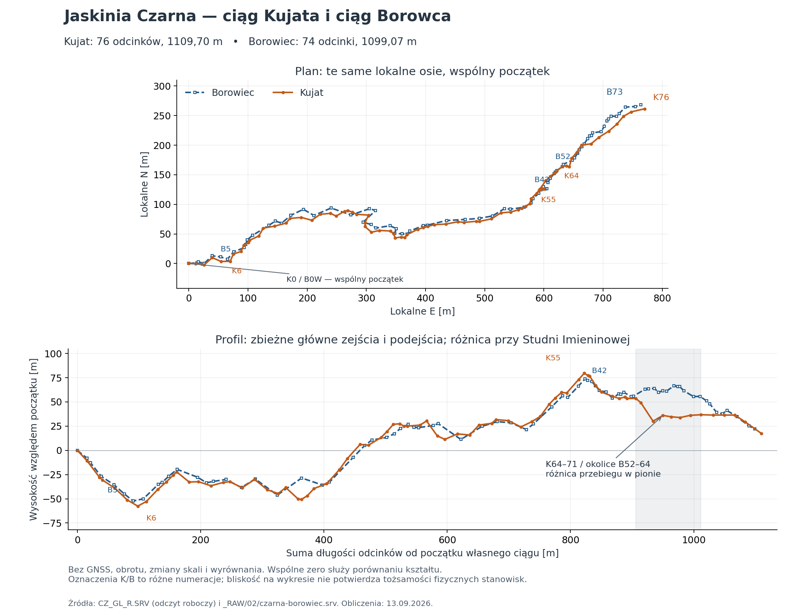

# Czy ciąg Kujata odpowiada głównemu ciągowi Borowca?

Stan: 2026-09-13. **Geometria mocno wskazuje na pomiar tego samego ciągu
głównego, ale numeracja i rozmieszczenie stanowisk są różne.** Zbieżność planu,
kolejności zakrętów oraz większości zejść i podejść jest wyraźna bez dopasowania
obrotu i skali. Lokalny wyjątek stanowi profil w rejonie Studni Imieninowej.
Nie ustalono jeszcze fizycznej tożsamości poszczególnych punktów ani przewagi
jakościowej któregoś pomiaru.

Autorem dziennika odczytanego do `CZ_GL_R.SRV` jest **Ryszard Kujat**, zgodnie z informacją
użytkownika z 2026-09-13 i dopiskiem `Kujat` w nazwie fotografii `123052`.
Wcześniejszą spekulację o innym autorstwie usunięto. Data i instrument tego
dziennika pozostają nieustalone.

[Wersja wektorowa wykresu](POROWNANIE_BOROWIEC.svg) ·
[Wyniki, współrzędne wszystkich stacji i SHA-256 źródeł](POROWNANIE_BOROWIEC.json)

## Źródła i zakres

- Kujat: [CZ_GL_R.SRV](CZ_GL_R.SRV), **76 odcinków 0→76**. Pominięto dwa
  odcinki boczne 6→a→b. Jest to obecny odczyt roboczy z czterema jawnymi
  niepewnościami, opisanymi w [analizie wariantów](WARIANTY_ODCZYTU.md).
- Borowiec: [_RAW/02/czarna-borowiec.srv](_RAW/02/czarna-borowiec.srv),
  **74 odcinki 0W→0→…→73**, zapisane jako przyrosty kartezjańskie E/N/Z
  (`*data cartesian`). To archiwalny plik cyfrowy; w tym etapie nie wykonano
  ponownego odczytu wszystkich jego współrzędnych z fotografii.
- Kontrola używanych obecnie danych: [CZ_B_DAV.SRV](CZ_B_DAV.SRV).
  Po przeliczeniu D/A/V maksymalna różnica skumulowanej pozycji stacji
  względem pliku kartezjańskiego wynosi **0,002590 m**, zgodnie z zaokrągleniem
  konwersji. Porównanie dotyczy zatem również tego aktywnego zestawu Borowca.
  Nie użyto mieszanej, wyrównanej sieci całego projektu z pomiarami Nowaka.

## Metoda

Oba początki umieszczono w lokalnym `(0, 0, 0)`: K0 i B0W. To założenie
rysunkowe do porównania kształtu, a nie stwierdzenie identyczności stanowisk.
Użyto surowych kierunków zapisanych w danych, bez dat, fixów, GNSS, korekty
deklinacji, obrotu, zmiany skali lub wyrównania. Osie E/N oznaczają tu lokalne
składowe, nie współrzędne geodezyjne po korektach orientacji.

Dla każdego odcinka Kujata obliczono przyrosty:
`E = D cos(V) sin(A)`, `N = D cos(V) cos(A)`, `Z = D sin(V)`.
Kąty wejściowe są w stopniach; dla pionu V=−90° składowe poziome są zerowe.
U Borowca użyto bezpośrednio przyrostów kartezjańskich. Pozycje stacji
otrzymano przez sumowanie przyrostów, a długość odcinka Borowca przez normę
wektora 3D. Kontrolowano ciągłość par stacji.

Do opisowej korelacji kształtu interpolowano każdy poligon liniowo w **1001
równych ułamkach jego własnej sumy długości 3D**, z oboma końcami. W ten
sposób porównuje się np. 40% jednego ciągu z 40% drugiego; nie identyfikuje
to fizycznie wspólnych punktów. Nie skalowano współrzędnych E/N/Z.
Wykres profilu pokazuje natomiast rzeczywiste metry bieżące każdego ciągu.

W JSON zapisano także najbliższe rzuty stacji na odcinki drugiego poligonu
w 3D. Dla każdego odcinka `q→r` parametr rzutu to
`t = clip(dot(p−q, r−q) / dot(r−q, r−q), 0, 1)`; wybierano minimum odległości.
Rzuty są niezależne, bez narzucania zgodności kolejności. To kandydaci
geometryczni, **nie tabela dowiązań**.

## Wielkość i kształt ciągów

| Wielkość | Kujat | Borowiec |
| --- | ---: | ---: |
| Liczba odcinków głównych | 76 | 74 |
| Suma długości 3D | 1109,70 m | 1099,07 m |
| Odległość pozioma początku od końca | 813,43 m | 809,28 m |
| Kierunek początku→koniec w lokalnych osiach | 71,25° | 70,65° |
| Wysokość końca względem początku | +17,45 m | +22,28 m |
| Najniższa stacja | K6: −57,58 m | B5: −52,35 m |
| Najwyższa stacja | K55: +79,65 m | B42: +73,78 m |

Różnica długości wynosi **10,63 m, czyli 0,97%** długości Borowca, a różnica
kierunków początku→koniec **0,60°**. Końce po wspólnym ustawieniu początku
są oddalone o **9,40 m poziomo / 10,57 m w 3D**. Ostatnia liczba nie jest
błędem domknięcia ani miarą dokładności terenowej: fizyczne dowiązania
końców i orientacje nie zostały ustalone.

Opisowe korelacje Pearsona dla 1001 próbek wynoszą:

| Składowa kształtu | r |
| --- | ---: |
| E | 0,99953 |
| N | 0,99662 |
| Z | 0,96900 |

Mediana poziomej odległości tak porównanych próbek wynosi 9,34 m,
a mediana bezwzględnej różnicy wysokości 3,90 m. Próbki nie są niezależnymi
obserwacjami, więc nie wyznaczano istotności statystycznej. Wysokie rE/rN
są częściowo skutkiem wspólnego dominującego kierunku ciągu. Wniosek o trasie
opiera się również na kształcie zakrętów, profilu i sekwencjach odcinków,
nie na samej korelacji. Wszystkie te liczby opisują podobieństwo poligonów,
nie poprawność pojedynczych pomiarów.

## Czy punkty i odcinki sobie odpowiadają?

**Numerów nie można utożsamiać.** B0W jest początkiem Borowca, a B0 już
następną stacją. Przy mechanicznym zestawieniu K0…K73 z B0…B73 mediana
odległości wynosi aż 82,89 m; to skutek różnej numeracji i rozmieszczenia,
nie oszacowanie błędu pomiaru.

Istnieją natomiast mocne odpowiedniki przebiegu. Przykłady kierunków
pojedynczych odcinków podano z aktywnych plików D/A/V:

| Kandydat Kujata | D / A / V | Kandydat Borowca | D / A / V | Kąt między kierunkami 3D |
| --- | --- | --- | --- | ---: |
| K3→4 | 20,00 m / 48° / −25° | B2→3 | 20,805 m / 47,039° / −24,810° | 0,89° |
| K45→46 | 20,40 m / 78° / −3° | B34→35 | 22,556 m / 79,509° / −3,406° | 1,56° |
| K46→47 | 20,10 m / 58° / −19° | B35→36 | 24,659 m / 58,497° / −16,104° | 2,93° |

Również cztery kolejne odcinki K53→57 i B40→44 mają zgodną sekwencję
kierunków; kąty między kolejnymi parami wynoszą 4,50°, 7,26°, 4,21° i 6,65°.
Długości nie są takie same, co jest zgodne z innym ustawieniem stanowisk.
Są to przykłady wybrane z geometrii, nie niezależnie potwierdzone pary punktów.

Szersze odcinki pokazują zgodną kolejność charakterystycznych zmian wysokości:

| Odcinek Kujata | Odpowiadający rejon Borowca | ΔZ Kujata | ΔZ Borowca |
| --- | --- | ---: | ---: |
| K0→6: pierwsze duże zejście | B0W→5 | −57,58 m | −52,35 m |
| K6→11: podejście | B5→10 | +35,32 m | +32,78 m |
| K11→20: kolejne zejście | B10→17 | −22,37 m | −26,60 m |
| K47→55: duże podejście | B36→42 | +55,49 m | +52,28 m |
| K59→64: łagodne obniżenie | B46→52 | −6,58 m | −6,47 m |
| K64→76: bilans końcowej części | B52→73 | −36,10 m | −33,34 m |

Ostatni zgodny bilans nie oznacza zgodnego profilu wewnątrz tego odcinka.

## Wyjątek: Studnia Imieninowa

Przy **K64–71 / rejonie B52–64** poligony są podobne w planie, ale lokalnie
różnią się wysokością o około **20–30 m**. K65→66 schodzi o 19,13 m, podczas
gdy poligon Borowca w odpowiadającym rejonie wznosi się ku B60. Dalej profile
ponownie się zbliżają. Nazwa Studni Imieninowej pochodzi z uwag przy punktach
64–66 na fotografii `123052`; odczyt opisano w [porównaniu Gemini](POROWNANIE_GEMINI.md).

Możliwe wyjaśnienia to inny poziom/droga prowadzenia pomiaru albo problem
danych. **Żadne nie zostało rozstrzygnięte.** Należy zestawić szkice i opisy
tego fragmentu oraz sprawdzić znaki/nachylenia źródłowe po obu stronach.
To obecnie najważniejszy lokalny punkt do ustalenia odpowiedniości tras.

## Sprawdzenie i dalsza praca

Drugi czytelnik niezależnie przeliczył oba ciągi z pól źródłowych i potwierdził
długości, kierunki, korelacje, zgodność aktywnego D/A/V Borowca z zapisem
kartezjańskim oraz SHA-256 wejść. Wykres sprawdzono wizualnie. W tym etapie
nie zmieniono żadnej wartości D/A/V; poprawiono autorstwo i dokumentację.

Wynik uzasadnia dalsze porównanie obu głównych ciągów. Przed ich łączeniem
potrzebne są fizyczne odpowiedniki punktów, wyjaśnienie Studni Imieninowej
i domiary do otworów. K76 jest opisany jako „Koniec Colorado”, więc sam
nowy plik nadal nie stanowi pełnego trawersu między dwoma punktami GNSS.
`CZ_GL_R.SRV` pozostaje poza głównym WPJ. Kolejność pracy i znane problemy
pozostałych danych zapisano w [STAN_PRAC.md](STAN_PRAC.md).
