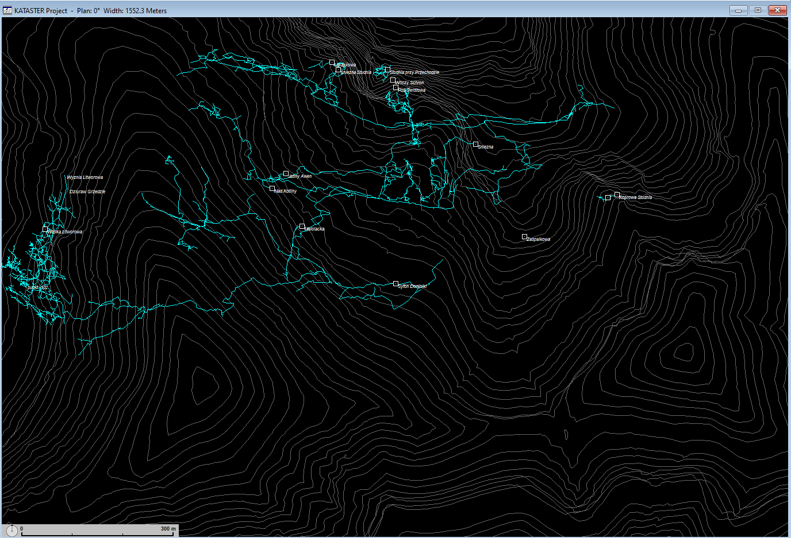

[🇵🇱 Polski](README.md) | 🇬🇧 **English** | [🇸🇰 Slovenčina](README.sk.md)

# Tatra Cave Registry

[Download the latest release](https://github.com/dlubom/Jaskiniowy-Kataster-Tatr-Zachodnich/releases/latest)

### Project Description
The project aims to compile all cartographic data related to the caves of the Tatra Mountains in one place. Utilizing the Walls software, the primary goal is to create a spatial compilation of measurement sequences, cave entrance coordinates, and terrain models. The project is open to all who are interested, to facilitate exploratory and educational activities, and to support scientific research. Gathering comprehensive and accurate data presents a challenge due to the diversity of methods and times of their execution.

The project is based on the Walls software – you can find the [latest version of the program and its manual here](http://texasspeleologicalsurvey.org/Walls/tsswalls.htm).

### 3D Model Online

### How Can You Help?
We encourage collaboration on the project as well as sharing your own measurements. Contact: [darek.lubomski@gmail.com](mailto:darek.lubomski@gmail.com).

### License
[Creative Commons Attribution-ShareAlike 2.0](http://creativecommons.org/licenses/by-sa/2.0/).

### Project Contents
Currently, the project includes data for the following caves:

- Czerwona Studzienka
- Dmuchawa
- Dziura
- Dziura pod Świstową Studnią
- Dziura w Stole
- Dziurka w Trawce
- Gawra
- Jaskinia Bańdzioch Kominiarski
- Jaskinia Biała (jako fragment jaskini Zimna)
- Jaskinia Ciepła
- Jaskinia Czarna (fragment)
- Jaskinia Goryczkowa
- Jaskinia Harda
- Jaskinia Kalacka
- Jaskinia Koszowa
- Jaskinia Kozia
- Jaskinia Lejbusiowa
- Jaskinia Lodowa Małołącka
- Jaskinia Lodowa Miętusia
- Jaskinia Mała w Mułowej
- Jaskinia Małołącka
- Jaskinia Marmurowa
- Jaskinia Mylna
- Jaskinia nad Beczką
- Jaskinia nad Percią
- Jaskinia Nova Kresanica
- Jaskinia Obcasna Vyvieracka
- Jaskinia Obłazkowa
- Jaskinia pod Progiem
- Jaskinia pod Zamkiem (fragment)
- Jaskinia Poszukiwaczy Skarbów (fragment)
- Jaskinia przy Jędrusiowej Dziurze
- Jaskinia przy Przechodzie
- Jaskinia Raptawicka
- Jaskinia Świstacza
- Jaskinia Śnieżna Studnia
- Jaskinia Śpiących Rycerzy (fragment)
- Jaskinia w Wielkiej Turni
- Jaskinia w Zbójnickiej Turni
- Jaskinia Wielka Śnieżna
- Jaskinia Zawaliskowa Tomanowa
- Jaskinia Ziobrowa
- Kamienne Mleko
- Koprowa Studnia
- Lustrzany Korytarz
- Meander w Małołąckim Siodle
- Mnichowa Studnia Wyżnia
- Ptasia Studnia
- Rura przy Oknie
- Schron pod Jędrusiową Dziurą
- Smocza Jama
- Studnia na Szlaku
- Studnia przy Przechodzie
- Studnia w Kazalnicy
- Szczelina Miętusia
- Szczelina nad Lejem
- Szczelina nad Tomanową I
- Szczelina nad Tomanową II
- System Jaskinia za Siedmiu Progami-Jaskinia Pośrednia-Jaskinia Wysoka
- Szara Studnia
- Upłazkowa
- Wielka Litworowa
- Wilczy Schron
- Wyżnia Koszowa Dziura
- Zawalony Schron
- Zaspałkowa Szczelina
- Zbójnicka Piwnica
- Zbójecka Dziura
- Zoska - Zagonna Studnia
- Zwolińskiego

### Raw source files `_RAW/`
The release ZIP does not include `_RAW/` directories with original survey source files. These are used for data verification and archival purposes. To access them, clone the repository or download the [master branch](https://github.com/dlubom/Jaskiniowy-Kataster-Tatr-Zachodnich/archive/refs/heads/master.zip).
