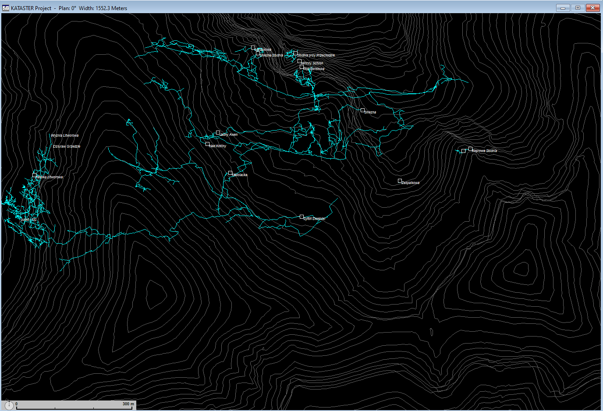
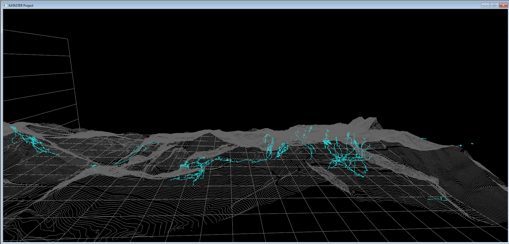
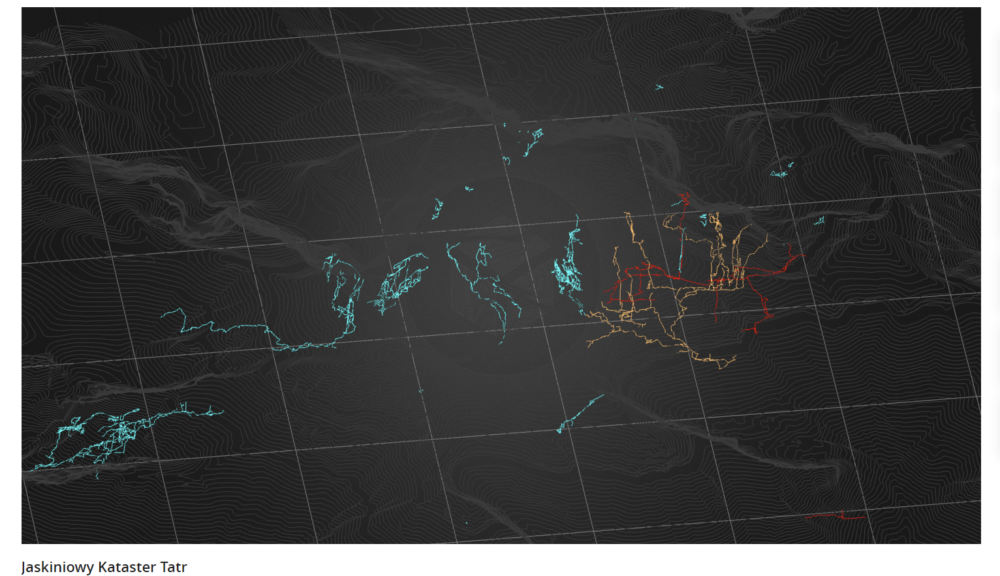

# Jaskiniowy Kataster Tatr [PL] | Tatra Cave Registry [EN] | Tatranský kataster jaskýň [SK]

[Pobierz główny projekt tutaj | Download the main project here | Stiahnite si hlavný projekt tu](https://github.com/dlubom/Jaskiniowy-Kataster-Tatr-Zachodnich/archive/refs/heads/master.zip)

### Techniczne ostrzeżenie | Technical Warning | Technické upozornenie
**Uwaga:** Zaleca się rozpakowanie projektu bezpośrednio na dysku C://, ponieważ w niektórych katalogach systemu Windows niektóre jaskinie mogą nie być wyświetlane prawidłowo.

**Note:** It is recommended to unpack the project directly on the C:// drive, as some caves may not display correctly in certain Windows directories.

**Poznámka:** Odporúča sa rozbalenie projektu priamo na disku C://, pretože v niektorých adresároch systému Windows sa niektoré jaskyne nemusia správne zobrazovať.

### Opis projektu
Projekt ma na celu zgromadzenie w jednym miejscu wszystkich danych kartograficznych dotyczących tatrzańskich jaskiń. Wykorzystując oprogramowanie Walls, głównym celem jest stworzenie zestawienia przestrzennego ciągów pomiarowych, współrzędnych wejść do jaskiń oraz modelu terenu. Projekt jest otwarty dla wszystkich zainteresowanych, by ułatwić działania eksploracyjne, edukacyjne oraz wspierać badania naukowe. Zebranie kompleksowych i dokładnych danych stanowi wyzwanie ze względu na różnorodność metod i czasu ich wykonania.

Projekt oparty jest o oprogramowanie Walls – tutaj znajdziesz [najnowszą wersję programu oraz instrukcję obsługi](http://texasspeleologicalsurvey.org/Walls/tsswalls.htm).

### Project Description
The project aims to compile all cartographic data related to the caves of the Tatra Mountains in one place. Utilizing the Walls software, the primary goal is to create a spatial compilation of measurement sequences, cave entrance coordinates, and terrain models. The project is open to all who are interested, to facilitate exploratory and educational activities, and to support scientific research. Gathering comprehensive and accurate data presents a challenge due to the diversity of methods and times of their execution.

The project is based on the Walls software – you can find the [latest version of the program and its manual here](http://texasspeleologicalsurvey.org/Walls/tsswalls.htm).

### Popis projektu
Projekt má za cieľ zhromaždiť všetky kartografické údaje o tatranských jaskyniach na jednom mieste. Využitím softvéru Walls je hlavným cieľom vytvoriť priestorové zosumarizovanie meracích postupov, súradníc vstupov do jaskýň a modelu terénu. Projekt je otvorený pre všetkých záujemcov, aby uľahčil prieskumné, vzdelávacie a podporoval vedecký výskum. Zhromaždenie komplexných a presných údajov predstavuje výzvu kvôli rozmanitosti metód a času ich vykonávania.

Projekt je založený na softvéri Walls – [tu nájdete najnovšiu verziu programu a návod na použitie](http://texasspeleologicalsurvey.org/Walls/tsswalls.htm).

### Projekt dostępny jest również online | The project is also available online | Projekt je tiež dostupný online: 

### Jak można pomóc? | How Can You Help? | Ako môžete pomôcť?
Zachęcamy do współpracy przy projekcie oraz do udostępniania własnych pomiarów. Kontakt: [darek.lubomski@gmail.com](mailto:darek.lubomski@gmail.com).

We encourage collaboration on the project as well as sharing your own measurements. Contact: [darek.lubomski@gmail.com](mailto:darek.lubomski@gmail.com).

Začleníme do projektu aj vašu spoluprácu a zdieľanie vlastných meraní. Kontaktujte: [darek.lubomski@gmail.com](mailto:darek.lubomski@gmail.com).

### Licencja | License | Licencia
[Creative Commons Attribution-ShareAlike 2.0](http://creativecommons.org/licenses/by-sa/2.0/).

### Zawartość projektu | Project Contents | Obsah projektu
Aktualnie projekt zawiera dane dla następujących jaskiń:
Currently, the project includes data for the following caves:
V súčasnosti projekt obsahuje údaje pre nasledujúce jaskyne:

- Czerwona Studzienka
- Dmuchawa
- Dziura pod Świstową Studnią
- Dziurka w Trawce
- Jaskinia Bańdzioch Kominiarski
- Jaskinia Biała (Zimna)
- Jaskinia Goryczkowa
- Jaskinia Harda
- Jaskinia Kalacka
- Jaskinia Kozia
- Jaskinia Lodowa Małołącka
- Jaskinia Lodowa Miętusia
- Jaskinia Mała w Mułowej
- Jaskinia Małołącka
- Jaskinia Marmurowa
- Jaskinia Mylna
- Jaskinia Nova Kresanica
- Jaskinia Obcasna Vyvieracka
- Jaskinia Obłazkowa
- Jaskinia pod Progiem
- Jaskinia pod Śnieżną Studnią
- Jaskinia pod Zamkiem (fragment)
- Jaskinia Poszukiwaczy Skarbów (fragment)
- Jaskinia przy Jędrusiowej Dziurze
- Jaskinia przy Przechodzie
- Jaskinia Raptawicka
- Jaskinia Świstacza
- Jaskinia Śnieżna Studnia
- Jaskinia Śpiących Rycerzy (fragment)
- Jaskinia w Wielkiej Turni
- Jaskinia Wielka Śnieżna
- Kamienne Mleko
- Koprowa Studnia
- Mnichowa Studnia Wyżnia
- Ptasia Studnia
- Schron pod Jędrusiową Dziurą
- Studnia na Szlaku
- Studnia przy Przechodzie
- Studnia w Kazalnicy
- System Jaskinia za Siedmiu Progami-Jaskinia Pośrednia-Jaskinia Wysoka
- Szara Studnia
- Szczelina Miętusia
- Wilczy Schron
- Zaspałkowa Szczelina
- Zbójecka Dziura
- Ziobrowa i Jaskinia pod Niżnią Zbójnicką Turnią
- Zoska - Zagonna Studnia
- Zwolińskiego
