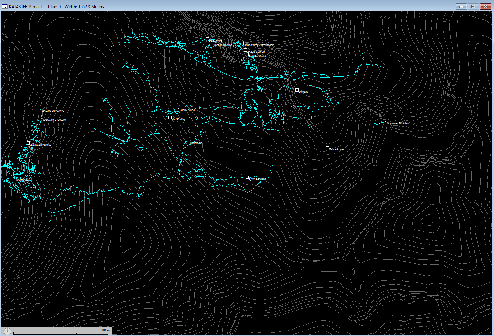

🇵🇱 **Polski** | [🇬🇧 English](README.en.md) | [🇸🇰 Slovenčina](README.sk.md)

# Jaskiniowy Kataster Tatr

[Pobierz najnowsze wydanie](https://github.com/dlubom/Jaskiniowy-Kataster-Tatr-Zachodnich/releases/latest)

[Model 3D online](https://dlubom.github.io/Jaskiniowy-Kataster-Tatr-Zachodnich/)

### Opis projektu
Projekt ma na celu zgromadzenie w jednym miejscu wszystkich danych kartograficznych dotyczących tatrzańskich jaskiń. Wykorzystując oprogramowanie Walls, głównym celem jest stworzenie zestawienia przestrzennego ciągów pomiarowych, współrzędnych wejść do jaskiń oraz modelu terenu. Projekt jest otwarty dla wszystkich zainteresowanych, by ułatwić działania eksploracyjne, edukacyjne oraz wspierać badania naukowe. Zebranie kompleksowych i dokładnych danych stanowi wyzwanie ze względu na różnorodność metod i czasu ich wykonania.

Projekt oparty jest o oprogramowanie Walls – tutaj znajdziesz [najnowszą wersję programu oraz instrukcję obsługi](http://texasspeleologicalsurvey.org/Walls/tsswalls.htm).

Projekt działa również w [Survex](https://survex.com/) — wystarczy zainstalować najnowszą wersję i wczytać plik `KATASTER.wpj` w programie Aven lub skompilować z linii poleceń: `cavern KATASTER.wpj`. W Aven można też wczytać model terenu `Powierzchnia/Survex/N49E019_VF1.hgt`.

### Jak można pomóc?
Zachęcamy do współpracy przy projekcie oraz do udostępniania własnych pomiarów. Kontakt: [darek.lubomski@gmail.com](mailto:darek.lubomski@gmail.com).

### Licencja
[Creative Commons Attribution-ShareAlike 4.0](http://creativecommons.org/licenses/by-sa/4.0/).

### Zawartość projektu
Aktualnie projekt zawiera dane dla następujących jaskiń:

- Czerwona Studzienka
- Dmuchawa
- Dziura
- Dziura pod Świstową Studnią
- Dziura w Stole
- Dziurka w Trawce
- Gawra
- Jaskinia Bańdzioch Kominiarski
- Jaskinia Biała (jako fragment jaskini Zimna)
- Jaskinia Ciepła
- Jaskinia Czarna (fragment)
- Jaskinia Goryczkowa
- Jaskinia Harda
- Jaskinia Kalacka
- Jaskinia Koszowa
- Jaskinia Kozia
- Jaskinia Lejbusiowa
- Jaskinia Lodowa Małołącka
- Jaskinia Lodowa Miętusia
- Jaskinia Mała w Mułowej
- Jaskinia Małołącka
- Jaskinia Marmurowa
- Jaskinia Miętusia Wyżnia
- Jaskinia Mroźna
- Jaskinia Mylna
- Jaskinia nad Beczką
- Jaskinia nad Percią
- Jaskinia Nova Kresanica
- Jaskinia Obcasna Vyvieracka
- Jaskinia Obłazkowa
- Jaskinia pod Progiem
- Jaskinia pod Zamkiem (fragment)
- Jaskinia Poszukiwaczy Skarbów (fragment)
- Jaskinia przy Jędrusiowej Dziurze
- Jaskinia przy Przechodzie
- Jaskinia Raptawicka
- Jaskinia Świstacza
- Jaskinia Śnieżna Studnia
- Jaskinia Śpiących Rycerzy (fragment)
- Jaskinia w Wielkiej Turni
- Jaskinia w Zbójnickiej Turni
- Jaskinia Wielka Śnieżna
- Jaskinia Zawaliskowa Tomanowa
- Jaskinia Ziobrowa
- Kamienne Mleko
- Koprowa Studnia
- Lustrzany Korytarz
- Meander w Małołąckim Siodle
- Mnichowa Studnia Wyżnia
- Ptasia Studnia
- Rura przy Oknie
- Schron pod Jędrusiową Dziurą
- Smocza Jama
- Studnia na Szlaku
- Studnia przy Przechodzie
- Studnia w Kazalnicy
- Szczelina Miętusia
- Szczelina nad Lejem
- Szczelina nad Tomanową I
- Szczelina nad Tomanową II
- System Jaskinia za Siedmiu Progami-Jaskinia Pośrednia-Jaskinia Wysoka
- Szara Studnia
- Upłazkowa
- Wielka Litworowa
- Wilczy Schron
- Wyżnia Koszowa Dziura
- Zawalony Schron
- Zaspałkowa Szczelina
- Zbójnicka Piwnica
- Zbójecka Dziura
- Zoska - Zagonna Studnia
- Zwolińskiego

### Pokrewne projekty
Warto wspomnieć o projekcie [Caves of the Tatra Mountains](https://github.com/RadostW/jaskinie) prowadzonym przez Speleoklub Warszawski. Stosują oni odmienną filozofię — bazują na własnych pomiarach terenowych wykonywanych współcześnie, a nie na pozyskiwaniu danych z historycznych źródeł. Wykorzystują również wtórną digitalizację planów jaskiń, bez informacji o głębokości. To ciekawe podejście, choć pomierzenie w ten sposób wszystkich tatrzańskich jaskiń będzie dużym wyzwaniem. Projekt korzysta z formatu Survex i jest udostępniany na licencji CC BY-SA 4.0.

### Historia zmian
Wszystkie zmiany w projekcie są dokumentowane w pliku [CHANGELOG.md](CHANGELOG.md).

### Pliki źródłowe `_RAW/`
Paczka ZIP z wydania nie zawiera katalogów `_RAW/` z oryginalnymi plikami źródłowymi pomiarów. Służą one do weryfikacji i archiwizacji danych. Aby je uzyskać, sklonuj repozytorium lub pobierz [branch master](https://github.com/dlubom/Jaskiniowy-Kataster-Tatr-Zachodnich/archive/refs/heads/master.zip).
