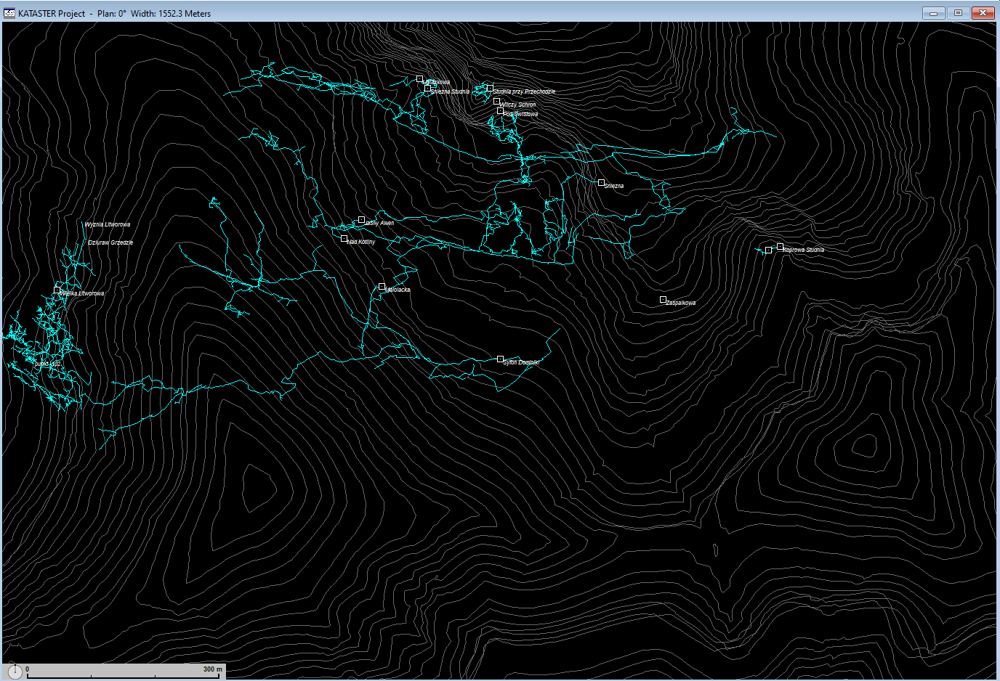
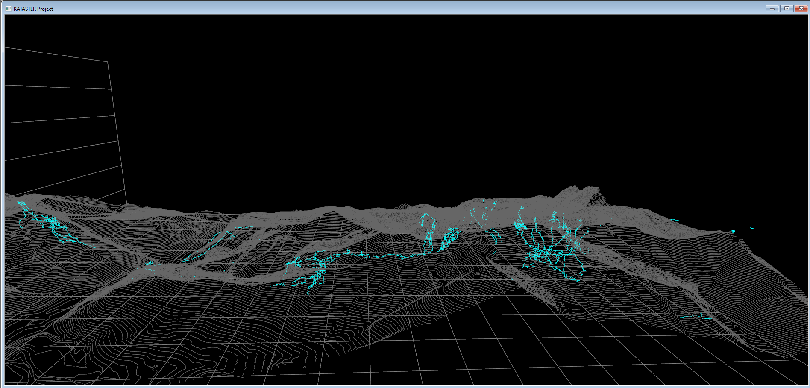
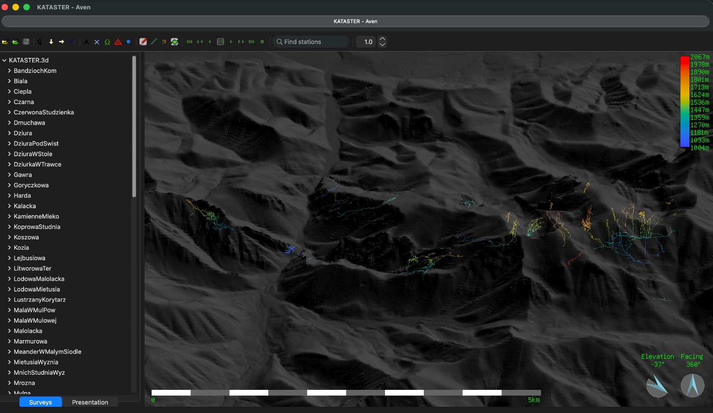

[🇵🇱 Polski](README.md) | [🇬🇧 English](README.en.md) | 🇸🇰 **Slovenčina**

# Tatranský kataster jaskýň

[Stiahnite si najnovšie vydanie](https://github.com/dlubom/Jaskiniowy-Kataster-Tatr-Zachodnich/releases/latest)

[3D model online](https://dlubom.github.io/Jaskiniowy-Kataster-Tatr-Zachodnich/)

### Popis projektu
Projekt má za cieľ zhromaždiť všetky kartografické údaje o tatranských jaskyniach na jednom mieste. Využitím softvéru Walls je hlavným cieľom vytvoriť priestorové zosumarizovanie meracích postupov, súradníc vstupov do jaskýň a modelu terénu. Projekt je otvorený pre všetkých záujemcov, aby uľahčil prieskumné, vzdelávacie a podporoval vedecký výskum. Zhromaždenie komplexných a presných údajov predstavuje výzvu kvôli rozmanitosti metód a času ich vykonávania.

Projekt je založený na softvéri Walls – [tu nájdete najnovšiu verziu programu a návod na použitie](http://texasspeleologicalsurvey.org/Walls/tsswalls.htm).

Projekt funguje aj v programe [Survex](https://survex.com/) — stačí nainštalovať najnovšiu verziu a otvoriť súbor `KATASTER.wpj` v programe Aven alebo skompilovať z príkazového riadku: `cavern KATASTER.wpj`. V programe Aven je možné načítať aj model terénu `Powierzchnia/Survex/N49E019_VF1.hgt`.

### Ako môžete pomôcť?
Začleníme do projektu aj vašu spoluprácu a zdieľanie vlastných meraní. Kontaktujte: [darek.lubomski@gmail.com](mailto:darek.lubomski@gmail.com).

### Licencia
[Creative Commons Attribution-ShareAlike 4.0](http://creativecommons.org/licenses/by-sa/4.0/).

### Obsah projektu
Aktuálny zoznam jaskýň zahrnutých do projektu nájdete v súbore [Zoznam jaskýň](LISTA_JASKIN.md).

### Súvisiace projekty
Stojí za zmienku projekt [Caves of the Tatra Mountains](https://github.com/RadostW/jaskinie) vedený Speleoklubu Warszawski. Uplatňujú odlišnú filozofiu — vychádzajú z vlastných súčasných terénnych meraní, nie zo získavania údajov z historických zdrojov. Využívajú tiež sekundárnu digitalizáciu plánov jaskýň, bez informácií o hĺbke. Je to zaujímavý prístup, hoci zamerať takto všetky tatranské jaskyne bude veľkou výzvou. Projekt používa formát Survex a je licencovaný pod CC BY-SA 4.0.

### História zmien
Všetky zmeny v projekte sú zdokumentované v súbore [CHANGELOG.md](CHANGELOG.md).

### Zdrojové súbory `_RAW/`
Vydanie vo formáte ZIP neobsahuje adresáre `_RAW/` s pôvodnými zdrojovými súbormi meraní. Tieto slúžia na overenie a archiváciu údajov. Ak ich chcete získať, naklonujte repozitár alebo si stiahnite [vetvu master](https://github.com/dlubom/Jaskiniowy-Kataster-Tatr-Zachodnich/archive/refs/heads/master.zip).
