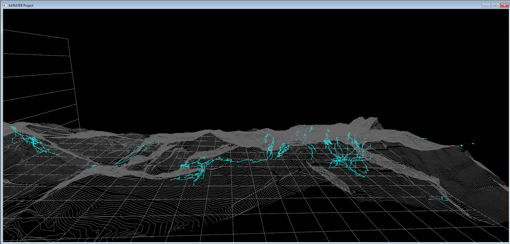

[🇵🇱 Polski](README.md) | [🇬🇧 English](README.en.md) | 🇸🇰 **Slovenčina**

# Tatranský kataster jaskýň

[Stiahnite si najnovšie vydanie](https://github.com/dlubom/Jaskiniowy-Kataster-Tatr-Zachodnich/releases/latest)

### Popis projektu
Projekt má za cieľ zhromaždiť všetky kartografické údaje o tatranských jaskyniach na jednom mieste. Využitím softvéru Walls je hlavným cieľom vytvoriť priestorové zosumarizovanie meracích postupov, súradníc vstupov do jaskýň a modelu terénu. Projekt je otvorený pre všetkých záujemcov, aby uľahčil prieskumné, vzdelávacie a podporoval vedecký výskum. Zhromaždenie komplexných a presných údajov predstavuje výzvu kvôli rozmanitosti metód a času ich vykonávania.

Projekt je založený na softvéri Walls – [tu nájdete najnovšiu verziu programu a návod na použitie](http://texasspeleologicalsurvey.org/Walls/tsswalls.htm).

### 3D model online

### Ako môžete pomôcť?
Začleníme do projektu aj vašu spoluprácu a zdieľanie vlastných meraní. Kontaktujte: [darek.lubomski@gmail.com](mailto:darek.lubomski@gmail.com).

### Licencia
[Creative Commons Attribution-ShareAlike 2.0](http://creativecommons.org/licenses/by-sa/2.0/).

### Obsah projektu
V súčasnosti projekt obsahuje údaje pre nasledujúce jaskyne:

- Czerwona Studzienka
- Dmuchawa
- Dziura
- Dziura pod Świstową Studnią
- Dziura w Stole
- Dziurka w Trawce
- Gawra
- Jaskinia Bańdzioch Kominiarski
- Jaskinia Biała (jako fragment jaskini Zimna)
- Jaskinia Ciepła
- Jaskinia Czarna (fragment)
- Jaskinia Goryczkowa
- Jaskinia Harda
- Jaskinia Kalacka
- Jaskinia Koszowa
- Jaskinia Kozia
- Jaskinia Lejbusiowa
- Jaskinia Lodowa Małołącka
- Jaskinia Lodowa Miętusia
- Jaskinia Mała w Mułowej
- Jaskinia Małołącka
- Jaskinia Marmurowa
- Jaskinia Mylna
- Jaskinia nad Beczką
- Jaskinia nad Percią
- Jaskinia Nova Kresanica
- Jaskinia Obcasna Vyvieracka
- Jaskinia Obłazkowa
- Jaskinia pod Progiem
- Jaskinia pod Zamkiem (fragment)
- Jaskinia Poszukiwaczy Skarbów (fragment)
- Jaskinia przy Jędrusiowej Dziurze
- Jaskinia przy Przechodzie
- Jaskinia Raptawicka
- Jaskinia Świstacza
- Jaskinia Śnieżna Studnia
- Jaskinia Śpiących Rycerzy (fragment)
- Jaskinia w Wielkiej Turni
- Jaskinia w Zbójnickiej Turni
- Jaskinia Wielka Śnieżna
- Jaskinia Zawaliskowa Tomanowa
- Jaskinia Ziobrowa
- Kamienne Mleko
- Koprowa Studnia
- Lustrzany Korytarz
- Meander w Małołąckim Siodle
- Mnichowa Studnia Wyżnia
- Ptasia Studnia
- Rura przy Oknie
- Schron pod Jędrusiową Dziurą
- Smocza Jama
- Studnia na Szlaku
- Studnia przy Przechodzie
- Studnia w Kazalnicy
- Szczelina Miętusia
- Szczelina nad Lejem
- Szczelina nad Tomanową I
- Szczelina nad Tomanową II
- System Jaskinia za Siedmiu Progami-Jaskinia Pośrednia-Jaskinia Wysoka
- Szara Studnia
- Upłazkowa
- Wielka Litworowa
- Wilczy Schron
- Wyżnia Koszowa Dziura
- Zawalony Schron
- Zaspałkowa Szczelina
- Zbójnicka Piwnica
- Zbójecka Dziura
- Zoska - Zagonna Studnia
- Zwolińskiego

### Zdrojové súbory `_RAW/`
Vydanie vo formáte ZIP neobsahuje adresáre `_RAW/` s pôvodnými zdrojovými súbormi meraní. Tieto slúžia na overenie a archiváciu údajov. Ak ich chcete získať, naklonujte repozitár alebo si stiahnite [vetvu master](https://github.com/dlubom/Jaskiniowy-Kataster-Tatr-Zachodnich/archive/refs/heads/master.zip).
