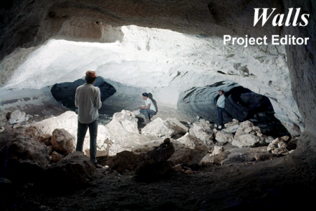
### _Tools for Cave Survey Data_ _Management_

##### Version 2.0 Build 2016-11-18

Copyright 2016 by David McKenzie, Austin TX

**I** **Walls Project Editor**

## **Table of Contents**

**0**
##### **Part I Main Contents Page 1** **Part II Introduction and Setup 2**

**1** **Introduction ................................................................................................................................... 2**

**2** **Recent Changes ................................................................................................................................... 4**

**3** **System Recommendations ................................................................................................................................... 9**

**4** **Setup and File Usage ................................................................................................................................... 9**

**5** **Limitations ................................................................................................................................... 10**

**6** **History and Acknowledgements ................................................................................................................................... 10**

##### **Part III Program Operation 11**

**1** **Project Trees ................................................................................................................................... 11**

**2** **Survey Text Editor ................................................................................................................................... 13**

**3** **Properties Dialog ................................................................................................................................... 15**

**Properties: General Page .......................................................................................................................................................... 15**

**Properties: Compile Options Page .......................................................................................................................................................... 18**

**Properties: Geographical Reference Page .......................................................................................................................................................... 20**

**4** **Review Dialogs ................................................................................................................................... 22**

**Geometry Page .......................................................................................................................................................... 23**

**Traverse Page .......................................................................................................................................................... 26**

**Map Page** **.......................................................................................................................................................... 28**

Scale and Position Dialog......................................................................................................................................................... 32

Grid Intervals Dialog......................................................................................................................................................... 34

Passage Display Options......................................................................................................................................................... 34

Map Format Options......................................................................................................................................................... 37

**Page Layout Page .......................................................................................................................................................... 40**

Page Offsets and Legend Dialog......................................................................................................................................................... 42

**Segments Page .......................................................................................................................................................... 43**

Color Selection Palettes......................................................................................................................................................... 46

Color Gradient Dialog......................................................................................................................................................... 48

Adjusted Totals Dialog......................................................................................................................................................... 52

Flag and Marker Symbols......................................................................................................................................................... 53

**5** **Displayed Maps ................................................................................................................................... 55**

**6** **Search Operations ................................................................................................................................... 56**

**7** **Vector Properties Window ................................................................................................................................... 57**

**8** **Vector and Coordinate Reports ................................................................................................................................... 58**

**9** **Creating Backup Archives ................................................................................................................................... 60**

**10** **Geographical Calculator ................................................................................................................................... 61**

##### **Part IV Survey Data Format 64**

**1** **SRV Files - Overview ................................................................................................................................... 65**

_Copyright © 2013 by David McKenzie_

**Contents** **II**

**2** **Vector Data Lines ................................................................................................................................... 66**

**3** **#Units Directive ................................................................................................................................... 69**

**#Units Directive Syntax .......................................................................................................................................................... 69**

**Overriding Default Units with Special Formats .......................................................................................................................................................... 70**

**Vector Type and Column Order .......................................................................................................................................................... 71**

**Measurement Units .......................................................................................................................................................... 71**

**Declinations and Grid Corrections .......................................................................................................................................................... 72**

**Instrument Corrections .......................................................................................................................................................... 73**

**Backsight Types and Tolerances .......................................................................................................................................................... 73**

**Saving and Restoring Units Settings .......................................................................................................................................................... 74**

**Advanced or Seldom Used Options .......................................................................................................................................................... 75**

**4** **#Segment Directive ................................................................................................................................... 76**

**5** **#Fix Directive ................................................................................................................................... 78**

**6** **#Prefix Directive ................................................................................................................................... 80**

**7** **#Note Directive ................................................................................................................................... 81**

**8** **#Flag and Symbol Directives ................................................................................................................................... 83**

**9** **#Date Directive ................................................................................................................................... 85**

**10** **Block Comments (#[ and #]) ................................................................................................................................... 86**

**11** **Defining and Using Macros ................................................................................................................................... 86**

**12** **Variance Assignments ................................................................................................................................... 87**

##### **Part V Roundtripping SVG Maps 92**

**1** **Roundtripping Overview ................................................................................................................................... 93**

**2** **SVG Export Dialog ................................................................................................................................... 95**

**3** **SVG Advanced Settings ................................................................................................................................... 98**

**4** **SVG Layer Definitions ................................................................................................................................... 101**

**5** **Adjustment of Brushed Strokes ................................................................................................................................... 107**

**6** **Live Paint and Pattern Support ................................................................................................................................... 108**

**7** **Instructions for Illustrator Users ................................................................................................................................... 109**

**8** **Illustrator Limitations and Workarounds ................................................................................................................................... 112**

**9** **Converting Groups to Layers ................................................................................................................................... 113**

**10** **Using Other Drawing Programs ................................................................................................................................... 115**

##### **Part VI Import/Export Features 115**

**1** **Importing Compass Data ................................................................................................................................... 115**

**2** **Importing SEF Files ................................................................................................................................... 118**

**3** **Exporting SEF Files ................................................................................................................................... 120**

**4** **Exporting Maps as Metafiles ................................................................................................................................... 121**

**5** **Exporting ESRI Shapefiles ................................................................................................................................... 123**

**6** **Exporting 3D VRML Files ................................................................................................................................... 126**

**7** **Downloading GPS Data ................................................................................................................................... 128**

##### **Part VII Integrated Applications 130**

_Copyright © 2013 by David McKenzie_

**II**

**III** **Walls Project Editor**

**1** **Walls2D SVG Viewer ................................................................................................................................... 130**

**2** **Walls3D VRML Viewer ................................................................................................................................... 132**

##### **Part VIII Background and Tutorial 132**

**1** **Network Terminology ................................................................................................................................... 132**

**2** **Data Screening Tutorial ................................................................................................................................... 134**

**3** **Easily Overlooked Features ................................................................................................................................... 138**

##### **Part IX Advanced or Special Topics 140**

**1** **Workfiles Created by Walls ................................................................................................................................... 140**

**2** **Choice of Mathematical Model ................................................................................................................................... 141**

**3** **Error Propagation in Long Traverses ................................................................................................................................... 143**

**4** **GPS Position Accuracy Table ................................................................................................................................... 144**

**5** **Statistical Formulas ................................................................................................................................... 145**

**6** **Tree Survey Example ................................................................................................................................... 147**

**7** **Missing Measurement Problem ................................................................................................................................... 148**

**8** **Height Measurement Pitfalls ................................................................................................................................... 148**

**9** **Regular Expression Searches ................................................................................................................................... 148**

**10** **Floating Traverse Chains ................................................................................................................................... 150**

**Accessing Walls from Other Applications .......................................................................................................................................................... 151**

##### **Index 153**

_Copyright © 2013 by David McKenzie_

**Main Contents Page** **1**

#### **1 Main Contents Page**

**Contents**

Introduction
Recent Changes
System Recommendations
Setup and File Usage
Limitations
History and Acknowledgements

**Program Operation**

Project Trees
Survey Text Editor
Properties Dialog
Review Dialogs
Displayed Maps
Search Operations
Vector Properties Window
Vector and Coordinate Reports
Creating Backup Archives
Geographical Calculator

**Data Formats**

Survey Data Format
Roundtripping SVG Maps

**Import/Export Features**

Importing Compass Data
Importing SEF Files
Exporting SEF Files
Exporting Maps as Metafiles (WMF and EMF)
Exporting ESRI Shapefiles (for ArcView® GIS, etc.)
Exporting 3D VRML Files (WRL)
Downloading GPS Data

**Integrated Applications**

Walls2D - SVG Map Viewer
Walls3D - VRML Viewer

**Background and Tutorials**

Network Terminology
Data Screening Tutorial
Easily Overlooked Features
Advanced or Special Topics

_Copyright © 2013 by David McKenzie_

**2** **Walls Project Editor**

#### **2 Introduction and Setup**

##### **2.1 Introduction**

Welcome to Walls!

This program is freeware designed by cave surveyors intent on using it for their own projects. The need for specific and sometimes unusual features has guided its development over the years. As the original programmer,
my first goal was to make it possible for surveyors to handle the basic data management tasks for several longrunning projects in Texas, Montana, and Mexico, each encompassing hundreds of linked caves and karst features. Walls is now being used to manage survey data for some of the largest cave systems in this hemisphere,
including both the longest and deepest.

**Getting Started**
Since the program uses standard text as its native data format, you can't immediately begin entering survey data
without spending a few minutes reviewing the script-like language used to specify measurement units, column
order, and so forth. An interactive "getting started" tutorial would be nice, but this is just one of many desirable
features the program could have. For now I suggest opening the small example project, _Tutorial.WPJ_, that Walls
Setup installed. You'll see a tree diagram with a branch icon resembling a page. Double-click the page icon to
examine a commented data file in the built-in editor. You may be able to modify it and start entering your data
right away. The text editor in Walls is functionally similar to the basic editor that comes with Windows (Notepad).
When the edit window opens, press F1 to see a description of the editor's features.

Be sure to probe the menus and dialogs as you run the program. Also be willing to reference the online help,
which is quite extensive. If your habit is to explore without reading the documentation, and if you are sufficiently
familiar with the Windows interface, you may be able to get by while missing some tricks. (Whenever an unfamiliar dialog window appears, press F1 for instructions.) On the other hand, if you're considering extensive use of
Walls you should browse through the entire help file at least once to get a feel for what's available.

**Design Goals**
The program was named _Walls_ in anticipation of a feature that was implemented fairly recently in its history: the
incorporation of complete map documents in the project database. Our mapping software should support the
creation of detailed cave maps that automatically track an ever-evolving survey database -- something that commercial CAD and illustration programs can't manage at all. The unique problem we face is that estimated passage locations change as successive surveying trips are made into the cave. New traverses will be averaged into
the data set, possibly exposing blunders in old data. Therefore, it would be nice if we could quickly produce upto-date maps, both for publication and field use, that are more than just computer-drawn line plots or crude passage representations. Ideally, the maps will show realistic passage outlines and complete decoration. I believe
[this goal has largely been achieved due to the availability of Scalable Vector Graphics](http://www.w3.org/Graphics/SVG/) (SVG), a standard format
that allows Walls to share the task of creating dynamic cave maps with a commercial drawing program.

Other features that go beyond basic data reduction relate to project management and data screening. Having
once used certain statistical methods in _Ellipse_, a mainframe-based program, I've been wanting ever since to
move them to a personal computer with a graphical interface. Also, it appears that blunder detection in networks
-- surely an interesting and non-trivial problem -- has been given lower priority than it deserves by other program
developers.

Cave surveyors are resigned to the fact that certain failures in technique are inevitable. The main categories of
failure are bad instrument readings, mistakes in data recording, and various kinds of systematic error. My own
experience has been that such problems completely dominate, or swamp out, all other influences on map accuracy, including the inherent imprecision of the instruments used. Almost irrelevant is the particular weighting
scheme we choose to finally average the data that survives the screening process. By this I mean that even after
we've done our best to filter out spurious data, the benefit of choosing one "loop closing" method over another is
probably insignificant. (I admit I would like it to be otherwise.) Loops or no loops, the accuracy achievable with
our instruments would be good enough if we could just avoid the mistakes.

Final map accuracy isn't the only consideration. There's also just the frustration and delay caused by mistakes
that will eventually be noticed, like misnamed stations and reversed shots. Even here, unadjusted plots are

_Copyright © 2013 by David McKenzie_

**Introduction and Setup** **3**

rarely helpful when the cave geometry is complex. This problem continues to plague large mapping projects
where just one person, usually, is trying to manage data collected by many different teams. Consequently,
much of Walls has to do with network error analysis as opposed to simply network adjustment, the idea being
that bad measurements can often be singled out immediately when loops are present.

While there's no need to have even the faintest appreciation of statistics to use the program as a tool, the basic
idea can be stated very simply: By approximating the behavior of measurement data with a mathematical model,
we can compute numbers that measure consistency in a data set. If by _throwing out_ some measurement the
consistency improves by more than we might reasonably expect given the model's assumptions, then we consider the measurement _suspect._ Walls uses this method to rate all traverses in a loop system, allowing us to
confine attention to a relatively small part of the data. The program presents graphical views of an "outlier" traverse with the surrounding network undistorted by its presence. It also suggests specific measurement corrections that would bring the traverse into line.

**About the Documentation**
Walls with its error checking is an approach to data reduction that's probably new to most cave surveyors -- perhaps drastically so -- and some may want a better explanation of the underlying theory even though it's not required. If you're in that category then I can recommend just about any introductory statistics text. The help file
is definitely not a tutorial on linear models and least-squares, but it should be enough to get you started with the
data screening tools. (The article cited in History and Acknowledgments describes in detail both the theory and
the numerical methods used in Walls. Also, see Statistical Formulas for a terse summary of what the program
actually computes.)

The help file also assumes that you're already familiar with the Windows interface -- moving and resizing windows, navigating menus and dialogs, and so forth. My hope is that you're at least willing to try the most popular
method of software checkout: Open a sample file (a WPJ file in this case) and venture forth, mouse clicking
everything in range.

[You can visit the Texas Speleological Survey](http://texasspeleologicalsurvey.org/index.php) Web site to download the latest version of Walls along with some
example project data sets. Try the program out and let me know what you would like to see (or not see) in the
next build.

Thanks for your interest!

**David McKenzie**
[davidmck@austin.rr.com](mailto:davidmck@austin.rr.com)

_Copyright © 2013 by David McKenzie_

**4** **Walls Project Editor**

##### **2.2 Recent Changes**

**Build 2016-11-18**

     - The Flags and Markers dialog was overhauled to apply changes dynamically to screen maps as the latter are
zoomed and panned to see the effects. A series of changes can then be committed or rolled back with a cancel.

     - A variety of improvements, such as more informative window captions and statistical summaries. Much of this
was prompted by a suggestion from **Mark Minton** relating to the use of the Segments tree for removing vectors from total length calculation.

**Build 2016-10-29**

     - A change was made to make the program more usable on small laptop screens of high pixel density.

     - Several bugs introduced with the 2016-07-31 build were fixed. Passage rays were not compiled correctly, resulting in truncation. The color selection dialogs failed to function properly on Windows XP systems only.
Thanks to **Igor Teleshman** for helping resolve these issues.

     - Help file and user interface improvements, mostly related to SVG round-tripping.

**Build 2016-07-31**

     - Importing Compass data is now a built-in feature, with project (MAK) files being directly convertible to georeferenced Walls projects. Data made available by many others, including **Larry Fish**, **Peter Sprouse**, **Fred De-**
**vos**, **Jim Coke,** **David Mayor**, and **Jerry Atkinson** helped make this possible. (See Importing Compass
Data,)

     - The functions for importing and exporting Survey Exchange Format (SEF) files are more comprehensive, with
several SEF support levels offered. For details, see Importing SEF Files and Exporting SEF Files.

     - User interface improvements: Mouse scroll-wheel zooming and right-drag panning have been implemented for
both preview and screen maps. Screen map windows can also be resized without restriction by dragging their
borders. When left-dragging with the distance measuring tool, the distance and azimuth are displayed next to
the mouse cursor instead of on the status line.

     - Screen maps now have a scale bar alongside a north indicator. Right-click the bar to switch between English
and metric units. (This will also affect the distance measuring tool.) Map windows are also dynamically updated as controls in the Segments and Geometry dialogs are manipulated, such as when changing colors and
styles, or changing the selected traverse (or floating it). Other dialogs have Apply buttons that will update the
appropriate map windows.

     - Multiple open projects and compiled branches with multiple (free-hanging) components are better handled
when each have open map windows subject to being updated. When a compilation produces multiple components, branches of the Segments tree are grayed when they don't contain vectors of the selected component.

     - When a selected traverse is floated, the "Attach other end" toolbar button affects both preview and screen
maps when the Map dialog option to show the Selected traverse is enabled. This operation toggles the attachment end of the unadjusted version of the traverse, making misnamed stations, for example, easy to spot on a
labeled screen map.

     - The context menus for a clicked-on survey vector, both in the text editor and on screen maps, has a "View
segment" option alongside "View statistics" and "Properties." This activates the Segments page of the Review
dialog, allowing the vector's assigned display attributes to be quickly edited or reviewed. **Jim Borden** suggested this enhancement.

     - For better compatibility with dive surveys, bisector-style LRUD measurements (LRUD=FB and LRUD=TB) are
now supported as recommended by **Osama Gobara** . This style defines a cross section aligned with the bisector of the angle between two adjacent shots.

     - SVG-related changes: The installation now includes a script that converts the specific SVG groups containing
Walls-adjusted artwork to true layers in Adobe Illustrator, a process previously done manually. An export involving two merged SVG files could on occasion produce a file containing an undefined or duplicated symbol
name. Also, the merged export will now include transformed _w2d Legend_ data from both files, not just the first
one. **Peter Sprouse** has helped resolve these and similar issues.

     - The program failed to catch as data errors cases where the recorded instrument and target heights are incompatible with the taped distance. This can happen when the taping method is not instrument-to-target and the
distance is smaller than the IH / TH difference. The result of that is either a contradiction or there being two

_Copyright © 2013 by David McKenzie_

**Introduction and Setup** **5**

possible solutions for the survey vector. Such cases, more likely in dive surveys, now trigger errors or warnings
thanks to **Andy Edwards,** who discovered the redundancy problem.

      - When one changed the option to generate UTM/UPS grid-relative coordinates after a preferred map view had
been saved, a blank preview map would appear after the recompile. The program now clears the saved view
after such a change. **George Veni** reported this bug.

      - **Igor Teleshman** discovered that passage rays (wall shots) with negative inclinations appeared correctly in
Walls3D, but were displayed with zero inclinations in profile view on screen maps and printed maps. This bug
was fixed.

      - Numerous, mostly minor improvements either forgotten or not worth listing here. The code was ported to Microsoft's latest C++ compiler and libraries (Visual Studio 2015) and should be compatible with Windows XP, 7,
8.x, and 10.

**Build 2015-05-04**

      - Incorrect compilation settings for the previous build (2015-03-17) broke compatibility with Windows XP. This
should be fixed in the current build, thanks to Igor Teleshman's report of the problem.

      - This build incorporates the latest International Geomagnetic Reference Field (IGRF) model which covers the
period Jan 1, 1900 through Dec 31, 2019. You can compare the declinations computed with the calculator
[with output produced by the online IGRF (12th Generation) calculators at the National Geophysical Data](http://www.ngdc.noaa.gov/geomag-web/?model=igrf)
[Center](http://www.ngdc.noaa.gov/geomag-web/?model=igrf) [(NGDC) and the British Geological Survey](http://www.geomag.bgs.ac.uk/data_service/models_compass/igrf_form.shtml) web sites.

      - The SVG round tripping code will log a larger number of diagnostic messages of a certain kind before aborting
-- useful when splitting very large Illustrator documents (source SVGs) into smaller ones.

**Build 2014-11-01**

      - Miscellaneous minor improvements to the code and documentation. The link in the About Box now points to a
[page at the new Texas Speleological Survey](http://texasspeleologicalsurvey.org/index.php) website.

      - The program's code was ported to Microsoft's latest compiler version (VS 2013). The previous version can still
[be downloaded via this link.](http://texasspeleologicalsurvey.org/software/walls/Walls_setup_2013-05-25.exe)

      - A bug was fixed that caused an exported _wall outline_ shapefile to have the wrong scale if the chosen coordinate system was Lat/Long instead of UTM.

**Build 2013-05-25**

      - The VRML export function was modified to output point clouds defining cave passage walls. The lines connecting the points to a station or measuring device are also optionally exported. Joe Mitchell, who is developing an electronic cave mapping device (Caveatron), assisted by designing a data format and providing files
generated by the prototype. The VRML viewer, Walls3D, was also updated to display higher-quality lines and
points.

**Build 2013-01-31**

      - Following a suggestion by Peter Sprouse, the SVG export feature was enhanced to support merging of artwork from two separate SVG files. This represents a major upgrade to the program's round tripping capability.
See SVG Export Dialog for details.

      - Live paint groups in Adobe Illustrator documents should now be adjusted properly during round tripping.
Aaron Addison's work prompted this fix. Also, SVG's <pattern>element is finally supported thanks to Jeff Bartlett. This allows use of pattern fills in any adjustable layer. For details, see Live Paint and Pattern Support.

      - In a merged SVG export, if a source SVG contains identifiers for vectors missing in the survey data, up to 500
such cases will simply be ignored. Whether or not this limit is reached, the orphaned vectors are listed in a log
file so they can be reviewed. It's possible that surveys were inadvertently excluded from compilation. Or a few
vectors could have become obsolete due to data corrections, in which case relying on the shifts in other vectors for artwork adjustment and touching up manually is usually all that's required.

      - Other SVG export improvements include displaying adjustment details whether or not the Walls2D viewer is
launched. As suggested by Jeff Bartlett, the survey vector experiencing the greatest endpoint coordinate
change is listed along with the amount of shift. Also fixed was a bug that caused gradient fills in a sym group
-- in a passage cross section, for example -- would be lost in a round trip.

      - When the units of exported shapefiles are specified as Lat/Long (the new default), the coordinates that appear
in the attribute table will have seven decimal places of precision. Also, the elevations (Z components) of 3D
shapefiles are scaled from meters to degree units as required by the format definition. For best compatibility
with other software you should specify UTM units for 3D shapefiles.

**Build 2011-04-12**

_Copyright © 2013 by David McKenzie_

**6** **Walls Project Editor**

   - The Walls2D SVG viewer will notify you if a new install of Adobe's SVG viewer is required due to Internet Explorer being upgraded to version 9. This IE upgrade, unfortunately, disables the viewer installation, causing
the prior version of Walls2D to produce a "script error" upon startup.

   - A compiled dataset can now straddle UTM zone boundaries, with fixed points defined in more than one zone.
For completeness, the Universal Polar Stereographic (UPS) coordinate system is also seamlessly supported.

   - The geographical calculator has been enhanced in multiple ways. It performs coordinate conversions across
UTM/UPS, UTM zone, and equatorial boundaries. The intensity of the magnetic field's horizontal component is
displayed alongside declination. You can transfer coordinate pairs via the clipboard, the supported
formats being suitable for pasting directly into the search boxes of online mapping programs. The geodetic
datum that's initialized by default is WGS84 instead of NAD27. (See the new sections under Geographical
Calculator.)

   - Options to produce either UTM/UPS or Lat/Long coordinates has been added to both the coordinate listing
and shapefile export dialogs. For shapefiles, Lat/Long degrees is now the default coordinate type.

   - Miscellaneous fixes: An SVG export involving a merged Illustrator 11 file could on occasion produce an invalid SVG that Illustrator couldn't open. Thanks to Stan Allison for reporting the problem. As suggested by Bob Osburn, gradient color assignments, such as color-by-depth, are recognized when exporting SVG vector layers. Jason Richards discovered that network pathnames
were not being handled properly, preventing access to project datasets on a local network. The
undo/redo feature in the text editor, if used in a certain way, could cause a program shutdown.
The Geographical Reference page would sometimes display the datum name incorrectly. Modules
wallmag.dll and wallzip.dll have been removed, the code now part of the exe.

**Build 2010-05-14**

   - Starting with Build 2010-01-11 or later, the geographical calculator module (wallmag.dll) has had a
defect that caused incorrect magnetic declinations to be computed for a 5-year period beginning
in 2005. The effect is that a correct declination computed for Jan 2005 would also be returned for
subsequent dates, up until Jan 2010. Thereafter, correct values based on the IGRF-11 model
were returned. The error introduced will depend on location. For example, in central Texas the
model's declination, instead of remaining constant, actually decreased a total of 0.6 degrees over
that period. This build includes a repaired DLL. Thanks to Jeff Bartlett and friends for discovering
and reporting the discrepancy.

**Build 2010-02-21**

   - This build actually doesn't represent a change. An apparent Windows 7 compatibility problem led
to a minor rearrangement of code. It was later discovered that the program was not at fault.

**Build 2010-01-14**

   - Igor Teleshman discovered that "percent grade" inclination units were being incorrectly processed as proportional to the angle instead of proportional to the tangent of the angle. The effect, unfortunately, was an easily
overlooked systematic error in situations where "Percent" was specified for a V, VB, IncV, or IncVB units override. For example, a 5% grade is 2.86 degrees, not 2.25 degrees.

**Build 2010-01-11**

   - [This build incorporates the latest International Geomagnetic Reference Field](http://www.ngdc.noaa.gov/IAGA/vmod/igrf.html) (IGRF) model which covers the
period Jan 1, 1900 through Dec 31, 2014. A problem was also fixed that caused the geographical calculator
to stop working properly when the previous model expired on Jan 1, 2010. You can compare the declinations
[computed with the calculator with output produced by the on-line IGRF calculator at the National Geophysical](http://ngdc.noaa.gov/geomagmodels/IGRFWMM.jsp)
[Data Center](http://ngdc.noaa.gov/geomagmodels/IGRFWMM.jsp) (NGDC) web site.

   - Several minor bugs are fixed in this build, one being the occasional display of an empty or corrupted datum
name on the Geographical Reference page of the Properties dialog.

**Build 2009-02-03**

   - The Editor Options dialog now has settings to control the initial width and height of an opened editor window.
(The default width was also increased from 60 to 80 characters.) Bob Osburn suggested this fix.

**Build 2008-12-26**

_Copyright © 2013 by David McKenzie_

**Introduction and Setup** **7**

      - Several Vista compatibility issues are addressed in this build. When run under Windows Vista the Walls setup
program stores the sample projects in Vista's "Public" folder if the "Program Files" folder is chosen as the install location. This is to allow read/write accessibility for all users. Also, the Walls2D viewer no longer uses the
application folder for temporary files. Under Vista that would disable the toolbar buttons that control SVG layer
visibility.

**Build 2008-08-22**

      - The substantial change in release B8 is the use of a different file extension for project script files. The required
extension is now WPJ instead of PRJ. The renaming was done to avoid conflicts with the projection files used
by modern GIS software. Walls will still recognize the PRJ files created by earlier releases but will prompt for
confirmation and automatically change their extensions to WPJ in the process of opening them.

      - New compiler versions (both for code and online help) were used for this release. Windows Vista compatibility
has been improved. The pop-up windows in online help should now function properly under both Vista and
XP. Also a printable PDF version of the help file is now part of the distribution. You'll find _Walls_manual.pdf_ in
the doc subfolder.

      - When exporting UTM shapefiles for datums NAD27, NAD83, and WGS-84, the program now produces ESRIcompatible projection files. The presence of a PRJ component greatly simplifies adding shapefiles to GIS projects, allowing for the automatic conversion of coordinates to a different datum or map projection when it's required.

      - An option to suppress the averaging of foresights and backsights was added to the data format due to a suggestion by Bryan Signorelli . See Backsight Types and Tolerances.

**Build B7 2007-09-28**

      - When a survey station was assigned multiple wall shots or LRUD measurement sets, only one set would appear in generated output. This bug was introduced when the option to include LRUD bars in SVG exports was
implemented. Thanks to Terry Mitchell for reporting the problem.

**Build B7 2007-09-24**

      - The SVG export function was revised to work around an annoying problem present in all recent versions of
Adobe Illustrator (especially CS3 it seems), which is the tendency to occasionally rename an object or layer
unnecessarily when writing an SVG. For example, w2d Survey might be renamed w2d Survey_1_, even when
it isn't necessary for insuring ID uniqueness (an SVG requirement). This would cause Walls error messages
such as "invalid layer name" or "no vectors in view", the easiest fix being to edit the SVG manually. To get
around this bug, suffixes like "_1_" are now removed during the processing of w2d layer names and vector
IDs.

      - In earlier builds, clicking the "Data summary" toolbar button without the review dialogs being open would
cause the program to close unexpectedly.

**Build B7 2007-01-27**

      - Two additional levels of name prefixing were implemented with directives #PREFIX2 and #PREFIX3. This simplifies the merging of large surveying projects, where the original level-one prefixes (field book numbers, for
example) are not necessarily unique and would cause conflicts. Jim Borden suggested this enhancement.

      - The program should now start up noticeably faster.

**Build B7 2006-02-25**

      - Miscellaneous fixes: The "Flag Symbols" button on the Segments page was re-enabled to open the Flag and
Marker Symbols dialog. The report option to organize stations by flag name now prints the flag name headings correctly.

**Build B7 2006-02-04**

      - The SVG merge function was fixed to properly support character entities representing Unicode characters.
Stan Allison helped discover this limitation. A few other improvements were made to the SVG export module,
now at version 1.13.

      - The project management features were improved based on suggestions from Jim Borden and Scott House.
Duplicate shots are now optionally logged. It's now possible to delete data files associated with project tree
branches. The text editor's search and replace dialog is now properly disabled for read-only files.

**Build B7 2005-12-01**

_Copyright © 2013 by David McKenzie_

**8** **Walls Project Editor**

   - The SVG-related features, including the tutorial project's source SVG, _Polygon_w2d_mrg.svg_, were updated to
better support round tripping with the latest version of Adobe Illustrator, 12 (or CS2). See Instructions for Illustrator Users.

   - The modules wallnet.dll and wallsrv.dll were eliminated, their code now contained in Walls32.exe. Also, to
avoid incompatibilities with some laptop versions of Windows, the program files are no longer compressed.

   - [The link to the Walls home page](http://www.utexas.edu/tmm/sponsored_sites/tss/Walls/tsswalls.htm) in the About box was updated.

**Build B7 2005-03-10**

   - A bug in the text editor related to text scrolling and caret positioning was fixed. Thanks to Jim Borden for reporting it.

   - Miscellaneous help file changes were made. Victor Komarov corrected an error in the Data Screening Tutorial
topic.

**Build B7 2005-01-10**

   - [The latest version of the International Geomagnetic Reference Field](http://www.ngdc.noaa.gov/IAGA/vmod/igrf.html) (IGRF) was incorporated. This is the
mathematical model used to estimate magnetic declination (variation) when the Geographical Calculator is active or when declinations are computed automatically. The IGRF model now supports dates starting with Jan 1,
1900 and ending with Dec 31, 2009.

   - A multi-level undo/redo function was added to the text editor. This is accessed in the standard way: from the
edit menu, toolbar, or with keystrokes Ctrl-Z and Ctrl-Y. It's now possible to reverse all changes made to a file
since it was opened.

   - An option to enlarge LRUD polygons by a specified amount was added to the Passage Display Options dialog
as suggested by Mark Passerby. This can be used in connection with SVG round tripping to produce gradientcolored passage floors.

**Builds 2004-03-20 to 2004-12-17**

   - Support was finally added for the manipulation and highlighting of traverse chains in the Geometry and Map
dialogs. The Floating Traverse Chains topic attempts to explain what this feature entails.

   - Miscellaneous improvements were made to the report dialogs and their methods of access via tool bar and file
menu. Coordinate reports can be restricted to data appearing within the current view frame -- see Vector and
Coordinate Reports. When the program sorts project tree branches and station names in reports, strings of digits are handled properly -- for example, "A30" comes before "A100". To help prevent inadvertent editing, project files can be compiled, opened, and navigated in read-only mode -- see the _Read-only_ section in Properties: General Page. Jim Borden is largely responsible for these changes.

   - There is a new item on the right-click popup menu for screen maps named "Resize map frame." It allows us to
quickly change the overall map size (resolution) without affecting the view or other map attributes. The
changes can apply to just the active map window or can be saved as the default for future map windows. The
only method for accomplishing this in earlier versions, the Map Format Options dialog, was less convenient
and often overlooked.

   - To aid computer map drafting, an SVG export option is now available that places cross section rectangles
alongside LRUD bars. This can occur only for LRUD specifications with a "C" argument following the last dimension number or facing azimuth. Examples: *1,3,1,0,c*, <.5,1,5,1,270,C>. The check box for this option is in
the Advanced SVG Export Settings dialog. Also see the "w3d Lrud" layer description under SVG Layer Definitions. (Thanks to Mark Passerby for detailing this feature.)

   - Backup archives now store items that were originally outside the project's folder tree in suitably named subfolders. The stored WPJ file is modified accordingly, preventing the "blank page icon" problem that sometimes
occurred after extraction. Bill Stone encouraged this improvement which simplifies transporting large projects
to different computers. See Creating Backup Archives.

   - SVG round tripping now works with the latest Adobe Illustrator version (11 or CS), which has improved support
for the SVG format. Also, with both AI10 and AI11 you can decorate your maps with linked or embedded images, rotated or path-aligned text, and SVG filter effects. Such artwork will correctly conform to view or survey
changes after processing by Walls. This processing has been revised so that symbols, text, and unnamed
groups of objects can be placed in _shp_ layers and their north-relative orientation will be preserved. (Unlike
passage outlines, for example, they will be translated and scaled but not morphed.) As before, placing such
objects in _sym_ layers preserves their _page-relative_ orientation. Numerous other improvements were made to
SVG export/import operations. See SVG Layer Definitions and the updated sample in the _Walls\Projects_
_\Tutorial Project_ folder.

   - The Color Gradient Dialog now has an "Apply to Map" button that updates (without closing the dialog) all open
map frames with the color gradient you've temporarily defined. If you then cancel the dialog, the previously
defined gradient is preserved while keeping any changes to the map displays. This feature (suggested by Jim

_Copyright © 2013 by David McKenzie_

**Introduction and Setup** **9**

Borden) makes it much easier to choose an effective color range. Also, an "Apply to Map" button replaces "Update" on the Segments page of the Review dialog. This refreshes all open map frames with the color settings
on that page.

      - The options to view previously generated SVG (and VRML) files behave differently. If an SVG file is highlighted
in the project tree, the operation will open that specific file. Otherwise, you'll pick from a date-sorted list of files
in the project folder. Some operations no longer depend on which window is active.

      - A new "information" mode is available for inspecting screen maps. When a map frame is active, survey vectors
and flagged stations are highlighted as you move the mouse pointer over them. Right-clicking on a highlighted
feature opens a menu with options to jump to either the feature's definition in the raw data or to its position in
the statistics tables. Another choice is to display all compiled information about the feature. The information
window is also available from the editor and Traverse page context menus and has buttons for copying coordinates directly to the geographical calculator. See Vector Properties Window.

      - Numerous less significant changes. Examples: Flag and note display statuses are preserved project settings.
Color selection buttons show the current color or gradient type when the mouse pointer moves over them.
Rendering of gradient-colored LRUD passages was improved. The tutorial sample project was expanded.

##### **2.3 System Recommendations**

Walls should be compatible with all recent versions of Windows, particularly XP, Vista, 7, 8.0, 8.1, and 10. The
next major update of Walls will probably require Windows 7 or above to take advantage of new graphics technology and to avoid our having to work around Microsoft's diminishing support for Windows XP in its code libraries.

Memory and resource requirements are typical of a modest sized Windows program. A display resolution greater
than 1024x768 is recommended since you'll want to have multiple windows open on the screen. A mouse is
practically a requirement -- at least for me.

The performance of printers and plotters is of course dependent on their respective Windows device drivers and
is not always predictable. In Walls you'll want to experiment with the settings in **Options | Printed Maps** . Laser
printers, especially, should present no problem. In years past, users have also had success with HP DeskJet
models, Epson ink-jets, Fujitsu dot-matrix printers, and some large format plotters (mostly HP brands).

##### **2.4 Setup and File Usage**

**Distributed Program Files**
Although the distributed setup program is recommended, all that's required is a folder for storing the executable
files, the help files, and several optional support DLLs. The basic package is comprised of the following files:

**Program Module** **Description**

walls32.exe
walls32.chm
wallcss.dll
wallsef.dll
wallexp.dll
wallshp.dll
wallsvg.dll
wallgps.dll

Main executable
Help file
Compass data import module
SEF import module
SEF export module
ESRI shapefile export module
SVG import/export module
GPS receiver download module

**Additional Programs Available for Use with Walls**
Currently, two executable programs (EXE files) are distributed with Walls. While they can be run independently,
they are designed to be launched from Walls whenever certain kinds of data are exported. Walls2D.exe is an
SVG map viewer and Walls3D.exe is a viewer for VRML wireframe models.

**Project Data Files**
You will be creating separate project folders (e.g., C:\Caves\Huautla) for the projects you intend to work with,
whether they be single caves or areas of many caves. Depending on path property settings, the survey data
files (default extension SRV) don't have to be stored in the same folder as their associated project script files (ex

_Copyright © 2013 by David McKenzie_

**10** **Walls Project Editor**

tension WPJ). However, it will make management of the project easier if data files are kept in subdirectories beneath the project directory. This makes archiving the project easier and also simplifies drag-and-drop transfers
between different project trees. (See Project Trees.) It's simply a matter of preference whether one should work
with a large complex project tree or with a number of simpler ones.

Long names for both folders and project script files are supported. For example, you might create a project file
named "Hackberry Cave.wpj". SRV data files, however, must have names no longer than eight characters (excluding the extension). Walls will enforce this restriction whenever you create a new data file. Note that project
items of type Other can have long file names.

This is all you really need to be aware of. Walls will automatically create a separate work folder beneath the project folder for the required databases as soon as you compile any portion of a project. This work folder has the
same name as the project script file, but without the extension WPJ.

##### **2.5 Limitations**

The following limits will be of interest to anyone converting between data formats:

     - Lines in data files can be no longer than 255 characters.

     - Station names (unprefixed) are limited to 8 characters in length.

     - Station name prefixes are limited to 127 characters in length but should be unique in the first 8 characters.

     - The maximum length of a segment pathname is 255 characters. For a segment name it's 80 characters.

     - Project and segment trees are currently limited to 16 levels of depth.

Here are some program limitations I expect to remove eventually:

     - Other export formats may be supported, such as GPX, KML, and DXF.

     - Reports formatted especially for the printer are not yet available.

     - SVG exports are limited to plan views.

##### **2.6 History and Acknowledgements**

Walls is derived in part from a mainframe-based FORTRAN program, Ellipse, I wrote in the mid 70's and which
was used for many cave surveying projects in Texas, Mexico, and Montana for a period of about ten years. The
traverse and system statistics now displayed in Walls are identical to those in the Ellipse "string listings". In a
1980 AMCS Activities Newsletter article I describe the method used by Ellipse for storing and adjusting drawn
passage outlines. Nearly the same morphing algorithm forms the basis for the Walls SVG round tripping capability. In 1982, a Pascal language version of the adjustment and error analysis code, NET3, was created to run on
CP/M-based microcomputers. The algorithms are described in "Averaging Network Elements", _Compass & Tape_,
Vol 4, Nos 3 & 4, Spring 1987. In 1990, an updated C language version, NET4, was incorporated in **John Fog-**
**arty's** DOS program, CaveView. Finally, NET4 was recompiled as a Windows dynamic link library (DLL) and
used, in early 1994, as the basis for the first version of Walls.

There have been many cave surveyors who by using Walls with their own data and providing feedback have participated in the design effort. They include **Aaron Addison**, **Stan Allison, Jerry Atkinson**, **Jeff Bartlett**, **Jim**
**Borden**, **William Elliott, Jerry Fant, Terry Holsinger**, **Scott House**, **Mark Minton**, **Brian Signorelli**, **Orion**
**Knox**, **Pete Lindsley**, **Joe Mitchell**, **Bob Osburn**, **Mark Passerby**, **Ron Ralph,** **Peter Sprouse**, **Bill Stone**, and
**George Veni** . If you find that further development of this program stalls, check with any of them; they'll probably be up-to-date on what new and useful software is available regardless of its source.

Contributions in the form of design ideas and feature requests continue to shape the program. Over the last 30
years or so, **Bob Thrun** (developer of CMAP) has shared with me his programming ideas and plenty of survey
data for testing Ellipse and Walls. One of his contributions is replacement of the term "link" with the more descriptive "traverse chain." **Dale Pate** provided data from the Lechuguilla Cave mapping project. **Jim Borden**

_Copyright © 2013 by David McKenzie_

**Introduction and Setup** **11**

helped design the Page Layout dialog and is responsible for numerous improvements related to large project
management. **Mike Yocum** assisted in an overhaul of the SEF processing and shapefile export functions. **Pete**
**Lindsley** encouraged and provided information for the GPS download feature. **Bob Osburn** is responsible for
the generated screen maps being made interactive. **Scott House** has suggested significant user interface improvements (data file renaming and default view control). **Mark Passerby** has helped refine the SVG-related
tools for creating vector-based cave maps.

**Mike Yocum**, the late director of the Cave Research Foundation's Educational Resource Development Program,
assisted in the development of the documentation, the setup program, and several other Walls features. He also
encouraged wider use of the program. Although I never met him in person, I feel fortunate to have had him as a
friend and to have worked with him on both Walls and a CRF project he managed for preparing Mammoth Cave
survey data for use by the National Park Service.

More programmers than I can recall have contributed indirectly by making their tools, design ideas, and code libraries freely available. Since just listing them would be a research project, I'll provide only a partial list for now:
The color selection dialogs are derived in part from **Chris Maunder's** color picker control and **Joel Holdsworth's**
[CGradient and CGradientCtrl classes. Their articles are available at www.codeproject.com. Both the backup](http://www.codeproject.com)
archiving and SVG import/export features in Walls take advantage of compression and decompression functions
[in zlib, a library developed by](http://www.zlib.net/) **Jean-loup Gailly** and **Mark Adler.** The regular expression search feature is based
[on PCRE, written by](http://www.pcre.org/) **Philip Hazel.** The GPS download feature was developed with the aid of code fragments
from gpstrans, a program written by **Carsten Tschach** . Both gpstrans and the geographical calculator in Walls
have parts taken from **John F. Waers'** program, MacGPS.

Anyone interested in cave mapping software will know that several caver-programmers have developed programs
and are making them publicly available as either freeware or shareware. To check them out, simply browse the
Internet for "cave surveying". My impression is that there has been surprisingly little competition or cross-program influence, the main tendency being to go it alone. There are just too many different problems related to
cave mapping and strategies for solving them. One program, however, has been particularly influential from my
standpoint. **Doug Dotson's** DOS program, SMAPS, largely motivated Walls development and shaped its initial
design. SMAPS pioneered the approach of organizing cave survey data in a flexible, tree-like hierarchy -- one in
which branch data sets are easily rearranged and selectively processed. It also introduced a survey exchange
format (SEF), making it possible for Walls and other programs to import raw survey data while preserving the
hierarchy.

Finally, the work of several other cave software developers should be acknowledged. My implementation of leastsquares in Ellipse was largely inspired by a 1970 NSS Bulletin article on loop-closing by **Schmidt and**
**Schelling** . Also, the resemblance of the Walls built-in geographical calculator to **Garry Petrie's** stand-alone program, GEOMAG is not accidental. You can find this and his shareware cave mapping software, _WinKarst_, on his
[web site.](http://www.resurgentsoftware.com/winkarst.html)

#### **3 Program Operation**

##### **3.1 Project Trees**

When a Walls project (WPJ file) is opened or created, a tree-like diagram is displayed in its own window. The
tree shows the current organization of the project's data files, ideally one that makes it easy to examine selected
portions of the data (e.g., geography, caves, field books, dates, people, etc.) There is one **root,** a "folder" icon
representing the entire project. Beneath this are named **surveys** (little page icons) optionally grouped under
named **books** (little book icons).

The labels for tree items are constructed from the Title property, Name property, or both (Name:Title), which depends on a setting in the program's View menu: **Titles Only**, **Names Only**, or **Both** . (See Properties : General
Page.) In the example below, the labels are titles.

_Copyright © 2013 by David McKenzie_

**12** **Walls Project Editor**

Click on each of the four labeled buttons at the
top of this image to see what actions they invoke. In this example, "The Crevice", would be
the item affected. Notice that the "Entrance
Maze" has already been compiled.

The project tree behaves in the expected way when operated on with the mouse: Double-click a book to collapse
or expand the corresponding **branch** one level. Double-click the root to collapse or completely expand the entire
tree. Double-click a survey to open an edit window into the corresponding text file. Click the _right_ mouse button
on an item to display a popup menu with available operations.

Note that leaf nodes of type Other have their own style of icon (not shown above). What happens when their
icons are double-clicked is a property you can specify. (See Properties: General Page.)

Typically, you'll start Walls and a project window containing the last project you accessed will appear on the left
side of the screen. You'll expand the appropriate book if the survey title you're interested in is not visible. You'll
double-click the title, causing the field book data to appear in a window on the right side of the screen, ready for
you to edit. For a description of the built-in editor, see Survey Text Editor.

**Detached Branches**
In this example, "Silver Mine Cave" is in a **detached** state. A detached item is skipped (ignored) during the compilation of either its parent or of an item closer to the tree's root. This means that if the root folder were to be
compiled, and you were to review the results, you would seemk:@MSITStore:C:\Work14\bin\walls32.chm::/general_page.htm a network comprised only of Powell's Cave and Neel's Cave. As long as surveys have uniquely
named stations, a successful compilation never _requires_ that certain branches be attached or detached since a
reviewable network can consist of more than one connected component.

**How to Change the Arrangement**
The items in non-collapsed books of a project branch can be sorted alphabetically by their label. (Depending on
a setting on the View menu, labels are formed from an item's Title property, Name property, or both.) To do this,
right-click the branch to open a pop-up context menu, then select **Sort visible items in branch** . Since parentchild relationships are preserved in a sort operation, only the order of siblings is affected. Also, the operation occurs quickly without prompting. One way to see if a change to the tree actually occurs is to observe the disketteshaped icon on the toolbar (Save button). If the icon changes from gray to black, at least some items had to be
reordered.

Another way to rearrange the project tree is to _drag_ a book or leaf item from anywhere and _drop_ it on its new **par-**
**ent.** It will become the parent's new first **child.** You can also use this drag-and-drop feature to reorder, for appearance's sake, a set of **siblings.** (It would not be a processing requirement.) You'll discover that since only
the root folder and books can have children, dropping something on a leaf will create a sibling just beneath the
leaf, not a child.

One complication that can arise when dragging a branch to a new parent, is that the effective data file path can
change if the branch's path property is _relative_ rather absolute. In this case, if the new parent's default data
path differs from that of the old parent, you will be prompted to choose between three alternatives: 1) actually
move the affected data files, 2) leave the files in place by making the dragged node's path property absolute, or
3) cancel the operation.

_Copyright © 2013 by David McKenzie_

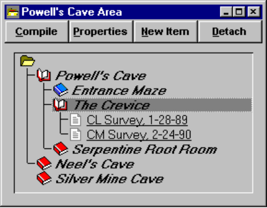
**Program Operation** **13**

In a manner similar to the Windows File Manager, if you drag with the _right_ mouse button, a pop-up menu of
choices is displayed when the button is released. These choices are more numerous when transferring
branches between different projects as discussed below.

When files have to be moved (or copied -- see below), prompts to confirm the overwriting or skipping of existing
files can appear, in which case the dates and sizes of different file versions are shown. With each encounter of a
matched name, your options are "Replace", "Replace All", "Skip", and "Skip all dups". Files with identical
names, sizes, and last update times are considered "dups". The program, of course, will preserve all file attributes during move and copy operations.

**Removing Tree Branches**
To remove a project tree branch, first select the branch to highlight it, then either press the Delete key or select
Remove Branch from the right-click context menu. A dialog is displayed that gives you two choices besides
Cancel. One is simply to remove the branch from the project while deleting any workfiles produced during compilation. The other choice is to delete all associated data files along with the branch. Data files will actually be
moved to the Windows recycle bin. Be aware that operations on the project tree, particularly branch deletions,
cannot be undone.

**Transfers Between Projects**
A feature easily overlooked is the ability to open more than one project and to transfer items between their respective trees via drag-and-drop. Here you can use the standard technique of holding the CTRL key down to
_copy_ a branch when you don't intend to _move_ it.  Alternatively, drag with the _right_ mouse button to invoke a popup menu of choices described below. A transfer that would cause two tree items to have the same _name_ property is disallowed since a project's item names, if nonblank, must be unique. All _copies_ within a single project
tree window are therefore disallowed.

Although it's normal practice, it's not a requirement that data files share the same disk directory as the project
script file. Each project tree item has a path property that can be either absolute (e.g., containing a drive letter)
or relative to that of its parent. Therefore, assuming the tree node you're dragging to a new parent has a _relative_
path property, it's quite possible that the data files themselves will have to be copied or moved if we are to preserve the node's parent-relative path. When this happens, you will be prompted for a decision regarding the disposition of data files: move or copy them, or keep them in place by forming absolute links.

To avoid such unexpected prompts, you can drag with the _right_ mouse button. Upon button release, a pop-up
menu will present you with five choices: 1) Move branch and files, 2) Move branch alone, 3) Copy branch and
files, 4) Copy branch alone, or 5) Cancel. When files remain in place, the path property of the dragged node is
transformed into an absolute path if necessary. (The program will generate a new relative path if possible.)

(Also see Properties: General Page, and Setup and File Usage.)

##### **3.2 Survey Text Editor**

The Walls built-in editor, with which you enter raw survey data, is like other popular text editors designed for
Windows, except there are some special capabilities, like auto-sequencing. There are also _project navigation_
functions that link the text you're positioned at to the compiled data under review (statistics tables or the preview
map). The standard procedures for moving the insertion point, searching for and selecting text, performing cutand-paste, and so forth, will not be detailed here. If you are not familiar with these conventions, you might check
out the help file for WordPad, which comes with all recent versions of Windows.

With the editor you can open or create any ordinary text file. Such files can be linked to the project whether or
not they contain compilable data. See Format of Survey Data to learn what Walls would consider valid survey
data.

_Copyright © 2013 by David McKenzie_

**14** **Walls Project Editor**

The most common way you'll invoke the text editor is by double-clicking a leaf (small page icon) in the project
tree. This will open an edit window containing the text of the associated survey data file. On the Walls "desktop",
you can have many text files displayed at once in their own edit windows. By selecting **Window | New window**
while an existing edit window is active, you can even have multiple windows displaying parts of the same file. In
this case, they will all be updated automatically as you use one to edit the text.

There are many other situations in the operation of Walls where an editor window is opened -- sometimes automatically, with text selected, or with the caret positioned at a place of interest.

An important editor option is the font used to display text, which can be either a proportional or fixed-space font.
You specify the font by selecting the menu item **Options | Fonts | Editor text** . Other editor-related preferences
are controlled by the following preferences dialog, which is accessed by selecting **Options | Text editor | <file**
**type>**, where <file type> is either "Current file", "Survey files (SRV)", or "Other files":

The horizontal grid lines, combined with the vertical lines defined by tab characters, improves the readability of
transcribed field notes. Also, the special ENTER key behavior allows for fast typing of tab-separated columns of
data -- particularly for numeric keypad users. The tab interval, which controls separation of the vertical grid lines,
can be adjusted larger than the 6-column default if the lengths of your station names require it. The optimal setting also depends on the font chosen for the editor's text.

Auto-sequencing can be toggled on or off via a toolbar icon labeled _**A..**_ You'll normally have this feature turned
on when entering sequences of survey shots. This usually makes entering the From and To station names unnecessary. There is also a toolbar button for reversing the positions of the From and To stations.

**New:** The **Initial Window Size** settings (with defaults shown above) actually determine the _maximum_ window
size of a newly opened editor window. If necessary the program will resize the window downward to display it in
the Walls application window. Of course you can then move and resize the open window.

**Important:** If you right-click the mouse while an editor window is active, a _context menu_ pops up that has a number of very useful functions. Which functions are enabled (not grayed out) depends on where the cursor was positioned. If it was positioned at a vector definition and the file is part of a compiled data set being reviewed, then
you can "jump" to that vector's representation on a page of the Review dialog, or locate the vector on the preview
map. A function that's always available is **Properties**, which opens the Properties dialog for the project tree item
corresponding to the file you're editing. Be sure to try out these functions on the context menu, which are easy to
overlook if you haven't made a habit of "right-clicking".

_Copyright © 2013 by David McKenzie_

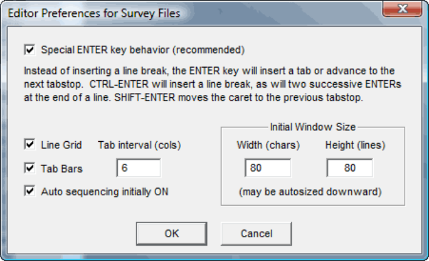
**Program Operation** **15**

##### **3.3 Properties Dialog**

The **Properties** dialog allows you to modify properties of an existing project tree item (book or survey) and is
reached by clicking the "Properties" button in the project tree window. A variation of this dialog, called the **New**
**Item** dialog, allows you to create a new tree item. It is reached by clicking "New Item" while the desired _parent_
item (book or project root) is selected. Both dialogs have basically the same data fields, which are organized as
a set of three tabbed pages:

      - General Page (survey or branch name, title, etc.)

      - Compile Options Page (advanced processing options)

      - Geographical Reference Page (UTM zone, datum, declinations, etc.)

**3.3.1** **Properties: General Page**

**Type (Survey file, Book, or Other)**

      - Select **Survey file** if you are defining a survey data file (normally with extension SRV). When you compile a
branch of the project tree, all attached survey files will be processed. A survey file is a _leaf_ since it can't have
child items.

      - Select **Book** if you are creating a new project branch instead of defining a leaf item (Survey file or Other).
When you are editing an existing item, you can turn a leaf into a book, in which case the actual data file (if
one exists) becomes unattached to the project. You can similarly turn a book into a leaf provided it doesn't
already have child items.

      - Select **Other** to link any kind of file to the project as a leaf. Such items will always be skipped during normal
compilation, whether or not they are attached (via connecting lines) to the book being compiled. They are always included, however, when a ZIP backup archive is created. Unlike data files, they can have long file
names. Also, their base names don't have to be unique within the project. Instead of Review Units, which
are relevant for books and data files, you specify **Launch Options** for items of this type (see below).

**Review Units (Feet or Meters)**
Select the units to be displayed when this item (Book or Survey file) is being reviewed. This option has nothing
to do with compilation; it affects the appearance of various dialogs in the next review session invoked for that
item and determines the units for exported maps and coordinate listings. For book items this also establishes
the default review units for new children. When the project window is active, the keyboard shortcut **ctrl-F9** / **ctrl-**
**F10** is available for turning feet units on/off for an entire tree branch. This operation ignores the attached/detached state of children.

_Copyright © 2013 by David McKenzie_

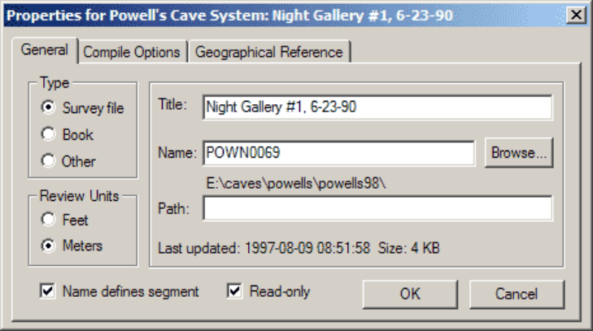
**16** **Walls Project Editor**

**Launch Options**

Make sure you use the Edit option only for ordinary text files. For example, an SVG file with extension ".svg" is
ordinary text, while a compressed SVG with extension ".svgz" is a binary file. Attempting to open a binary file in
the Walls editor will most likely produce a warning, "Line 1 will be truncated due to having more than 255 characters", at which time you should cancel the open operation.

**Name Defines Segment**
Leave this box checked if during the next compilation of a parent branch you want this _project tree_ node to have
a corresponding node in the _segment tree_ displayed in the Segment page of the Review dialog. The effect is to
insert a name component in the segment attribute of all vectors in the compiled branch. This would make it
easy, for example, to assign colors to specific caves and/or surveys in displayed or printed maps. It is also possible, of course, to define segments within the data files themselves. This box is normally checked by default.
For more information, see #Segment Directive.

In the segment tree diagram, the node's label will be taken from the **Title** property, but for the segment name
component itself Walls uses the 8-character **Survey File Name** or **Workfile Base Name** (see below). When this
name field is left blank, a checked Define Segment box has no effect on compilation.

Note that a forced recompilation (Edit | Recompile item) of higher-level branch items may be required if you
change the Define Segment status. This alone will not cause existing workfiles to be flagged obsolete.

**Tip:** If your project tree contains hundreds of small surveys, leaving this box checked for _all_ items can create an
unnecessarily large and complex segment hierarchy. You may have no need to distinguish between these surveys during the review process -- when assigning map colors, for example. To help you quickly change the segment hierarchy of a large project, the following keyboard shortcut is available when the project window is active:
**F9** / **F10**   - Turn _on/off_ the Define Segment property of all attached _descendants_ of the selected item. This insures
that the descendant books and surveys in the project tree will not automatically define nodes (branches) in the
segment tree. All segments defined _within_ the survey data files, however, will still be represented.

**Read-Only**
Check this box to write protect the file. This means you can't change the file's contents when it's open in an editor window, nor can other applications edit or delete the file until the read-only protection is removed. All other
operations on the file, such as compilation and jumping to and from Review pages are allowed. When the file is
open you'll know it's protected when "<LOCK>" appears in the window's title, or when an attempt to insert a
character causes a "beep" alarm.

**Note:** The Read-only check box is missing from the property pages of Book items. To set or clear the read-only
attributes of _all_ file items in a project branch, right-click the branch in the project window. Then select **Write pro-**
**tect files in branch** from the context menu. A submenu offers two choices: either protect all of the branch's files,
or else remove their protection so they can be edited.

Since file protection is implemented at the operating system level, the WPJ script file doesn't store the read-only
attributes. Hence other file managers (like Windows Explorer) are free to change them. Fortunately the Backup
Archive feature of Walls saves the read-only attributes in the ZIP files it creates. This helps protect the data from
inadvertent editing when a transported project is intended mainly for viewing.

**Title**
This is the text used to label this item's node when it is visible in the project tree window (or segment tree window
if Define Segment is checked). Typically it's the complete cave name or area name. There are no restrictions on
what can be entered here, except that the field must be nonblank. Enter a long, descriptive title if you like.
When selecting an existing survey data file via the "Browse" button, a blank field will be initialized with the file's
first-line comment (if one exists).

_Copyright © 2013 by David McKenzie_

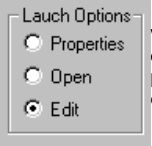
**Program Operation** **17**

**Base Name (or File Name)**
This edit field is labeled "File Name" if the project item happens to be a survey data file. Otherwise it is named
"Base Name". If you enter anything here, it must be a short (8 characters or less) name that is unique for all
items in the project. The program enforces this restriction by not allowing you to enter a name that's already assigned to a preexisting book or survey.

When a new _survey_ is being attached to the project, the name you enter here is an actual file name excluding
any path prefix. The file's base name (excluding extension) must have a length of eight characters or less -which means that the survey data files used by Walls cannot have long filenames. If the 3-character extension is
left off, the extension ".SRV" is assumed. Optionally this field can be left blank, in which case you will be prompted for a name whenever an operation requires one. A survey with either a blank file name or the name of a
nonexistent file is depicted as an "empty page" icon in the project tree window. When a file doesn't already exist, one will be created in the directory determined by the **Path** property (see below) after a window for it is
opened in the Walls editor and newly entered text is saved. An existing data file can be selected via the "Browse"
button, in which case the Title field, if empty, is initialized with the file's first line of text provided it is prefixed with
a semicolon.

Although earlier versions of Walls didn't allow this, you can now rename an existing data file by changing its File
Name property. You will be prompted to confirm such a change and whether or not an existing file with the new
name should be replaced.

Branch nodes (books) also require a unique name in this field if they are to be individually compiled. The program uses this name when constructing file names for the database it generates. If the node is a survey, as described above, Walls simply uses the base name of the survey data file. If the node is a book (or project root
folder) you can specify any name you wish here as long as it's unique for the project and no longer than eight
characters. Even if no database for this specific item will be created, you may still want to enter a name in this
field. That's because the name is also used as a component in the hierarchical segment attribute assigned to
vectors. (See **Define Segment** above.) If the name is blank, the project item will not be represented as a branch
in the segment tree when a higher-level node is compiled -- even if "Define Segment" is enabled.

**Path**
The path property box should be left empty if the survey data files associated with this tree item will reside, by
default, in the same disk directory as that specified for the _parent_ tree item. The default path property of the project root folder is the directory containing the project script (WPJ file). Therefore, if you're content with having all
of a project's data stored in one disk directory (as required by versions of Walls prior to B4), then just leave this
box empty for all items in the project tree.

Displayed immediately above the path property box is the path prefix that will remain in effect if the box is left
empty. If you enter a _relative_ path in the box, the text you enter will be concatenated with the displayed prefix to
establish a new path for the data file or branch. A relative path is any text that does _not_ begin with either a backslash or a drive letter followed by a colon. If the tree item is a book node, the default path property of its children
is in this way specified. If the item is a survey file or directory selected via the **Browse** button, then the Path box
will be automatically filled in as appropriate -- that is, with a parent-relative path if one can be constructed, or
with an absolute path if one cannot. I recommend that you use relative paths whenever possible to simplify management of the project.

For example, the General Page shown at the beginning of this section is for a leaf node, or survey data file. It
has a relative path setting of "Surface", which in this case specifies that POW-NG4.SRV resides at location E:
\caves\powells. Note that the path property pertains only to data files, not to workfiles. If this leaf node were
compiled by itself, workfiles with base name "POW-NG4" would be created in the project's work directory, which
is always a subdirectory directly beneath the project directory.

Alternatively, you can specify a completely new default path prefix, independent of the parent node, by entering
an absolute path such as "E:\caves\powells\Surface Surveys". (Note that with either type of path, case doesn't
matter, long file names are allowed, and the trailing backslash can be omitted.) This makes it possible to attach
data files that don't reside in some subdirectory beneath the project directory, which in turn might facilitate the
sharing of data between different projects. The only problem with absolute paths, which have to be "hard coded"
in the WPJ file, is that they make it harder to archive entire projects and to transport them to new locations. If associated data files are somehow overlooked, or even just moved to a different drive or directory, the reopened

_Copyright © 2013 by David McKenzie_

**18** **Walls Project Editor**

project will display "empty page" icons for the missing files. This situation can usually be remedied, however, by
changing the path property of just a few branch nodes.

Making changes to the path property of branches already populated with data is as simple as editing this field in
the Properties dialog. The program will confirm that you want affected files moved, possibly causing new directories to be created automatically. Also, drag-and-drop operations, either on a single project tree or between different trees, can trigger various kinds of prompts when the path prefix inherited by a dragged branch changes.
(As in Windows File manager, you can avoid unexpected prompts by dragging with the _right_ mouse button.) The
options you're given include moving, copying, and linking (keeping in place) files associated with the moved or
copied branch. In some situations, "reasonable" choices are made behind the scenes without prompting, such
as transforming an absolute path into a relative path whenever possible. Normally, you'll want files to either remain in place or to be _moved,_ not copied. This is to avoid eventually winding up with identically named files with
different content.

For more information on project tree reorganization, see Project Trees.

**3.3.2** **Properties: Compile Options Page**

The compile options edit box is an advanced feature that might be useful, for example, when experimenting with
instrument corrections, name prefixes, or other settings you may want to apply to a group of files. It allows you
to pass #Units Directive parameters to the module of Walls that interprets raw data files during compilation. For
example, "IncA=0.5" would cause a half-degree correction to be applied, by default, to all compass and tape azimuth measurements in all data files contained in this project tree branch. Any such parameters can be overridden within the files themselves.

This is a particularly good place to put macro definitions, such as $UV_001="UV=0.25", which allow you to _spe-_
_cifically target_ subsets of data scattered throughout the branch. Another advantage of macros is that you can
specify settings for other kinds of directives, not just #units. See Defining and Using Macros.

When each data file is opened for processing, all non-blank Compile Options settings encountered in a project
tree traversal, starting with the root and ending with the file itself, are processed as if they were a sequence of
separate #Units directives inserted at the top of the file. (Do not include the keyword "#Units" in the Compile Options field, only the directive's arguments.) The attached/detached state of branches is ignored during the traversal.

**Important Note:** Obviously, if this edit box contains parameters necessary for the correct interpretation of your
data files, then it's crucial that the WPJ file be kept with your SRV files and that the latter have appropriate comments. You must also be careful when moving the affected data files to other project tree branches. Ideally your
SRV files should be self-contained and have their own #Units directives or at least comments to describe their requirements.

_Copyright © 2013 by David McKenzie_

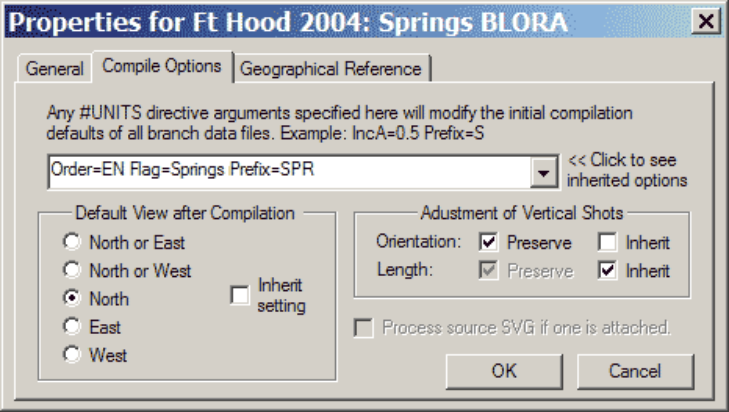
**Program Operation** **19**

**Inherited Options**
The Compile Options dialog (like the Geographical Reference page described below) illustrates the use of _inher-_
_ited_ options. In the example pictured above, orientation (verticalness) of pure vertical shots is explicitly set to
"Preserve". The status of the length preservation option, however, is inherited from the parent node in the project
tree. In this case, a grayed check mark reveals that a "Preserve" setting is being inherited. This facility allows
you to control the processing of many surveys by accessing the Properties dialogs of just a few high-level book
nodes. (A detached node does not break the inheritance chain.)

In the example above, entry "Order=EN Flag=Springs Prefix=SPR" specifies three #units parameters to be used
in the compilation of all data files in project book "Springs BLORA." It's possible, however, to override these settings in the Compile Options properties of sub-branches or in the data files themselves. By clicking the down-arrow at the right of this edit box you can view (but not edit) the list of compile options inherited from parent book
nodes.

**Default View After after Compilation**
This setting determines the default orientation of the preview map for all network components after a compilation.
Normally **Inherit Setting** will be checked, causing the orientation preference to be inherited from the parent
item. The default preference for the project root is initially "North or East", which causes the same program behavior exhibited by versions of Walls prior to 2B7. That behavior is to choose either North or East depending on
which view would give the largest scale. In the example above, the default view preference is overridden (Inherit
setting _not_ checked) and specified as North. Note that on the Map page you can change the view to any orientation and Save it. If you then Review the item (as opposed to recompiling), the last saved view will be restored.

**Process SVG if One is Attached**
This option specifies that a source SVG file, if attached to the project tree beneath this item, will be automatically
processed during each compile operation. This will slow the compilation process somewhat. The result will be a
workfile with extension NTW which can optionally be used for drawing passage outlines in place of LRUD polygons. This feature is independent of SVG export operations. The NTW file is useful only for printed and displayed non-SVG maps, or for metafiles and shapefiles. For this to work, the SVG file must contain a w2d_Mask
layer. (See SVG Layer Definitions.) You must also turn on the option to use the processed SVG data in the Passage Display Options dialog.

**Adjustment of Vertical Shots**
These settings affect how _pure vertical_ shots (i.e., +90 or -90 degree inclinations) are handled during a leastsquares adjustment. Ordinarily, such shots are treated like normal compass-and-tape vectors and weighted inversely proportional to length -- see Variance Assignments. Also, like normal shots, you can place a variance
override on the respective data line. In particular, "(0,)" would constrain the horizontal components, "(,0)" would
constrain the vertical component, and "(0)" would constrain all components. The check boxes in this dialog allow you to redefine the _default_ assignments for just the vertical shots in this project branch.

It's debatable what these assignments should be when we're dealing with ordinary "good" data. It's been my experience when cave surveying that I'm usually far more confident in the measured length of a drop than I am its
verticalness. It's not always easy to position a marked station directly over another marked station, the result being we're kind of sloppy about station positioning. The difficulty increases with long drops. Compared to a nearhorizontal shot of the same length, a vertical shot would likely contribute at least as much horizontal error while
contributing _far less_ vertical error to a traverse. Vertical shots are a very good way to measure depth in a cave,
whereas near-horizontal traverses are a very poor way. My preference, therefore, would be to preserve length
and _not_ orientation.

The issue of appearances, however, might favor a different approach. If the default adjustment changes a shot's
vertical orientation so much that it's noticeable on a plot, then we're probably dealing with a relatively short _bad_
traverse -- possibly one that we've decided to float. Recall that when we float a traverse we are less concerned
with location accuracy within the traverse (we know it's bad) than simply having it "look reasonable" when it's
plotted. We don't want to leave one end dangling, and we don't want the traverse's presence to distort the remaining network. In this circumstance there's little harm in maintaining the verticalness of shots we've recorded
in our notes as being vertical. By making this choice we insure that the total horizontal component error in a traverse is resolved by adjusting only the non-vertical shots.

_Copyright © 2013 by David McKenzie_

**20** **Walls Project Editor**

**Technical Note:** Selecting "Length: Preserve", for example, is not quite the same as specifying zero for the vertical component error variance on each data line defining a vertical shot, as with "(,0)" . While the latter would indeed prevent any vertical adjustment whatsoever, it could conceivably cause Walls to halt compilation when
more than one vertical shot existed between a pair of stations. (The same limitation exists for loops comprised
entirely of constrained vectors.) To prevent this from happening, a positive but insignificant variance is assigned.

**3.3.3** **Properties: Geographical Reference Page**

The Geographical Reference page displays (in red-colored type) the geographical reference position you've selected for this item in the project tree. Selecting a reference position activates the controls on the right of this dialog, which allows you to generate UTM coordinates and/or use #Date directives for the automatic calculation of
magnetic declinations. In this example we are viewing the settings for "ESS_Z13 Survey", which show that the
reference position is being **Inherited** from a parent node, "ESS Cave".

Unchecking the Inherited box enables the **Change** button along with the **Unspecified** check box, which, if
checked, makes it clear that no geographical reference is being used. When you first create a project, the root
folder's geographical reference is unspecified and the related settings for all child items are inherited. You could
very well leave it this way if you have no need for UTM coordinates and date-derived declinations. Changing
anything but the Coordinates setting (which affects output for this item alone unless the setting itself is inherited)
will invalidate the workfiles of ancestor and descendent items in the project tree, causing blue tree icons to become red icons. The Declinations and Coordinates check boxes are described in more detail below.

When it's enabled (not grayed) the Change button brings up a version of the Geographical Calculator. Although
the calculator can be used for other purposes, the only calculated results that are needed for survey data processing are the grid convergence and the magnetic declination. Both depend on the selected geographical position. The declination also changes with time, and therefore your survey vectors must have been assigned dates if
the program is to automatically calculate declinations.

**Declinations - Derive from #Date**

When this option is selected, default declinations (otherwise zero) will be automatically supplied by the program
when data files containing #DATE directives are compiled. A #Date directive then becomes equivalent to a #Units directive with the single argument DECL=x, where x is the declination derived from a model of the Earth's
magnetic field. The use of this option, however, will _not_ deactivate all DECL specifications that might actually appear on #Units directive lines. The two methods of specifying declination will simply override each other depending on the ordering of directives in your files.

_Copyright © 2013 by David McKenzie_

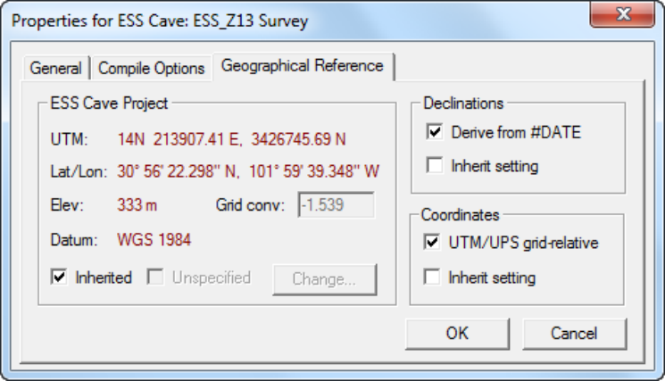
**Program Operation** **21**

[The mathematical model used to estimate the Earth's magnetic field is known as the International Geomagnetic](http://www.ngdc.noaa.gov/IAGA/vmod/igrf.html)
[Reference Field](http://www.ngdc.noaa.gov/IAGA/vmod/igrf.html) (IGRF), which currently supports dates in the range Jan 1, 1900 to Dec 31, 2014. It is the same
model used by GEOMAG, a program maintained by the NOAA's National Geophysical Data Center (NGDC). An
[online version of GEOMAG along with more information on the model is available) at the NGDC website.](http://www.ngdc.noaa.gov/geomag/)

Besides providing a declination angle, both GEOMAG and the Walls calculator estimate the intensity of the magnetic field's horizontal component. Magnetic compass readings are considered by some to be unreliable if this intensity is less than about 5000 nT (nanotesslas), which is often the case for locations above 70° N latitude.

The IGRF model's declinations are usually accurate to within a degree, depending on your location. Perhaps
more important than absolute accuracy, however, is the ability of the model to predict the _change_ in declination,
which is very significant over a period of years. This can be of great help as we try to calibrate new compass
readings against those taken in years past, when only dates, not declinations, were recorded in field books. For
future work, various schemes of calibration are possible, such as having each surveying team routinely take
readings on a few physical features at known (or agreed-upon) true north orientations at the cave entrance. Any
consistent deviation from the IGRF predicted value, which in reality is a combination of both model error and instrument error, can then be expressed as a compass (IncA=) correction. In fact, differences between instruments
not properly calibrated against each other are likely to be a more serious problem than uncertainty about declination.

A mixture of model-predicted declinations and declinations taken from other sources (entered explicitly as
DECL=n), even when the latter are believed to be more accurate, is probably a bad idea. I recommend using
just the model, or consistently employing some other method of keeping measurements comparable over time
and between surveying teams. Remember that during a Walls data compilation, a compass and tape vector's
true north-relative direction is obtained as follows:

<compass reading> + <IncA correction> + <computed or specified declination>

When the option to generate UTM/UPS coordinates is in effect (see below), the grid convergence is then _subtrac-_
_ted_ from this value to obtain the grid-relative direction.

You'll notice that the geographical calculator in Walls shows declinations precise to two decimal places, even
though we can't depend on them being much closer than about a degree of the true value in some regions. The
displayed precision at least gives us some sense of the declination's dependence on time and position. Given
the model's limited accuracy, it's probably sufficient to choose a reference position somewhere within the cave
area (no farther than 40 km away) and stick with it throughout the course of the project.

**Coordinates - UTM/UPS Grid-relative**

When the "UTM/UPS Grid-relative" box is checked, the coordinate listings and maps generated after compilation
will be grid-relative rather than true north-relative. The coordinates produced will be either _Universal Transverse_
_Mercator_ (UTM) or _Universal Polar Stereographic_ (UPS), the latter being an option in polar regions. The grid convergence angle used for the conversion from true north to grid north will be the one shown in this dialog,
labeled **Grid Conv** . The value will be _subtracted_ from true north-relative azimuths to obtain grid-relative azimuths. Normally, this angle is the actual UTM/UPS grid convergence angle associated with the reference position (as computed by the calculator); however, advanced users can change the Grid Conv edit box contents,
thereby producing any desired amount of rotation. If this is done, the generated coordinates will _not_ be strictly
UTM or UPS, even though the coordinates on a listing might appear to be. This value also establishes the default GRID correction that will be applied to #FIX coordinates when true north-relative coordinates are wanted.
(To enable the **Grid Conv** edit box you still need to specify a geographical reference position.)

In the example above, since "UTM/UPS grid-relative" is checked, a negative grid convergence (-1.539 degrees)
will be applied so that all generated maps and coordinate listings will be based on UTM grid north instead of true
north. This assumes that the convergence angle was derived from the reference and not edited.

The coordinate _type_ produced in a compilation, UPS or UTM for a specific zone, is determined by the geographical reference assignment of the project branch selected for compilation. Usually, a child item will inherit its geographical reference from its parent; however, a descendent item might very well have its own reference assignment and consequently a different basis for defining #FIXed positions. A Walls project might therefore overlap a

_Copyright © 2013 by David McKenzie_

**22** **Walls Project Editor**

zone boundary (or, less likely, the equator or one of the UPS/UTM boundaries at 84° N and 80° S). The final result of a compilation, in any case, will be a consistent database with coordinates all either UPS or UTM in a single
zone.

In polar regions, the choice of UPS over UTM can result in more accurate coordinates due to less scale distortion. Although a compass-and-tape survey with one fixed point would not have better loop system statistics, the
coordinates of distant stations would more likely fit those of satellite estimates. The Geographic Calculator topic
describes how to specify UPS for a survey's geographical reference.

**Automatic Zone and Datum Conversion**

When appropriate, Walls will automatically convert coordinates in one UTM zone and geodetic datum, say zone
14, NAD27, to coordinates in a different zone and datum, such as zone 13, NAD83. Thus UTM coordinates that
are technically out-of-zone are possible in a compiled database. This can happen when a child node of the project tree is assigned a different geographical reference from that of the parent node being compiled. This feature
allows you to easily construct projects with data overlapping a zone boundary, or projects with fixed points
defined in different datums. (The Geographical Calculator topic describes how to express coordinates in either of
two adjacent UTM zones.).

##### **3.4 Review Dialogs**

The review dialog is a series of tabbed pages that allow you to examine the compiled results of any portion of
your project. It is made active immediately after a compilation, or whenever the **Review** button is clicked while a
previously compiled project tree branch is selected.

The **Geometry** page allows examination of those parts of the network relevant to data screening: connected
components, loop systems within a component, and traverses within a loop system.

The **Traverse** page lists the vectors in a selected traverse along with suggested corrections and other statistics.
Like the Geometry page, it is most useful during data screening.

The **Map** page has a "preview map" that highlights the selected system and traverse. Here you can zoom to an
area of interest and rapidly generate maps for the screen and printer. For more precise scaling, the Scale and
Position dialog can be invoked.

The **Page Layout** page displays an image of the map that will be printed at the current view and printer settings.
It also displays the contents of adjacent view frames and allows you to generate multi-page plots.

The **Segments** page is used to assign map attributes for selected portions of the data, such as vector coloring.
Manipulation of the segment tree also allows you to specify portions to be excluded from maps, statistical summaries, coordinate listings, and several kinds of exported data.

**Please Note:** The kind of length unit (feet or meters) displayed on these pages and in related dialogs is in most
cases determined by a property setting for the compiled branch at the time the Review dialog window is opened.
The default units are meters. (See Properties: General Page.)

For more information, please review the following topics in turn:

Geometry Page

Floating Traverse Chains
Traverse Page
Map Page

Scale and Position Dialog
Grid Intervals Dialog
Passage Display Options Dialog
Map Format Options Dialog
Page Layout Page

_Copyright © 2013 by David McKenzie_

**Program Operation** **23**

Page Offsets Dialog
Segments Page

Color Selection Palettes
Color Gradient Dialog
Adjusted Totals Dialog
Flag and Marker Symbols

**3.4.1** **Geometry Page**

Whenever a portion of your data is processed or reviewed, whether it be a single survey data file or a project tree
branch consisting of many files, a page of list boxes describing the resulting network geometry appears as a
page in the Review dialog's window. In the initial stages of working with new survey data you will consider this
page your "control center" for data screening. On other occasions, when survey files are considered fully debugged, you will skip the Geometry page, moving immediately to the Map page to select specific regions for
printing or screen display. Depending on the situation, you can toggle a preference setting (a toolbar button resembling a map), that determines whether or not the Geometry page, as opposed to the Map page, is immediately displayed when the Review dialog is called up.

The Geometry page is described here on an item-by-item basis, where it's assumed you've already reviewed the
definitions in Network Terminology. For a short tutorial on the use of this page, see Data Screening Tutorial.
Also, if you're really interested in knowing how the statistics are computed, see Statistical Formulas.

**Components**
The compiled data will define a network of possibly more than one connected component. (This means there
are no traverses connecting the separate components and no #FIXed stations establishing their relative locations.) Each component is shown in this list box as a line of data: the reference station, the total number of vectors, and the total length. The reference station is named "<REF>" if the component has fixed points; otherwise
it is simply the first station of the component encountered during compilation. (Data files are processed in the order that they appear in the project tree.)

If there is more than one component, the one you select (highlight) in this list box affects the contents of the remaining list boxes on the Geometry page. Also, the other tabbed pages, including the Map page, will reflect

_Copyright © 2013 by David McKenzie_

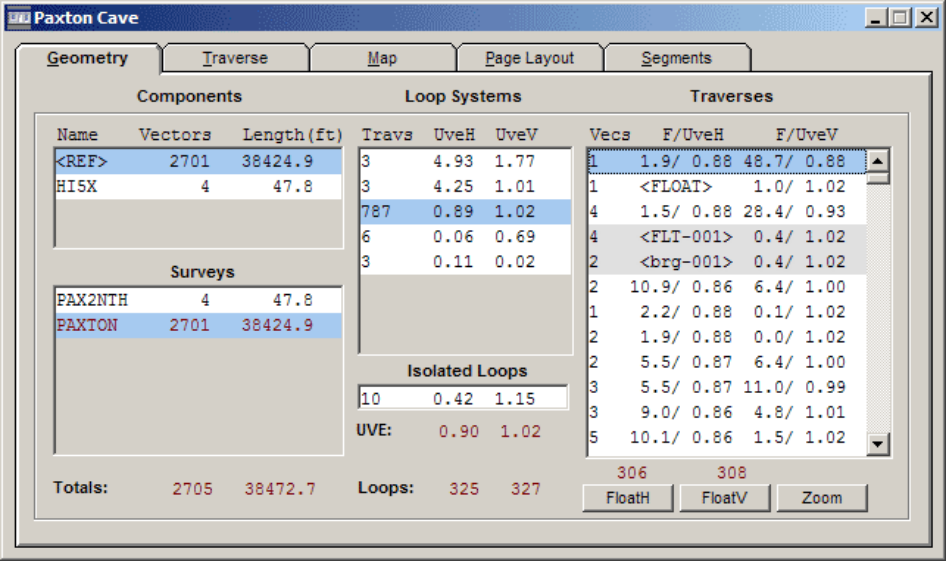
**24** **Walls Project Editor**

only the component that is selected. The components are listed in no particular order. The first component featuring a loop system (if there is one) will be highlighted when the dialog is initially opened.

Since it is usually more convenient to compile and review disconnected surveys separately, the Components list
box will normally contain just one item. More often than not, multiple components reveal the presence of
"hanging" surveys due to missing data or misnamed stations. In this case, you will want to select the unexpected component and then double-click the red-colored item in the Surveys list box (see below). This will open an
edit window showing the "orphaned" reference station as it appears in a data file.

**Surveys**
This list box displays the names of the data files, along with vector counts and total lengths, in the order they
were processed. One of these list box entries will be shown in red. This file contains a defined vector involving
the selected component's reference station (see above). Double clicking the entry will activate an edit window
highlighting the vector's data line. Double clicking any other entry will simply open the respective file.

**Loop Systems**
The selected component's loop systems -- those with loop counts greater than one -- are listed here. Shown for
each loop system is the number of traverses followed by the unit variance estimates for the horizontal and vertical dimensions: UveH and UveV. The systems are sorted in order of increasing quality -- that is, those with the
largest combined UVE appear at the top of the list. Inevitably, the worst UVEs will sometimes be too large to
print in the allotted space. On those occasions you will see "--.--" instead of their true values.

The contents of this list box should become more or less familiar to you after repeated processing of a project's
evolving data set. Initially you'll want to examine each loop system in turn by selecting the corresponding list box
entry, thereby filling the **Traverses** list box (see below) with information about the system's traverses. (The Map
page also highlights the selected system in blue.) The goal is to correct or float traverses while lowering the system UVEs to tolerable values. While a UVE much larger than one indicates the presence of bad measurements,
a modest-sized UVE for a large system doesn't necessarily imply the opposite -- that is, "outlier" traverses can
still be present. Whatever the case, at some point you should inspect the list of traverses for each loop system.

The separate treatment of the horizontal and vertical components of a survey should assist you in your data
screening efforts. Errors in compass readings, for example, will affect only UveH, while reversed signs in inclination readings will affect only UveV.  Depending on the survey, inclination and distance errors can contribute to
both statistics, but will often have a disproportionate affect on one or the other.

**Isolated Loops**
A component may have numerous _isolated loops,_ each of which is a loop system comprised of just a single traverse. For convenience these are lumped together and analyzed as if they were a single loop system. This special "system" is selected by clicking in the separate 1-item list box labeled "Isolated Loops" -- an operation that
automatically unselects whatever multiple-loop system happens to be highlighted in the list box just above it.
Displayed here is the total number of isolated loops along with the overall horizontal and vertical UVEs. When
the Isolated Loops box is selected, the statistics for the closed traverses will be displayed together in the **Tra-**
**verses** list box. Also, the selected loop will be shown in red on the Map page. All other isolated loops will be
shown in blue.

**Traverses**
This list box contains statistics for the selected loop system's traverses. When we're examining a system with a
large UVE we can usually restrict attention to just a few of the listed traverses, namely those that themselves
have bad statistics. For each traverse the number of end-to-end vectors forming it is displayed in the leftmost
column. Except for special cases, the remaining columns consist of pairs of statistics that indicate how well the
traverse closes with the surrounding network. (The cases in which a bracketed expression, such as "<FLOAT>",
replaces a statistics pair are described in the next section.) Normally, you'll see a pair of numbers for the horizontal components, labeled "F/UveH", and a pair of numbers for the vertical component, labeled "F/UveV". Each
such pair is defined as follows:

The number _above the slash_ is the traverse's F-ratio. Its size reflects the traverse's disagreement with the remaining traverses in the selected loop system. If it is greater than one, then discarding the traverse will cause
the system's consistency to improve -- that is, the system's UVE will become smaller. If it is less than one, then
discarding the traverse will cause the consistency to worsen. If it is zero, then the traverse is in perfect agreement with the remaining data: its best correction is zero. In practice, the F-ratios for a reasonably "clean" system

_Copyright © 2013 by David McKenzie_

**Program Operation** **25**

will range in value from 0 to 10, with only a few above 5. One possible strategy is to always examine closely the
worst few traverses in each loop system while either fixing or permanently floating any traverse with an F-ratio in
the double-digit range (or beyond, in which case "--.-" is displayed).

The number _beneath the slash_ is the value that the system's UVE would attain if the traverse were discarded. If
it is larger than a value you consider tolerable, then you know that throwing out (or even fixing) this particular traverse will not solve all your problems. Unfortunately, it's not uncommon for a loop system to show evidence of
multiple blunders. Since the traverses are ordered by decreasing F-ratio (horizontal and vertical combined), the
ones affected by blunders should all be near the top of the list. Removing the effect of a bad traverse by floating
its horizontal or vertical components (see below) might change the ranking of other traverses; however, an advantage that these statistics have over traditional methods of flagging "outliers" is that there is less tendency for
one bad traverse to severely inflate the statistics of traverses nearby -- even if the situation is as drastic as a misnamed station. The result is that multiple blunders in one loop system can often be detected after a single compilation.

If a traverse happens to consist entirely of constrained vectors (i.e., its assigned variance is zero), the word
"<FIX>" is displayed in place of the statistics. The program doesn't compute the statistics in this special case, although technically they are obtainable. For example, you can determine the best correction and UVE after detachment by floating the traverse as described below. If you have several constrained traverses in a loop system
and want to know if any of these "stress" the network significantly, you can toggle the float status on and off for
each one in succession. (For further discussion of this case see the note at the end of the Traverse Page topic.)

When a particular traverse is selected, it's possible to obtain additional information in various ways. First, you
can switch to the Traverse page, which lists the traverse's vectors in their natural order along with suggested
measurement corrections. (This switch can be accomplished by simply double-clicking a list box entry.) From
the Traverse page you can easily (by double-clicking a vector) invoke the text editor to view or correct the relevant lines of raw data. Another way to examine the traverse is to switch to the Map page, which shows the selected traverse highlighted in red. (If it is just the traverse you are interested in, use the **Zoom** button instead of the
Map page's tab.) Finally, you can use the **Float/Unfloat** buttons to examine the effects of excluding the traverse
from the loop system's data. In fact, the successive steps of selecting a traverse, clicking one of the float buttons, and then either double-clicking the traverse or clicking the **Zoom** button, together form what is perhaps the
most frequently-used data screening operation.

**Float/Unfloat Buttons**
When a traverse with obviously bad statistics is noticed, a possible next step is to highlight it in the Traverses list
box and use the **FloatH** and **FloatV** buttons to float whichever components, horizontal or vertical, stand out.
This action involves reprocessing the loop system's data -- a least-squares readjustment in which the measured
components of the selected traverse are given zero weight. If the loop system is large (it would have to be _very_
large nowadays), you may witness the hourglass icon for several seconds before the screen is refreshed with
new statistics.

The main benefit of floating a suspect traverse is that you can then home in to it on the Map page (see the **Zoom**
button below) and see the network around it undistorted, either by this traverse and any others that may have
been floated. Also, the raw unadjusted vectors of a floated traverse are shown in yellow, while those that are adjusted to conform to the rest of the network are shown in red. Some common types of data errors -- misnamed
stations and reversed shots, for example -- are in this way made quite obvious. Another benefit is that with the
updated statistics you can continue the data screening process without editing data files and recompiling. Although the "discarded" traverses will no longer play a role in the statistical ranking of other traverses, they obviously can't be of any assistance either. Therefore, as soon as you confirm mistakes in the data, you should fix
them right away and recompile to take advantage of the new information.

The process of dynamically floating and unfloating traverses, besides changing the statistics, will affect the appearance of certain items in the Traverses list box. Except for the special case of traverse chains (see below),
when a traverse is floated the corresponding statistics are replaced with <FLOAT>. The horizontal or vertical
component of the traverse is effectively discarded and the loop count is reduced by one. At the same time, if the
operation makes certain other traverses essential for keeping the network connected, the statistics for those
other traverses are replaced with <BRIDGE> (or more likely something like <brg-001> -- see below). This means
the operation turned them into non-loop elements, called bridges.

Interactive float/unfloat operations will not change the sort order or scroll position of items in the Traverses list
box, even though their ranking by combined F-ratio might be affected. This helps us keep track of traverses

_Copyright © 2013 by David McKenzie_

**26** **Walls Project Editor**

which are identified here only by their statistics and vector counts. After floating several traverses we sometimes
have to peruse the list a bit to locate the largest F-ratio (horizontal and/or vertical) among the remaining traverses.

A relatively new feature of Walls is special support for chained traverses, whose statistics appear with a gray
background in the Traverses list box. (The example dialog above has one 2-traverse chain displayed.) Chained
traverses have a different behavior when operated on with the Float/Unfloat buttons. You might see <FLT-001>
instead of <FLOAT>, or maybe <brg-002> instead of <BRIDGE>. Unlike normal bridges, which technically can't
be floated without disconnecting the network, traverse chain bridges _can_ be floated in a certain sense. This
means you can use the FloatH/FloatV buttons to float an entire traverse chain, which may be preferable to floating an arbitrarily chosen member of the chain. For details, see Floating Traverse Chains.

**Zoom Button**
Clicking this button switches to the Map page while at the same time rescaling the map so that the selected traverse almost fills the frame. This also automatically checks the **Selected, Label, and Mark** check boxes on the
Map page -- the idea being that you will probably next want to generate a map with station labels. The view direction and plan/profile orientation currently set for the Map page, however, are _not_ changed. For example, if you
float _only_ the vertical component of a traverse and **Zoom** to the Map page in plan view, you will then need to
switch to profile view to see any yellow lines (the unadjusted version of the traverse).

**Locating a Vector in the Geometry**
When the Geometry page is active, the **Search | Find** operation (accessed most easily via the binoculars icon on
the toolbar) will locate the component, loop system and traverse (if any) containing a specified vector. You are
prompted to enter a pair of station names in any order, separated by tab(s) or space(s). Be sure to include explicit name prefixes (e.g., "SRV1:A100 14C") when necessary to distinguish between duplicate names. Prefixes
can be omitted when there is no chance of conflict. The search will stop upon finding the first matching vector
contained in a loop system. After a successful search the containing system and traverse will be highlighted.
Also, upon switching to the Traverse Page, the target vector will be selected and in view.

**Searching from and Edit Window**
There's also a more direct way to search for a vector in the geometry. To see the effect on statistics of a shot in a
survey file you're editing, simply right-click on the shot line to open the editor's _context menu_ . Then select **Find**
**vector in statistics** . If the vector is part of a loop system, the corresponding traverse will be highlighted on the
Geometry page. This also works to highlight a vector's statistics on the Traverse page, if that page is in view.

**3.4.2** **Traverse Page**

The second tabbed page of the Review dialog, the **Traverse page,** displays details for a specific traverse in the
loop system currently being examined. Normally you select this traverse via the Geometry page, but you can
also scroll through the system's traverses using the **"<<"** and **">>"** buttons at the bottom of either the Traverse
page or the Map page.

At the top of the page are the statistics **F/UveH** and **F/UveV,** the same ones appearing in the Traverses list box
on the Geometry page. (For their definitions, see Geometry Page.) In the upper right corner is a check box,
**"Feet",** that allows you to toggle between feet and meter units for the displayed length data. (Its initial status
depends on the "Display Feet" setting for the project tree item that was compiled. See Properties Dialog.)

_Copyright © 2013 by David McKenzie_

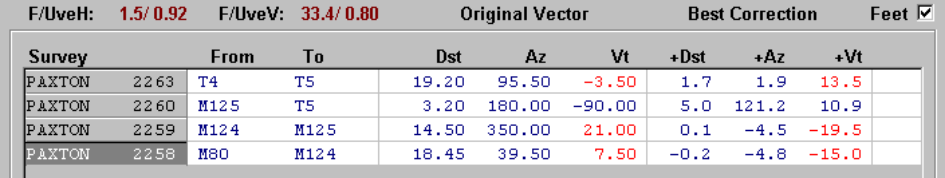
**Program Operation** **27**

Occupying most of the page is a table featuring all of the traverse's vectors. The ordering of vectors is along a
connected sequence; that is, each vector connects to the ones immediately above and below it in the table. The
following vector properties make up the table's columns:

**Survey**
The first column contains the location of the vector's definition: a file name (without the extension) along with a
line number. Double-clicking anywhere on the row will open (or activate) an edit window into the data file with
this line highlighted.

**From To**
The second column shows the FROM and TO station names in the _same order_ that they appear in the vector's
original definition. While adjacent vectors have an endpoint in common, a vector's FROM station, for example,
will not necessarily match the TO station of the vector just above it. This choice of direction makes comparison
with the original data much easier. A station's name prefix, if any, is not shown.

**Original Vector**
Listed under the headings **Dst, Az,** and **Vt** is the _originally measured_ vector converted to a set of three equivalent
"measurements": distance (feet or meters), azimuth (degrees), and vertical angle (degrees). This may or may
not exactly match what appears in the data file, since instrument corrections, declinations, height adjustments,
etc., have already been applied. This means, for example, that azimuths will either be true north-relative or gridrelative. You can, however, use the **"Feet"** check box to switch between distance units.

A fixed point vector -- that is, a station connected to the implied zero reference, <REF> -- will be displayed with
zeros in the Dst, Az, and Vt columns. Although the "observed" vector components (e.g., UTM coordinates) could
have been displayed instead, they would not be particularly useful in this context. The zeros help make this special case stand out and emphasize that the +Dst, +Az, and +Vt fields are an east-north-up best correction for the
fixed point (see below).

**Best Correction**
Listed under the headings **+Dst, +Az,** and **+Vt** are the three numbers that when added to those of the previous
three columns (Dst, Az, and Vt) would completely eliminate the discrepancy between the traverse and the rest of
the network (adjusted with the traverse excluded). Note that _only one_ of the listed vectors must be so corrected
to close the traverse. The east-north-up components of this best correction are displayed with the label **"ENU**
**Closure"** at the bottom of the page.

Occasionally you will notice that one of the numbers is displayed in a red font. For example, you might see
something like this for +Dst, +Az, and +Vt :

... |  0.02 **-9.21** -0.51 |

The color change occurs only when _exactly one_ of the three corrections -- that for the azimuth in this case -- exceeds a predefined tolerance level. By default, these tolerances are 1 meter, 5 degrees, and 5 degrees for the
distance, azimuth, and vertical angle, respectively. (You can change these tolerances via the Walls menu -- see
Options | Compilation | Vector Highlighting...) The idea, of course, is that if a traverse fails to close because of a
blunder, then there is a good chance that just one bad measurement is responsible. Vectors for which a single
measurement change is suggested are therefore suspect. Given the above example, we might discover that an
azimuth reading of "250" was mistakenly keyed in as "259".

In the case of fixed point vectors (one station being <REF>), the east-north-up components of the best correction
appear instead of +Dst, +Az, and +Vt. This is how much the fixed point would need to be moved to close the traverse. In this case, the tolerance level for distance is applied to each component to determine highlighting. Note
that these components will be grid-relative if the option to generate UTM grid-relative coordinates was in effect
during compilation ( or if a non-zero #Units GRID parameter was applied) . (See #FIX Directive.)

Except for the odd case of a constrained traverse (see NOTE below), the numbers on the Traverse page -- apart
from the statistics at the top which can be replaced by "<FLOAT>" -- are independent of whether or not the traverse has been floated. Although the best correction, by definition, is unaffected by the traverse's own float/unfloat status, the status of _other_ traverses in the system can of course make a difference. In fact, when multiple

_Copyright © 2013 by David McKenzie_

**28** **Walls Project Editor**

blunders are evident, a good strategy is to float all traverses with conspicuously large F-ratios before examining
the Traverse page for suggested corrections.

The **"ENU Closure"** at the bottom of the page is the best correction in the form of a vector that must be _added_ to
the traverse to make it consistent, where the traverse's direction is defined to be along the sequence of listed
vectors, from top to bottom. (If there is just one vector, the FROM and TO names define the direction as usual.)
Like the vector azimuths, these error components will be true north-relative unless the option to generate grid-relative coordinates was in effect during compilation.

Also at the bottom of the page is **"Hz Len",** the traverse's horizontal length, and **"Vt Len",** the traverse's vertical
length. The former is simply the total length of the vectors in plan view. The latter is the sum of the absolute
values of the vertical components.

**NOTE:** There is one circumstance when a traverse's statistics, including the best correction, are not provided by
the program, even though they technically exist. This occurs when the traverse has been _constrained,_ as indicated by the word "<FIXED>" shown in place of the statistics (horizontal and/or vertical) at the top of the page. In
this case, zeros replace the actual best correction. To obtain the latter you can return to the Geometry page momentarily and float the traverse. Alternatively, you can override the zero variance assigned to a vector in the data
file with a small value such as 0.01 -- a tactic that will also produce an F-ratio. If the idea bothers you that a constrained traverse should be considered error prone, then you can think of the F-ratio as testing not the traverse,
but the remaining loop system as a whole.

**3.4.3** **Map Page**

The Map page of the review dialog is divided into three sections: a preview map featuring a graphical representation of the compiled survey data, a **Preview Map** control panel for controlling the region displayed, and a set of
**Displayed or Printed Map** controls. The latter are used to generate more detailed maps, with station labels
and segment-defined colors and line styles, in separate screen windows. Also, when any page of the review dialog is active, the Print, Print Preview, and Export Map as Metafile options are enabled in the program's File
menu, allowing you to print or export maps similar to those that are displayed. (The Page Layout page is best for
launching print jobs, however.)

_Copyright © 2013 by David McKenzie_

**Program Operation** **29**

**Preview Map**
The preview map highlights the physical features selected via the Geometry page and therefore has a central
role to play in data screening as well as in generating final output. Vectors contained in loop systems (if not the
selected system) are colored black instead of gray; the selected loop system is colored blue; the selected traverse is colored red. If the selected traverse has been floated, the unadjusted version is colored yellow. If the selected traverse is part of a traverse chain **,** the remaining traverses in the chain are colored light blue.

**Coordinates or distances:** When the mouse pointer is inside the preview map window it will have one of two
shapes. If the **measure tool** is enabled, the cursor will be a small icon consisting of a tiny cross above a white
ruler. Otherwise the cursor is a large cross. The measure tool is toggled on and off via a menu choice (View |
Measure distance) or more conveniently by selecting a toolbar button with the same ruler icon. When the tool is
enabled, left-dragging the mouse will draw a line "rubber band" style on the map, causing the corresponding
distance and azimuth to appear on the Walls status bar in place of the coordinates that are normally displayed.
(Displayed maps also have this feature.)

Operations on the preview map usually involve a **tracker rectangle,** which outlines a region for a zoom operation
or for generating a displayed or printed map. When the measure tool is not active, you create a tracker rectangle
by left-clicking on one corner of the desired region, dragging the mouse pointer while holding down the left button, and releasing the button when the desired size is attained. The result is a hollow white rectangle that can
be _resized_ by dragging one of the eight "sizing handles". It can also be _repositioned_ by left-clicking on the interior and dragging it to a new location. The rectangle is removed by left-clicking anywhere outside its boundary.

Another way to create a tracker rectangle is via a station search operation. By clicking the **binocular icon** on the
toolbar (or by invoking **Search/Find...** on the menu) you will open a dialog that prompts for a station name. If
the name of an existing station is entered and the dialog is closed, the view is shifted (if necessary) and a small
tracker rectangle is centered about the station. If the **right-arrow icon** on the toolbar is clicked instead, the rectangle is centered on the previously searched-for station (or the network component's reference station if this is
the first search operation).

Normally the width of the view in survey units (feet or meters) is displayed in red and labeled **"Width:"** in the
control panel. However, when a tracker rectangle is in place, the rectangle's width is displayed in white instead.

**Mouse Shortcuts**
Apart from the preview map controls, which are described below, several mouse shortcuts are available for changing the view or displaying statistics:

      - Left-dragging opens a tracker rectangle (described above) unless the measure tool is enabled, in which case
a line is drawn and its length and azimuth are displayed on the status bar. You can toggle the **measure tool**
on and off with either a toolbar button or a right-click context menu selection. When this tool is active, the
cursor is a tiny white ruler instead of a cross.

      - Left double-clicking within a tracker rectangle zooms to the view that is outlined. The same result is achieved
by clicking the **Zoom** button when a rectangle is present.

      - Left-click and drag with the CTRL key down to pan across the image (scale is not changed).

      - Right-click and drag (side-to-side) with the CTRL key down to rotate the image in 1-degree increments about a
vertical axis. The axis of rotation is at the image's center for plan views and at the component's reference station for profile views.

      - Left double-clicking anywhere but inside a tracker rectangle centers the view over the specified point without
changing the scale.

      - Right clicking anywhere in the frame opens a context menu with options for zooming and panning the view.
Additional options are toggling the attachment end of a floated traverse and toggling the measure tool on or
off .

The vectors connecting #FIXed stations to the zero reference are not drawn as such on the preview map. Instead they are represented by tiny squares centered on their respective stations. The color scheme used for
vectors, which identifies the selected system and traverse, is also used for the squares. On the lower right of the
Map page are two pairs of scroll buttons, **<<** and **>>,** which can be used to change the "System" and "Traverse"
selections in a circular fashion.

_Copyright © 2013 by David McKenzie_

**30** **Walls Project Editor**

Also useful during data screening is the **connection toggle,** a special toolbar button (the one labeled with a red
and yellow diagram) that toggles between attaching one end or the other of the unadjusted (yellow) version of a
floated traverse.

**Preview Map Controls**
The "Preview Map" section of the control panel contains buttons for setting position, orientation, and scale.
While these settings immediately affect the preview map, they also define the region that will be viewed in "Display" map windows and in printed maps.

**Zoom:** If a tracker rectangle is present, clicking this button causes the region enclosed by the rectangle to fill
the view. Otherwise, the effect depends on the status of the **Trav** check box (in the Displayed or Printed Map
section below). If **Trav** is checked, the map is scaled and repositioned so that the selected (red) traverse occupies most of the frame -- the same action invoked by the Zoom button on the Geometry page. If Trav is unchecked, the scale is increased by 50% while maintaining the center position.

**Back:** This operation "backs up" to a view from which you've previously zoomed, assuming there is one. (The
program keeps track of the sequence of zoom operations.) If there is no such prior view, the scale is reduced by
one third. In each case, the result is a new tracker rectangle showing the region you've just backed _from,_
provided it's still visible.

**Default:** When the preview map of newly-compiled survey data is displayed for the first time (unless you've
zoomed to a traverse) the selected network component is shown in plan view, with north either straight up (0 degree view) or to the left (90 degree view). A convenient scale is automatically chosen. The corresponding default profile is similar except that the view direction is now defined as "into the screen" instead of "up the screen".
At any time you can restore this view (plan or profile) by clicking the Default button. This also enables a Walls
menu item, **View/Flip default view,** which rotates the default view 180 degrees. Whether or not the default view
is so rotated is a preference setting that's preserved for subsequent review sessions.

**Profile/Plan:** Clicking the button labeled "Profile" or "Plan" causes the orientation to change, respectively, from
plan to profile or profile to plan.  While this action preserves the view direction, the center location and scale will
normally change to that of the default view to insure that at least part of the network remains visible. The exception is when the **Trav** check box is checked _._ In this case, clicking Profile/Plan will change orientation while simultaneously zooming to the selected traverse.

**Save and Recall:** Clicking the **Save** button takes a "snapshot" of the current overall view (not the tracker rectangle) _._ The center coordinates, orientation, and exact frame width in survey units are saved in the project item's
database. At a later time, possibly in a different Walls session, the saved view can be reinstated with a click of
the **Recall** button. Separate snapshots for plan and profile are maintained. You'll notice that both buttons will be
disabled (grayed) whenever the snapshot is actually visible. In other words, clicking either button will turn both
buttons gray. Thereafter, any sort of change, such as zooming or panning, will enable the buttons. If you leave a
review session with the saved view visible (buttons grayed), this same view, plan or profile, will be reinstated the
next time the project item is _reviewed_ . However, if you _recompile_ the item, a new default view will instead be computed and made visible. In this case, the original saved view can still be recalled. Views established with the
Locate dialog (see below) are automatically saved depending on an option setting in that dialog.

**Scale & Position:** This button (also on the Page Layout page) invokes the Scale and Position dialog that allows
for more precise scaling and positioning of the view. Normally, you will invoke this dialog prior to printing a final
map, or when exporting a metafile.

**Format opts:** This button provides quick access to the Map Format Options dialogs, which are also available
from the menu bar. Be sure to use the Printer/Screen button on those dialogs to toggle to the set of options you
are interested in. These options are not project specific (mostly default settings) and will be preserved between
program invocations.

**Rotate Buttons:** Two buttons, marked with curved arrows, are available for quickly rotating the map about a vertical axis in 15-degree increments, either clockwise or counter-clockwise. For plans the axis of rotation passes
through the center of the image. For profiles, the axis passes through the component's reference station. The
resulting view direction (defined as up for plans and into the screen for profiles) is labeled **"View:"** and displayed
just to the left of these buttons. The **Locate** dialog must be used for more precise changes of view direction. Alternatively, the CTRL-right-drag mouse shortcut can rotate in increments as small as one degree.

_Copyright © 2013 by David McKenzie_

**Program Operation** **31**

**Displayed or Printed Map Controls**
The preview map is used for data screening and for navigating to specific regions of interest at a desired scale
and orientation. Beyond that you have little control over what is displayed. The customizable maps are generated with the controls in the "Displayed or Printed Map" section of the Map page, which are described below.
For anything fancier than default colored maps with grids and station labeling, you'll also need to work with the
Segments page, which allows you to assign different map attributes to different portions of the data.

In addition to the various settings described here and in the Segments page, there are a number of style preferences that you will need to change less frequently: fonts for annotation and labels, frame dimensions and line
thickness, tick mark and station marker styles, label offsets and spacing, etc. These preferences are set in the
**Options | Printed maps...** and **Options | Displayed maps..** . dialogs, which are most conveniently accessed via
the **Options...** button (see below). They are not specific to the compiled project branch, but apply to all projects
you work with. For a description of the dialogs see Map Format Options.

      - **Grid:** The check box enables (or disables) display of a rectangular grid. When a item is compiled for the first
time, the grid is initially turned off. At the end of a review session, the grid's on/off status is preserved in the
workfiles for that item, along with the grid's properties. The button labeled "Grid" opens the Grid Intervals dialog, which allows you to specify grid properties such as origin, spacing, and orientation. The color and style of
grid lines are specified on the Segments page.

      - **Passage:** The check box enables (or disables) display of passage dimension data, either LRUD measurements or the mask layer of an attached SVG file. The button labeled "Passage" opens the Passage Display
Options dialog, which allows you to choose options related to passage drawing. The Segments page has controls for setting floor color and passage outline style.

      - **Stations - Mark** and **Label:** These check boxes enable/disable station marking and name labeling for both
displayed and printed maps (not the preview map). Note that when a feature is turned on, the selective _dis-_
_abling_ of this feature for different parts of the segment tree is possible via the Segments page. When it is
turned off, the corresponding segment assignments are ignored; the feature will be absent.

      - **Stations - Flag:** This check box enables (or disables) marking with a prominent symbol those stations specified with #FLAG directives in data files. This symbol, the size and shape of which are selectable Map Format
options, will override the usual marking symbol (a plus sign) if station marking is also enabled.

      - **Stations - Note:** This check box enables (or disables) the display of any annotation you've attached to stations via #NOTE directives in data files. The position of the text with respect to the station is the same as that
of a label and is an adjustable Map Format option. (An assigned note will override a name label.) Also selectable is the font used for the text.

      - **Traverses - Selected:** Checking this box has two consequences. First, the selected traverse will appear on
displayed and printed maps with the line style and color assigned to its corresponding node in the segment
tree. (On the Segments page this node is labeled "Selected Traverse". One level beneath it is a node for the
unadjusted version, which is displayed _only_ if the traverse is floated.) Second, the actions of the **Zoom** and
**Plan/Profile** buttons are modified when the Selected button is checked. Both will cause the preview map to
home to the traverse, as described earlier. NOTE: This option causes the selected traverse to be displayed or
printed, even if the vectors would otherwise be excluded from the map due to the detachment of segment tree
branches. As a result, you could conceivably have the traverse displayed by itself in the middle of a blank
area.

      - **Traverses - Floated:** Checking this box enables highlighting of _all floated_ traverses on displayed and printed
maps, while at the same time removing any special highlighting of the _selected_ traverse (see above). You can
then produce a map where it can be seen at a glance where your floated traverses are. If you check this box
and switch to the Segments page, you'll see that the "Selected Traverse" node has been renamed "Floated
Traverses". Line style and color attributes can then be chosen for the set of floated traverses as a whole. Unlike a highlighted selected traverse, the floated traverses (or portions thereof) will appear on maps only if their
vectors haven't been excluded via detachment of segment tree branches. By choosing appropriate line styles,
you can display the unadjusted versions (one end detached), the adjusted (floated) versions, or both versions.
To specify the ends of attachment for the unadjusted versions, you can select each floated traverse in turn
and use the connection toggle as necessary.

_Copyright © 2013 by David McKenzie_

**32** **Walls Project Editor**

     - **Display Map:** Clicking this button generates a separate map window that remains a component of the Walls
desktop until it is specifically closed, or until the project window is closed. The region that's currently visible in
the preview map is what's initially shown unless a tracker rectangle is present. In the latter case, the tracker
rectangle defines the region. The initial visibility of station markers, names, flags, and notes are controlled by
the above mentioned check boxes, while map attributes such as background color, station marker and label
color, line styles and colors for vectors and grid, etc., are determined by settings in the Segments page. (The
default color settings are black background, light blue vectors, gray grid lines, and white markers and annotation.) The visibility and appearance of individual survey segments can also be controlled via the Segments
page. See Displayed Maps.

     - **Update View:** Clicking this button changes only the region displayed in the most recently created map window. This is an alternative to panning and zooming the map using mouse operations. The elements displayed
on the map should not change, as most of these are controlled via the map's context menu. By contrast, repeated use of the Display Map button produces multiple map versions that can be displayed together, such as
plan and profile.

**3.4.3.1** **Scale and Position Dialog**

Clicking the button labeled **Scale & Position...** on either the Map Page or Page Layout control panel accesses
this dialog, which allows you to define precisely scaled and positioned views for printing and export purposes.
Changing the dialog's values and selecting **OK** will immediately update the page layout and map page's preview
map.

The **View Direction** is specified in degrees with respect to either grid north or true north, depending on whether
or not you selected the option to generate grid-relative coordinates during compilation -- see Properties: Geographical Reference Page. The text to the right of the entry field will indicate which was the case.

The **Scale of Printed or Exported Maps** section allows you to specify an exact scale in either of two ways: as a
scale ratio or as a unit equivalence. Entering a number into either field will update the other field automatically.
The scale, along with the view frame dimensions (see next section), will determine the view width in survey units.
This width, in turn, defines the region shown in screen displays and in the Map Page's preview map. Note that
page units, inches or centimeters, can be specified with a unit toggle in the next section of this dialog. The survey units, feet or meters, will have been determined prior to invoking the Review dialogs -- see Properties: General Page.

The **View Frame Dimensions** section is where you specify the frame size in inch or centimeter page units. This
frame is a rectangle, the outline of which you may or may not choose to draw on the printed map -- see Map

_Copyright © 2013 by David McKenzie_

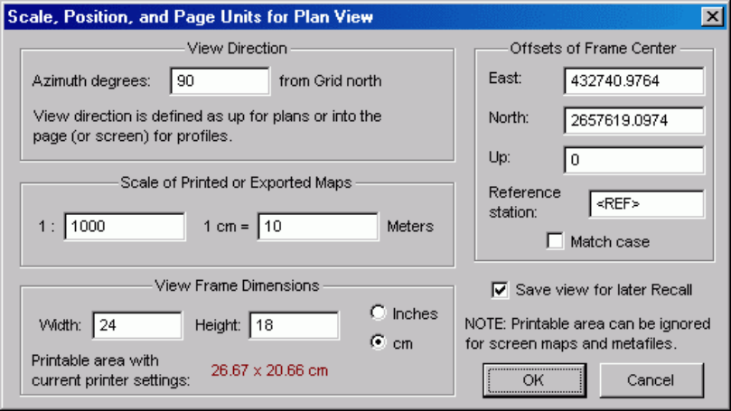
**Program Operation** **33**

Format Options. The dimensions you input here, along with the scale, will determine the map coverage -- that is,
the view width and height in survey units. Unlike versions of Walls prior to B5, the frame dimensions are a property of the compiled project branch and will be saved in the database. Furthermore, plans and profiles can have
different frame dimension settings. These settings will persist until changed in this dialog or until workfiles are
purged. Also, unlike prior versions of Walls, the frame dimensions specified in the Map Format Options dialog
determine only the initial frame size for new compilations.

**Note:** A drawn frame outline will surround the view but not cover any part of the view. Therefore, when taping together pages of multi-page maps, thick frame outlines can be trimmed off entirely to facilitate accurate matching
of plot segments.

Displayed in red, for your information, are the dimensions of the page's **printable area**, which are dependent on
the currently selected printer and page settings. The printable area will be smaller than the page itself depending on the specific printer model. An 8.5" x 11" sheet, for example, might provide a printable area of 8.27" x
10.23". If the specified frame dimensions (plus frame outline thicknesses) are larger than this, printed maps will
be truncated. You'll be warned of such truncation during subsequent print or print preview operations. You will
not be warned, however, if there is no room outside the frame to print the legend text (in case you've chosen
such a legend position). In the Page Layout dialog, where the view frame and printable area are shown graphically, you can experiment with different printer settings.

If your objective is to produce metafiles for import into drawing programs, the size of the printable area can be ignored. The frame dimensions alone will determine document size. Starting with Walls B5, metafiles and printed
maps don't have separately specified frame dimensions. Changing the frame size defaults in the Map Format
Options dialog, metafile or printer version, will change them for both output types. Currently, the maximum allowed width or height for a Walls plot is 72 inches. To go beyond that you will need to output separate plots (or
files).

The **Offsets of Frame Center** section allows you to position the center of the frame so that it corresponds to a
specific set of coordinates, or rather a set of coordinate offsets with respect to a specific named station. (To center on a named station, set the offsets to zero.) Each time the dialog is opened, the station is automatically set to
the reference station for the current network component. By changing either the reference station or the offsets
you can reposition the view without rescaling it. If you enter a station name and try exiting the dialog, an error
message is displayed if the name isn't found in the database. A checkbox option allows you to specify a casesensitive name search.

**Important:** To be safe, you should inspect this dialog immediately prior to printing. Operations on the preview
map (zooming and panning) can change these settings, if sometimes only slightly. For this reason, it's common
practice to leave the **Save view for later Recall** option turned on when you close the dialog. (See Save and
Recall.) This option is a user preference that's preserved between program sessions.

_Copyright © 2013 by David McKenzie_

**34** **Walls Project Editor**

**3.4.3.2** **Grid Intervals Dialog**

This dialog is accessible from two locations: A button on the Map page control panel labeled Grid, and a segment tree icon labeled Grid on the Segments page. (Double-clicking the icon opens the dialog.)

Here is where you to specify grid properties such as origin, spacing, and orientation. (As with most other map
features, the color and line style of the grid are settings on the Segments page.) By default, the grid origin is located at the component's reference station, but you can specify East and North offsets for plans and vertical and
horizontal offsets for profiles.

Grid intervals for plans are specified as an East interval in survey units and a North/East _ratio_ . For initial compilations, the default East interval is 100 survey units and the North/East ratio is 1.0, which produces a square grid.
In the above example, the "m" suffixes indicate that the current review units are meters (as specified on the General page of the Properties dialog). Similarly, profile grid intervals are specified as a vertical interval and a horizontal/vertical ratio. Here, the ratio 5 produces grid cells five times as wide as they are tall -- 50 meters wide in
this case. Thus the grid dimensions of profiles are independent of the view direction.

Plan grids can also be _rotated clockwise_ by an amount specified in degrees. Finally, the dialog features a
**Frame tick marks instead of grid** check box and an associated **Tick interval** field. This gives you the option of
_replacing_ the grid with tick marks along the frame's border. The length and thickness of those tick marks are setting is the Map Format Options dialog.

**3.4.3.3** **Passage Display Options**

This dialog controls how passage wall information is displayed on maps. It is accessed by clicking the Passage
button the Map Page's control panel, or by double-clicking the Passage Outlines tree node on the Segments
Page. All but one of these settings will be preserved in the workfiles for the compiled project tree item. The outline width, an SVG-specific setting, applies to all projects.

These options have no effect if passage drawing is not enabled on the Map Page ( **Passage** check box), or if the
compiled data set has neither processed SVG data or passage dimension data. The latter can be conventional
LRUDs, LRUDs with a specified facing direction (no associated vector), passage wall shots, or a mixture of all
kinds.

_Copyright © 2013 by David McKenzie_

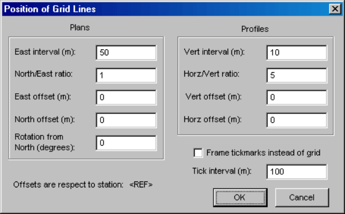
**Program Operation** **35**

It may help to know the order in which enabled map objects are drawn on the window or page. First, the window
is filled with the background color. Next, the passage representation is drawn. This consists of either filled SVG
passage outlines or the LRUD-wall shot representation. Finally, the LRUD dimension lines, grid, survey vectors,
station markers, station flag symbols, and station labels and notes are drawn in that order. The result is that passage drawing should never interfere with vectors and annotation assuming you assign non-conflicting colors via
the Segments Page.

There's also the option of omitting all annotation, including the survey vectors, to leave only cave passages. To
omit vectors, choose the " no lines" line style on the Segments page's control panel when the appropriate (usually main) branch of the segment tree is selected. You can also turn off vectors in a Display map window via the
right-click context menu.

**SVG Options for Plan Views**
The check box specifies whether or not SVG data are to be used for passage rendering when it's available -- that
is, when the most recent compilation produced a workfile with extension NTW. Two conditions are necessary for
this to happen when a project book item is compiled: 1) an SVG source file with a mask layer is attached to the
project tree as a child of the compiled item, and 2) the Compile Options property, **Process source SVG if one is**
**attached**, is enabled for that item. Note that the status of these two conditions is displayed in this dialog. The information you need to create an SVG file containing a mask layer (named w2d_Mask) is presented in SVG Layer
Definitions.

The other SVG-related setting in this dialog, **Outline width...**, determines the actual thickness of passage outlines when the "thick" line style is selected for the **Passage Outlines** node of the segment tree. Unlike the other
line styles, which produce a minimal-width line regardless of the map's scale, the thick style in this case produces lines that become thicker as the scale becomes larger. The default setting of 1.0 produces a 1-point (1/72
in.) thick line in page units when the scale is 1" = 15 ft. In world units, this is a 2.5-inch thick wall that appears to
maintain it's thickness as you zoom in to larger scales. A setting of 2.0 produces 5-inch thick walls, 4.0 produces
10-inch thick walls, and so forth. The outline width setting is not project specific but is preserved as part of the
program's profile.

**Passage Display Options**

_Copyright © 2013 by David McKenzie_

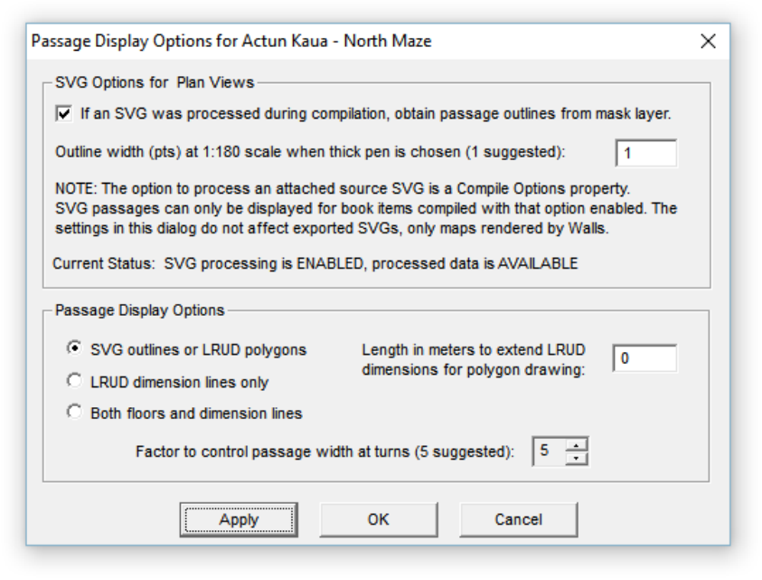
**36** **Walls Project Editor**

The three choices you have for displaying passage dimension data are as follows:

   - **SVG outlines or LRUD polygons**    - If the SVG mask layer is enabled and available, an outlined passage floor
region will be drawn. The outline will either be absent or solid (not dashed) and, if present, will have either a
scaled or non-scaled thickness. The line style setting for the **Passage Outlines** node of the segment tree will
determine these characteristics. Choosing the thick line style will cause outline thickness to be scaled as described above. Any other choice besides "no lines" will produce a thin solid outline. The node's setting also
determines outline color. If the SVG mask layer is _not_ enabled, passage will be drawn as non-outlined, filled
LRUD polygons. In either case, the fill color is that set for **Passage floors** . Note that while LRUD polygons can
be gradient filled, the SVG floor region will be filled with the last-selected solid color.

   - **LRUD dimension lines**    - Attributes assigned to the **Passage Outlines** node of the Segments tree will be
used to draw LRUD dimension lines and lines representing wall shots. The thick line style setting, however,
will cause thin solid lines to be drawn.

   - **Both floors and dimension lines**    - This selection causes both passage floor regions and LRUD dimension
lines to be drawn in the styles applicable to each feature when chosen individually.

**Length in meters to extend LRUD dimensions for polygon drawing**   - A decimal number between 0 and 50
can be entered here to make cave passages more prominent in small-scale area maps. It might also be used to
create a metafile map export that can be manipulated in a drawing program to produce gradient-colored passage
floors. This setting, which is not stored in the project's database, affects all maps generated during a program
session.

The **factor to control passage width at turns** is a number ranging from 0 to 10. Its purpose is to compensate
for the common practice of obtaining just one LRUD measurement set at each station along a cave passage. A
value of 0 would instruct the program to simply connect the endpoints of the LRUD cross section bars when constructing passage polygons. In many cases this would cause an undesirable narrowing of the polygon as it
either approaches or leaves a station where there is a change in passage direction. A value of 10 causes a
second LRUD bar to be generated in such circumstances, one that's rotated (no more than 90 degrees) so that
it's perpendicular to the passage that would otherwise be narrowed. This is an approach similar to the one adopted by Larry Fish's COMPASS program. The effect is an enlargement, or smoothing of the passage outline at
turns -- not much different from treating LRUDs as if they were the bisector type. The downside is that this can
create unrealistic effects when passages are irregular and large compared to shot length. The default value of 5
is a compromise. It rotates the second bar only half as much.

No such passage enlargement occurs when there are multiple LRUDs or wall shot rays obtained at a station.
Wall shot rays are defined by way of a recent extension of the SRV data format. For example, here is a sampling
of several kinds passage dimension data:

A1 A2 25 270 +3 <13,18,5,0>
A1    - 10 210

     - A1 12 300 +10
A1   - 2.5 -- +90
A10 <5,11,2,1,325>

The main distinction of a wall shot is that a minus sign (- or --) is used for one of the names. Like LRUDs, the
processed data will be used _only_ for the representation of walls. They don't contribute to survey statistics nor do
they appear on the preview map. Reasonably accurate outlines of large rooms and passage junctions can be
achieved this way when vector-associated LRUDs would be too limited by themselves.

Note that the last line in the above example illustrates another recent data format addition, an LRUD assigned to
an isolated station (A10 in this case). The fifth number is an azimuth, the LRUD's facing direction, which is now
optional in any LRUD specification. For more information, see the LRUD and Wall Shots sections under Vector
Data Lines.

**Ambiguity of Vertical Shot LRUDs**
Unfortunately, I've yet to see a set of guidelines that specify what _facing direction_ to assume for an LRUD associated with a vertical shot. That's apparently left up to the surveyors, who are free to pick between two reasonable
choices. For the time being, Walls takes the following approach: The direction of the previously established vec

_Copyright © 2013 by David McKenzie_

**Program Operation** **37**

tor takes priority if it is not vertical and the TO name matches the current FROM name. Otherwise, the direction is
obtained from the next established vector if it qualifies. If neither vector qualifies, the LRUD is ignored and a nonfatal error is written to the error log. Start-station and end-station LRUDs which are "orphaned" this way are similarly treated. The best solution, of course, is for surveyors to explicitly specify the facing direction, as for station
A10 in the above example.

Profiles present yet another ambiguity when shots are vertical. For example, should the station-to-floor distance
extend to the bottom of the drop or to the lip of the drop? For what it's worth, the current profile drawing algorithm makes assumptions that favor the lip-of-drop method.

**3.4.3.4** **Map Format Options**

Three dialogs are available for controlling the appearance of generated maps. These are general preferences
that are not specific to a compiled portion of a project. Their status is preserved between different invocations of
the program. All three dialogs, **Options | Printed maps...**, **Options | Displayed maps...,** and **Options | Expor-**
**ted maps...** are described here since they are very similar. You are encouraged to experiment with the settings
in these dialogs. The printer and display versions are both easily accessible via a button on the control panels of
both the Map page and Page Layout page. The export version is available via the **File | Export map as file....**
dialog as well as via the Options | Fonts.. menu selection.

You can toggle between the printer and screen versions of this dialog by clicking a button at the bottom left,
labeled **Printer** or **Screen.** Clicking **OK** (or **Cancel** ) will preserve (or discard) any changes you've made to either
set of parameters.

Selecting **Reset**, followed by OK, will restore everything but the settings in the **Fonts** section to the program's
default values.

Notice that certain parameters (e.g., symbol sizes and offsets) are given in "point" units. For printed output a
point is 1/72 inches -- approximately 4.17 dots on a page printed with a 300 dpi (dots/inch) laser printer. For

_Copyright © 2013 by David McKenzie_

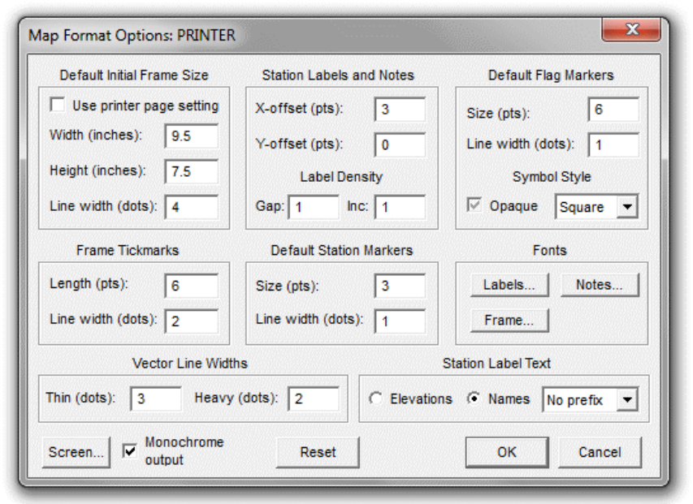
**38** **Walls Project Editor**

screen displays, where the resolution is assumed by Windows to be 96 dpi (actual resolution will depend on system settings and monitor size), a point corresponds to approximately 1.33 pixels. Point units are convenient because they are the same units we normally use when selecting character font sizes.

Line widths are specified in actual dots (pixels) since they allow us better control of the appearance of lines.
This means, however, that if we switch printer resolution from, say, 300 dpi to 600 dpi, we might also need to
double the line width values to insure that printed lines retain their original boldness.

**Default Initial Frame Size**
The frame dimensions determine document size and will contain the geographical region shown in the preview
map and specified in the Scale and Position Dialog. For printed and exported maps (not screen displays), the
width and height entered here will be relevant only when project items are compiled for the first time. Normally,
you'll want these settings to be compatible with (i.e., smaller than) the most commonly used printer page size.
After an item is compiled, frame dimensions for plans and profiles can be independently previewed and optionally changed via the Page Layout page of the Review dialog. Thereafter, the item-specific dimensions will be preserved in the workfiles. For a compiled project branch there are two active document sizes to work with and
change as necessary: one for plans and one for profiles.

For screen displays, only the frame width is relevant -- the width-height ratio will be the same as that of the preview map. Also, changing the Width setting at any time will determine the size of all subsequently generated
frames. (See below.)

Unlike earlier versions of Walls, printed maps and metafiles share the same frame dimension settings. For example, changing the initial frame size default in either the metafile or printer version of this dialog will change it
for both output types. With printed maps, if the frame size is too large for the output device's printable area, you
will be informed of this situation at the time a print job is started. For metafiles this situation doesn't arise since
printable area is meaningless for file output. (Instead you must consider the final destination.) Therefore, when
generating WMF and SVG files, you can ignore the white page image representing the printable area in the
Page Layout diagram.

Currently, the maximum allowed width or height for a Walls plot of any kind is 72 inches. To go beyond that you
will need to output separate plots (or metafiles).

   - **Use printer page settings**    - Instead of specifying a fixed default frame size, you can optionally let Walls select one automatically. The selection will be based on the Windows printer settings at the time of an item's
compilation. The selection that will result with the current printer setup is indicated by the grayed contents
of the Width and Height edit boxes.

   - **Width**    - The default frame width in inches. For displayed maps, the actual frame width will depend on the
monitor's screen resolution. The actual frame width will match the Width setting only if this resolution is 96
dpi. If the specified width is too large for the available screen area, you can use the scroll bars to pan to different portions of the frame.

   - **Height**    - The frame height in inches. This setting is enabled only for printed and exported maps. If the resulting aspect ratio is different from that of the Map page's preview map, the specified view's center will still
be at the center of the frame, resulting in a taller or shorter geographical region being printed or exported.
The region's width, however, will always reflect what's shown on the preview map. Displayed (screen) maps
will have the same height-to-width ratio as the preview map.

   - **Line width**    - The thickness in dots of the frame outline. For laser printers (300 dpi), a setting of 4 is usually
a good choice. To omit the frame outline, set this to zero. Displayed maps have no frame outline as such.
For metafiles, thicknesses greater than one dot will be interpreted as one dot.

**Important Note:** A plotted frame outline will surround the view but not cover any part of the view. Therefore, when taping together pages of multi-page maps, thick frame outlines can be trimmed off entirely to facilitate accurate matching of plot segments.

**Frame Tickmarks**

   - **Length**    - The tickmark length in points.

   - **Line width**    - The tickmark line width in dots.

**NOTE:** Tickmarks are drawn only if the "Use Tickmarks Instead of Grid" option is checked in the **Interval...**
dialog accessed via the Map page.

_Copyright © 2013 by David McKenzie_

**Program Operation** **39**

**Vector Line Widths**

      - **Thin** and **Heavy**      - In the Segment page, vectors belonging to a segment can be assigned one of several line
styles as shown in a list box on the control panel. The top two list box items are illustrations of a thin solid
line and a heavy solid line. The settings in this dialog determine the actual thickness of these lines (in dots)
when they are drawn on the map. Unfortunately, the widths of dashed and dotted line styles aren't currently adjustable; they're always one pixel wide. Also, the "thin" version of grid lines is always one pixel
wide.

**Station Labels and Notes**

      - **X-Offset**      - The top-left corner of the first character cell will be offset this many points to the _right_ of the station's actual location on the map. The initial default is 3.

      - **Y-Offset**      - The top-left corner of the first character cell will be offset this points dots _down_ from the station's
actual location on the map. The initial default is 0.

      - **Gap** (or Spacing) - The minimal distance (in units of character cell height) allowed between displayed station labels and notes. Labels and notes that would encroach upon previously-drawn text are simply not
drawn. (Labels are always drawn after the notes are drawn.) Gap=1, the default, provides the maximum label and note density without overlap. Gap=0 eliminates proximity testing, forcing all text to be drawn
provided Inc=1 (see below).

      - **Inc**      - A positive integer that determines station labeling frequency. (Notes are unaffected.) A value of 1, the
default, causes every station to be labeled provided it passes the proximity test (see Gap above). A value of
N insures that at least N-1 unlabeled stations separate labeled stations in the drawing sequence -- a sequence that tends to follow the network's traverses. For example, with Inc=10 and Gap=0, every 10th station
will be labeled. A possible use of this feature is to prevent storing too many objects in a metafile, something
that could crash the program it's intended for. The use of Gap>0 alone would scatter the labels uniformly
over the map, whereas Inc>1 allows clustering of labels where stations are densest.

**Station Markers**

      - **Size**      - The default marker size in points. This is the length of each of the horizontal and vertical components
of the "plus sign" that's drawn to mark a station's location when station marking is enabled. The marker
symbol's shape, color, and size can be overridden for compiled data in the Flag and Marker Symbols dialog.
NOTE: Regardless of the dialog version (screen, printer, or metafile) changing the marker size default
changes it for all output types.

      - **Line width**      - This is the thickness in dots of each of the marker's horizontal and vertical components. For
screen output you'll normally leave this set at one. (You can see the effect of this setting in the Flag and
Marker Symbols dialog). For high resolution printers, you'll probably want to increase line width to several
dots.

**Default Flag Symbol**
This section defines the map symbol that will be used, by default, for flagged stations. This symbol can be overridden for specific flags via the Flag and Marker Symbols dialog. NOTE: Only the line width is specific to output
type (screen, printer, or metafile). Changing any of the other settings changes them for all output types. For
more information see #Flag and Symbol Directives.

      - **Size**      - The default symbol width (and height) in points.

      - **Line width**      - The thickness in dots of a flag symbol's outline. This parameter is ignored when a solid symbol
is being drawn. Normally, you'll leave this set at one for screen output, since outline thickness currently
can't be assigned individually to different flag symbols. (You can see the effect of this setting in the Flag
and Marker Symbols dialog.) For high resolution printers, you'll probably want to increase line width to several dots.

      - **Clear/Solid/Opaque**      - This check box has three states. If unchecked ("Clear"), the flag symbol will be an
outlined figure with a transparent interior. If checked ("Solid"), a solid figure will be drawn using the current
marker pen color. If grayed ("Opaque"), the symbol will be an outlined figure filled with the current background color. The centers of solid and opaque symbols are indicated with a differently colored dot.

      - **Squares/Circles/Triangles**      - This drop-down list box allows you to select one of several shape options for
the default flag symbol.

**Fonts**
These buttons bring up dialogs that are also accessible via Options | Fonts |... menu selections:

_Copyright © 2013 by David McKenzie_

**40** **Walls Project Editor**

     - **Labels...**      - Invokes a dialog for selecting the station label font.

     - **Notes...**      - Invokes a dialog for selecting the font for annotation defined via the #Note directive in data files.

     - **Frame...**      - Invokes a dialog for selecting the font used for the legend, or frame annotation. (Title, scale, view,
etc.) It is relevant only for printed maps and metafiles. The frame-relative location of the legend is specific to
compiled items and is specified in the Page Offsets and Legend dialog.

**Station Label Text**

     - **Elevations**      - When selected, elevations above the survey's reference will take the place of station names
when labeling is enabled. Elevations will be shown to the nearest tenth of a unit (feet or meters).

     - **Names**      - When selected, station labels will consist of base names (8 characters maximum length), possibly
with a prefix prepended to it.

     - **Prefix levels**      - A drop-down box offers four options for constructing the prefix: **No prefix**, **Prefix 1**, **Prefix 2**,
and **Prefix 3** . For example, when Prefix 2 is selected, name prefixes of level 2 and below will be prepended
to a station's base name using colon separators. No more than eight characters of each prefix component
will appear. (See #Prefix Directives.)

**Color Translation**

     - **Monochrome**      - When checked, color assignments will be ignored and all map features will appear in black
on a white background. The background color will always be white for printed and exported maps, whether
or not this option is set. When not set, the colors of some enabled features (e.g., markers and labels) might
be forced to black or white if they would otherwise be invisible against the background.

**3.4.4** **Page Layout Page**

You should examine this page of the Review dialog before sending output to the printer. It shows a simplified image of the printed map in the context of a grid, each cell of which represents a view frame of the currently assigned dimensions. (See Scale and Position Dialog.) The selected cell is indicated by a blue rectangle representing the _printable area_ of the page as determined by your current printer settings. Since anything outside this
rectangle can't be printed, you must insure that the view frame lies entirely within it to avoid producing a truncated map. (Upon printing you'll be warned of this situation.)

Survey lines representing data in the selected component of the compiled item are shown in black. (Fixed stations appear as small squares.) Unlike the preview map, however, surveys that reside in detached branches of
the segment tree are _not_ shown since they will not appear on the printed map.

To obtain a multi-page plot, you can right-click with the mouse on the desired frames, turning them white instead
of gray -- or you can Select All non-empty frames automatically with one button click. The sheets of a multi-page
printout, when taped together, will perfectly cover a region as long as the paper _on and outside_ the frame outlines is first trimmed away. (Thick frame borders will not obscure plotted surveys.)

_Copyright © 2013 by David McKenzie_

**Program Operation** **41**

The above highlighted cell arrangement will produce a multi-page plot. The pages will be printed in row-column
order, and the selected (blue-outlined) cell establishes the zero reference for frame labeling. In this example, the
top-left, partially visible frame is labeled -3:-4 (row -3, col -4) and the bottom-right highlighted frame is labeled
1:2. To maintain consistent frame labeling for a large project area, you'll probably want to select (but not necessarily highlight for printing) the cell in the top-left corner of the entire project region. The region's frames,
whether printed or not, can then be designated 0:0, 0:1, 0:2, ..., 1:0, 1:1, 1:2, ..., etc.

How do you change the selected cell without highlighting it for printing? Double-click the cell you want to select.
(This also highlights and centers the cell in the grid display.) Then right-click the cell to toggle off the highlight
(color it gray). In order to accomplish this you may need to Zoom In/Out or pan the display by CTRL-dragging
with the mouse.

The selected, blue-outlined cell also indicates the view frame currently displayed in the Map page's preview map.
It's the frame from which screen maps are generated via the Map page's or Segments page's Display button. It's
also the frame used for metafile output. Therefore, double-clicking a cell in this dialog is an easy way to accurately reposition the preview map for single-frame output.

**Page Layout Controls**

      - **Zoom In/Out**      - Use these buttons to change the scale of the grid. Initially, the only selected cell will be that
of the preview map's view frame and it will occupy more than a third of the grid window's width. Another
method of navigating the grid is **CTRL-dragging** with the mouse, which pans the grid as it would the preview map. Also, **double-clicking** the grid will select, center, and highlight a specific cell, thereby repositioning the preview map.

      - **Default**      - This centers the selected cell at the original magnification while unhighlighting all other cells.

      - **Select All**      - Highlights (makes white) all cells and only those cells that cover any part of the current survey
component. For reasonable frame sizes, white cells will cover the entire component except for segments
hidden via segment attribute settings. One caveat: Walls will highlight no more than 500 cells and will notify
you if this coverage is incomplete.

      - **Clear All**      - Unhighlights all cells, including the selected (blue outlined) one. A subsequent attempt to print
or print preview will produce an error message.

      - **Scale & Position**      - Opens the Scale and Position dialog as does the like-labeled button on the Map page.
There you can adjust frame size (grid spacing), map scale, and specify the preferred page units: inches or
centimeters. When the dialog is dismissed, the Page Layout page is updated to reflect any changes. This
will remove highlighting for all but one recentered (and selected) frame.

_Copyright © 2013 by David McKenzie_

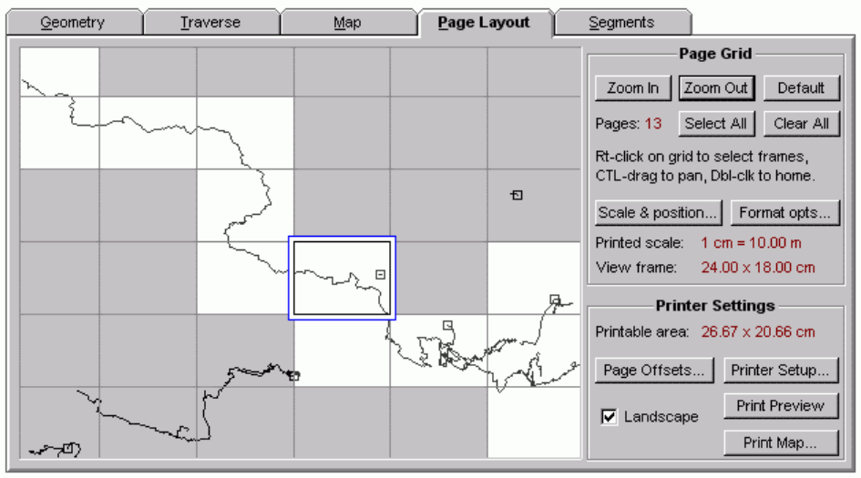
**42** **Walls Project Editor**

     - **Format** **opts**      - Opens the _printer_ version of the Map Format Options dialog. Like the "Format..." button on
the Map page, this lets you review and change global format settings which aren't project-dependent: Default marker and flag attributes, line thicknesses, text fonts, etc.

     - **Page Offsets**      - Opens the Page Offsets and Legend dialog, which lets you position the frame on the page,
set an out-of-frame plotting distance, and to position the legend text (or omit it).

     - **Landscape**      - Checking or unchecking this box will toggle page orientation between landscape and portrait
modes. It changes not only the display (outlined printable area) but also the setting for the currently assigned Windows printer. As a convenience, Walls automatically switches the printer to landscape mode
when it starts up.

     - **Printer Setup, Print Preview, and Print Map**      - These buttons invoke the same basic print operations as
those on the **File** menu. You'll normally want to use them in that order. Changes within the printer setup
dialog will be reflected in the page layout display as soon as the dialog is dismissed. Print Preview lets you
see an image of what will be printed given your particular format and segment settings. It's especially useful
when a multi-page plot is being generated. (Might save you a lot of paper.)

**3.4.4.1** **Page Offsets and Legend Dialog**

This dialog is accessible from the Page Layout dialog. Except for positioning the legend in metafiles, it applies
only to maps sent to the printer. Like frame sizes, these settings are stored in the workfiles and are maintained
separately for plans and profiles.

By default, the view frame will be exactly centered in the printable area, which is not necessarily the center of the
sheet depending on the printer model. Unchecking **Center frame in printable area** will let you reposition the
top-left corner of the map frame on the rectangle defining the page's printable area (visible on the Page Layout
grid). When this box is checked, as above, the grayed numbers show the offsets (or margins) required to center
the frame in the area defined by the current printer settings.

You can also specify an **Overlap**, a distance (in page units) that survey lines will be drawn outside the frame
border. This might facilitate taping together adjacent pages when frame outlines and/or grid lines are not sufficient for that purpose.

**Legend Position**
Finally, you can choose which corner of the frame to print the legend text and whether or not it should be inside
the frame, possibly obscuring plotted data. A "no legend" option is also available. The default setting is outside
the frame at the lower left corner. The font used for the text is a general preference in the Map Format Options
dialog (labeled "Frame..." in the Fonts section). It's likely that future releases of Walls will offer more legend-related options.

_Copyright © 2013 by David McKenzie_

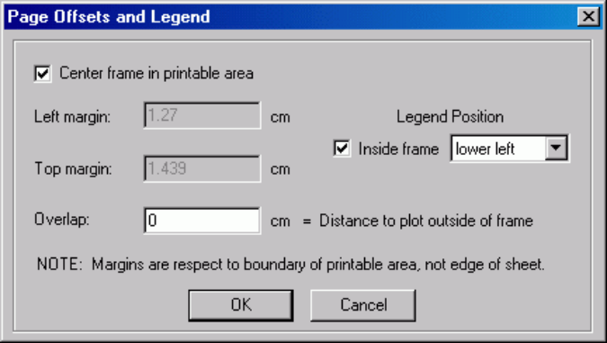
**Program Operation** **43**

With metafiles, the only relevant setting in this dialog is the quadrant selected for the legend (if you choose to
display one). If one is drawn, it will be inside the frame regardless of the "Inside frame" setting.

**3.4.5** **Segments Page**

The Segments page of the review dialog has several purposes: to assign colors to common map objects, to specify visual attributes for vectors assigned to specific segments, and to select those parts of the segment hierarchy to be excluded when generating the various kinds of output. For example, for a printed map you may want
to exclude the surface surveys even though they are part of the compiled data set. Also, it is on this page that
you can examine statistics for different portions of the data while possibly omitting, for example, "length-excluded" vectors. The page is divided into a labeled tree diagram showing the segments for the compiled project
branch and, on the right, a set of controls for operating on the tree. Below is a description of each item on the
page. For more information on what segments are and how they can be defined within data files, see #Segment
Directive.

**Segment Tree**
The segment hierarchy is represented by a tree diagram similar to the project tree, except that branches appear
not only for the book nodes and data files but also for the vectors that have been assigned segment names
(e.g., flags) within the data files themselves. Mouse operations also control how much of the tree is displayed.
Double-clicking the root (the small triangle at the top) will expand the entire tree. Double-clicking a branch will
expand it one level or collapse it completely. The presence of children is indicated by a small plus sign at it's
left.

A node is represented graphically in the diagram as either a plain junction of lines, in which case map attributes
will be inherited from those of a higher level node (see **Inherit/Use Own** below), or a capsule-shaped icon indicating that the node's own assigned attributes are active. The icon shows both the background color and vector
line style. Like the project tree, nodes can be visibly _detached_ from their parent, indicating that the correspond

_Copyright © 2013 by David McKenzie_

**44** **Walls Project Editor**

ing tree branch will be excluded from both maps and statistical summaries. In this case, however, no recompilation of data is required.

Except for the top-level tree nodes labeled **Grid Lines**, **Passage Outlines**, and **Selected Traverse** (see below),
each node represents zero or more vectors in the selected component of the compiled project branch you're reviewing. (Unless there are "hanging" survey fragments, there will be just one component.) For example, if a vector is defined in the data as having the segment name Upper Level/L, it will contribute to the count of vectors
with L as a component of its segment attribute, of which there could be many. The vector's complete tree address might be **KAUA/NMAZE/NM1994/ASURVEY/** Upper Level/L, where the beginning portion, **KAUA/NMAZE/**
**NM1994/ASURVEY**, is established not by the data but by the _project_ tree hierarchy. In this example, **KAUA**,
**NMAZE**, **NM1994**, and **ASURVEY** would be the base file names for the project tree branches having titles **Actun**
**Kaua**, **North Maze Surveys**, **1994 Additions**, and **A Survey**, respectively. (See **Define Segment** under Properties Dialog.) Non-bold underlined names, like L in this example, are the trailing components defined in data files.
All other nodes in this tree, except for the special nodes at the top, are representative of project tree branches.
The font for branch titles is the same as that selected via **Options | Fonts | Branch titles** in the Walls main
menu.

Selecting a node in the tree (e.g. by left-clicking on its corresponding line in the diagram) displays an abbreviated set of statistics in the upper right of the page under "Branch Totals": vector count and total length. If the
node is _expanded_, the statistics summarize the node itself -- that is, vectors having this particular segment pathname. If the node is _collapsed,_ the entire branch is summarized. In the example above, the selected node L has
no branches and contains 8 vectors totaling 47.3 meters in length. There may be other L nodes in the tree. How
to quickly **Detach** all of them to determine, say, a final surveyed cave length, is described near the end of this
topic -- see **Apply to All** .

Right-clicking on a node activates a popup menu with three selections: 1) **Segment totals** brings up an expanded statistics dialog -- see **Reports** below, 2) **Edit survey**, enabled only for a project file-titled node, will open an
edit window containing the corresponding survey file, and 3) **Project item properties**, when enabled, expands
the _project tree_ as necessary and opens the corresponding item's Properties dialog.

**Top-level Tree Nodes**

**Grid Lines** -- Select this node to specify the color and style of grid lines as described below. If it's attached to
the tree, the next generated screen map will show the lines. If a map showing grid lines is already displayed, any
changes you make are applied immediately..

**Passage Outlines** -- Similarly, select this node to specify the color and style of LRUD cross section bars. Also, if
display of an SVG mask layer has been enabled via the Passage Display Options dialog, this specifies the passage outline style and color as shown in the above map image.

**Selected Traverse** -- This node is relevant only if the survey has loop system traverses as shown on the Geometry page. When connected, screen maps will highlight the current _selected_ traverse with the line color and
style specified for this node. There is also a subnode of this one, named **Unadjusted Version**, which is relevant.when the selected traverse is floated. The map in the above screenshot shows a floated traverse that reveals
what is probably a mistake in station naming.

**Floated Traverses** -- You don't see this in the above image because it's actually a variation of the Selected Traverse node. When the node is labeled "Floated Traverses", and is attached, screen maps will instead highlight
_all floated traverses_ with another pair of style assignments. You can toggle between variations by clicking a button named **Change Type**, the latter a relabeling of the **Use Own / Inherit** button described below. More likely,
however, you'll be checking boxes on the Map page to switch between types of traverse highlighting.

**Control Panel**
Below is an item-by-item description (top to bottom) of the controls that operate on the segment tree. Note that
these settings are among the things preserved in the workfiles for a compiled project tree item. If you want to
preserve them in an archived project, be sure to include the NTA workfile -- see Creating Backup Archives.

**Reports**

_Copyright © 2013 by David McKenzie_

**Program Operation** **45**

This button activates The Adjusted Totals dialog showing various statistics for the selected item: vector count,
total length and component lengths, vertical range, etc. Options for creating ESRI shapefiles, 3D (VRML) files,
and vector/coordinate listings are also presented in this dialog.

Controls that affect the entire map, independent of selected tree item, appear beneath the Branch Totals section.
There are five colored buttons that bring up color selection dialogs (40-color palettes with options for more specialized selections) and a button for specifying marker and flag symbol attributes. **Please Note:** For displayed
and printed maps (not SVGs), these settings are applicable only when the respective graphics objects are enabled (boxes checked) on the Map page.

**Notes and Labels:** Selects the color for station name labels
or notes. The font sizes and styles, which are general preferences applicable to all projects, are determined by a menu
selection (Options | Fonts... ) or by selections in the Map
Format Options dialogs. There are separate font settings for
displayed maps, printed maps, and metafiles.

**Markers:** Selects the color for station markers without affecting the other attributes you may have assigned to markers.
Shapes, sizes, and colors are assigned in the Flag and
Marker Symbols dialog (see below), whereas outline pen
thicknesses are determined for both flag symbols and markers via the Map Format Options dialog.

**Bkgnd:** Selects the background color for displayed (not printed) maps and for SVG exports where the color is not inherited from the SVG. The chosen color is reflected both on the
control and in the tree diagram's icons. CAUTION: You
should take care that the background color differs from those
of the other features you want to be visible. (Note that for
printed maps the background is always white and the frame
outline and annotation is always black.) Since failure to do
this is such a common problem, the program will override the
assigned colors for labels, notes, flags, and markers when
appropriate, changing them to black or white. This is not
done, however, for the vector lines and passage representation.

**Passage Floors:** Selects the color inside SVG passage outlines or LRUD polygons. For the LRUD polygons you can
choose either a solid color or one of three types of color
ranges: color by depth, color by date, or color by component
F-ratio. (See Color Dialogs.) When floors derived from a
source SVG are being displayed within either Walls or Walls2D only the last selected solid color is relevant.

**Flag Symbols...** Opens the Flag and Marker Symbols dialog, which lets you chose shapes, sizes, and colors
separately for all categories of stations in the compiled data set. The marker symbol style and color can be
chosen there as well. The names of assigned flags (e.g., entrances, GPS positions, etc.) define the named categories.

**Segment Attributes**
These controls make assignments to the selected node in the tree diagram. In most cases, the appearance of
the node icon will immediately reflect any changes you make. The nodes corresponding to segments and also
the special nodes, **Grid Lines**, **Passage Outlines**, and **Selected Traverse**, can be given assignments. Also,
one level beneath Selected Traverse is a child node labeled **Unadjusted.** You can use it to specify separate attributes for the unadjusted version of a selected traverse that happens to be floated.

      - The **Detach / Attach** button removes/restores the node's connecting line to its parent. Only when there is an
unbroken path to the tree's root are the node's vectors displayed on the map. The attached state of a node
also determines whether or not vectors in the branch are included in statistical summaries for a parent node.

_Copyright © 2013 by David McKenzie_

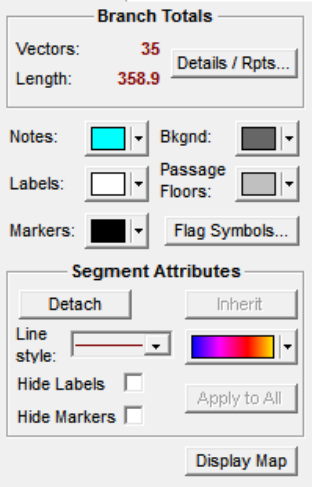
**46** **Walls Project Editor**

The attached state of the special nodes, Grid Lines and Selected Traverse, reflect the status of their corresponding check boxes on the Map page. The Selected Traverse node, if attached, causes any segment-based
assignments to the traverse's vectors to be overridden, a feature normally used only while data screening.

     - The **Use Own / Inherit** button activates/deactivates the style attributes assigned to the selected node, such as
line style and color. When a node is in the _inherit_ state, the corresponding vectors will take on the map attributes assigned to the nearest higher-level node that happens to be in the _Use own_ state. On the tree diagram
inheritance is indicated by a missing capsule-shaped icon. Also, the following style controls are disabled, although they continue to reflect the node's current assignments. (This button is relabeled **Change Type** and
has a different function when the third top-level node is selected.)

     - A list box containing seven **line styles** appears just beneath the Detach / Attach button. The first entry is the
thinnest possible (1-pixel) solid line. The second entry is a "thick" solid line whose thickness when applied to
survey vectors is determined by a setting in the **Options | Displayed maps...** or **Options | Printed maps...**
dialogs. When applied to the Passage Outlines tree item, the actual thickness of the "thick" line style is determined by a setting in the Passage Display Options dialog. The third through sixth entry are the various
dashed line styles.

     - IMPORTANT: The last line style entry, which you can select by highlighting its background, corresponds to
"no lines". This is the only way turn off just the vector lines in a generated map. (In a Display map frame you
can toggle their visibility via the right-click context menu.) Unlike a detachment, selecting no lines hides the
node's vectors without affecting other vectors in the branch. Note that line style settings currently have no effect on exported SVGs, which always feature thin solid lines.

     - The **line color** button next to the line style box lets you to select a color or color range for the selected node's
vectors. Like other controls in this section, it is disabled (grayed) when the node is in the _inherit_ state (see
above). Note that this is the only vector style attribute applicable to exported SVGs. Even when the option
"Preserve styles and colors" is enabled during an SVG export, new vectors not already represented in the
merged file will be given this color. When the **Passage Outlines** tree item is highlighted, you use this to button specify the line style and color for SVG outlines and LRUD cross section lines. (Double-clicking that tree
item opens the Passage Display Options dialog, which lets you specify how passage data is to be displayed.)
For _exported_ SVG maps, however, only the _passage floor_ color is relevant, and then only when the SVG Export dialog setting, "Preserve styles and colors", is disabled. In a merged SVG export, the passage outline colors and thicknesses are always established by the source SVG.

     - The **Hide Labels** and **Hide Markers** check boxes allow you to selectively turn off station name labels and station markers, respectively, for vectors in the selected segment. For a station to be marked or labeled, it's necessary for at least one adjacent vector to have the respective attribute unhidden. NOTE: These segment
settings are ignored when the corresponding features on the Map page are turned off -- that is, check boxes
**Label** or **Mark** unchecked. In that case, no stations anywhere are labeled or marked.

     - The **Apply to All** button is available to easily assign the same set of map attributes to all nodes in the segment tree with the same name. For example, there may be many tree branches having nodes with the same
name, such as L in the above example. Such nodes generally correspond to flag-type attributes assigned to
vectors in data files. After confirmation, all settings in the Segment Attributes control panel, including the
Detach/Attach and Inherit/Use Own states, are transferred to identically named nodes. (Case is significant.)

**Display Map Button**
This button has the same effect here as it does on the Map page: It generates a new screen map frame, initially
covering the region shown on the preview map. The "Apply to Map" button of earlier Walls no longer exists because changes made on the Segments page are immediately applied to all map frames showing the network
component being reviewed. Note that the menu options **File | Print...** and **File | Print Preview** are also available
when this page is active. For more information on generating maps, see Map Page.

**3.4.5.1** **Color Selection Palettes**

On the Segment page of the review dialog there are six colored buttons for assigning colors to map features.
Clicking any one of these buttons displays a drop-down window containing a palette of 40 solid colors along with

_Copyright © 2013 by David McKenzie_

**Program Operation** **47**

some feature-specific coloring options. For example, the drop-down window for assigning vector colors might
appear as follows:

All three of the "Color by" options beneath the 40-color palette behave similarly. Clicking the right side chooses
the gradient currently defined for that type of coloring. Clicking the left side opens the Color Gradient Dialog
which allows you to edit the gradient prior to selecting it. The "More colors" button also behaves this way, but instead of opening the gradient dialog, it opens the standard color picking dialog that's common to many Windows
applications. You can use it to select a solid color that may not be present in the palette. The rectangle to the
right of "More colors" displays the solid color last chosen for this map feature -- pale green in this example. This
is the color used for some types of program output where gradient coloring isn't applicable. Note that within the
standard color dialog you can add your favorite solid colors to a "Custom colors" palette that will be preserved
across separate invocations of the program.

**Notes on Gradient Coloring**
Currently, gradient coloring can be selected only for vector lines (in the main portion of the segment tree) and for
LRUD-based passage floors. All other color dialogs contain just the palette and "More colors" options. Furthermore, the following should be noted regarding the assignment of gradients:

      - Gradient coloring is applicable only to printed and internally displayed maps and also to exported metafiles.
The last chosen solid color, not the selected gradient, will be used for shapefile, VRML, and SVG exports.
Also, the last solid color chosen for **Passage floors** will be used for floor coloring when the passage outlines
are based on a source SVG instead of LRUD measurements.

      - When the map is drawn, each survey vector or LRUD polygon is rendered with a single solid color, not a range
of colors. For example, when vectors are colored by depth, the elevation of the vector's midpoint is used to select a color from the color-by-depth gradient.

      - Like any vector line style assignment, a gradient assigned to the main branch of the segment tree will be overridden by colors (solid or not) assigned to child branches. It may be necessary to temporarily set child
branches to inherit coloring from their parents when examining the effects of gradient coloring.

      - The database for a compiled project tree item stores just one gradient for each of the three different types -one for color-by-depth, one for color-by-date, and one for color-by-stats (component F-ratio). For example, if
you redefine the color-by-date gradient, it affects all parts of the map where date coloring is assigned.

      - The gradient definitions are stored in workfiles with extension .NTAC, three gradients per file, which are preserved across compilations (but not purges). The NTAC files are considered part of the NTA file set that's optionally stored in a backup archive.

An advantage of using one of the gradient types for coloring LRUD passage floors (backgrounds) is that differently colored passages will properly appear above or behind one another. Upper levels will overlap lower levels
on plans and foreground passages will overlap background passages on profiles. Vector lines are normally
drawn _after_ all the passage floors are drawn. This means that unless a vector overlaps a floor polygon drawn
earlier with the same color it will ordinarily _not_ be obscured by the passage representation. When your main goal
is to show passage, there are several ways you can prevent the display of unwanted vector lines. In approximate
order of usefulness they are:

      - Use the Segment page's control panel to give selected segments the thin solid line style and the same color
gradient as the passage floors. Such vectors will be sorted "back-to-front" along with the floor polygons and

_Copyright © 2013 by David McKenzie_

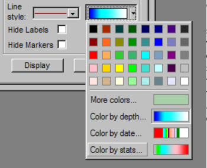
**48** **Walls Project Editor**

rendered at the same time. Only if vectors have no corresponding LRUD measurements will they appear as
lines instead of polygons. In either case they will be obscured by higher-level (or foreground) passages.

     - Give vectors the same gradient as the floors but instead of the thin solid line choose either a dashed line or
the thick line style. (If the latter, set the thick line width to one pixel in Map Format Options.) In a plan view this
causes vectors with floor polygons to be visible as lines only when they pass beneath an upper-level passage
that's colored differently. Selecting such vectors with the mouse is easier when they can be seen -- perhaps
the only advantage of this approach.

     - Give vectors the "No line" style but again set their gradient to be the same as the floor gradient. This will produce the same effect as the first method. The difference is that when passage display is turned off the vectors
won't be represented at all.

     - A quicker but less selective way to accomplish this for screen maps is to toggle off "Show Vectors" on the
map window's context menu. With "Show Passage" enabled, this turns off any vectors with a different color
assignment. With "Show Passage" disabled, this turns off all vectors.

Whether drawn as lines or represented only by floor polygons, vectors can still be highlighted as described under Vector Properties Window.

See Color Gradient Dialog for more information on gradients and how they are defined.

**3.4.5.2** **Color Gradient Dialog**

This dialog is accessed from the Color Selection Palettes that allow picking of color ranges, or gradients, in addition to solid colors. It comes in three variations, one for each kind of _vector property_ the colors can be made to
represent. When a map is drawn, the line and/or polygon representing a survey vector can be given a color corresponding to the vector's **elevation**, assigned **date**, or a **consistency rating** (F-ratio). For example, here is
what the dialog looks like when the gradient representing elevations is being edited:

The large colored bar in this example represents a color range, which is calculated from the colors you assign to
specific _positions_ along the bar. The bar's left edge is at position 0.0 and the right edge is at position 1.0. You
can assign colors to intermediate positions by creating one or more color _pegs_ at appropriate points along the
bar. The program will then calculate the colors for other positions using one of the _interpolation methods_ described below. The _cosine_ method illustrated here produces smooth color transitions between adjacent pegs.
(The default method for depth coloring is _HSL long_, which can produce a good color range without intermediate

_Copyright © 2013 by David McKenzie_

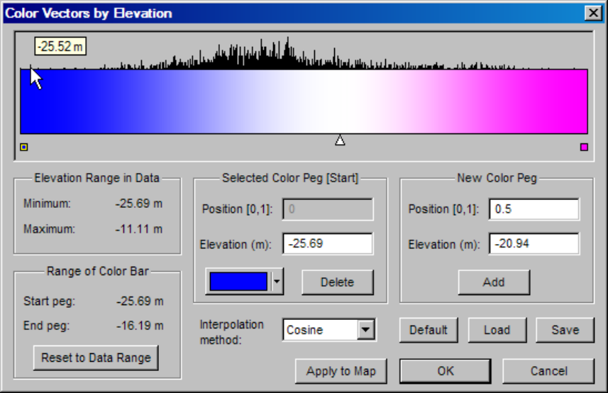
**Program Operation** **49**

pegs.) There is just one intermediate peg in this example, as indicated by the white triangular pointer -- white because that was the color assigned to it. You can create additional pegs in either of three ways:

      - By **double-clicking** the bar, in which case the new peg's color and position depends on where you click. Although the peg's color is taken from the bar's original color at that position, which doesn't change, the colors
on either side of the peg might change depending on the interpolation method.

      - By using controls in the **New Color Peg** section of the dialog, in which case you specify either the position or
corresponding vector property (e.g., elevation). Again, the new peg's color is the original (unchanged) bar
color at that position.

      - By dragging either of the two endpoint pegs (small squares) inward, toward the middle of the bar. When you
start dragging a new triangular peg is created with the same color as the endpoint peg. You continue dragging to establish its position. As described below, this method is useful for reducing the range of data values
that a color range represents.

Whichever way a peg is created, it becomes the _selected_ peg and the controls in the middle section of the dialog
allow you to edit its properties. Normally you'll use the color selection button to change the color that was automatically assigned to a newly-created peg. Creating a peg, therefore, is usually a two-step process: fixing its position and editing its color.

You can select an existing peg via the keyboard (tab and arrow keys) or by **left-clicking** it with the mouse. The
peg's properties can then be edited via the controls for the selected peg. Also, by **left-dragging** an intermediate
peg, you can change its position without changing its color. In the above example, the left endpoint peg has
been selected. This is indicated by the middle section's title, "Selected Color Peg [Start]", and by the fact that
the leftmost small square is outlined.

**Mapping Colors to Survey Vector Properties**
When you use this dialog to define a color gradient, your goal will be to set it up so that the colors used to display survey vectors (or passage polygons) will reflect some vector property. The particular property is determined
by the button you use to invoke the dialog and can be one of three types: elevation, date, or F-ratio. (Each of
these types will be described in more detail below). In the dialog shown above, labels indicate that the property
is _elevation._ Above the color bar is a **histogram** that shows the _frequency_ of elevation values for vectors actually
present in the data set. Here, the histogram covers elevations in the range -25.65 meters to -16.19 meters which
have been linearly mapped to the gradient's position range (0.0 to 1.0). The yellow box with "-25.52 m" is what
you see when you move the mouse cursor over a spike in the histogram representing an elevation of -25.52
meters. Every vector whose elevation falls within the color bar's range will correspond to a spike at least one
pixel tall. Except for that condition, taller spikes correspond to larger proportions of vectors.

The mapping of gradient (color bar) range to elevation range is shown in the dialog section labeled **Range of**
**Color Bar** . Displayed above this section, under **Elevation Range in Data**, is the range of elevations actually
present in the survey database. These two ranges are automatically initialized to be the same when you _first_
open this dialog to define a gradient for a compiled data set. Thereafter, the ranges might differ for two reasons.
First, recompilations can cause the minimum and maximum values to no longer match the color bar range that's
saved as part of the gradient's definition. Second, you can use this dialog to change the range of values represented by the color bar. The direct way of accomplishing this is to _select_ one of the small squares representing an
endpoint peg and edit its property value (elevation). In this example, the color bar's extent is smaller than the
data extent.

Another way of _reducing_ the bar's range that's easier than a direct edit, is to 1) _add_ a new peg by left-clicking an
endpoint box and _dragging inward_ with the left button held down, 2) _reselect_ the corresponding endpoint box
and _delete_ it. The peg you added by dragging disappears, but its property value and color are passed on to the
"deleted" endpoint peg. The endpoint color doesn't change but the value it represents does. The bar's range is
thereby reduced and the resolution of the histogram improves. When the map is drawn, vectors that have values
_outside_ the gradient's range will be given the color assigned to the appropriate endpoint peg. A variation on this
method is to omit the deletion step (2) that improves the histogram' resolution. More likely, though, you'll be
wanting to "zoom in" on the histogram. When choosing colors for a color-by-date gradient, for example, you
might need to see separate spikes for two nearby dates.

The **Reset to Data Range** button will make the color bar limits correspond to the current minimum and maximum
property values in the compiled item being reviewed. For all but the statistics gradient, all network components in
the item, not just the selected one, will determine those limits. Besides applying to just the selected component,

_Copyright © 2013 by David McKenzie_

**50** **Walls Project Editor**

the statistics gradient is different in that this button also restores the default peg configuration, which is illustrated below.

The **Apply to Map** button updates any screen maps with the gradient you currently have defined -- but without
exiting the dialog. This allows you to preview the gradient's effect as you make changes to it. Without this button
you would need to commit to your changes by clicking **OK**, possibly replacing what may have been a more-acceptable gradient definition. If you **Cancel** the dialog, any changes you may have made to screen maps using
this button are retained while the original gradient definition (and whether or not it is assigned to features) is unchanged. If necessary, you can use the Apply to Map button on the Segment page to refresh a map with the visibility attributes assigned to segment branches.

**Saving and Restoring Gradients**
When you assign any customized color gradient to a map feature, the current definitions for all three gradient
types are saved in workfile <name>.NTAC, where <name> is the base name of the compiled project branch.
Apart from this automatic feature, you can manually save and restore "snapshots" of the dialog's displayed
gradient using the **Save** and **Load** buttons. That allows you to experiment with different color patterns while being able to quickly restore the gradient you normally use. A snapshot file, which stores both a gradient and the
value range it represents, can have any name, but the extension is forced to be NTAE, NTAD, or NTAS, depending on the gradient type. As long as such files are kept in the project's work directory, they are considered part of
the NTA file set that's optionally included in a backup archive.

The **Default** button replaces the displayed gradient and value range with what the program uses by default for a
newly compiled data set (or one in which workfiles have been purged). If you never assign a customized gradient, no NTAC workfile is created.

**Gradient Types**
Here are some specifics regarding the three types of gradient coloring supported by this version of Walls:

   - **Color by Depth (Elevation)**    - The elevation of the vector's midpoint as determined from the compiled data.
A units qualifier (ft or m) will indicate which distance unit is in effect during this review session. (See Review
Units under Properties: General Page.) Note that the elevation range shown for the data set will not match
exactly what you'll see in an Adjusted Totals report. Only the elevations of vector midpoints are relevant
here. Also, _all_ components of the reviewed data set, including all segment tree branches, "detached" or not,
are considered when computing the data range and histogram. The default depth gradient for newly compiled project items is a blue-purple-red-yellow color range produced with the HSL long interpolation method
(no intermediate pegs required).

   - **Color by Date**    - The date assigned to a survey vector via the #Date directive. Vectors without assigned dates
are lumped together and given the date 1000-01-01. Unless _all_ vectors have unassigned dates, such vectors
will not be used in the calculation of either the histogram or the minimum and maximum values. (When
drawn they will be given the color assigned to the gradient's left endpoint.) You might want to use either the
_flat start_ or _flat end_ interpolation method when coloring vectors by date. (The default for new compilations is
a blue-to-red color range produced with the HSL long method.) Here is an example using the flat start
method, the goal being simply to cover the relatively few different dates with a unique color:

   - **Color by Stats (F-Ratio, or Consistency)**    - On the Geometry page of the review dialog, all traverses in loop
systems are rated by their horizontal and vertical component F-ratios. The F-ratio is a positive number that's
larger than one (and possibly quite large) when the traverse's presence in the data set is hurting overall
consistency. When the F-ratio is less than one, consistency is being helped. The F-ratio used here to define
a color gradient differs from those on the Geometry page in two respects. First, the one used here is a
weighted average of the traverse's horizontal and vertical component F-ratios when those F-ratios are well

_Copyright © 2013 by David McKenzie_

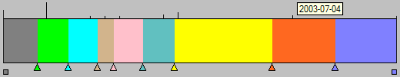
**Program Operation** **51**

defined -- that is, when both component types haven't been completely constrained or floated. (The F-ratio
of a vector in this context is the F-ratio of the traverse that contains it.)

Second, we're using a _global_ F-ratio, not one specific to the independent loop system containing the traverse. Whereas the system-specific F-ratios shown on the Geometry Page can be misleadingly large when a
system has few loops, the global F-ratio measures a vector's consistency with respect to all systems in the
connected component. The component possibly contains many loop systems. The histograms of the other
gradient types are even more inclusive since they represent all vectors in the compiled data set, not just the
selected component.

In statistics gradients, three special values are reserved to represent vectors that don't have F-ratios. Vectors
for which both component types (horizontal and vertical) are constrained are assigned value -1.0. Vectors for
which both component types are floated are assigned value -2.0. Vectors not contained in any loop are assigned value -3.0. The statistics gradient assigned by default (and which is restored by the **Reset to Data**
**Range** button) looks like this:

With this gradient selected, non-loop vectors will be colored light blue, floated vectors will be colored green,
and constrained vectors will be colored yellow. Normal loop vectors, with F-ratios 0.0 or greater, will have
colors ranging from white to red. Here we're using linear, not cosine, interpolation to produce a faster transition to red (see below). Note that the leftmost spike in the histogram, which represents non-loop vectors, is
no taller than the tallest of the remaining spikes. The program enforces this to ensure that a large proportion
of non-loop vectors doesn't flatten too severely the remaining part of the histogram.

**Interpolation Method**
The program uses one of several **interpolation methods** to calculate color as a function of position along the
bar. To change the appearance of the bar without affecting the current peg colors, you can specify one of the following algorithms:

      - **Linear**      - Each of the three RGB (Red, Green, Blue) color components is obtained as a weighted average of
the corresponding color components of the two adjacent pegs.

      - **Cosine**      - Similar to linear, except that the weighting is based on the cosine function, causing somewhat
smoother transitions across pegs.

      - **Flat start**      - Moving left to right, the color abruptly changes from that of the previous peg to that of an encountered peg. The bar has N+1 distinct colors, where N is the number of intermediate pegs. This method is
useful for date coloring when there are only a few dates, or date ranges, to distinguish between.

      - **Flat end**      - Similar to flat start. In the above description change "left to right" to "right to left."

      - **Flat Middle**      - The color at a position is the unweighted average of the two adjacent peg colors.

      - **Reverse**      - Linear interpolation calculated in reverse. Moving left to right, instead of starting with the current
peg's color and transitioning smoothly to the next, it starts at the next color and transitions to the current
peg's color.

      - **HSL CW, HSL CCW,** **HSL Short,** and **HSL Long**      - These four methods interpolate between adjacent pegs
by treating their colors as points on the HSL (Hue, Saturation, and Luminance) color wheel.

Since the wheel is circular, there are two possible routes to take when transitioning from
one peg's color to that of an adjacent peg. The HSL CW and HSL CCW methods take the
clockwise and counterclockwise routes respectively. HSL short and HSL long take the
shortest and longest routes respectively. With the HSL methods you don't need intermediate pegs to produce rainbow-like effects. The default depth and date gradients are produced this way using HSL long with suitable colors chosen for the endpoint pegs.

In designing the gradient dialog, I borrowed from the work of programmer Joel Holdsworth. (See Acknowledgements.)

_Copyright © 2013 by David McKenzie_

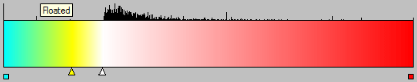

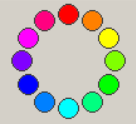
**52** **Walls Project Editor**

For more information on selecting gradient coloring for map features, see Color selection Palettes.

**3.4.5.3** **Adjusted Totals Dialog**

This dialog is a statistical summary of compiled data and is accessible via a toolbar button (shown above)
whenever a page of the Review dialogs is active. It also can be invoked from the Segments Page, either by rightclicking an item in the segment tree diagram or by clicking the **Details / Rpts...** button when the item is highlighted.

When the segment tree item is a _collapsed_ branch (plus sign on the left), then the information and controls in
the dialog will pertain to the entire branch. (This the default tree state after a compilation.) Otherwise, just the
vectors assigned to the selected node will be summarized. Unfortunately, it's a common mistake to forget to collapse a node and to bring up a summary of fewer vectors than was intended. It's also easy to forget that _de-_
_tached_ branches and unselected network components aren't included either.

The numbers displayed are _adjusted_ results. The flag and note totals are also shown; those totals can be nonzero even when there are no vectors to summarize. The statistics for vectors should be self-explanatory. There
is a percentage shown beside the total vertical component length, which is simply this value times 100 divided by
the total length. (You can consider this percentage a measure of the "verticalness" of a cave.)

**Excluding Vectors from the Totals**
Detached branches of the segment tree are not included in the statistical summary of collapsed higher-level
nodes. For example, in the Segments page, if you wanted to exclude from length calculations all vectors with
the "Side shot" segment attribute, you would first detach any tree branch named "Side shot". Next, you would
click the **Apply to All** button, which detaches _all_ "Side shot" branches. Finally, you would collapse the entire
tree and click **Reports...** (or right-click the branch) to view the resulting statistics.

**Shapefiles...**
This button opens the GIS Export dialog, allowing you to create ESRI shapefiles, a native format for ArcView®
GIS. For more information, see the topic Exporting ESRI Shapefiles under Import/Export of Other Data Formats.

**Coordinates** ...
This button opens the Vector and Coordinate Reports dialog (also accessible via a tool bar icon). From there you
can generate several types of coordinate listings.

_Copyright © 2013 by David McKenzie_

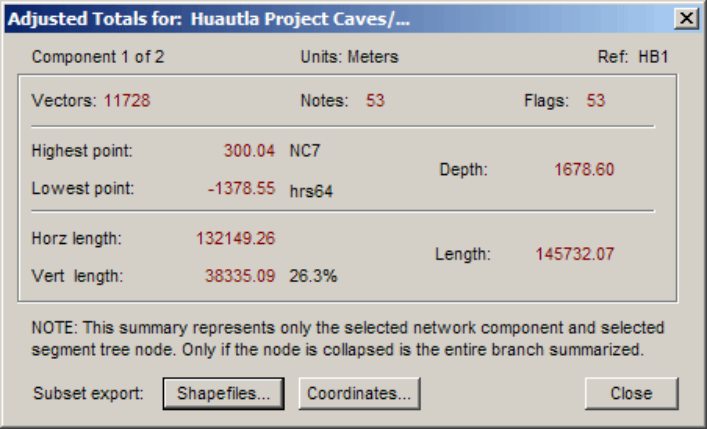
**Program Operation** **53**

**3.4.5.4** **Flag and Marker Symbols**

This dialog is accessible via a tool bar button (shown above) whenever a page of the Review dialog is active. It's
also reachable by clicking the **Symbols...** button on the Segments Page control panel.

**Flag Names and Station Counts**
The left side of the dialog is a list of all flag names that were encountered during processing of the reviewed project tree branch. The right side of the dialog displays the symbol attributes for the flag name that currently has
focus (the last one selected if multiple names are highlighted), allowing them to be changed. In the above example, the flag named "WAYPT-0" has a green hollow square assigned. The names could have appeared on
#Flag directives, which assign named flags to lists of stations, or on #Symbol directives, which assign default
symbols to named flags. In parentheses to the right of each flag name is a count of the number of stations having that flag, whether or not the locations of those stations were actually established. The count could be zero;
it's not necessary that a flag name on a #Symbol definition be assigned to any stations.

The last item in the list is "{Station Markers}", which represent all stations that don't have any assigned flags or
whose flags are all "hidden" (see below). Also, if flags are disabled while station marks are enabled (via check
boxes on the Map Page and/or Segment Page), then all stations will be marked with the symbol defined for
"{Station Markers}". Using this dialog it's possible to change the size, shape, and color of both flag symbols and
marker symbols and have those attributes preserved in the workfiles.

Another automatically assigned list item is "{Unnamed Flag}", which is present only if stations appear on a #Flag
directive without a name parameter -- for example, "#FLAG A1 A2 A3". There's really no reason to have any of
those, although Walls has always allowed them.

**Priority -** Since a given station can be assigned many different flags, it's useful to be able to control which flag
symbols, if any, get drawn at that station's position. The order in which flag names are listed in this dialog determines the _reverse order_ their corresponding symbols are drawn on the map. The symbols for the highest priority flag will be drawn _after_ all symbols for the lower priority flags are drawn. Nowhere on the map will a lowerpriority flag symbol obscure one of higher priority. (Instances of the same flag symbol can overlap each other.)

**Higher** and **Lower**     - These buttons move the selected list item up and down, respectively, in the list sequence,
thereby changing it's priority. The bottommost priority of {Station Markers}, however, cannot be changed. Like
other flag attributes, the priorities you assign here are preserved across data compilations. In fact, changing the
order of appearance of flag names in your data files (which could be difficult to control) will not affect the relative
priority of preexisting flags. Of course, flags can be removed or added. If new flags are encountered during a

_Copyright © 2013 by David McKenzie_

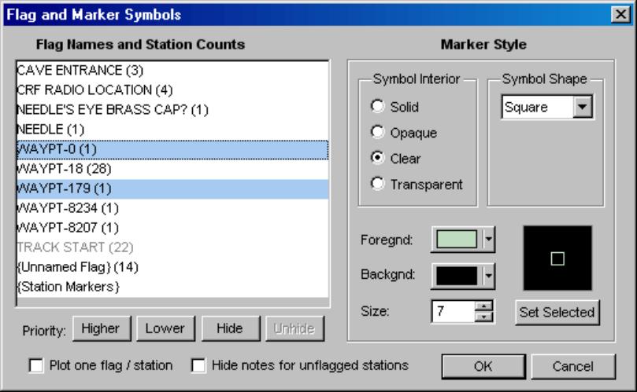
**54** **Walls Project Editor**

compilation, they are placed _above_ the preexisting flags at a higher range of priorities. You can then easily
change them. Tip: Use the **Up/Down** arrow keys with the **CTRL** key to change priorities via the keyboard.

**Hide / Unhide**    - These buttons will disable or enable the highlighted flags. (Multiple flags can be selected by using the **CTRL** and **SHIFT** keys along with the left mouse button.) If a flag is disabled, its symbol won't be drawn
on the map, even though you can edit and save its attributes in the database. Stations with no flags or with only
hidden flags can be excluded from coordinate listings and shapefile exports. If all flags assigned to a station
have been disabled, then the station will be treated as an ordinary station and will be marked instead of flagged
(assuming marking is turned on). Station markers cannot be disabled this way. The names of hidden flags are
indicated by grayed text, such as "TRACK START" in the above example. Tip: Use the **space bar** to toggle the
Hide/Unhide state while changing the selection with the **Up/Down** arrow keys.

**Plot one flag / station**    - When a station is assigned multiple flags, it's likely that the highest priority flag symbol
won't completely obscure the symbols for the lower priority flags underneath it. This could very well be the effect
you desire, depending on how you design your symbols. If not, check this box to insure that only the highest priority, non-hidden flag assigned to a station is actually drawn. For metafile and SVG output, you may want to
leave this box unchecked. Most drawing programs will let you "ungroup" the symbol objects at a station, perhaps
separating them so they are all visible.

**Hide Notes for Unflagged Stations**    - Check this box to hide the notes for stations that are either unflagged or
have only hidden flags. This is useful in GIS applications, for example, where the notes are names of karst features belonging to specific categories. In the example illustrated above, only the names and flag symbols for bat
caves will be shown in a displayed or exported map.

**Marker Style**
The right half if this dialog presents the current symbol attributes assigned to the flag name that has focus in the
left half. (This is the last flag selected if you've highlighted more than one.) The controls for selecting attributes
should be self-explanatory. (For a description, see #Symbol Directive.) In any case, a dynamically updated preview of the symbol is displayed at the lower right, making it easy to experiment.

**Set Selected**    - This button is enabled only when multiple flag names are selected. (Use the CTRL and SHIFT
keys with the left mouse button to select more than one flag.) Its function is to assign the style attributes of the
current flag to all selected flags. In the example illustrated above, clicking "Set Selected" would copy the attributes assigned to WAYPT-0 (green square) to WAYPT-179.

An attribute requiring special mention is **Transparent** . Only in exported SVG maps is this different from **Clear** . In
an SVG map the flag will have a black border and a 50% opaque interior (allowing a marker, for example, to
show through).

While the **Symbol Interior**, **Symbol Shape**, **Foreground**, and **Size** controls all pertain to the selected flag
name, the **Background** control determines the background color for maps displayed on the screen. It's actually
the same as the "Bkgnd" color control on the Segment Page's control panel. (For the time being, Walls supports
just one color attribute per symbol as opposed separate outline and interior colors.) Similarly, if you change the
attributes for "{Station Markers}", the Segment Page's "Mark" color control will be automatically updated.

You'll observe that when you change a symbol's size by direct numeric entry instead of scrolling, the preview image will be updated only after you move the focus off the size control -- for example, by pressing the tab key or
by clicking anywhere outside the control. Also, a special value of 255 placed in this control indicates you want
the symbol to have the default size as specified in the Map Format Options dialog.

The preview image shows exactly what will appear on a generated screen map. Printed versions of these symbols will no doubt look different -- probably better, in fact. The metafile versions will be handled in ways dependent on the importing program. Also, the Map Format Options dialog allows you to assign symbol outline **line**
**widths** to each type of output separately. (The default line width is one pixel.) This alone can dramatically alter
the appearance of all flag symbols drawn. Likewise, station _markers_ have different line width settings.

This dialog is likely to evolve, depending on user feedback. A planned upgrade is to include another Symbol
Shape selection, "TrueType", and to provide a button labeled "TT Symbol..." for opening a symbol selection dialog. Although the code is partly set up for this, there are currently other unfinished features of higher priority.

_Copyright © 2013 by David McKenzie_

**Program Operation** **55**

For more information, please review the #Flag and #Symbol Directives topic.

##### **3.5 Displayed Maps**

While either the Map page or Segments page is active, a screen map window can be opened via the **Display**
**Map** button. The window remains a component of the Walls desktop until it is specifically closed, or until the project window is closed. This means there can be multiple map windows showing different views. The region initially shown is what's currently visible in the Map page's preview map (or tracker rectangle if one is present).
Thereafter you can use the mouse for **scroll-wheel zooming** and **right-drag panning** . You can also resize the
frame by **left-dragging its borders** .

The initial visibility of station markers, names, flags, and notes are controlled by check boxes on the Map page.
Style attributes such as background color, station marker and label color, line styles and colors for vectors and
grid, etc., are determined by settings in the Segments page. The visibility and appearance of individual survey
segments are also controlled via the Segments page.

Displayed maps can be zoomed, panned, and manipulated as long as the corresponding project item is being
reviewed (as indicated by a crosshair cursor). For example, you can left-drag to open a zoom rectangle, or
double-click to pan to a specific location. Also, the distance measuring tool works the same way it does on the
preview map. Operations such as returning to preview map view and resetting the default _initial_ frame width are
available from a right-click context menu. Other menu selections allow you to toggle the display of labels, prefixed labels, markers, flags, notes, and passages.

As illustrated below, a different context menu can appear when you click near a displayed vector or flagged station. The menu's choices allow you to jump to the object's definition in an editor window, to highlight the object's
statistics on the Traverse page, or to display a Vector Properties window.

If highlighting is enabled and there are features to highlight, the mouse pointer will appear as a cross with an "i"
subscript. Otherwise it will be a plain cross, the measure-distance icon, or the default mouse pointer (typically an
arrowhead). The default pointer is present when the data currently displayed in the map window is no longer being reviewed.

Flagged stations are also highlighted as you move the pointer over their symbols. There is no scale requirement
for highlighting such stations, except that flag display must be turned on.

**New!** The above menu now has option named View segment which jumps to the corresponding Segments page
tree node. There you can quickly change color and style.

**Setting the Initial Width of Displayed Map Frames**

The default initial size is a setting on the Map Format Options dialog. During data screening, for example, you
might prefer that a small 6-inch wide window pops up. At other times you might want a full-screen or _even larger_
(scrollable) image where more detail is visible at once for a wider region of the project. Note that these so-called
"inches" are not physical screen inches, but are based on what was once considered a standard monitor resolution: 96 pixels per inch.

This initial width setting can also be quickly changed by selecting **Set Initial Frame Size** from a screen map's
context menu.

_Copyright © 2013 by David McKenzie_

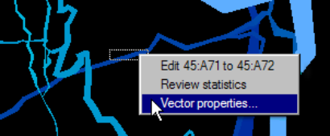
**56** **Walls Project Editor**

The **Options | Printed maps...** dialog has the corresponding frame size setting for printed maps. Note that for
printed output both the default initial frame _height_ as well as the frame width can be specified. (See the Page
Layout dialog.)

##### **3.6 Search Operations**

**Finding Text In Data Files**

Several text search and replace functions are available to you when an editor window or a project tree window is
active. In either case click the binoculars icon on the toolbar or select Find (or Replace) on the Search menu to
bring up a dialog with search options.

**Finding Text in an Editor Window**
If you invoke the dialog when text is selected (highlighted) then the **Find what** box is initialized with this text.
When you click the dialog's **Find next** button, the editor scrolls to and highlights the first occurrence of the target text following your current position in the file. Thereafter, you can simply click the arrow icons on either side
of the binocular icon to move to additional occurrences in the text. The **Regular Expression** option should be
left unchecked if you're not familiar with the term (see below). The **Ignore case** and **Match whole words** options
behave as you would expect, with or without the regular expression option enabled.

**Replacing Occurrences of Matched Text in an Editor Window**
There is also a text replace function accessible by selecting Replace in the Search menu. (There is no toolbar
icon for this.) The dialog is similar except that both **Find what** and **Replace with** fields are present. The dialog
also stays open as matches are found and highlighted. Along with the **Find Next** and **Replace** buttons there is
a **Replace All** button that replaces, without prompting, all remaining matches in the file starting with the current
highlighted match. If during this operation the file's end is reached while at least one match exists at a position
earlier in the file, you are prompted to either highlight the first match or leave your position in the file unchanged.
If you want to confirm each replacement, be sure to click the **Replace** button successively instead of **Replace**
**All** .

**Finding All Occurrences of Text in a Project Branch**
When a project tree window is active, you can search across all files in a selected tree branch, whether or not
the files are open for editing. The **Search Branch Files for Text** dialog, like the Find dialog, is invoked by clicking the binoculars icon, or by selecting **Find** on the Search menu. An option in this dialog specifies whether or
not detached branches should be searched. When you click the **Search** button, all files that have at least one
occurrence of the specified text will be flagged with a red check mark on the project window's tree diagram. Subsequent opening of a checked file will automatically position the cursor at the first highlighted match. You can
then move to additional matches in the file by clicking the **Find Next** toolbar icon (the right-pointing arrow). Alternatively, while the file is open, you can invoke **Replace** on the Search menu to perform a search and replace
operation using the same target string. The check marks remain on the tree diagram until you perform another
search, or until you select **Clear Chks** in the dialog.

If your project contains a large number of data files, you might want the ability to review in one window the detailed results of a project-wide search operation. You could then open files by clicking links in this window (highlighted matches), or perhaps execute a global search and replace operation. Accessing Walls from Other Applications describes how another program can be integrated with Walls to provide this capability.

**Using Regular Expressions**
If you know the rules for forming character strings known as _regular expressions_, you can use them to perform
searches and replacements involving wildcards and/or special conditions. If you don't know the rules then leave
the **Regular expression** box in its default non-checked state. Unless you're a programmer at heart, the benefit
of this option may not be large enough to justify learning the rather arcane syntax. If you're still interested, see
Regular Expression Searches for some examples and references.

_Copyright © 2013 by David McKenzie_

**Program Operation** **57**

**Finding Vectors in Compiled Data**

If either the Geometry page or Traverse page is active, a search operation can locate the component, loop system, and traverse (if any) containing a specified vector. Upon clicking the binocular icon you are prompted to
enter a pair of station names in any order. When a search is successful the appropriate component (traverse or
vector) is highlighted on the page. If one or both of the names you enter is missing a prefix, say A1 instead
SURFACE:A1, multiple matches are possible, in which case the **Find Next** and **Find Previous** functions (right
and left arrow icons) allow you to traverse the sequence of matches with progress shown on the status bar. Note
that a vector in the compiled database doesn't necessarily belong to a loop system traverse. For such vectors the
search fails and you are given the option to locate it on the preview map instead. (Also see Locating a Vector in
the Geometry.)

When the Map page is active a similar search capability is available. The difference is that you are prompted for
one station name instead of two. If the station is found on the preview map, the map is scrolled as necessary and
the station is enclosed in a small tracker rectangle. At this point you can zoom the view and click the Find Next
button to reposition the tracker, and so forth, to obtain a more detailed view of the region of interest. As with vector searches, multiple matches are possible here as well.

**Other Ways to Find a Vector or Station**
When you are editing a data file, a much simpler way to find a vector in the statistics (Traverse page) or on the
preview map is to right-click a line where a vector is defined. If the vector is represented in the compiled project
item under review (Review dialog open), two selections, **Locate vector on map** and **Review Statistics**, will be
enabled on the right-click context menu. Those selections will bypass the search dialogs completely while avoiding any ambiguity that could result in multiple matches.

Finally you'll notice that as you move the mouse cursor over a displayed screen map vector lines and station flag
symbols are automatically highlighted. (Vector highlighting is enabled when a screen pixel represents two
meters or less.) Right-clicking in a surrounding rectangle pops up a context menu from which you can jump to
either the traverse page (if applicable) or the data file where the vector or #FIX station is defined. For more information see Vector Properties Window.

##### **3.7 Vector Properties Window**

_Copyright © 2013 by David McKenzie_

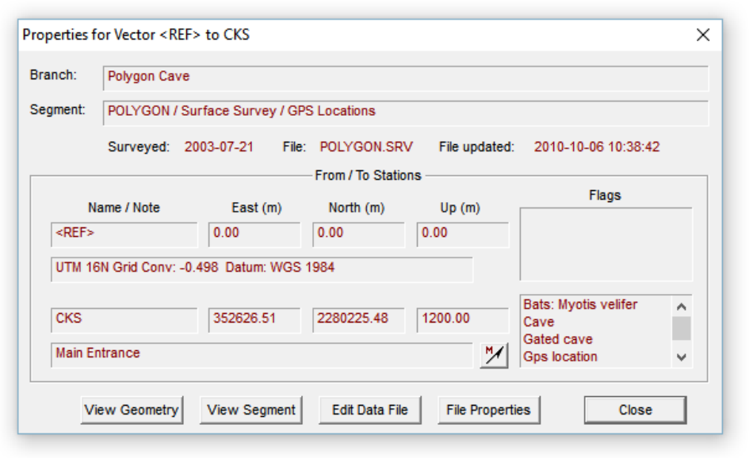
**58** **Walls Project Editor**

The Vector Properties window shows non-editable information for a compiled survey vector or #FIXed station.
When editing a data file you can open it by selecting "Vector properties..." from the editor's right-click context
menu while the cursor is positioned on the vector's definition. This assumes the data has already been compiled
and is currently under review (Review dialog open). You can also open this window via the Traverse page's context menu while the vector's statistics line is highlighted. Finally, you can open it via the context menu of a displayed screen map as described under Displayed Maps.

The window displays data retrieved from the compiled database. The red-colored text in the sunken rectangles
can be scrolled horizontally, if necessary, and copied to the clipboard via a right-click context menu. The **Branch**
field contains the location of the vector in the project tree. This location is expressed as a path-like name ending
in the data file's title. (In this example, the data file for Polygon Cave is attached immediately beneath the tree's
root so there are no higher-level name components.) The **Attributes** field contains the segment names assigned
to the vector. Beneath the listed coordinates of each endpoint station is a long text field containing any note you
may have assigned. In this example, since the from station is the UTM coordinate system's reference, datum and
zone information is displayed instead of a note.

A station's **Flags** list box contains an alphabetical listing of all of its assigned flags, whether or not they appear
as symbols on the map. (At least one flag symbol must be present for a station to be highlighted.) A flag's priority and hidden/non-hidden status is not indicated in this list box. (See Flag and Marker Symbols.) The Vector
Properties window shown above has information for a flagged station that also happens to be a #FIXed station.

To the right of a station's note field is a **toolbar-like button** for launching the geographical calculator. The calculator's edit boxes will be initialized to contain the station's coordinates and the geodetic datum will be set appropriately. The button will be disabled (grayed) if UTM-relative coordinates weren't generated by the compilation.
(See Properties: Geographical Reference Page.) If the current review units are feet rather than meters, the UTM
coordinates you see in the calculator will be the Vector Properties window's coordinates converted to meters.

Opening the geographical calculator will not close the Vector Properties window. Pressing any of the following
buttons, however, will close it and make a different window active:

**View Geometry**     - The vector, if it's part of a loop, is highlighted on the Traverse page of the review dialog. Certain statistics are shown on this page, such as suggested measurement corrections that would make the vector
(and containing traverse) consistent with the containing loop system. This button is disabled if the vector is not
contained in a loop.

**View Segment**     - Jumps to the Segments page with the corresponding node in the tree highlighted.

**Edit Data File**      - The file containing the vector's definition will be opened in the Walls editor, with the appropriate
line highlighted.

**File Properties**      - The project tree is expanded and the leaf corresponding to the vector's file is highlighted. Also,
the file's Properties Dialog is invoked, the particular page opened being the last one that was active.

##### **3.8 Vector and Coordinate Reports**

This dialog is accessed from the File menu, the Adjusted Totals dialog, or more simply via the tool bar icon
that resembles a printed page (shown here). The reporting feature is enabled whenever a compiled project
branch is being reviewed. Only data that are summarized in the Adjusted Totals dialog will be included in the report -- and that's controlled by settings on the Segments page. Portions of the survey component being reviewed
can be excluded by expanding or detaching branches of the segment tree.

_Copyright © 2013 by David McKenzie_

**Program Operation** **59**

There are currently two basic report formats: 1) an alphabetical listing of stations with their coordinates and assigned notes and 2) a list of stations and their coordinates organized as vector sequences (a possibly useful export format). Two additional format options are available with the alphabetical station listings. First, you can
choose to have only noted stations included. This should shorten the list considerably. Second, by selecting **In-**
**clude only flagged stations**, you can group the listed stations by the names of assigned flags (e.g., entrances,
leads, etc.). If a station has several flag assignments, it will appear in the report several times. The flag sections
will be ordered alphabetically by flag name. If you select this option, unflagged stations will not be listed at all.

For both station listings and vector listings you can choose to **Include only vectors or stations in current view**
**frame** . That's the view frame specified in the Scale and Position dialog that defines a printed page. (Its height
can be different than what's shown on the Map page's preview map.) In the case of the vector list, a vector's
FROM and TO stations will both appear as adjacent lines of the report if at least one of the two stations is inside
the frame. When a station is out of the frame, its corresponding line in the report will have an appended ">" character.

Use the **Decimal places** edit box to specify the number of digits after the decimal to show for UTM coordinates.
If **Lat/Long degrees** is the requested coordinate type, 4 will be added to this number.

At the bottom of either type of frame restricted report, the minimum and maximum coordinate values of _stations_
actually located inside the frame are listed. In vector reports, the number of vectors crossing the frame boundary
(i.e., the number of appended ">" characters) is also listed.

When the dialog is opened, the **Output** edit box will be initialized with a name (extension LST) constructed from
the reviewed item's base name, the path being the project's work folder. Of course you can change this, but
you'll need to remember the file's name and location if you want to easily access the file during a future session.
A soon as a report is generated it's automatically opened in a Walls edit window. The file is an ordinary tab-delimited text file.

**Jumping from Listing to Data File**
In vector listings the rightmost column is a colon-separated filename and line number (e.g., SURVEY02:1023)
that locates the vector in the original data. An easily overlooked feature is the ability, when editing the report file
in Walls, to double-click this location field to open an edit window into the survey data file with the line highlighted. (For example, you may want to use this feature to find vectors that have been assigned an obscure, possibly mistyped, segment name.) This feature, however, is enabled only when the file extension is **LST** .

_Copyright © 2013 by David McKenzie_

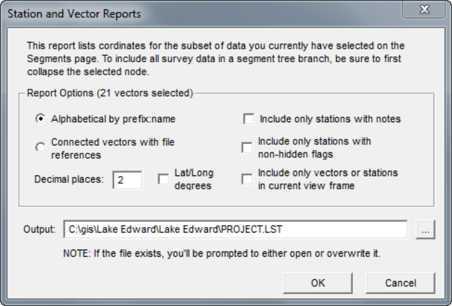
**60** **Walls Project Editor**

Apart from the location field, the vector and station lists have similar formats. The location field in a vector list has
an appended minus sign to mark a TO station for which the immediately preceding station is the FROM station.
Lack of a minus sign indicates the start of a traverse. As noted above, the character ">" might follow the location
field and possible minus sign to mark an endpoint station that's outside the view frame.

**Requirements for Generating UTM or Lat/Long Coordinates**
The coordinates displayed in reports, and stored in exported data will be georeferenced if these two conditions
are met:

     - On the Geographical Reference page, the checkbox option **Coordinates: UTM/UPS grid-relative** must have
been enabled at the time of compilation. You can't enable this option without also specifying a _geographical_
_reference_ . This reference, which can be inherited from a higher-level project tree item, determines the geodetic
datum and coordinate system of displayed and exported data.

     - The #FIXed points in your SRV data files, of which there must be at least one, are entered as UTM eastings
and northings (or Lat/Long). Also, each SRV file with fixed points must have in its property settings a geographical reference with the appropriate zone and geodetic datum specified..

##### **3.9 Creating Backup Archives**

Use the menu option **File | Create/Send Project ZIP file...** to generate a ZIP archive containing all files associated with the active project. These will include the project script (WPJ file), the SRV data files, and all other files
represented in the project tree, whether or not they are attached to the root by way of connecting lines. This simplifies both backing up the project and transferring it to other locations.

**Output**     - The path and file name of the ZIP archive to be created. This is initialized to the WPJ file's pathname,
but with the .WPJ extension replaced with .ZIP. You can edit this directly or use the browse button ("...") to navigate to an existing file or location. If the file you specify already exists, you will be asked to confirm replacement
of the existing file.

**Include NTA files**      - Check this box to also include in the archive any NTA files generated by compilations. These
are the workfile components that store various graphics display assignments, including gradient definition files
with extensions NTAC, NTAE, NTAD, and NTAS. See the second paragraph under Workfiles Created by Walls
for another description of NTA files.

Select **OK** to proceed with archive creation. If successful, the function displays a summary of the contents and
provides you with three alternatives:

_Copyright © 2013 by David McKenzie_

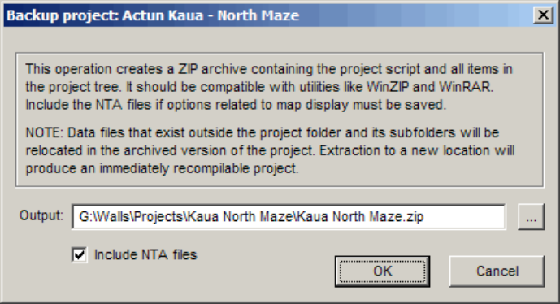
**Program Operation** **61**

1) Open the archive using WinZIP, WinRAR, or whatever utility you currently have associated with the .ZIP extension.
2) Launch your mail program with a message initialized to contain the archive as an attachment.
3) Simply exit.

**Important Note:** The generated archive contains the original directories (folders) of included files provided they
are descendants of the project directory that contains the WPJ file. Associated files located elsewhere will have
ZIP file paths constructed as <drive letter>$ \<path name>, where <drive letter>:\<path name> is the item's full
path prior to being archived. In the archive, all files are stored within or beneath the archive's root (which contains the WPJ file) and if necessary the WPJ file is modified to reflect this. Therefore, when you extract the
archive to a new location, the project should successfully compile.

The read-only attributes of all files in the project are preserved in the archive. When the ZIP is extracted, files
that were originally protected from editing will continue to be protected (unless your ZIP utility discards the attributes). For details on write protection, see the **Read-only** section in the Properties: General Page topic.

Walls provides no backup restore function since it's very likely your system's ZIP utility can do a good job of this
while offering many options. You may find it convenient to attach the archive to the project tree as an item of
type Other. If you do this and also set the launch option to Open, double-clicking the item's tree icon should
open the archive inside your ZIP utility. Attaching the archive won't present a problem when you again generate
a backup. That is, the new archive won't contain an old copy of itself unless you change its name.

Note that this function offers no way to exclude specific portions of the project; all files represented in the tree
are stored in the archive (with the exception mentioned above). The easiest way to exclude certain files -- perhaps an image file too big for an email attachment -- is to have the function launch your ZIP utility. Then simply
delete the unwanted files.

The Walls backup function doesn't require that a separate ZIP utility be installed on your system. The compression code is contained entirely in a module (wallzip.dll) that's loaded whenever the function is invoked.

##### **3.10 Geographical Calculator**

Integrated into Walls is a calculator that can be used as both a coordinate conversion tool and a predictor of
[magnetic declination. The latter capability is based on a mathematical model known as the International Geo-](http://www.ngdc.noaa.gov/IAGA/vmod/igrf.html)
[magnetic Reference Field](http://www.ngdc.noaa.gov/IAGA/vmod/igrf.html) (IGRF), which currently supports dates in the range Jan 1, 1900 to Dec 31, 2019. For
years 2020 and beyond, it will be necessary to download and install a new program release.

The calculator is invoked in two different ways. When you specify a geographical reference for a survey or
branch of your project via the Geographical Reference property page, the calculator serves as a window for data
entry. When used this way, the window must be closed (by your selecting **Accept** or **Cancel** ) before any other
program activity takes place. The other way it is invoked is as an independent calculator, where the window,
which is not confined to the Walls desktop, can stay open as you edit surveys and compile or review data. The
calculator can be accessed via a toolbar icon (an M-labeled north arrow) or by selecting _File_ | _Geographical cal-_
_culator_ . In calculator mode, the Accept and Cancel buttons are replaced with a single **Close** button. Since all
fields of the dialog are updated as you enter data, the calculator serves as a coordinate conversion tool. Any
one of about 28 geodetic datums can be selected, allowing you to also convert between datums without changing the actual location.

_Copyright © 2013 by David McKenzie_

**62** **Walls Project Editor**

You can enter a latitude and longitude using any of three popular degree formats. Alternatively, you can enter
_Universal Polar Stereographic_ (UPS) or _Universal Transverse Mercator_ (UTM) coordinates and UTM zone number. The UPS coordinate system is officially defined for latitudes equal to or above 84° N, or strictly below 80°.
When the latitude is no more than 0.5° outside these polar regions, a button appears at the dialog's lower-right,
allowing you to toggle between UTM and UPS. In the example below we've forced a location below 84° N to display as a set of UPS coordinates:

For locations within a half degree of the equator we can, in a similar fashion, toggle between northzone and south-zone UTM representations.

**Calculating Out-of-Zone Coordinates for a Location**

Editing the degree fields will cause the UTM coordinates and zone number to change accordingly. Likewise, editing the UTM easting, northing, and zone will change the degree fields. It's possible, however, to enter UTM coordinate values that map to a geographic location that's not strictly within the zone displayed in the edit box. (A
zone's central meridian is at easting 500,000 while a zone's total width at the equator is 666,000 meters.) In this
case, if the magnitude if the zone discrepancy is no more than one, the zone number will be displayed in red as
shown below. Note that the true zone corresponding to the location's longitude (14N in this example) is always
displayed upper-left of the degree settings.

_Copyright © 2013 by David McKenzie_

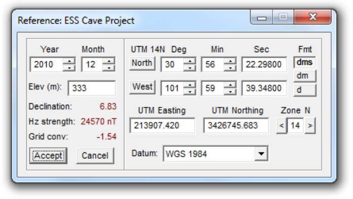

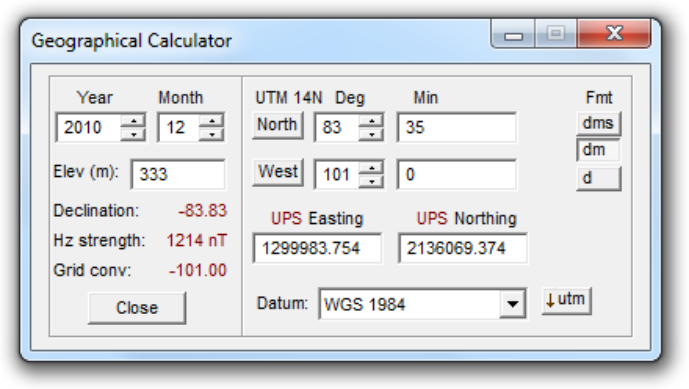
**Program Operation** **63**

If the zone discrepancy is greater than two, or if either UTM coordinate is too far out of range, the message "Invalid !" will appear in the dialog's lower right corner.

Since a Walls compilation can include surveys that cross a UTM zone boundary, it's sometimes useful to calculate, for a specified Lat/Long location, the equivalent "out-of-zone" coordinates corresponding to an adjacent
zone. You can accomplish this by first entering the location either as degrees or as UTM coordinates with the
correct zone specified. Next, _hold down the CTRL key_ while clicking one of the buttons adjacent to the zone's
edit box. Incrementing or decrementing the zone in this manner will only affect the displayed UTM coordinates
and grid convergence, which will now specify the same location in reference to the new zone. This zone number
will be colored red and will remain red while out-of-zone values are present. With the calculator in this state you
cannot change the geographical reference of a Walls project branch. (The Accept button is disabled.) In a data
file you can, however, define a UTM fixed point with these out-of-zone coordinates as long as the zone displayed
in the edit box is the same as that of the data file's geographical reference. (Also see #FIX Directive.)

**Transferring Coordinate Pairs via the Clipboard**

Right-clicking the edit box for a UTM coordinate or either of the two rightmost (least significant) degree fields will
open a pop-up menu with two special options: _Copy coordinates_ and _Paste coordinates_ . Selecting _Copy coordin-_
_ates_ will transfer a text string to the clipboard, the exact form depending on field type (UTM or degrees) and
format setting (dms, dm, or d). The four possibilities for the location displayed in the above example are listed
below, the last being the out-of-zone UTM:

**30 56 22.29800 N    101 59 39.34800 W**
**30 56.371633 N     101 59.6558 W**
**30.9395272         -101.9942633**
**787189.298         3426775.234**

The coordinates in each pair are separated by a tab character, which simplifies pasting the data into adjacent
cells of an Microsoft Excel or Access table. The degree formats are also suitable for pasting directly into the
search boxes of mapping programs, such as Google Earth and Google Maps. (For those programs you'll need to
set the calculator's datum to either NAD83 or WGS84 before the copy operation.) These and similar formats, say
with space or comma separators, can also be transferred to the calculator by selecting _Paste coordinates._ If the
paste succeeds, the calculator's degree format automatically changes to reflect the input. Since UTM zone and
datum are not part of a clipboard transfer, it's important that these be set beforehand in the calculator.

**Declination Calculator**

On the calculator windows's left side is a magnetic declination calculator. With it you can see what declination
Walls will use during a data compilation when automatic computation of declinations is enabled. (See the Geographical Reference property page.) The computed declination, which is based on both survey date (as specified
by #date directives) and the _geographical reference position,_ will be added to all compass readings in the af

_Copyright © 2013 by David McKenzie_

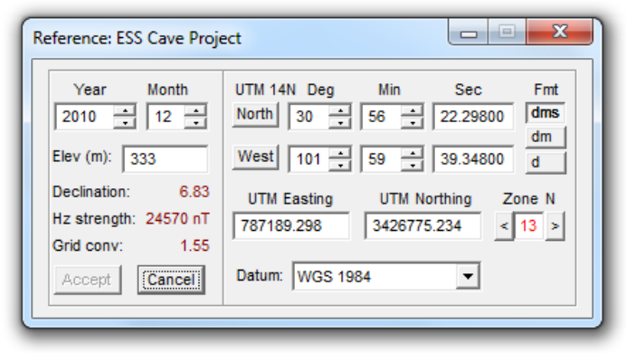
**64** **Walls Project Editor**

fected data files. In addition to date and horizontal position, the predictive model used by the calculator also accepts an elevation as input. Although an elevation field is provided for completeness sake, the computed declination will be practically the same for all reasonable land elevations. You can leave the elevation set to zero -- or
simply use it as a descriptive field for your project's geographical reference.

Along with the declination angle, the calculator displays the estimated intensity, in nanoTesslas (nT), of the magnetic field's horizontal component. Compass readings can be especially unreliable when this intensity is less
than about 5000 nT, which is often the case for locations above 70° N latitude. The National Geophysical Data
[Center's Geomagnetism FAQ](http://www.ngdc.noaa.gov/geomag/faqgeom.shtml) states the following regarding compass behavior near the poles:

_There are established zones around the north and south magnetic poles where compass behavior is deemed to be_
_"erratic" and "unusable". These zones are defined where H (the horizontal intensity) is between 3000 nT - 6000 nT_
_(erratic zone) and H is less than 3000 nT (unusable zone). Experts in the field claim that if you have a good com-_
_pass and are careful, you can get decent results through the "erratic" zone. However, when H is small (H <_
_[2000nT), the daily variation in D can easily be greater than 10 degrees. The Canadian Geological Survey](http://gsc.nrcan.gc.ca/geomag/index_e.php)_ _has ex-_
_cellent information on their web site concerning magnetism and the north magnetic pole._

**UTM/UPS Grid Convergence**

The UTM or UPS grid convergence is also displayed in the left section. Grid north and convergence relate to true
north in exactly the same way that magnetic north and declination relate to true north. In the diagram below you
could replace G with M and Conv with Decl:

Here grid north is east of true north, in which case the convergence angle
is a positive number by definition. You can see that the point's true northrelative direction (Nt) with respect to the diagram's origin is obtained by
adding the convergence to the point's grid-relative direction: **Nt = Ng +**
**Conv** .

In the Northern Hemisphere, UTM grid convergence is positive or negative
depending on whether the UTM easting is greater than or less than
500,000 meters, respectively. Convergence is zero at 500,000 meters easting and increases in magnitude at a rate dependent on latitude for positions approaching the UTM zone's boundaries. (A zone's width is 6 degrees of longitude.) For example, using the calculator you can verify that
at 30 degrees north latitude, the convergence ranges from -1.50 degrees
at the zone's west boundary to 1.50 degrees at the zone's east boundary.
In polar regions the UPS grid convergence is identical in magnitude to the
longitude.

#### **4 Survey Data Format**

The following topics cover the Walls data file format. (For a description of the text editor you'll normally use to
enter data, see Survey Text Editor.) The project script files, which connect data files in a hierarchical relationship,
are not described here in detail since the program maintains them automatically. New users will want to examine
these topics in sequence by using the browse buttons ("<<" and ">>") at the top of this window.

SRV Files - Overview
Vector Data Lines
#Units Directive
#Segment Directive
#FIX Directive
#Prefix Directive
#Note Directive
#Flag and #Symbol Directives
#DATE Directive
Block Comments (#[ and #])
Variance Assignments

_Copyright © 2013 by David McKenzie_

**Survey Data Format** **65**

Defining and Using Macros

##### **4.1 SRV Files - Overview**

The data files accepted by Walls are simple script-like text files with the default extension SRV. If you have written programs before, you can think of them as source files to be interpreted during a Walls compilation. The
mostly "free-form" style, where keywords specify the meaning of data, has two main advantages. First, the files
can resemble what is actually written in field books, so they are easy to proofread and largely self-explanatory.
Second, it's easy to extend the format to handle new data types while still keeping old data files compatible. Unlike a proprietary database that requires a specific program for interpretation, the files can be safely archived.

There are a few disadvantages as well. The choice of ordinary text as the program's native data format brings us
long-term flexibility with a slight ease-of-use penalty. A new user cannot immediately begin entering data
without becoming familiar with at least a few features of the script format. Also, data entry errors are detected
during compilation, not as they are being keyed in. Since syntax checking is quite thorough in Walls, a large
chunk of freshly entered data may require a few stops and restarts before it cleanly compiles. When compilation
is halted this way, an appropriate message is displayed and the questionable text pops up in an editor window.

Below is a small survey (10 shots) as it would appear in a Walls editor window. Note that comments are prefixed
with a semicolon. The grid lines in this window appear because the option to display tab characters as vertical
lines is turned on. The Walls editor makes it very easy to use tabs to separate line items. (See Survey Text Editor.)

Most SRV files are _small in size_ -- typed in by the surveyors themselves either during or immediately after an expedition. A typical file will consist of data obtained by one team on one surveying trip. It is the purpose of the
project script (WPJ file) to link the possibly numerous SRV data files together in a way that they are easily managed and operated on. Except for possible future corrections, the data files themselves should not require revision once they are created and proofread.

Because of the need to handle preexisting data, the SRV format also supports the practice of lumping
everything, even multiple unconnected caves, into one large text file. My preference, however, is to package a
_project_ -- a collection of many SRV files and one or more WPJ files -- into one ZIP archive for transport and
backup.

_Copyright © 2013 by David McKenzie_

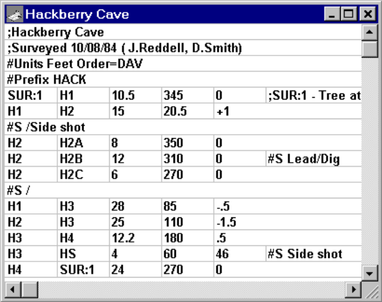
**66** **Walls Project Editor**

**General Description**
The files are ordinary text (actually ANSI, a superset of ASCII) and can be created with the Walls built-in editor or
with most other text editors, including Windows Notepad. During compilation, the program reads a file line-byline while recognizing the semicolon character as a comment prefix. Except for the first whole-line comment,
which Walls uses as the default title when the file is added to a project via the "browse" feature, anything on a
line following a semicolon is ignored. Blank lines are also ignored.

Each line is read as a sequence of _tokens_ (strings of displayable characters), where the number of spaces and
tab characters between tokens is irrelevant. Except for certain text data, such as station and segment names,
the case (upper or lower) of characters in a token doesn't matter. During compilation, if Walls encounters something it doesn't like, it displays an error message and highlights the offending line in an editor window.

You'll discover that the program is quite strict in deciding what numeric forms are reasonable. For example, not
only will it reject negative distances and azimuths, but an entry like "+10" for anything but an inclination or
above-station height will also trigger an error message. Why? Because entering measurements out of order is a
very common mistake.

Special lines, called _directives,_ have their first token prefixed with a pound sign (e.g., #Units, #Segment, #Prefix,
etc.) and are used to specify such things as station and vector attributes, measurement units, and measurement
column order. Other lines in the file define _vectors_ between pairs of named stations. Ordinarily, these are the
survey "shots" that resemble data lines in field books.

The range of measurement units now supported by the SRV format is much larger than it once was, but of
course it still won't satisfy everyone. A complex format takes longer to describe and is harder to export to other
programs. Already, it's not easy gathering data that's sufficiently diverse for testing purposes. For this reason
I've tried to avoid adding features until they are actually needed for current projects. Nonetheless, I will continue
to make changes to the format -- hopefully in a way that keeps old data files compatible.

##### **4.2 Vector Data Lines**

The survey data files you prepare for Walls resemble fieldbook pages in that they consist of lines (or rows) of
measurement sets, each defining a vector between two named stations. Since the name pairs are sufficient to
determine a survey's connectivity, a successful compilation by Walls does not require that the lines of vector data
be ordered in any specific way, or even that vectors be connected (i.e., have matching endpoints). However, if
you move lines around via cut-and-paste, you must be careful that each vector has applied to it the correct #Units, #Prefix, and #Segment directives. The following sections describe the components of a vector definition in
more detail.

**Station Names**
The first two items on compass and tape (CT) and rectangular coordinate (RECT) data lines are the **FROM** and
**TO** station names, in that order. With CT data, the FROM station is always defined as the station from which the
(forward) vertical angle and azimuth readings were _actually taken in the field_ . (Reversing the shot direction after
the fact makes it difficult for any program to properly apply instrument corrections or to estimate some kinds of
systematic error.) With RECT data, the specified vector is always the displacement of the TO station with respect to the FROM station.

Station names, with their implied or explicit prefixes, must be globally unique within any subset of data files that
are to be compiled together. This means that if two names in different files match, they are assumed to refer to
the same location. Character case is significant when comparing names, but there is a CASE setting of the #Units directive that can perform case conversions. For information on the use of prefixes to insure station name
uniqueness, see #Prefix Directive.

Unprefixed names can have a maximum of _eight_ characters and must not contain any colons, semicolons, commas, pound signs (#), or embedded tabs or spaces. In order to avoid possible problems when printing or when
exporting data to other programs, you are encouraged to restrict names in new surveys to numbers with alphabetic prefixes or suffixes (e.g., BR123). Also, you'll probably want to take advantage of the editor's auto-sequencing/prefixing feature, which makes entering such names especially easy.

_Copyright © 2013 by David McKenzie_

**Survey Data Format** **67**

**Measurements**
Immediately following the two station names are the three primary measurements that define a three dimensional
vector. For compass and tape data lines, they are the **Distance** (shot length), magnetic **Azimuth** (bearing), and
**Vertical angle** (inclination), and they must appear in the order specified by the Order=xxx parameter of the #Units directive, where xxx is some permutation of the letters D, A, and V (DAV is the default). For rectangular
(RECT) vector data lines, the three numbers are the true north-relative **East, North,** and **Up** displacements, with
their default order represented by the #Units setting, Order=ENU. The presumed measurement units are those
that have been specified for Distance. (See Measurement Units.)

If these three items are not all present, have the wrong format, or are out of range, Walls will abort compilation
and highlight the line in an editor window. There are special cases, however, where the vertical measurement
can be omitted entirely to specify a constant zero value. The #Units parameter Order=DA, AD, EN, or NE will allow this. Alternatively, you can enter a string of two or more minus signs (e.g., ---) to make it clear that a measurement was not actually taken. The program will accept this placeholder for missing LRUD measurements and
for the nonexistent azimuth readings on pure vertical shots.

**Instrument/Target Heights**
To handle a large stash of existing survey data, the SRV format supports optional _fourth_ and _fifth_ measurements
on compass and tape (CT) data lines. Walls will interpret these as an **instrument height above marked sta-**
**tion** followed (optionally) by a **target height above marked station** . If the taping method is instrument-to-target
(the default assumption), the effect of these heights is equivalent to adding their difference (IH minus TH) to the
computed elevation of the TO station with respect to the FROM station. Note that the #Units directive's INCH
_vertical adjustment_ is not necessarily related to these measurements; it is independently applied to all CT data,
regardless of whether or not explicit height above station measurements are present.

Earlier versions of this program did not support the four different taping methods. When instrument/target height
measurements were encountered, the taping method was naturally assumed to be along the line of sight -- that
is, _instrument-to-target_ instead of station-to-station. This has always seemed to me the only logical method to adopt since instrument/target height measurements are necessary only when the line between marked stations is
either obstructed or not easily accessible. What finally tilted the balance in favor of support was the requirement
to handle underwater surveys, where _station-to-station_ taping is indeed the proper way to represent bearings,
taped distances, and depth gauge measurements. Here, depth measurements are treated as if they were IT
heights.

For a discussion of the difficulties IT measurements might cause, see Height Measurement Pitfalls.

**Variance Overrides**
Occasionally you may want to override the default variance assigned to vectors, whether they be compass and
tape (CT), rectangular (RECT), or #FIXed vectors. This variance is used by the adjustment and error analysis
portion of Walls and will come into play only when the vector is part of a loop system. The override is in the form
of a parenthetical expression following the last measurement (or coordinate) on the data line. For more information, see Variance Assignments.

**LRUD Passage Dimensions**
The SRV format allows the specification of Left-Right-Up-Down passage dimensions -- information that is often
found in field books and in data managed by other programs. The optional LRUD specification is a bracketed
expression, <L,R,U,D>, following the last measurement on a compass and tape data line -- for example,
<10.5,3,5,1>. Note that angle brackets distinguish this from a variance override (parenthetical expression) which
can either precede or follow it on the data line. If it simplifies typing, substitute asterisks for the angle brackets.
Also, space characters can be used instead of comma delimiters: *10.5 3 5 1*.

To allow for the possibility that the associated vector definition can't provide a realistic _facing direction_ for the
LRUD, an azimuth value, can be included as a fifth number in any LRUD expression:

NAM1 NAM2 15 -- -90 <5,10,10,0,325>

_Copyright © 2013 by David McKenzie_

**68** **Walls Project Editor**

A recent addition to the format is an optional trailing "C" (or "c") argument in the LRUD expression -- for example,
<1,6,5,1,C>. Currently this flag only effects SVG exports where the option "Draw cross section boxes for Cflagged LRUDs", is specified in the SVG Advanced Settings dialog. For more information see the description of
the "w2d Lruds" layer in SVG Layer Definitions.

A missing dimension measurement should be indicated by two adjacent minus signs -- for example, <10,5,--,-->.
Unless there are other passage dimension measurements at the station (wall shots or other LRUDs), this may
result in zeros assumed for the missing values when passages are drawn. Special values to indicate such things
as "passage" at a right-angle bend are not supported. Instead you should consider wall shots (see next section)
or use one or more LRUDs with specified facing directions. A given station can have more than one LRUD assignment.

Unfortunately, there doesn't seem to be a generally agreed upon definition for the LRUD numbers written in field
books -- for example, whether or not the LRUD is to be associated with the TO station instead of the FROM station (SEF style). Notes are often unclear about the method used, so one has to decide if it's worth tracking down
and querying members of the surveying team. Another problem from a software perspective is that we can't reliably convert between the different variants of LRUD that have been proposed. (The SEF format supports only
the FROM station variant.) The prospect of recognizing and not just accommodating several incompatible LRUD
schemes never did interest me. Eventually, however, it became necessary to support large projects where
LRUDs of several kinds had been painstakingly obtained and keyed into computer files.

The #Units directive currently supports four popular LRUD style options: FROM-station-perpendicular (default),
TO-station-perpendicular, FROM-station-bisector, and TO-station-bisector. (LRUD=F/T/FB/TB.) You can also
specify what order the Left, Right, Up, Down values appear in the expression. For example, LRUD=T:UDLR
would specify TO-station LRUDs with the ceiling and floor distances appearing before the left and right distances.

During raw data processing, Walls converts the various LRUD styles to an unambiguous internal format: four distances, a direction (azimuth), and an associated station. If your LRUDs are the TO-station type, it's very important that you use the LRUD=T (or TB) units specification, perhaps as a Compile Options entry in the project root
folder's Compile Options dialog. Otherwise, LRUDs will be associated with the wrong station.

You'll find, however, that the wall rendering algorithm is fairly robust and can be easily adjusted after the fact to
prevent passage narrowing at turns. Although Walls-specific, there is also the option to include an overriding azimuth in the LRUD expression as described above.

With either of the two basic LRUD methods, TO-station or FROM-station, you'll sometimes need to specify _start-_
_ing station_ LRUDs or _ending station_ LRUDs. Depending on the method, you'll need sequences like the following:

#Units LRUD=T
A0 <2.5,5,3,0> ;Starting station LRUD
A0 A1 30 275 -5 <0,7,4,0>
--- etc.

#Units LRUD=F
--A0 A1 30 275 -5 <0,7,4,0>
A1 <2.5,5,3,0> ;Ending station LRUD
--- etc.

Finally, at any point in your data files you can associate a station with LRUD dimensions and a facing azimuth:

A1 <2,3,5,0,275>

LRUDs are included as shapefile attributes and optionally as part of exported SVG files. They can also be displayed on printed and screen maps. For more information, see Passage Display Options.

**Wall Shots**
Another method of specifying passage dimension data is available which is more flexible and less ambiguous
than conventional LRUDs. These are simply shots to anonymous points on a passage boundary:

_Copyright © 2013 by David McKenzie_

**Survey Data Format** **69**

A1      - 10 210
A1      - 12 300 +10

        - A1 0.5 45
A1     - 3.5 -- +90
--- etc.

The main distinction of a wall shot is that a minus sign (- or --) is used for one of the names. The inclination is
optional, and the processed data will be used _only_ for the representation of walls. Like LRUDs, they don't contribute to survey statistics nor do they appear on the preview map. The program will throw them into the mix with
LRUDs when defining passage outlines for plans and profiles. Reasonably accurate outlines of large rooms and
passage junctions can be achieved this way when vector-associated LRUDs provide too little information.

There is only one rule to follow with wall shots. For an accurate plan or profile view, there should be at least one
wall shot (or LRUD) with the unnamed station residing at a point farthest in horizontal or vertical extent in the
specified direction. There's no harm, however, in shooting to arbitrary points on the floor or ceiling. The Walls3D
viewer has a relatively new option to display wall shots and LRUDs.

**Segment Assignment for a Specific Vector**
Finally, an optional segment specification, prefixed by the token "#S" (or "#Seg, or #Segment), can appear as
the last data item of any line that defines a vector -- namely #FIXed stations, RECT coordinates, and compass
and tape data lines. It serves to assign the segment attribute of a single vector without changing the current default segment. Currently, this is the only directive that can appear on the same line as a vector's data. A common example is a flag-like segment assignment, such as "#S L", to indicate that the vector should be excluded
from length calculations. Such vectors could then be "detached" from the segment tree prior to statistics being
calculated. (See Segments Page.)

##### **4.3 #Units Directive**

Each survey file should contain one or more **#Units** directives -- at least one on a line prior to the first defined
survey vector. Since there are quite a few units options, most of which you'll rarely need, the #Units directive description is organized into separate topics:

#Units Directive - General Description
Overriding Default Units with Special Formats

In the following topics the slash (/) character is used to separate the alternative versions of parameters and/or
their settings. For example, "A/AB = Degrees/Mils/Grads" heads the section that describes unit assignments for
both azimuths (A=...) and azimuth backsights (AB=...). Abbreviated forms, if allowed, are indicated by using
lower case for the portion that can be omitted (e.g., O=... for Order=...).

Vector Type and Column Order (CT/RECT, Order=)
Measurement Units (Feet, Meters, D=,A=, V=, S=)
Declinations and Grid Corrections (DECL=, GRID=, RECT=)
Instrument Corrections (INCA=, INCV=, etc.)
Backsight Types and Tolerances (TYPEAB=, TYPEVB=)
Saving and Restoring Units Settings (RESET, SAVE, RESTORE)
Advanced or Seldom Used Parameters (LRUD=, CASE=, PREFIX=, TAPE=, UV=, FLAG=, NOTE=,
$name=)

**4.3.1** **#Units Directive Syntax**

The #Units directive tells Walls how to interpret the data that follows. Although there are many different options
that you can include on a #Units directive line, you'll typically be specifying only a few while accepting default
settings for the others. For example, if length measurements are in meters, the magnetic declination is 6.5 degrees, and the column order (after the From and To names) is Distance, Azimuth, and Vertical angle, the #Units
directive at the beginning of your data file could look like this:

_Copyright © 2013 by David McKenzie_

**70** **Walls Project Editor**

**#Units Meters Order=DAV Decl=6.5**

or, alternatively, like this:

**#Units Decl=6.5**

since meters is the default length unit and DAV (Distance, Azimuth, Vertical) is the default column order for the
primary measurements.

When a #Units directive line is encountered, the new parameter settings take hold and remain in effect until they
are _individually_ overridden by settings in a subsequent #Units directive, or if they are explicitly reset to the default
state via the RESET keyword. Ordinarily, only the settings that change need to be respecified.

**The Compile Options Property Setting**
In addition to using the #Units directive to describe data characteristics, you can also make use of the Compile
Options page of the Properties Dialog for project tree branches. These settings are stored in the WPJ file.
Ideally, the SRV files should be self-contained, but sometimes it's convenient to be able to make global assignments (name prefixes, declinations, etc.) or to experiment with instrument corrections without having to edit numerous data files. When you use this feature, you should be aware that the Compile Options settings are processed by Walls in the order of a _complete_ project tree traversal from the root (folder icon). This has exactly the
same effect as a corresponding sequence of #Units directives inserted at the beginning of a survey data file.
(The attached/detached state of branches is ignored in this traversal.)

**4.3.2** **Overriding Default Units with Special Formats**

The #Units directive can be used to change the _default_ units for both the length and angular quantities present
in your data files -- that is, whether a distance measurement entered simply as "10", for example, will be interpreted as 10 feet instead of 10 meters. It is possible, however, to override the defaults with specially formatted
values. Perhaps the easiest way to document this is by way of example:

**Lengths (distances, heights, tape corrections, etc.)**

-.5m = -.5 meters
10.5f = 10.5 feet
10i6.5 = 10 feet, 6.5 inches
i6 = 6 inches

**Angles (azimuths, inclinations, declinations, compass/clinometer corrections, etc.)**

45d = 45 degrees
800m = 800 mils (360d=6400m)
100.5g = 100.5 grads (360d=400g)
-5p = -5% grade (45d=100p, 2.8624d=5p) (inclinations only)
15:10:30 = 15 degrees, 10 minutes, 30 seconds
:50 = 50 minutes
N50.5W = North 50.5 degrees West (=309.5d)
S:15.5E = South 15.5 minutes East
320d/N41W = foresight/backsight pair (=319.5d)
/-20 = isolated back-inclination (default units)

Note that a measurement (or FS/BS pair) is always entered as a _single token;_ there is no space between any of
the separate components. An entry like "10 f" instead of "10f", for example, will trigger an error message during
compilation. Character case, however, doesn't matter; "10.5F" is equivalent to "10.5f". The context will determine whether or not certain formats are acceptable. A quadrant-style bearing like N10E, for example, would not
be accepted as an inclination. Neither would a number outside the range -90 to 90 (after conversion to degrees).
There are, in fact, many forms that could technically be interpreted as legitimate values (365d, N-10W, 30.5:20,

_Copyright © 2013 by David McKenzie_

**Survey Data Format** **71**

10.0i6, etc.) but are instead viewed by the program as possible data entry errors. Even a sign (plus or minus) on
a distance or azimuth is considered suspect. All such unlikely forms will generate an error message.

Finally, a special token, a sequence of two or more successive minus signs (e.g., "---"), can be used where appropriate to indicate that an actual measurement was not taken and that certain assumptions can be made regarding its absence during processing. Examples might include inclinations in a water passage (assumed zero),
azimuths of pure vertical shots, missing LRUD distances, and absent foresights or backsights. If not followed by
other line items, _blank_ fields can sometimes serve the same purpose.

**4.3.3** **Vector Type and Column Order**

**CT / RECT**
If the parameter RECT appears on a #Units directive, the three basic numbers that define a vector are assumed
to be the true north-relative East-North-Up _displacements_ of the TO station with respect to the FROM station.
Otherwise, they are the Distance, magnetic Azimuth, and Vertical angle measurements of a compass and tape
(CT) data line. In either case, the first two tokens on a line are the FROM and TO station names. The third
token is the first of the three primary measurements, the order of which is specified by the Order parameter as
described below. See Vector Data Lines.

**Order = DAV / DVA / ADV / AVD / VDA / VAD / DA / AD**
**Order = ENU / EUN / NEU /NUE/ UEN / UNE / EN / NE**
The first form applies to subsequent compass and tape (CT) data lines, where the three primary measurements
(distance, azimuth, and vertical angle) are assumed to be in the column order indicated by a permutation of the
letters D, A, and V. **The initial default is DAV.** The shortened sequences (AD and DA) can be used to specify
that the vertical angle will be omitted entirely from the set of measurements -- a useful option for underwater surveys in particular. The effect is the same as specifying zero for the vertical angle.

The second form specifies the order that the East-North-Up coordinates appear on both #FIX directives and
RECT data lines. The initial default is ENU. Like the vertical measurement on CT lines, the Up coordinate can
be omitted if one of the two shortened sequences is specified. When geographical coordinates are being entered
for fixed stations, "order=ENU", for example, specifies that the column order is longitude - latitude - elevation.
See #Fix Directive.

Both forms of the Order parameter can appear on the same #Units directive since they apply to different kinds of
data that might follow.

CT data lines can optionally have up to two additional measurements: a vertical adjustment, or an instrument
height followed by a target height. Their order and position on a data line, however, cannot be specified. (If
present, they always follow the DAV measurements.) For more information, see Vector Data Lines.

**4.3.4** **Measurement Units**

**A/AB = Degrees/Mils/Grads**
Establishes the default angle units for the azimuths in compass and tape (CT) data lines. The second form (e.g.,
"AB=D") specifies the units for the backsight instrument. **The initial default is decimal degrees.** The current
default can be overridden for individual measurements with D, M, or G suffixes (upper or lower case), with quadrant-style bearings, or with DMS entries like 135:10:30. For example, when A=D is in effect, 90 degrees azimuth
can entered as 90, 1600m, 100g, N90E (or E). On CT data lines, backsights are indicated with a slash (/) prefix
_immediately_ following the foresight (if one is present). See Vector Data Lines.

**D = Meters/Feet**
**S = Meters/Feet**
**Meters/Feet**

_Copyright © 2013 by David McKenzie_

**72** **Walls Project Editor**

The first form (D=...) establishes the default distance units for both compass and tape (CT) and RECT data lines.
The coordinates of #FIX directives are also assumed to have these units. The second form (S=...) specifies the
units for instrument/target heights above station and any LRUD measurements on CT data lines. The third form
(Meters or Feet) is a shorthand way of specifying the default units of all length quantities -- both distances and
heights. **The initial default in each case is meters.**

When there are more than one type of length quantity on a data line (shot distance, height measurements, relative variance, LRUD distances), you may have to override the current units of specific measurements with the suffix "m" or "f" (upper or lower case), or with the inches designator, "i". Such formats also allow you to enter a few
exceptional data lines without having to bracket them with #Units directives. See Overriding Default Units with
Special Formats.

When units are specified as feet, the program assumes _International foot_ units, where a foot is exactly 0.3048
meters, not _U. S. Survey foot_ units, where a foot is approximately 0.3048006 meters. Such a distinction would be
important if for some reason you need to express UTM coordinates in feet.

**V/VB = Degrees/Mils/Grads/Percent**
Establishes the default angle units for the vertical angles (inclinations) in compass and tape (CT) data lines. The
second form ("VB=") specifies the units for the backsight instrument. **The initial default is decimal degrees.**
The current default can be overridden for individual measurements via a D, M, G, or P suffix (upper or lower
case), or by using the DMS format for degrees, minutes, and seconds (ddd:mm:ss). Note that the "right side"
scale in some clinometers (Suuntos) is percentage grade, with +100 percent corresponding to +45 degrees
(grade being interpreted as the tangent of the angle). Like azimuth backsights, back-inclinations are indicated
with a slash (/) prefix _immediately_ following the foresight (if one is present). See Vector Data Lines.

**4.3.5** **Declinations and Grid Corrections**

The following #Units parameters specify positive or negative angular quantities, the default units being decimal
degrees. Note that they specify how data should be _interpreted_ (what reference direction to assume), not necessary how you'll want data converted or displayed on a map.

**DECL = <true north minus magnetic north>**
This specifies the magnetic declination that would need to be _added_ to the azimuth measurements of compass
and tape (CT) data lines to obtain a vector's true north relative direction. If you choose to use a geographical reference with your project, you can enable the option to specify declinations indirectly via the #DATE directive, in
which case the #DATE directive becomes equivalent to a #Units DECL=x directive, where x is the declination
computed from a model of the Earth's magnetic field. For more information on this option see Geographical Reference Page.

#Fix and RECT data lines are _not_ affected by the declination setting. They have similar but separate settings as
described below.

**GRID = <true north minus grid north>**
The implied vectors corresponding to #FIX coordinates would need to be rotated clockwise by this amount to obtain true north relative vectors. The default GRID correction is the UTM grid convergence angle when a geographical reference has been assigned to the respective branch of the project tree. (See Geographical Reference Page.) In this case, the default setting for GRID assumes that all #FIXed points are defined in the data with
UTM (or UTM-relative) coordinates. Also, the UTM zone and geodetic datum are assumed to be the same as
that of the reference.

Therefore, when working with GPS position fixes and UTM coordinates, you'll not normally have any GRID= arguments on your #Units directives. That's because the assigned geographical reference will already be providing
a suitable default.

**Important:** Without either a GRID correction explicitly specified or a geographical reference assigned, #FIX coordinates are assumed to be true north relative.

**RECT = <true north minus RECT north>**

_Copyright © 2013 by David McKenzie_

**Survey Data Format** **73**

The displacement vectors corresponding to RECT data lines would need to be rotated clockwise by this amount
to obtain true north relative vectors. The default value is zero, meaning that RECT vectors are assumed to be
true north relative by default. For example, the GPS download feature produces track data in the form of RECT
vectors. Since those vectors are UTM grid-aligned, the #units option RECT=<grid convergence angle> is specified for you in the output file.

**Note:** This option is not to be confused with "RECT" (without the equals sign) which specifies that RECT data
lines follow the #Units directive.

**4.3.6** **Instrument Corrections**

**INCD / INCA / INCAB / INCV / INCVB = <tape/instrument correction>**
**INCH = <height adjustment>**
The expression INCx=n, with n a decimal number and x one of D, A, AB, V, or VB, specifies a correction that the
program will add to the corresponding measurement entry when it is processed. Those measurement entries are,
respectively, Distance, Azimuth, Azimuth Backsight, Vertical angle, and Vertical angle Backsight. These corrections will be applied only to compass and tape (CT) data lines.

Note that only the distance correction, INCD, will be applied to pure vertical shots, where the inclination is +90 or
-90 degrees. Also, corrections are not applied to zero heights or distances, both of which are allowed. (Zerolength vectors can be defined.) However, if applying a correction to a distance would cause a change of sign, an
error message is displayed.

Like measurements on data lines, the correction units can be given explicitly with suffixes (e.g., IncA=1.35d).
Otherwise, the units are assumed to be the current default for the corresponding measurement. In this case, if
measurement units are later changed without a corresponding change in the correction, the correction keeps its
original meaning. For example, a six-inch tape correction will stay six inches, even after switching to a meter
tape. (This is done to be consistent -- we don't want some types of settings to be automatically zeroed when
their units change.)

The height adjustment, INCH, is a special case in that it is not an instrument correction, but a _vertical adjustment_
that will be applied to all non-vertical shots. It is available to compensate for a possible systematic error in vertical target positioning -- something I've personally encountered in a few highly interconnected surveys where
techniques and personnel remained constant. Its default units are the same as that of the distance measurement. For example, "INCH=0.04m" would cause four centimeters to be added to the computed elevation of the
TO station with respect to the FROM station. The mainframe program, Ellipse, actually provided a "confidence
interval" for this height error as a product of the adjustment. Walls currently doesn't do this, but you can get the
same result by trying out different INCH values while homing in to the smallest vertical UVE.

For an illustration of the effects of INCA and INCH corrections, see Tree Survey Example.

**4.3.7** **Backsight Types and Tolerances**

**TYPEAB / TYPEVB = Corrected / Normal [,<degree tolerance>] [,X]**

The azimuth and vertical angle fields on compass and tape (CT) data lines can optionally contain backsight versions of the measurements. During processing, the FS/BS values are simply averaged after the appropriate
units conversions and instrument corrections are applied. For example, you could have vectors defined as follows:
**...**
**S1** **S2** **30** **100/282** **/-16 ;no forward inclination**
**S2** **S3** **15.5** **355/181** **6/-5**

With the program's defaults in effect -- that is, with "TYPEAB=N,5" and "TYPEVB=N,5" -- the program will detect
a FS/BS mismatch. That's because the difference between 355 and the reverse of 181 is more than 5, the default tolerance in degrees.

_Copyright © 2013 by David McKenzie_

**74** **Walls Project Editor**

Since apparently some cave surveyors prefer to record "corrected" backsights, the program also allows you to
define the same vectors as follows:
**...**
**#Units TypeAB=C,6 TypeVB=C**
**S1** **S2** **30** **100/102** **/16**
**S2** **S3** **15.5** **355/1** **6/5**

This changes the backsight type of both azimuths and inclinations from Normal to Corrected, and increases the
AB tolerance to six degrees so that the second vector passes the test.

**Update:** Another option in the handling of backsights is to to use them only as a check against blunders. If a
trailing ",X" is present in the arguments for TYPEAB or TYPEVB then no averaging will occur; the foresight alone
will be used in determining the vector's orientation. Use of this option requires that the other arguments be
present also, such as in TypeAB=N,5,X.

Whether or not averaging is suppressed, FS/BS mismatches are treated as non-fatal errors during the compilation of raw data. The program generates a log of such errors (if any exist) and prompts you to inspect it in an editor window when compilation is complete. The first item on each line is a hot link to the appropriate survey file
and line. A toolbar button, with the image of a clipboard marked with a red "E", allows you to open the error log
for an item's most recent compilation.

**4.3.8** **Saving and Restoring Units Settings**

**RESET**
If this keyword appears anywhere in a #Units directive line, the effect is to set all parameters (including the current name prefix) to their defaults before the other arguments are processed. You may occasionally want to use
RESET to clear any compile options in the project script (or earlier in the file itself) so you can be sure of starting
afresh. RESET does _not_ affect the current segment attribute being assigned to vectors.

**SAVE / RESTORE**
If the keyword "SAVE" appears on a #Units directive, then all of the parameter values (units, corrections, declination, name prefix, etc.) which were in effect prior to the directive are saved on a "stack" before any of the other
#Units arguments, which could change those settings, are processed. Then, further along in the file, the
RESTORE keyword can be used to put things back the way they were before the SAVE. (As many as 10 successive saves can be restored.)

SAVE/RESTORE is convenient when assigning attributes to a few data lines while _not_ affecting the processing of
lines above and below. Here is an example:
**...**
**#Units Save Reset Feet Tape=SS**
**A10 A11 60** **323** **-30** **3** **1.5**
**A11 A12 45.5** **280** **-15** **3** **1.5**
**#Units Restore**
**...**

Without the "Reset" keyword, all settings except those changed with "Feet Tape=SS" would remain unchanged
during the processing of the two lines. In this example, however, the other parameters are reset to the program's
defaults. (When present on the same directive, the Save and Reset keywords should appear in the order shown.
The positioning of the other #Units arguments is unimportant.)

_Copyright © 2013 by David McKenzie_

**Survey Data Format** **75**

**4.3.9** **Advanced or Seldom Used Options**

**CASE = Upper / Lower / Mixed**
Case conversion is applied to station names if you use CASE=L (convert to lower case) or CASE=U (convert to
upper case). CASE=M is the default setting which insures that the case actually appearing in names is significant. This parameter has no affect on station name _prefixes,_ where case is always significant. It also doesn't apply to notes and segment names.

**LRUD = F / T / FB / TB**
**LRUD = <type>:<order>**
Four popular LRUD style options are currently supported: FROM-station-perpendicular, TO-station-perpendicular, FROM-station-bisector, and TO-station-bisector. The default style is FROM-station-perpendicular, where the
dimensions appearing on a vector's data line are taken at that same vector's FROM station and describe a passage cross-section that's perpendicular to the vector's horizontal component. If there is no horizontal component,
the program attempts to find one in the previous or next shot. The bisector styles produce cross-sections that bisect the angle between adjacent vectors.

An example of the second form of the assignment is LRUD=T:UDLR. This specifies TO-station LRUDs with the
ceiling and floor distances appearing before the left and right wall distances. Thus the order that dimension
types appear in the data can be specified. The default assumption is LRUD=F:LRUD. (Note the colon delimiter
with no space on either side.)

For much more information about LRUDs, see LRUD Passage Dimensions under Vector Data Lines.

**PREFIX=<name>**
**PREFIX2=<name2>**
**PREFIX3=<name3>**
This option sets the current station name prefix of a particular level, with up to three levels being supported.
When the keyword appears without an assigned name, the prefix for that level is cleared. The #Prefix Directive is
normally the preferred method of prefix assignment, but this parameter form allows default prefixes to be set for
entire project tree branches via the "Compile Options" field in the Properties dialog. The compile options field
only accepts #Units arguments.

**TAPE = IT / SS / IS / ST**
For the sake of completeness (and to make importing data from other programs simpler), Walls now supports
the four different "taping methods": Instrument-to-Target, Station-to-Station, Instrument-to-Station, and Stationto-Target. The default method is Instrument-to-Target (IT), which is also the recommended method for anything
but underwater surveys. The taping method comes into play only for compass and tape (CT) vectors where instrument/target heights above station have been recorded. The instrument of relevance here, of course, is the
clinometer, not the compass. For further discussion of this feature, see the section on IT heights under Vector
Data Lines.

**UVH / UVV / UV = <nonnegative number>**
The assumed variances of all vectors, whether they be compass and tape (CT), rectangular (RECT), or the hidden vectors of #FIX directives, will be _multiplied_ by this number, a "unit variance" scaling factor. Use the
keyword UVH, UVV, or UV to indicate whether the variances of horizontal components, vertical components, or
both types of vector component are to be affected.

Note that these settings will be applied to _all_ (non-floated) vectors, including those whose default variances have
been overridden (see Variance Assignments). The default setting is UV=1.0.

You will not normally want to use this feature since values other than 1.0, if applied to an entire survey, will affect _only_ the UVEs, while F-ratios and coordinate estimates remain unchanged. You can verify, for example, that

_Copyright © 2013 by David McKenzie_

**76** **Walls Project Editor**

setting UVH or UVV to the corresponding UVE resulting from a default compilation will produce a new UVE of
1.0.

However, on occasion you may want to treat certain surveys, or portions of surveys, as being more reliable than
others -- at least in the final adjustment. For example, assigning UV=0.01 to a set of vectors would cause them
to be treated in the adjustment as if their error components had one hundredth their normal variance (or one
tenth their normal standard deviation).

You may use "UV=0", for example, to constrain a set of vectors -- a shortcut to placing the variance override "(0)"
on each data line. However, if you do this, be careful that there exist no loops consisting entirely of constrained
vectors, which will cause Walls to abort the adjustment with a message indicating the presence of fundamentally
inconsistent data. (This will occur even if you try to insure that the closure distance is zero.) The work around is
to use the override "(?)" to float any such vectors that form closures.

**FLAG = "flag name"**
**FLAG**
This option sets the current default flag name for #FIXed stations, or removes it when the keyword appears
without an assigned value. Note that quotes are necessary when the flag name has embedded white space.
The #Flag directive is normally the preferred method of flag assignment, but this parameter form allows the default flag to be set for entire project tree branches via the Compile Options property dialog. The text box in that
dialog only accepts #Units arguments.

**$<name> = <"replacement string">**
**$<name>**
Any name of your choosing prefixed with a dollar sign is treated as a _macro_ name. It's definition, or _replacement_
_string,_ is the string of characters to the right of the equals sign -- a string that must be quoted if it contains
spaces or commas. When there is no equals sign, the replacement string is taken to be the empty, zero-length
string. During compilation, the program examines all directive lines (excluding #FIX directives) for macro _references,_
then replaces those it finds with the corresponding replacement strings. It does this _before_ the directive line is
processed in the normal fashion. Macro references have the form _$(name)_ and can be used to construct any portion of a directive line following the hash-prefixed directive name. For more details and examples see Defining
and Using Macros.

##### **4.4 #Segment Directive**

The #Segment directive, abbreviated by #Seg or #S, is used to assign named attributes, called _segments_, to
survey vectors. By making such assignments we can obtain statistics for and dynamically assign map colors
and styles to groups of vectors, regardless of where they appear in data files. Segments are operated on via
the Segments page of the review dialog.

The key thing to notice first is that segment names are analogous to file _pathnames_ in that they group vectors
into a tree-like hierarchy, much the same way that files are grouped into folders on your computer's hard disk.
The directive form is

**#Segment <absolute or relative "pathname">**

The abbreviations #S and #Seg are accepted. An example is

**#S /Bat room/Lower level/March95**

When the directive appears on a line by itself, it defines the segment for vectors that follow, up until the next
#Segment directive on a line by itself. When the directive appears _as the last item_ on a vector's data line, however, it applies to that vector alone and does not affect what segment is assigned to vectors above and below it.
Currently, this is the _only_ directive that can appear on the same line as vector data.

Like pathnames, segment names consist of components separated by slashes (either forward slashes or backslashes). When the segment name does _not_ begin with a slash, the name is "relative" and does not replace but
instead _appends to_ the current segment name at that point in the file. In the Hackberry Cave illustration (see

_Copyright © 2013 by David McKenzie_

**Survey Data Format** **77**

SRV Files - Overview) vector **H2 H2B** is actually in segment **/Side shot/Lead/Dig** . The maximum allowed length
of a segment name component is **80** characters. The maximum allowed length of the expanded segment pathname is **255** characters. Note that unlike file pathnames, the case of characters (upper or lower) is significant _._

_S_ egments don't need to be predefined; they are automatically created when new names are specified. The dot
notation of file pathnames can even be used. For example, "#S .." means "back up one level in the current segment hierarchy." Assignments like "#S ../../X" are allowed, but I suggest the use of absolute (slash prefixed)
segment names whenever possible to avoid confusion.

Segments are optional and have no affect on the compilation of survey data. Their importance is that they allow
you to assign map features (colors, line styles, labels, markers, etc) to as many parts of a network as you may
want to distinguish between. For example, you can easily highlight the "Lead" vectors with a specific color, or
exclude all "Side shot" vectors from the map. You can also view statistics (length totals, vertical ranges, etc.)
and obtain vector/coordinate listings for different parts of the segment hierarchy. By _detaching_ branches of the
segment tree you can exclude vectors from the map, from listings, from statistical summaries, and from export
operations. Operations on the segment tree (color assignments, attachment status, etc.) are among the things
preserved in a database that is initialized (or updated) at the time of compilation. Recompilation of a project
branch will normally preserve any assignments you've already made.

Segments can specify geography (caves, passage names, levels) and also vector "types" (surface, length excluded, underwater) -- it's your choice since Walls doesn't support any predefined vector types or segment
names. For example, you might see the following tree diagram on the left side of the Segments page: (For a
more up-to-date image showing this tree, see Segments page.)

The reason that _Area Caves_ and _Hackberry Cave_ appear in the tree diagram
is that these project tree items happen to be part of a larger branch that was
compiled -- namely, _West Ft Hood Area._ Also, the "define segment" option
was turned on for these items (see Properties Dialog). It's usually convenient
that the project tree itself define _segment name prefixes_ for the survey files.
This means that the higher levels of the _segment hierarchy_ assigned to vectors are usually determined by the _file hierarchy_ stored in the project script.
When such prefixes are enabled, you cannot override them within the files
themselves. The directive "#S /", for example, resets the segment name to
whatever is assigned to the file by the project script.

As you can see above, attribute names defined _within_ survey data files are displayed in a distinct user-chosen
font (underlined in this case). Attributes defined by the _file hierarchy_ via "define segment" are represented in the
diagram by project branch _titles,_ displayed in another font. The actual attribute names, in this case, are the
workfile and survey file base names. The complete segment name for vector **H2 H2B** is something like **/AREA/**
**HACK/Side shot/Lead/Dig,** where "AREA" is the workfile base name for _Area Caves_ and "HACK.SRV" is the
name of the data file for _Hackberry Cave._

Another thing to notice about the diagram is that the icon representing the assigned map features for _Area_
_Caves_ is missing. That's because the _Area Caves_ assignments happen to be _disabled_ -- the result of our selecting that tree item and clicking a button labeled "Inherit" on the Segments Page's control. This means that the
_default_ assignments for _Area Caves_ vectors are inherited from its parent, _West Ft Hood Area_ . In this case, however, those defaults (white lines, etc.) will not be used for either _Hackberry Cave_ or _Surface Surveys_ since those
items have their own assignments, _enabled_ as a result of our clicking that same button when it's labeled "Use
Own.".

Notice that we are attempting to use one naming scheme for two basic types of attributes assignable to vectors:
_branch-type_ attributes that appear only once in the hierarchy (cave names, files, regions, etc.) and _flag-type_ attributes that may be duplicated in many different parts of the hierarchy ("Surface", "Side shot", "Lead", etc.). The
latter are analogous to the letter-designated shot "types" that are supported in other cave surveying programs.

_Copyright © 2013 by David McKenzie_

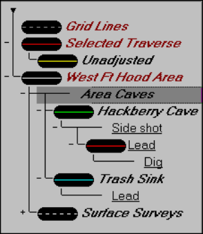
**78** **Walls Project Editor**

The first question you may have about this approach concerns the assignment of map features for flag-type attributes. For example, how can we change the color of all Lead vectors without having to exhaustively search
the segment tree, expanding branches, in an attempt to find all appearances of the Lead attribute? The solution
is to use of the "Apply to All" button in the Segment Page's control panel. It's only necessary to find _one_ occurrence of "Lead" in the segment tree, configure it with the desired map settings and click "Apply to All." This will
copy those settings to all other tree nodes with the name "Lead." Those settings include the Inherit/Use Own
and Attach/Detach states of that node, as well as the color, line style, label, and marker assignments. (Note that
this operation wasn't done for Lead nodes in the above example.)

Some flag-type attributes may not be mutually exclusive. For example, you may want to use "P" for "don't display" and "L" for "length-exclude." Since a vector could have both attributes, it might be convenient to define a
third attribute, say "PL" to allow more flexibility in distinguishing on a map the three different conditions.

The #Segment directive is easier to use than to read about. It can be helpful to load some sample data, make
some assignments, compile, and display a screen map. Then switch to the Segments page of the review dialog.
Changing settings on that page will dynamically update the map.

##### **4.5 #Fix Directive**

While most survey vectors are established with compass and tape (CT) or RECT data lines, where FROM and
TO stations are both specified, the SRV format also supports the defining of a special kind of vector via a directive line:

**#Fix <name> <East> <North> <Up> [<variance override>] [/<note>] [<seg override>]**

This establishes (or estimates) the location of a named station with respect to an implied _zero reference_ **.** The
three components are decimal numbers whose units are established by the Meters/Feet argument of a prior #Units directive. (Or you can use the "M" or "F" suffix to indicate units.) A #Units parameter, for example "order=NEU", can also specify the coordinate arrangement. The default is "ENU". If there are no elevations, omit
the "U" and zero values will be assumed.

As a convenience, a slash-prefixed note is allowed on a #Fix data line, just prior to the optional segment override.
The text following the slash is the same as what you would otherwise have to specify with a separate #Note directive. (CAUTION: In the event your note contains the string "#S", you'll need to use a separate #Note directive.)

Also, #FIX directives are unlike ordinary two-station data lines in that a default flag assignment is applicable. For
example:

**#units** **meters order=EN**
**#flag** **/GPS Fixes (No elevations)**
**#fix** **GPS9** **620765** **3461243 (R5,?)** **/Bat Cave Entrance**
**#fix** **GPS10** **620550** **3461133 (R5,?)** **/Filled Sink #10**
**.....**
**#flag**

The last #Flag directive removes the default flag assignment for fixed stations. Alternatively, we could have replaced the default with a new one. Although a #Fix station can have many flags assigned to it in the usual way,
only one default flag can be in effect when a #Fix directive is processed. Note that the #Units directive also supports a "flag=<"flag name"> parameter, making it easy to set the default flag for entire project tree branches.

In this example we've also included variance assigments, "(R5,?)", to insure that the GPS positions won't be
completely constrained when the survey is adjusted by least-squares. The "R5" specifies that Walls, when computing component variances, should assume an estimated Root-Mean-Squared (RMS) error in horizontal position
of 5 meters. (The RMS error is often interpreted as the radius of a 63% confidence region.) The "?" specifies that
no elevations were obtained.

_Copyright © 2013 by David McKenzie_

**Survey Data Format** **79**

The zero reference, referred to as "<REF>" in Walls dialogs and coordinate listings, is considered to be the same
geographical location for all fixed stations in a compiled portion of a project. Also, the East-North coordinates are
assumed to be based on true north unless a correction, GRID=<true north minus grid north>, was specified in a
prior #Units command or was established with a geographical reference.

**UTM and Latitude/Longitude**
When #FIXed points correspond to GPS position estimates (or locations scaled from maps), the horizontal coordinates can be **longitude** and **latitude** or, alternatively, the **easting** and **northing** of a Universal Transverse
Mercator (UTM) or Universal Polar Stereographic (UPS) projection. Such numbers alone, however, are not sufficient to uniquely define a position. During processing, Walls needs to know the correct _geodetic datum_ and, if
applicable, the _UTM zone number_ . The way we currently provide that information is to use the Geographical Reference Page of the Properties Dialog to establish a geographical reference. Normally you'll need to do this only
once for the root folder of a project tree. Child items would then inherit this setting. Very large projects, however,
might have separate georeference positions assigned to the different branches; and it's even possible that those
references will have different geodetic datums and/or UTM zone numbers. (The latter situation could happen if
the surveys straddle a zone boundary). Once a reference is supplied, the correct GRID correction (in this case
the convergence angle) is supplied automatically as the initial default for each survey file.

To illustrate possible formats, here is a data file containing some equivalent specifications for stations located at
the same place:

**; NOTE: The geographical reference assigned or inherited by this data file must have**
**; datum WGS84 and UTM zone 14 for the following fixes to be correctly interpreted.**
**#Units meters order=ENU**
**#FIX  A1  W97:43:52.5  N31:16:45     323f   /Entrance ;dms with ft elevations**
**#FIX  A2  W97:43.875   N31:16.75     323f   ;dm**
**#FIX  A3  W97.73125   N31.2791667  323f   ;d**
**#FIX  A4  620775.38    3461050.67   98.45  ;UTM zone 14**
**#Units feet order=NE**
**#FIX  A5  3461050.67m 620775.38m  323   ;m suffix overrides ft units.**

Note that latitudes and longitudes are specified with a letter prefix: N or S for latitudes and E or W for longitudes.

Apart from supplying geographical fixes like those above, two other requirements must be met before UTM maps
and coordinate listings can be created. First, before compilation, make sure that the option **UTM grid-relative** is
checked on the Geographical Reference property page. You must do this _in addition_ to supplying a reference
location. (One might want true-north coordinates with the geographical reference used only to compute declinations from dates.) Second, before opening the Review dialog, make sure that **Meters** is selected as the **Review**
**Units** on the General property page (unless you really want UTM-relative feet coordinates.)

As suggested above, Walls supports the automatic conversion of coordinates in one geodetic datum and/or UTM
zone, to coordinates in a different datum and/or zone. This can happen when a child node of the project tree is
assigned a reference different from that of the parent node being compiled. It's the reference assigned to the
compiled node that determines the coordinate system of the generated data set.

**#FIXed Points - General Properties**
When #FIX directives are present they establish a network component's default grid origin at the zero reference.
So including at least one #FIX directive in your data is one way to have control over the origin of grid lines on
maps. (Another way is to set it explicitly via the Grid Intervals dialog.) If a component has no #FIXed stations,
then the default grid origin as well as the zero reference for coordinate listings is set automatically at the first station encountered in a project tree traversal. There will be no <REF> station in this case, and of course your project won't be georeferenced.

By default, the location of a #FIXed station is _not_ moved by the adjustment operation. However, if a variance
override appears in parentheses, it assigns the component error variances for the "hidden" vector connecting the
station to the zero reference. Thus a #FIXed station is not necessarily constrained or held fixed -- it can even be
floated. (See Variance Assignments.) In this respect, #FIXed vectors are not unlike rectangular coordinate
(RECT) vectors.

_Copyright © 2013 by David McKenzie_

**80** **Walls Project Editor**

In earlier versions of Walls, multiple definitions of the same #FIXed station would likely abort compilation and
produce a nonspecific error message. This would happen if any of the station's coordinates were assigned the
default zero variance more than once. Now, when such a duplicate is encountered, a warning message is logged
and the new definition is ignored. Note that duplicate #FIXed points with positive component variances are not inconsistent and will be averaged.

The zero reference will not appear on maps generated by Walls, nor will the hidden vectors connecting it to the
#FIXed stations be scaled and drawn as connecting lines. (Neither will they be considered in length computations.) However, when different #FIXed stations are connected by surveyed traverses, the hidden vectors themselves become involved in loop systems and we need some way to represent them on the Map page's preview
map. Consequently, each #FIXed station has a small square drawn around it representing the hidden vector.
The same color scheme used for traverse highlighting is used for the square. The squares will _not_ appear in the
printed and displayed map frames that are generated.

A #FIXed hidden vector will acquire the current segment attribute unless a #Segment directive appears on the
same line to override it. While the assigned segment's line style and color are irrelevant in this case, the segment can have a role in determining whether or not a #FIXed station is marked and/or labeled.

##### **4.6 #Prefix Directive**

If our project area contained many caves connected, for example, by surface surveys or GPS positions, it would
be nice if we could compile the complete data set without having to revise the original station names simply to
make them globally unique. Also, if we wanted to insure that some arbitrary collection of SRV files is truly selfcontained, we would need some way to say whether or not station S1 in file A and station S1 in file B, for example, are physically the same station. To satisfy such requirements, the SRV format provides the following directive for creating qualifying name prefixes:

**#Prefix <name>**
or
**#Prefix**

The first form assigns an _implied name prefix_ to all stations following it in the file whose prefix is not explicitly
overridden. The second form reassigns the default empty prefix. For example, **PEP:A123, BRINCO:A123,** and
**:A123** are station names with explicit prefixes. These stations are assumed to be physically different, although
they all could have originally appeared in survey books as simply **A123.** A colon is used to separate the prefix
from the original name portion. (The override **:A123** is equivalent to a non-prefixed **A123** .) Notice that in the
Hackberry Cave illustration (see SRV Files - Overview), all stations are assigned prefix "HACK", except for the
surface tie-in, **SUR:S1.**

Here is another example. Note that the following two sequences of data lines are equivalent:

**#Prefix**
**A:1** **A:2** **. . .**
**A:2** **PEP:A123** **. . .**
**A:2** **ENT** **. . .**

**#Prefix** **A**
**1** **2** **. . .**
**2** **PEP:A123** **. . .**
**2** **:ENT** **. . .**

So that a default prefix can be assigned to an entire project tree branch, the #Units directive supports a
"PREFIX=<name>" argument. The effect is identical to a separate #Prefix directive, except that you can place
the assignment in the "Compile Options" edit box of the Properties Dialog. The program looks for prefix assignments in all tree nodes leading from the project root to the SRV file.

_Copyright © 2013 by David McKenzie_

**Survey Data Format** **81**

**Higher Level Prefixes**
A recent enhancement to the program is provision for two more levels of name prefixing via directives **#Prefix2**
and **#Prefix3** . ( **#Prefix1**, a synonym for #Prefix, is also available.) Their usage is exactly analogous to #Prefix,
with special attention given to colon separators. Within data files the prefixes at different levels can be overridden
individually when necessary. For example,

**#UNITS** **PREFIX3=P3 PREFIX2=P2 PREFIX=P1 ;any order**
**#FIX** **NAM1** **. . .**
**#FIX** **P1A:NAM2** **. . .**
**#FIX** **P2A:P1:NAM3** **. . .**
**#FIX** **:P2B::NAM4** **. . .**
**#FIX** **:::DATUM** **. . .**

will produce the following fully-qualified station names: **P3:P2:P1:NAM1**, **P3:P2:P1A:NAM2**,
**P3:P2A:P1:NAM3,** **:P2B::NAM4**, and **:::DATUM** . Here we've nullified (made empty) some prefix components
while replacing others. **DATUM** might be a globally unique station name, one that doesn't need qualifying prefixes. In the context of prefix assignments, however, we've had to prepend to it an appropriate number of colons.
The maximum number of colons we'll need when referencing a station is the number of prefix levels our project
uses.

The program will use the fully-qualified names for station identification during compilation. Prefixes beyond a
specified level can be left off of map labels when you believe the context is sufficient to distinguish between duplicates. This is a setting in the Map Format Options dialog. Leading empty prefix components are never actually
displayed, however. A station label, for example, will never begin with a colon.

**Prefix Length Restrictions**
Unlike station names, which are restricted to 8 characters in length and are optionally subject to case conversion, prefixes can be longer than 8 characters and are always case sensitive. Otherwise, prefixes have the same
restrictions as names (e.g., no embedded spaces). The total length of the three prefix components combined, including any embedded colon separators, is **127** characters. Even though long prefixes are legal, it's recommended that prefix components be chosen so that their first 8 characters are unique. This way they will be distinguishable in the coordinate listings and maps currently produced by Walls. Within name labels, the individual
prefix components are truncated to 8 characters in length.

It's not the purpose of the prefix feature to encourage use of a multitude of separate 1,2,3,... station sequences
in one cave survey. You can, however, be quite liberal in the use of prefixes; they will not slow processing significantly.

##### **4.7 #Note Directive**

Long strings of text can be attached to specific stations so they can optionally be displayed on maps in place of
station labels. For example, the directive

**#Note  A312  Filled Sink**

allows you to create a map in which the text, "Filled Sink", appears in the same location with respect to station
A312 as would the name "A312" if only station labeling were in effect. The printer and screen fonts used for station notes can be different from that of labels and is selectable via the Map Format Options dialogs.

**Assigning Notes to Fixed Stations**
Since it's almost never the case that a #FIXed station would not need a note, you're allowed to include a slashprefixed note on a #FIX directive. For example, entering a single directive, like

**#Fix  A0 0 0 0 /Main Entrance**

_Copyright © 2013 by David McKenzie_

**82** **Walls Project Editor**

is more convenient than having to enter separate #Fix and #Note directives. (A slash-prefixed note, if present,
must precede the optional #Segment override.)

**Multiline Notes**
You can define a multi-line note by including line break specifiers within the text. To insert a line break, enter a
backslash (\) followed by a lower case N, as is shown in this example:

**#Note  B95  B95: Cairn\nDigging Lead**

The total length of a note, including one character for each line break, is currently limited to **252** characters.
Multiple lines of text will be left justified in a rectangular region whose upper left corner has the same offsets
from the station as would a name label. These label offsets are adjustable map format options.

**Controlling Note Visibility**
Similar to names, markers, and flags, the notes you assign to stations can be selectively enabled or disabled via
check boxes on the Map page of the Review dialog. Notes (and flags) are like vectors in that they belong to
whichever segment that happens to be current when they appear in a data file. In fact, you can have segments
containing only notes (and/or flags) and no vectors. For example, if you need to have selective control over a
specific set of notes, you can create a special segment for them like this:

**#Seg /Entrance Notes**
**#Note E0 Pit Entrance**
**#Note SPR:0 Spring Entrance**
**#Flag E0 SPR:0 /Entrances**
**#Seg /**

Another approach is to group #Note and #Flag directives together in their own SRV files.

The linkage of notes to segments allows you flexibility when producing different kinds of maps. For example, on
a map of an entire project region, you could want only the cave entrances noted. Alternatively, on a map of a
specific cave system, you could want many in-cave features highlighted along with multiple entrances. You may
want to avoid notes altogether while data screening.

Therefore, while #Note is a simple data format feature, how the notes are actually used by the program is a bit
more complicated. Here is a list of conditions that must be satisfied for a note to appear on a generated map
(the first three conditions being similar to those for flags):

   - The associated station must exist in the network component you are examining.

   - The "Notes" box on the Map page must be checked to globally enable note display.

   - The segment tree node that the note belongs to must _not_ be in a detached branch. (By default, all branches
are initially attached and have enabled attributes.) It doesn't matter if all _vectors_ adjacent to the note's station
are in a detached branch.

   - If the "Spacing" parameter for station labeling is nonzero (see Map Format Options), then the note will not be
drawn if it would overlap previously drawn notes. You have no control over the drawing order, except that with
respect to overlap avoidance, the notes have priority over station name labels. This is because the station
names also observe the spacing parameter and are drawn only after the notes are drawn. (The station names
on _unadjusted_ versions of floated traverses are an exception. If enabled for display, they are drawn first and
thus have priority over the notes.)

   - If the same station is assigned different notes in more than one place in your data files, and more than one
such note is enabled, then only the highest priority note has a chance of being drawn. Note priority, in this
case, is determined by alphabetic ranking.

In most cases, you'll also want to _flag_ stations you've assigned notes to with a prominent marker style. Unlike
notes, flags ignore the spacing parameter and are _always_ drawn without overlap consideration; they are guaranteed to appear on maps unless you've purposefully excluded them (or they are completely obscured by other objects). See #Flag and #Symbol Directives and Flag and Marker Symbols for more information on station flags.

_Copyright © 2013 by David McKenzie_

**Survey Data Format** **83**

##### **4.8 #Flag and Symbol Directives**

Unless you disable station marking, the locations of survey stations (i.e., vector endpoints) are indicated on maps
by a customizable symbol called the station marker. Much greater flexibility with regard to station highlighting is
available if we group stations into named categories -- each with a customizable flag symbol. For example, on
an area map we may want only cave entrances and karst features marked -- ideally with distinct marker styles.
The **#Flag** and **#Symbol** directives described below make this possible. In a similar vein, a #Note directive allows us to replace specific station names with long descriptive titles called notes. The Flag and Marker Symbol
dialog allows us to not only hide specific flag symbols but also hide the notes for stations having no flags or only
hidden flags.

**#Flag Directive**
The #Flag directive identifies the stations that may need to be highlighted with category symbols on maps. For
example, the directive

**#Flag  ENT0 A0 SUR:31  /Pit Entrances**

allows us to optionally display a special marker symbol at the locations of stations ENT0, A0, and SUR:31. One
or more station names can appear on the directive line. Also, the same station can appear on #Flag directives in
more than one place in your data files and it doesn't matter where. Note that the usual prefix and case rules apply to the names, as if this were a vector data line.

A slash-prefixed **flag name** (e.g., "/Pit Entrances") can optionally follow the list of station names. Stations assigned different flag names can be displayed with different, multi-colored marker symbols as defined by the
#Symbol directive (see below) and as specified in the Flag and Marker Symbols dialog. Therefore, be sure to
use meaningful flag names for stations you may later want to distinguish between. This is important, for example, if you intend to use the GIS export feature of Walls, which supports a special flag shapefile. You can also
create a coordinate report with stations grouped by named flag category.

If the #Flag directive contains _only_ a slash-prefixed name and no list of stations, then it reassigns a _default flag_
for any #FIXed stations subsequently encountered. If the flag name is also missing, the default flag name is removed. Only #FIXed stations are assigned a default flag in this manner (or equivalently, with a "FLAG=" parameter on the #Units directive). For an example of this, see #FIXed stations.

One station will typically have multiple flag names associated with it. For example, you might want to tag a station as having all of these characteristics: cave entrance, gated cave, bat cave, mapped cave, and GPS position.
You can control the priority of flag symbols (i.e., which symbols are drawn last, possibly overlapping other symbol types) and also whether or not just one flag symbol gets drawn at a station -- the one with the highest priority. You can also interactively disable or enable certain flag symbols, depending on what you want a map to
show. For a description of this feature, see Flag and Marker Symbols.

In contrast to station markers and name labels, the visibility of flags (and notes), has nothing to do with the segment attributes of adjacent _vectors_ . Flags and notes are like vectors in that they have their own assignment to
whatever segment happens to be current at their directive's location in the data file. (This segment may or may
not contain vectors.) Thus, their visibility _can_ be controlled in much the same way as vectors, for example, by
detaching segment tree branches; however, it's probably much easier to do this in the Flag and Marker Symbols
dialog.

Unlike notes and labels, flags and markers are always drawn without testing for possible overlap of other map
features. You can, however, depend on the following drawing sequence with respect to overlap: 1) vector lines,
2) station markers, 3) station flags (from lowest to highest priority), 4) station notes, and finally 5) station name
labels. Normally, notes and labels are drawn so they aren't obscured by themselves or by other objects. For
more information on the conditions that must be satisfied for flags and notes to appear on maps, see #Note Directive.

**#Symbol Directive**
The #Symbol directive associates a specific map symbol with a named flag. Since it's now easy to accomplished
this interactively via the Flag and Marker Symbols dialog, you may choose not to use #Symbol directives at all -

_Copyright © 2013 by David McKenzie_

**84** **Walls Project Editor**

particularly if your project has only a few station categories (flag names). The symbol assignments you make interactively will be preserved across recompilations, and will remain associated with a particular project tree
branch. The only drawback to defining symbol _styles_ interactively instead of via #Symbol directives is that those
styles will be lost (reset to their defaults) whenever workfiles are _purged_ -- a process that in the past was sometimes necessary when a new program version was released. When categories are numerous, the shapes, sizes,
colors, and priorities you've painstakingly assigned to flagged station markers can themselves have significant information content. The #Symbol directive allows you to selectively preserve certain attributes in a documented
text format.

Without data-defined symbols, all flagged stations will have the same marker following a first compilation (or
after a workfile purge). This will be the default flag symbol specified in the Map Format Options dialog. Subsequent to this, you can assign an array of symbols interactively via the Flag and Marker Symbols dialog and
easily modify them whenever it's useful -- for example, to highlight only a certain kind of survey station. Unless
workfiles are purged, symbol attributes will be preserved across recompilations until they are subsequently overridden by new #Symbol directives in your data files.

The Flag and Marker Symbols dialog allows you to preview what's available in the way of flag symbols. There
are currently four basic shapes (squares, circles, triangles, and plus signs) that can be shaded four different
ways: "solid" (filled with color), "opaque" (colored outline with background color interior), "clear" (colored outline
with transparent interior), and "transparent" (50% opaque). Note that Transparent is different from Clear only for
exported SVGs. While the background color is selectable for a screen map, the symbol color can be selected individually for different flag names.

The directive format, which is likely to undergo future expansion to support TrueType font symbols, is currently

**#SYMbol  <style><size>  <color>  /<flag name>**

where <style> is a concatenation of the first letters of the following two groups of words:

**S** olid **S** quare
**O** paque **C** ircle
**C** lear **T** riangle
**T** ransparent **P** lus sign

An integer point size immediately follows (with no separator) the two style letters. Following that is an optional
"RGB color" specification in parentheses. Here are some examples:

#symbol  CS8  (0,255,0) /GPS position ; **C** lear **S** quares of size **8** and color bright green: an RGBvalue of **(0,255,0)**
#symbol  SC12           /Unexplored pits ; **S** olid **C** ircles of size **12** and with default or pre-assigned
color
#symbol  SP-             /Sink ; **S** olid **P** lus signs of pre-assigned size and color

These directives will cause all stations that were flagged "GPS position" to be marked with clear green squares
of size 8 points. Unexplored pits will show as solid circles of size 12, but with the currently-assigned color unchanged. Note that we could have assigned "Unexplored pits" a colored symbol interactively following a previous compilation. Likewise, we preserve the current size and color of the symbol for "Sink ". Although we can
change that symbol's shape interactively, the next recompilation will reset it to a plus sign.

In case you're unfamiliar with RGB colors, black is (0,0,0) and white is (255,255,255). Bright red, green, and blue
are (255,0,0), (0,255,0), and (0,0,255), respectively. A brighter blue (cyan) is (0,255,255). You can use color selection dialogs in Walls to determine the RGB values of other colors.

A station can be assigned different flags at various points in your data files. The initial flag priority is determined
by the order #Flag and/or #Symbol directives are encountered during processing. Subsequent to compilation,
you can change flag priorities interactively and also determine whether or not multiple symbols can be drawn at
a station, with higher priority symbols on top. You can also quickly disable, or "hide" certain flags.

The minus sign (-) can be substituted for each of the three style components (shade, shape, and size) to indicate that the currently assigned or default setting should be used. For example, "#symbol -S- /Caves", will reset

_Copyright © 2013 by David McKenzie_

**Survey Data Format** **85**

the symbol for caves to squares without changing the other attributes. The symbol can also be reset to zero
point size ("-S0"), causing it to be omitted from the map and possibly causing no marks of any kind to be drawn
for stations with the "Caves" flag (depending on priorities).

For now, the line thickness of a flag symbol's outline is a global (project-independent) setting in the Map Format
Options dialog, and will be the same for all flag symbols drawn on the map. It's measured in pixels (dots) and
can be different for the three types of map output: screen, printer, and metafile. That's because 1-dot wide outlines would be nearly invisible on printouts produced by high resolution printers. For screen output you'll probably want to leave line thickness set to one. (Line thickness is irrelevant for solid-style symbols.)

**Recommendations**
Since the order of appearance of flag names (either with #Flag or #Symbol directives) in your data files can be
important, it's probably most convenient to group all #Symbol directives together in a separate data file -- say,
SYMBOLS.SRV -- attached just beneath your project tree's root folder. In fact, you may want to prepare several
alternative symbol files, only one of which is in an attached state during compilation. However, this is only if you
decide to use #Symbol directives at all. Beginning with release B6, Walls lets you assign and experiment with
different symbol styles interactively via the Flag and Marker Symbols dialog. This is often more convenient than
the "hard coded" approach described here.

Unlike other directives, #Symbol plays no role whatever in _defining_ survey data; it only affects how data will be
displayed. Ordinarily, display preferences are set interactively after data sets are compiled, and are maintained in
the project's database of processed data -- specifically the NTA workfile. As a general rule I think this is preferable. The disadvantage of this approach is that the NTA file produced by compilation is sometimes discarded
when survey data is archived or when Walls itself is upgraded. Flag symbol attributes are themselves often informative enough -- or at least hard enough to prepare to one's liking -- that they may be worth preserving as
documented directives in SRV text files. This will depend on the nature of your survey projects.

##### **4.9 #Date Directive**

Although vectors defined in data files can be assigned a segment attribute, a component of which can be a text
string like "15 Jan 97", an explicit **date attribute** can be assigned as well. The program will, if you enable this
feature, automatically calculate a magnetic declination whenever a #DATE directive is encountered. Another benefit of using date directives is the ability to color surveys by date using a color sequence, or _gradient_ defined for
this purpose. Assigned dates will also be among the attributes of exported shapefiles allowing a GIS program
like ArcView, for example, to color surveys by date range.

The directive's format is

**#DATE** **yyyy-mm-dd**

where yyyy is the year in the usual Gregorian calendar, mm is the month of the year between 01 (January) and
12 (December), and dd is the day of the month between 01 and 31. Example:

**#Date** **1997-01-30**

While some date formats common in the U.S. (mm/dd/yy, mm-dd-yyyy, etc.) are accepted by the program, it is
recommended that you use the above form. It is an international standard (ISO 8601) and is less likely to be
misinterpreted by anyone viewing the data.

**Declination Calculation**
To enable automatic calculation of magnetic declination, you also need to define a geographical reference that
will apply to the surveys you intend to compile. (Establishing a reference also makes it possible to generate UTM
coordinates.) After you do this, calculating declinations from dates is still an option that can be selectively turned
on or off via the Geographical Reference page of a project item's Properties dialog. When the option is turned
on, a #DATE directive is effectively equivalent to

**#Units DECL=n**

_Copyright © 2013 by David McKenzie_

**86** **Walls Project Editor**

where n is the declination computed from a mathematical model of the Earth's magnetic field. Its value, of
course, depends on both the date that measurements were taken and your position on the Earth's surface. You
can easily determine what the computed declination will be by checking the Geographical Calculator that's built
into Walls. (The calculator can be launched via a toolbar icon, an M-labeled north arrow.)

##### **4.10 Block Comments (#[ and #])**

Large sections of data files are easily "commented out" by bracketing the lines with begin comment and close
comment directives. Each directive is simply the pound sign followed by an open or closed square bracket. For
example, in data imported from an SEF, type "X" vectors that are meant to be excluded from processing, are
bracketed as follows:

**#[ Excluded shots --**
**...**
**...**
**#]**

Like most other directives, the two comment directives must each start a line, but text can appear on the remaining portion of the line. Although block comments can be nested, each begin/close comment directive must have
a matching close/begin comment directive; otherwise, compilation aborts with an error message.

##### **4.11 Defining and Using Macros**

To control how raw survey data is interpreted during compilation, you normally assign values to named parameters on #Units directive lines. For example,

**#units IncV=-0.15** ... etc.

will cause a correction of -0.15 degrees to be applied to inclination measurements. Such parameter settings will
apply to all compass-and-tape data lines that follow in the file until the next such directive overrides them. #Units
directives not only can appear multiple times in a data file, but their allowed parameters can also be set in the
Compile Options property fields of project tree branches. In the latter case, they set the defaults for possibly
many data files (leaves) in the tree.

A problem with this approach is that some kinds of parameters, especially those intended for particular instruments or surveys, might need to be experimented with or revised fairly often. For example, you might want to adjust a compass correction _iteratively_ (multiple recompiles) to discover the "best fit" correction for an instrument's
data scattered throughout a larger project. Another example: The relative variance you may want to assign to a
high quality subset of data (see UV parameter) could change as the survey grows and overall quality improves.

To avoid having to edit many individual files, or to group the files so that #units parameters can be set as branch
properties, you can instead take advantage of defined variables, or _macros_ . Here is a #units directive containing
two macro definitions:

**#units $sunto112_IncA=0.25 $sunto112_typeAB="N,2"** ...etc.

A macro definition resembles an ordinary parameter assignment, except that the parameter name is prefixed with
a dollar sign ($) and can be a name of your own choosing. In this example you're defining two macros named
**sunto112_IncA** and **sunto112_typeAB**, and are assigning them values **0.25** and **N,2** . Normally, each name will
be followed by an equals sign and one or more characters representing a value. (You can, however, assign an
_empty string_ to a macro by simply dropping the equals sign.) Unlike the pre-defined parameter names, macro
names are _case sensitive_ and can be of any reasonable length.

**Important Note:** The text to the right of the equals sign can also be a long string, but it must be enclosed in
double quotes if it has embedded spaces, commas, or equals signs (as in the second definition above). Also, it's
a good idea to use quotes if the replacement string itself contains a macro _reference_ (see below).

_Copyright © 2013 by David McKenzie_

**Survey Data Format** **87**

**Referencing Defined Macros**

While it may be more convenient to _define_ macros with Compile Options properties, the actual directives in data
files are where you'll normally _reference_ the macros that have been defined at a higher level. Such a directive
might look like this:

**#units IncA=$(sunto112_IncA) typeAB=$(sunto112_typeAB)** ...etc.

Note that when macros are being referenced, their names are delimited by "$(" and ")". No spaces are allowed
inside the parentheses. During compilation, Walls will perform macro _replacement_ before the directive line is processed in the usual fashion. The above would be equivalent to

**#units IncA=0.25 typeAB=N,2** ...etc.

A macro's defined value, or replacement string, can be used to construct _any portion_ of a directive line apart from
the directive's name. For example, to simplify the above case we can define a single macro to assign two different parameters:

**#units $sunto112="IncA=0.25 typeAB=N,2"** ...etc.

The quotes are obviously necessary in this case. In the data files we could then produce the same result as
above with this line:

**#units $(sunto112)** ...etc.

Likewise, you may want to control only a portion of a parameter setting:

**#units $suunto112_tolerance=",2"** ...etc.
**#units typeAB=N$(suunto112_tolerance)** ...etc.

Then you could restore the default FS/BS tolerance by simply redefining the macro to the empty string by dropping the equals sign:

**#units $suunto112_tolerance** ...etc.

Macro replacement can occur in Compile Options strings and in most hash-prefixed directive lines in data files.
#FIX directives are the only exception. A macro expression, $(...), in an ordinary data line or vector definition will
most likely generate an error message. Attempting to use an undefined macro will also generate an error message.

Finally, you might ask why we require parentheses in a macro reference, $(name), but not in the definition,
$name="...". The reason this is customary is that a macro reference can be embedded anywhere in a string of
text and must be distinguishable from surrounding characters that are not necessarily separators. A macro definition has a different syntax so the compiler can distinguish it from a reference.

##### **4.12 Variance Assignments**

A variance assignment is an optional parenthetical expression following the last numeric item on compass and
tape (CT) and rectangular coordinate (RECT) data lines. (See Vector Type.) It can also appear after the coordinates in a #FIX directive. Its purpose is to override the default variance (inverse weight) that the program assigns to that vector during adjustment and error analysis.

By default, the program converts a CT vector to its east-north-up components and assigns to _each component_ a
variance of **<total length in feet>/100 ft²,** the same default used by the mainframe program Ellipse, the precursor of Walls. This is equivalent to a standard deviation of 0.3 m for a 30-meter shot. The variance of a traverse is simply the sum of the variances of its component vectors regardless of vector type.

Unlike CT vector components, the components of RECT vectors and #Fix points are assigned default variances
of zero. This means they won't be changed by a least squares adjustment. Most likely you'll want to override the
default as described below, particularly for #Fix points representing GPS locations.

_Copyright © 2013 by David McKenzie_

**88** **Walls Project Editor**

Our experience in working with several large project data sets over the years suggests that the default variance
assignment results in horizontal and vertical unit variance estimates (UVEs) in the range 0.2 to 2 for typical cave
surveys in which all evident blunders have been corrected or discarded. You might experience a different, hopefully narrower range, but adopting the default makes interpreting the statistics easier and allows us to objectively
compare different surveys and loop systems. In fact, if surveyors were willing to annotate their maps with a consistency rating like "UveH=1.20(14), UveV=0.55(15)" alongside the usual instrument details, we would have
enough information in some cases to obtain rough "confidence regions" for location estimates. The numbers in
parentheses are the horizontal and vertical loop counts, which measure the significance of the UVEs and allow
them to be properly combined with data from other surveys.

For a brief explanation of why we chose this simple length-proportional model for variance as opposed to one
that incorporates specified standard deviations of actual measurements, see Choice of Mathematical Model _._ For
the mathematical details of how these variances are used in Walls, see Statistical Formulas.

**Variance Overrides**
The variance override, if present, follows the last coordinate or measurement of a line defining a vector. It is a
parenthetical expression, with no embedded tabs or spaces, that has the following form:

**(h,v)** Examples: (1000,2000), (R5,R10), (r5,*), (1000000,?), etc.

Parts **h** and **v** are each either an asterisk (*), a question mark (?), a nonnegative number, or a number prefixed
with the letter R. The meanings of these different forms are explained in the sections below. The **h** part determines the variance Walls will assign to each of the two horizontal error components. The **v** part determines the vertical component's variance.

Alternative forms are **(h,)** and **(,v)** which specify that only one of the two kinds of component variance (horizontal
or vertical) is being overridden. In other words, to retain the _default variance_ ordinarily given to a component type,
we would simply include the comma separator without an associated assignment. Another alternative form is **(h)**,
which means that expression **h** applies to the vertical component as well. For example, (*) is the same as (*,*).

**Expressing Variance as Length**
When a non-prefixed number is used for **v** or **h,** it will be interpreted as a _length_ override _._ In deriving a component's variance, Walls will treat the vector as if it were an ordinary compass-and-tape vector of the specified
length. The distance units as specified in the #Units directive is applicable here as it is with the rest of the data
line (or you can use an F or M suffix override).

**Constraining Vectors**
The larger the variance the less weight the vector will be given when it is averaged with the entire data set. A
special case worth noting is when zero variance is assigned. The override "(0)" insures that all components of
the vector will be held fixed, or _constrained,_ in the adjustment operation. Constrained vectors that are also traverses in loop systems will be identified as such by Walls in the Geometry page of the Review dialog, where the
expression "<FIX>" replaces statistics that are not applicable in this case. If for some reason you inadvertently
assemble a loop consisting entirely of constrained vectors, Walls will abort compilation and display an error message. (Walls is designed to do this even if the unadjusted loop closure is exactly zero.)

Since the error properties of vertical shot measurements (i.e., +90 or –90 inclinations) are different from those of
normal shots, the program offers a convenient way to control whether or not the vertical and/or horizontal components of such shots are, by default, to be constrained. These options can be set for specific surveys or for entire branches of the project tree. A discussion of the rationale behind constraining either type of component can
be found in the description of the Compile Options Page of the Properties dialog.

**Floating Vectors and Traverses**
While numbers representing variances can be assigned, just as likely you'll be using a special override, an asterisk or question mark, to assign _infinite_ variances to the horizontal and/or vertical components of specific vectors
and traverses -- namely those shown to be bad or highly questionable by the data screening process. This operation, called floating, causes Walls to give zero weight to the corresponding measurements in the least-squares
adjustment, effectively discarding them. If a question mark character (?) is used in place of **h** or **v** in the override
expression, then just the vector is floated. If an asterisk (*) is used, then all vectors in the containing traverse are

_Copyright © 2013 by David McKenzie_

**Survey Data Format** **89**

floated. During an adjustment, the entire discrepancy between a traverse and the remaining network (i.e., the
best correction) is absorbed by the floated vectors. If the traverse has multiple floated vectors then the correction is proportioned out between them according to vector length.

Multiple members of a traverse chain can also be floated this way -- an operation that will distribute the best correction across several traverses. To do this it's necessary to find a vector in _each_ of the selected chain members
and apply an asterisk override to the appropriate component. As when floating normal traverses, suitable traverse chain vectors are most easily found and linked to from the Review dialogs. In fact, floating traverse chains
interactively rather than with variance overrides in data is usually done as a first step. See Floating Traverse
Chains.

Accommodating blunders is not the only possible justification for floating vector components. Suppose we want
to define a vector that expresses _only_ our knowledge that two stations A1 and B1 are at the same elevation, perhaps at a lake's surface. We could do this with the following CT data line:

A1 B1 0 0 0 (?,0)

Only the zero inclination measurement is relevant here since we are constraining the vertical component and
floating the horizontal components. We are assuming that other parts of the survey are sufficient for computing
the actual horizontal separation between A1 and B1. An analogous situation is a cave-to-surface radio location
where only the horizontal, not vertical, separation is being measured. In this case we would float the vertical
component but not the horizontal components. Also, since radio locations are subject to error, we probably
wouldn't want to constrain the horizontal components to be zero. The vector definition for a radio location might
be as above, but with a variance override something like (R2,?), where R2 specifies a 2-meter horizontal RMS error. (RMS errors are described below.)

Floating a vector is not quite the same thing as assigning a very large numerical value to the variance. While the
final location estimates would be essentially the same, the unit variance estimates (UVEs) would be slightly larger due to the fact that floating reduces the loop count. (The loop count appears as a divisor in the formula for
UVE.) With regard to the statistics, floating both horizontal and vertical components of a traverse is exactly the
same as detaching it by renaming an end station. In the former case, however, the loop system's apparent _geo-_
_metry_ doesn't change; floated traverses are still adjusted to achieve consistency when the map is drawn.

In the case of blunders or bad closures it's usually preferable to float traverses interactively via the Geometry
page of the review dialog rather than by "hard coding" them into the data files as described here. This way older
data can easily be reevaluated as the survey is extended, and you are less likely to overlook unresolved problems. The advantage of hard coding is that you won't be facing the same distracting statistics each time you recompile your survey data. (Floated traverses are no longer "bad" and will appear near the bottom of the sorted
list in the Geometry page.) Sometimes data screening can do no more than narrow a blunder's location to an
obviously bad traverse, where the only reasonable course of action is to permanently float it, resurvey it, or throw
it out completely.

Finally, if you acquire the habit of floating vectors in your data files, you may occasionally see a Walls compilation abort with the message, "Too many vectors are floated". This means there exist traverse end points for
which there is insufficient (unfloated) data to obtain estimates for both their horizontal and vertical locations. Interactively this can't happen since you are prevented from floating traverses that have been turned into bridges.
You can, however, float multiple traverse chain members -- an operation that would produce this error message
in earlier versions of Walls.

**Expressing Variance as RMS Error**
Variance overrides are frequently used with #Fix directives, especially those defining GPS locations. For these
cases it's convenient to use R-prefixed numbers for **h** and **v** . The number portion should be your estimate for
the **Root-Mean-Squared (RMS)** error, which is the _square root of the average squared position error_ in feet or
meters. For the horizontal part of the override, RMS error can be interpreted as the radius of a 63% confidence
region. For the vertical part, RMS error is equivalent to the standard deviation, which defines a 68% confidence
interval.

For example, a variance override of (R4.5,R10) specifies that the probability is 0.63 that the 2-dimensional, horizontal error vector has length less than 4.5. It also specifies that the probability is 0.68 that the magnitude of the
elevation error is less than 10. The default length units (feet or meters) are the same as for the coordinates them

_Copyright © 2013 by David McKenzie_

**90** **Walls Project Editor**

selves, but you can override the default by using an F or M suffix. If units are in feet, you could specify
(R4.5F,R10F).

While RMS error has perhaps the simplest mathematical definition, there are other popular statistics for estimating accuracy. Converting one of those to a nearly equivalent RMS error is usually just a matter of multiplying by
a constant. For instructions on how to do this, see GPS Position Accuracy Table. Although we're calling them
variance assignments, RMS errors are in the same category as standard deviation. Walls will convert them to
variances in a compilation.

Note that if you make an assignment like (R10), which is the same as (R10,R10), you won't be giving all three error components identical variances. The vertical component in this case would be given variance 10² = 100, while
each horizontal component would be given half that variance, or 50. (You can confirm this by using the table:
(0.71 x 10)² = 50). It so happens that this relationship between horizontal and vertical GPS accuracy is often observed in receivers capable of providing GPS-based elevations.

Given that many receivers display an Estimated Position Error (EPE), a statistic that takes into account satellite
arrangement and other factors, why not support EPE values in variance overrides? The reason we don't is that
manufacturers of consumer devices haven't documented how EPEs are calculated, or even what they mean exactly. Garmin International, for example, provides us with only this definition of EPE: "A measurement of horizontal position error in feet or meters based upon a variety of factors including DOP and satellite signal quality."
Evidently this isn't meant to imply that EPE is an estimate of the _expected error_ in a true statistical sense -- EPE
would represent a 54% confidence region in that case. The EPEs of recent Garmin models appear to be more
conservative than that, representing perhaps a 95% confidence region. In fact the statistical meaning of EPE
hasn't been consistent across GPS receiver brands and models.

**A note of caution** regarding #Fix point variance overrides: Using unscaled RMS error estimates is recommended
only if you're willing to accept that the default assignment for CT vectors is a reasonable approximation. That
means you think UVEs of value one are at least achievable with your CT surveys. Otherwise, you may want to
scale RMS error so that it reflects _relative variance_ as described below.

**Relative Variance vs True Variance**
The default variance assignment, <length in feet>/100 ft², was chosen simply to provide a reasonable magnitude
for the UVE -- a range that includes the value one -- so that the latter can serve as a convenient measure of consistency. If we were to replace the denominator 100 with 1000, the adjustment results (station locations) would
remain exactly the same as before, but the UVEs displayed in Walls dialogs would be ten times larger. In other
words, it is only the _relative_ sizes of variances assigned to vectors that will affect our final estimates and, for that
matter, the F-ratios computed for traverses.

If you find that your surveying produces UVEs that are consistently _smaller_ than one, then it is indeed the case
that the default variances _overestimate_ the true error variances of your observations. But this in itself doesn't undermine the basic assumption of our simplified model, which is only that variances are proportional to traverse
length. In fact, the UVE itself can be regarded as an unbiased estimate of a _variance scaling factor_ which we are
in effect treating as an unknown model parameter. (See Statistical Formulas.) Thus, an estimate for a vector
component's true error variance is simply UVE x <length>/100 ft². If we were to actually assign these scaled variances, a recompilation by Walls would produce a new UVE close to 1.0. But there would be little advantage to
doing so, as our final UVE would then cease to have any meaning.

**Assigning Relative Variances to #FIX Stations (Updated)**
The default variance assigned to a #fix station is zero, which completely constrains the station to the coordinates
you specify. Unless the station is isolated, however, this is rarely justified, especially with regard to the elevation
measurement. A surveyed traverse between two GPS locations, underground or not, might in fact be a better estimate of relative location than what a consumer-grade GPS receiver could provide. If we expect to have multiple
fixed stations, say GPS locations connected together by compass-and-tape (CT) surveys, then we'll need to
provide Walls with estimates of their accuracy. This is a technicality we can't avoid if we want Walls to make good
use of all our data when computing final station coordinates.

As described above, our methodology involves a default variance assignment that remains fixed for almost all of
our CT surveys (whether or not it's realistic), and a resulting Walls-calculated variance scaling factor (UVE) that's
likely to deviate from one. Realizing that what affects least-squares adjustment results are the _relative_ weights

_Copyright © 2013 by David McKenzie_

**Survey Data Format** **91**

assigned to vectors, we try to insure that all assigned variances reflect the _ratios_ of the true variances of our vector observations -- at least as far as they're known. The numbers we place in parentheses, therefore, are not necessarily what we believe to be actual error variances, but instead represent relative variances. This applies not
only to the occasional normal survey shot whose default variance we override, but also to the hidden vectors
connecting #fix stations to the coordinate system's origin.

Suppose, then, that we already have an accuracy estimate for a #fix station -- perhaps an RMS error estimate, or
the radius of a 95% confidence region. What should we enter as the variance override? Well, if we were consistently obtaining an overall UVE of 2.0 with our CT surveys, and we believed it was representative of the quality
obtainable in a particular project, then we might conclude that vector measurement error is behaving as if variances were twice that of the Walls default assignment. The default assignment would be _underestimating_ the
true variances of our CT vectors. Therefore, to preserve ratios, we need to similarly underestimate the true variances of any #fix or RECT vectors that could become part of a loop system.

Since the accuracy of a GPS location will normally be expressed as an RMS error estimate, we want to scale it
so that the variance Walls computes from it has the correct ratio to the true variance. Since RMS error is proportional to the standard deviation, we simply _divide it by the square root of the UVE_ (horizontal or vertical as appropriate). This way we'll be underestimating (or overestimating) the variance by the proper amount. If we were instead starting with a 95% confidence region or similar statistic, we would use the GPS Position Accuracy Table to
convert it to an RMS error before doing the division.

There is an alternative to scaling the GPS variance assignments to make them compatible, in a relative sense, to
those of the CT default assignments. That is to scale the latter using UVH and UVV parameter values -- values
that would produce _expected_ UVE's close to one assuming no blunders. We would have to avoid applying this
parameter to the GPS fixes, where we would be using the unscaled RMS values as variance assignments. With
this methodology, our goal in a large ongoing project would be to maintain overall UVEs close to one. My preference, however, is to stay with the default assignments for CT data, making the UVEs useful comparing surveys
in different projects. With experience it's possible to acquire a sense of how large they should be.

**Comparing GPS Locations with CT Traverses**
Using the same principle we could also express relative variance as a length value. You'll not need to do this,
but we'll illustrate the method because it reveals an interesting relationship between GPS locations and CT traverses. Given that the default assignment for a CT vector is <total length in feet>/100 ft² for each vector component, we can use the table to derive the following approximate formula for the metric "length" value, h, in a horizontal component variance override:

h = 3.28 x 100 x STDEV² / UveH = 328 x (0.71 x RMS)² / UveH = 164 x RMS² / UveH (metric units)

(The multiplier 0.71 approximates 1 / Sqrt(2) and is applicable only in the 2-dimensional case. The length formula for the vertical component would be v = 328 x RMS² / UveV.) Now suppose we are combining a _horizontal_
GPS position with CT surveys whose UveH of 2.0 we have accepted as realistic. If the GPS position has an estimated RMS error of 6 meters, we would use the following length override:

(h,?) = (164 x 6² / 2.0,?) = (2952,?)

So assuming the GPS fix is part of a loop system -- in which case it must be connected by a CT traverse to at
least one other #Fix point -- its displacement from the zero datum will be given the same weight in the adjustment as would be given (by default) to a 3 km-long CT traverse!

This might suggest that a 3 km traverse is as reliable as a typical GPS measurement taken at its end; however,
length values this large can't be interpreted that way. As traverse lengths increase beyond a few hundred
meters, the imperfect calibration of magnetic compasses against true north becomes a significant source of error
-- at some point more significant than random measurement error. This problem, however, has implications for
the weighting of long CT traverses, not #fix points. The topic Error Propagation in Long Traverses suggests a
couple of strategies for dealing with it.

_Copyright © 2013 by David McKenzie_

**92** **Walls Project Editor**

#### **5 Roundtripping SVG Maps**

**Introduction**
When I started Walls development in 1994, I wanted to create a set of tools for constructing complete cave maps
that grow dynamically over the years as the surveys themselves grow. If a station moves due to the addition of
[new or revised survey data, the map features surrounding it should also move. Until Scalable Vector Graphics](http://www.w3.org/Graphics/SVG/)
(SVG) became a Web standard, this wasn't a practical goal due to the lack of a standard file format for high[quality vector artwork. In late 2001, when SVG v1.0 became an official recommendation of the World Wide Web](http://www.w3.org/)
[Consortium](http://www.w3.org/) (W3C), a new version of Adobe Illustrator, Version 10, was released which for the first time could
read and write SVG in a roundtrip fashion. It was then much easier for software developers to get their hooks into
Illustrator's documents and transform the artwork programmatically. For me, this meant that the morphing of
already-drawn features to fit a dynamic cave survey database was finally worth trying to implement.

SVG roundtripping, starting with version 2B7, is the most complex new tool of recent Walls releases. It's also
something that only a few users will take advantage of immediately. Support for SVG in drawing programs other
than Illustrator is still too limited, a problem made worse by the complexity of these programs. Cave cartographers have been reluctant to try competing software once they've made a commitment. Although SVG roundtripping doesn't flatten this learning curve, it does address a problem affecting both the pen-and-ink and computer
approaches. This is that _updating_ an already drawn map of a complex cave is often difficult if not impossible. As
a result, some of the largest cave systems have remained in the computer line plot stage for years. What will
soon make this hard to justify, I believe, is the ability to create complete cave maps that are truly dynamic in
nature.

The advantages of SVG roundtripping aren't limited to the task of preparing maps for publication. With loop-intensive caves especially, a major benefit is the ability to easily print detailed views of everything mapped and
drawn to date -- possibly on a day-by-day basis while at the cave. A test case where this has been particularly
valuable is _Actun Kaua_, a dense maze cave where freshly-updated, laminated map sheets are carried in on each
surveying trip. As you might expect, the cave has also been a test case for blunder detection and correction.

If you are unfamiliar with SVG support in Walls, you should review the following topics in order:

SVG Roundtripping Overview
SVG Export Dialog
Advanced Settings Dialog
SVG Layer Definitions
Live Paint and Pattern Support
Instructions for Illustrator Users

_Copyright © 2013 by David McKenzie_

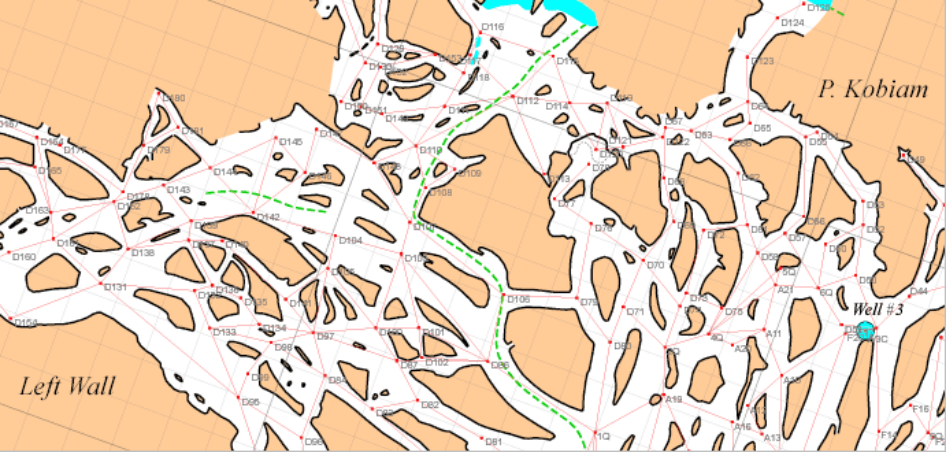
**Roundtripping SVG Maps** **93**

Illustrator Limitations and Workarounds
Adjustment of Brushed Strokes
Converting Groups to Layers in Illustrator
Instructions for Users of Other Drawing Programs

##### **5.1 Roundtripping Overview**

SVG roundtripping is the back and forth exchange of SVG-formatted data between two processing programs, the
goal being to produce a more complete SVG document. In the version of it described here, an illustration program contributes data based largely on field book sketches, while Walls contributes data based on field book
numbers. The result of this roundabout sharing of data, at least in principle, is a complete cave map that's always up to date.

The Walls implementation borrows ideas from both an article of mine and a paper presented at Siggraph '92 by
Thaddeus Beier, _Feature Based Image Metamorphosis._ In Beier's paper, a technique is presented for computing
transformations between raster images in an animation. The method deviates from traditional mesh warping in
that it uses a small, optimally chosen "skeleton" of superimposed line segments instead of a mesh. While the
math is similar in some respects, we will be morphing vector art in SVGs as opposed to raster images. Also, survey lines -- or rather their plan projections -- will serve as the skeleton.

The above split image, a Walls2D screen capture, shows the result of changing the azimuth and length of one
shot in a surveyed loop, recompiling the project, and creating an updated SVG (right frame) based on an original
drawing, or source SVG (left frame). Coordinates will often change this much, but a local reshaping this extreme
will only arise when a blunder is being corrected. Note that lengthening the vector stretched the left passage's
walls and floor details longitudinally while leaving its width almost unchanged. That's due to the warping algorithm Walls uses, one which tends to preserve a feature's _absolute_ perpendicular distance to a vector and its
_proportional_ distance along the vector's length. The outline of the right passage was affected very little by the
correction, even though its location changed significantly. This is characteristic of a morphing technique that's
feature-based rather than mesh-based.

This example also shows the effect of placing objects in special layers so that only their locations will change,
not necessarily their shapes and orientations. The clay symbols, for example, became less dense but remained
horizontal due to their layer placement. Also, _grouped_ sets of features in this layer, including the cross section
group and the ceiling height symbols, were treated as single objects and not distorted or broken apart. Finally,
the example illustrates a type of feature that's not always handled particularly well. The line segments indicating
the position of the cross section were properly translated as a group, but they also should have been rotated
slightly. Since there is currently no provision for this type of adjustment, a one-time manual repair is needed, as
will sometimes be the case near a survey blunder. For another example with more explanation see Adjustment of
Brushed Strokes.

_Copyright © 2013 by David McKenzie_

**94** **Walls Project Editor**

The adjustment of artwork stored as SVG is a complex operation, but the details are handled automatically if the
document follows some layering conventions. (See SVG Layer Definitions.) Features in _sym_ layers, like symbols,
text, and cross sections, will track the survey, but they will be translated and scaled, not reshaped, and will
maintain their page-relative orientation. Features in _shp_ layers, on the other hand, can also be of the non-reshapable kind, but their _north-relative_ orientation is maintained. Furthermore, path-like features in shape layers can
be morphed (warped in a smooth or continuous fashion) to fit the updated positions of nearby survey vectors. In
a passage wall outline, for example, the final position of each path control point depends _individually_ on a
weighted average of the shifts in the N closest survey vectors. (Certain weighting parameters, like N and drop-off
of a vector's influence with distance can be specified in an Advanced Settings dialog.) A feature adjustment,
therefore, requires a method for finding the 1st, 2nd, ..., and Nth vector closest to each symbol and path control
point. A map with thousands of survey vectors might have control points numbering in the hundreds of thousands, so the method obviously involves a lot of computation. The "nearest-vector" algorithm in Walls is efficient,
however, requiring more work than a least-squares adjustment but still taking only seconds to execute on a modern desktop or notebook computer.

**How It Works in Practice**
It's easy to get the process started. After setting up a map view in Walls, as you would when preparing to print,
you instead export an SVG file. The result is similar to a metafile export except that survey vectors have identifying tags (XML id's) that the illustration program leaves intact during import-export operations. (It has to if it qualifies as an SVG editor.) Also, the map is usually georeferenced so that UTM coordinates are displayed in Walls2D, an integrated SVG viewer.

In the initial data export from Walls, some specially-named, empty graphics layers are created in addition to the
usual survey lines and symbols. The file is then opened in Adobe Illustrator (or theoretically another drawing program), where the user places artwork inside those layers. Such artwork might include cave walls, floor and ceiling details, scale, north arrow, and annotation -- all in whichever style the user prefers. Subsequently, whenever
this decorated map is ready for use by Walls, either for updating or for generating new map views, it's saved as
a source SVG.

At appropriate times thereafter, a different kind of SVG export can be invoked from Walls: one that creates a new
SVG file while merging artwork from one or two existing source SVGs. The merged artwork is also transformed to
fit survey lines that may have changed in a least-squares adjustment. The new SVG, possibly with extended survey lines, can in turn serve as a source SVG for either Illustrator or Walls. It's like Illustrator's version qualitywise, except that it now accurately reflects the current state of the survey. If the cave was extended with new surveys, the exported file can be brought into Illustrator and the process repeated. An important characteristic of
SVG roundtripping is that image quality doesn't degrade as it often does when a raster image undergoes successive conversions -- the repeated replacement of a source file with an output file of an earlier process.

Whether or not it's meant to be used as a source for new exports, an SVG cave map (last written by either Walls
or Illustrator) can be viewed and printed from within Walls, distributed with Walls2D as a standalone interactive
map, or posted on the Internet as part of a Web application. It can even be revised with a text editor (certain
styles changed, elements added or removed, etc.) since SVG is standard XML text.

**Current Limitations**
Profile views currently can't be exported as SVG, a restriction that will soon be removed. One reason it exists
now is that additional coding is required to insure that specific profile orientations are maintained in merge operations. Also, this capability will benefit from the implementation of vertical clipping planes, another planned feature. Without the latter, too many irrelevant vectors would likely project onto the plane of the profile, thereby
complicating a feature adjustment.

For a similar reason, plan views of caves with a lot of vertical complexity will be more difficult to deal with than
plan views of a largely horizontal cave. For example, a lower level survey shouldn't influence the artwork associated with surveys located far above it. In practice we can ignore this issue for many caves. The inclusion of unrealistically weighted vectors will often have no noticeable effect on the adjustment of artwork; however, when
the relative positions of upper and lower survey lines change significantly, some unwanted distortion can occur
near crossover points. In that case it should be relatively easy for the Illustrator user to touch up those areas,
thereby creating a new SVG source file that likely won't require the same repairs again. Another option, of
course, is to work with different levels of the cave separately and combine them later when necessary. Finally,
you may have vector lines (e.g., surface surveys) you want to include on the map but whose influence on surrounding map features you want to remove completely. You can do this by flagging a vector's representation

_Copyright © 2013 by David McKenzie_

**Roundtripping SVG Maps** **95**

while in Illustrator or by editing the SVG text. (For details, see the w2d Vectors layer description under SVG
Layer Definitions.)

A longer-term goal is to support SVG roundtripping with drawing programs other than Adobe Illustrator. Perhaps
because the format is necessarily complex, no other popular program seems to support it quite well enough for
our purposes. That means it should at least be able to roundtrip its own SVG files and preserve the XML id's that
label vectors. (Tee Using Other Drawing Programs.) The good news is that interest in SVG seems to be increasing steadily, especially in the open source community and among GIS users and developers.

##### **5.2 SVG Export Dialog**

The procedure for exporting a map as a Scalable Vector Graphics (SVG) file is nearly the same as for printing a
map. You first insure that the exact map scale, view, and display attributes (sizes and colors), are set the way
you want. Then, instead of selecting File | Print map, you select **File | Export map as SVG file** -- or just click a
toolbar icon:

The left icon invokes the SVG Export dialog described below. The right icon launches the SVG
viewer, Walls2D, with a previously generated SVG.

The dialog can be opened whenever a compiled project branch is being reviewed in plan mode -- that is, when
any page of the Review dialog is active and the current view (as would be seen on the Map page's preview map)
is a plan rather than a profile. The SVG export of profile views is not supported in this release of Walls.

Shown above are the dialog settings that would produce an SVG suitable for roundtripping with Adobe Illustrator
v10-CS6. (See Roundtripping SVG Maps for an overview of this capability.) In this example, the exported SVG
would have not only survey features, but also artwork merged from two existing source SVG files. Furthermore, it
would contain the metadata necessary for it, in turn, to serve as a source SVG in future export operations. Altern

_Copyright © 2013 by David McKenzie_

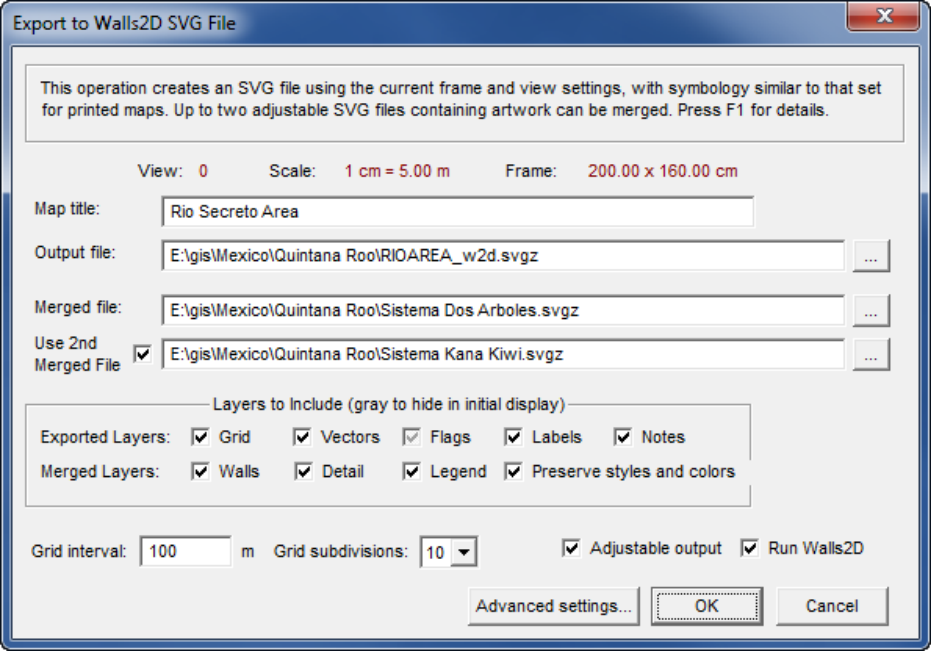
**96** **Walls Project Editor**

atively, you can produce simpler kinds of SVGs, either raw exports containing survey features alone (no merged
artwork) or complete SVG maps (no metadata) intended for efficient viewing and printing.

Your choices for most options in this dialog are saved in the compiled item's NTA workfile and will be recalled for
each export operation involving that item. There is also a group of less frequently changed settings that are remembered between program invocations. These are accessed via the Advanced Settings button.

**Map Title**    - Optional text that will be stored as part of the exported SVG's metadata, allowing Walls2D and other
software to retrieve a map title. The text is initialized to the Title property of the project item being reviewed (See
Properties: General page). The map title, along with the scale, orientation, view dimensions, and center coordinates, will form a string of text in the map frame's lower left corner. Although the text string can serve as a legend
substitute, its main purpose is to provide georeferencing information and its visibility can be controlled. For details, see the w2d_Ref layer under SVG Layer Descriptions.

**Output file**    - The SVG file to be written. The default file location is the project folder. The file's default name is
the reviewed item's workfile base name with "_w2d.svgz" appended. You can change the name, but using the
w2d suffix makes the file easily recognizable as an SVG generated by Walls.

Note that there are two types of SVG files: uncompressed with extension ".svg" and compressed with extension
".svgz". The program can work with either kind, both as output files and as merged files (see below). The advantage of using uncompressed SVGs is that they can be directly viewed and modified with an ordinary text editor,
[though preferably with an xml-aware editor such as the excellent Notepad++. The disadvantage is that an un-](http://notepad-plus-plus.org/)
compressed SVG can be up to four times larger that its compressed version. Also, the processing time overhead
due to compression is insignificant. Therefore, the program assumes you'll be using compressed SVGs when it
constructs default file names. When you want an uncompressed output file, simply delete the trailing z from the
name. Walls2D will open either kind and also provide options to view the SVG as text and save it compressed or
uncompressed under a new name.

More often than not you'll be accepting or entering a name that matches that of an existing file. In such cases
the export function first examines the file. Only if it's found to be an _unmodified_ Walls export will it be overwritten
without warning. An unmodified Walls SVG is recognized by the presence of a specific XML processing instruction: <?walls updated="no" ... ?>. This is never present in an SVG saved from Illustrator.

**Merged file**    - An existing SVG source file, if one is being used. You are assumed to be using one if at least one
control in the **Merged Layers** section has a check mark (see below). When the dialog opens, this field is initialized to the pathname of the first SVG that's attached, at any sublevel, to the project branch being reviewed. It
must also have an assigned type of Other. If no SVG file is attached, the default file name is the item's workfile
base name with suffix __mrg.svgz_ appended. The default location is the project folder. The merged file doesn't
have to be a project tree item.To be successfully merged, an SVG must satisfy two basic requirements:

   - It must contain the metadata that was produced by a Walls export operation -- one in which the **Adjustable**
**output** option was enabled (see below). The file may or may not have been routed through another program
like Illustrator, which necessarily preserves the metadata while possibly adding new content.

   - The originally exported survey vectors (elements in the SVG file's _w2d Vectors_ layer) should be a subset of
the compiled survey data being exported. That's because the adjustment of artwork depends on knowing
how those particular vectors shifted position. This is not, however, a strict requirement for a successful export.

_Copyright © 2013 by David McKenzie_

**Roundtripping SVG Maps** **97**

At the end of the export operation a dialog box (see above) will appear if the SVG source file contained identifiers
for vectors not in the database and were therefore ignored. The operation will have aborted, however, if the count
of missing vectors had exceeded 500. In either case the orphaned vectors are optionally listed in a log file so
they can be reviewed. For example, you may have inadvertently compiled only part of the survey represented in
the SVG. Or a few vectors could have become obsolete due to data corrections, in which case relying on the
shifts in other vectors for artwork adjustment and touching up manually is often adequate for a successful
roundtrip. In these situations there's no longer a need to delete vectors by editing the SVG source file. (Editing it
might be desirable if a vector's endpoint station had simply been renamed without it's position having changed
as a result.)

It's not required that the orientation, scale, or frame dimensions of the source SVG match those of the exported
SVG. Nor must the coordinate units, feet or meters, be the same. When displaying coordinates, Walls2D will use
the review units you had set at the time of export. Although the zero references (or geodetic datums) can be different, this isn't recommended since it would cause misplacement on the page of a merged legend layer (world
coordinates unchanged). For the same reason, don't change the _type_ of coordinate system. If the source SVG is
UTM grid-relative then the compiled data you're exporting should also be UTM grid-relative.

**Use 2nd Merged File**     - A recent program enhancement is support for an optional second merged SVG containing artwork. This makes it easy to combine, as needed, the drawings for segregated regions in an extensive cave
system. For such projects it helps when most of the Illustrator work can be done using moderately-sized files
covering specific regions. Trying to combine adjustable Illustrator documents manually while maintaining the correct layer arrangement would be very difficult and prone to errors.

The format requirements for the second file are the same as for the first. Their scales and orientations, however,
don't need to be the same. There are a few differences in the processing of the two files. Certain styles. say for
station markers when they are inherited, are taken only from the first file. When initializing this dialog, the program fills the two pathname boxes with the first two SVG files that it finds _attached_ to the project tree beneath
the compiled branch. (Their _Type_ should be _Other_ .)

**Exported Layers**     - Optional layers in the exported SVG that represent objects in the survey data. Those are the
same objects whose visibility you can control on displayed and printed maps in Walls. Data in detached
branches of the Segment tree will not be exported. Note that the check boxes are tri-state. A bold check mark
specifies that the layer will not only be present, but also visible when the file is initially loaded into Walls2D (or
your browser). A gray check mark specifies that the layer will initially be hidden but is subject to being toggled
on. When the **Adjustable output** option is checked, the Vector layer is automatically included, and it's recommended you also include the other layers (bold or gray check mark). When you're not inheriting color and size
attributes from a merged file, it's important that you first set these appropriately for the exported layers in the
same way you would for a printed map. Inheriting attributes is an option labeled **Preserve styles and colors**
(see below).

_Copyright © 2013 by David McKenzie_

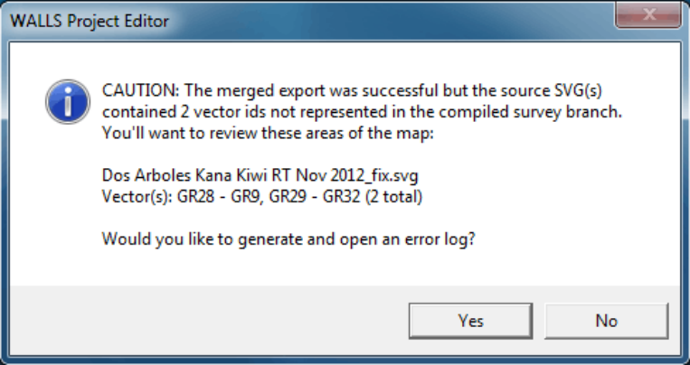
**98** **Walls Project Editor**

**Merged Layers**     - Layers in the specified **Merged file** to include in the exported file. Walls will not only include
those layers, but also adjust their content when necessary to fit revised surveys or a new map view. For a description of the Walls, Detail, and Legend layers, and the type of graphics they're expected to contain, see SVG
Layer Descriptions. The check boxes for the Walls and Detail layers are tri-state and have the same effect described above for the Exported Layers. Users of Walls2D can control the visibility of each layer via a corresponding toolbar button. You must clear all three check boxes in this section to insure that no merge operation is attempted.

**Preserve styles and colors -** When this option is enabled, the color and size attributes of survey features are
inherited from layers in the merged file as opposed to taking them from current project settings. These include
the background and passage floor colors, vector line colors, label and note type sizes, and so forth. This is the
usual choice since it frees us from having to worry about Walls display options when creating adjusted, possibly
zoomed views of an existing SVG source file. Turning off this option allows you to change the appearance of certain features when it's necessary. For a list of what specifically can be inherited, see SVG Layer Definitions

**Grid interval** and **Grid subdivisions**      - The interval setting is the distance in meters between major grid lines in
the optional square grid (one of the Exported layers). When the SVG Export dialog opens, this interval is the
same as what's set for "East interval" in the Grid Intervals dialog accessed via the Map page. Minor grid lines will
also be included if you specify a number greater than one for the number of grid subdivisions. The grid is always
aligned with grid north or true north, depending on whether or not the reviewed item was compiled with "UTM
grid-relative" enabled.

**Adjustable output**     - This option must be enabled in cases where the output is destined for roundtripping -- that
is, if the exported SVG is to serve as the **Merged file** in future export operations, possibly after more artwork is
added to it outside of Walls. This insures that certain elements (vectors, labels, and notes) are stored with
metadata linking them to the survey database. In a _non-merged_ export that's adjustable, you might be establishing for the first time the view, scale, and frame dimensions you've chosen for a full-sized printed map -- usually a
scale in the range 1 in = 20-50 ft that's suitable for showing maximum detail. In a _merged_ export that's adjustable, you will likely have set the view parameters to match or at least cover those of the source SVG, the file
you're in effect updating. In any case, it's expected that adjustable SVGs will rarely be zoomed views of a larger
map, a situation that might cause some elements to be visible outside the frame. (See Note for Illustrator Users.)

Uncheck the Adjustable option for all other cases, such as when creating a "final product" that's most efficient
for printing and viewing interactively -- perhaps a zoomed view of a larger source SVG. Content outside the
frame is perfectly clipped in this case. The file will be moderately smaller in size since it won't have the metadata
needed by Walls for an adjustment.

**Run Walls2D**     - Mark this check box to launch the SVG viewer, Walls2D.exe, immediately after a successful export operation. (Alternatively, you can use the toolbar button labeled "2D".) You can then explore the SVG image
by zooming, panning, and toggling layer visibility. If the check box is _not_ marked, statistics will instead be displayed signaling success of the operation. These include the total path lengths for features in the Walls and Detail layers. If a feature adjustment was necessary, the maximum shift detected in a vector endpoint's position (the
condition that triggered the adjustment) is reported.

**Advanced Settings**     - Opens a dialog with options that pertain mostly to feature adjustment and the processing
of **Merge file** layers. See SVG Advanced Settings.

##### **5.3 SVG Advanced Settings**

This dialog is invoked by a button on the SVG Export dialog. The choices you make here are not project specific,
but will be used for all SVG exports from Walls until the next time they are changed as part of the program's profile. Note that there is a **Load Defaults** button which resets the controls to values that are currently "hard coded"
into Walls. Those particular default settings have worked well for some test cases, but they may not be the ones
recommended in future Walls releases. (Which is to say more testing is needed.)

_Copyright © 2013 by David McKenzie_

**Roundtripping SVG Maps** **99**

The settings near the bottom of the dialog will be described first since they are the ones you're most likely to
change. The controls in the top section, "Adjustment of Merged Features", won't be used routinely, but interested users may want to experiment with them.

**Preserve positions of labels and notes**
The positions of station labels are determined, at least initially, by offsets specified in the Printer: Map format Options dialog. The settings in that dialog for overlap avoidance, however, are ignored; all labels and notes are normally written to the SVG, leaving you with an opportunity to manually adjust their positions if necessary. Enabling this option causes the _individual_ station-relative positions of both labels and notes to be inherited from a
merged SVG if it has content in those layers -- possibly items you've repositioned using Illustrator or another editor. A station label can also be deleted so that it doesn't reappear in a new export that merges the modified
SVG. Notes are handled a bit differently. Whether or not a particular note exists in an exported SVG is always
determined by Walls settings. (Notes can be omitted for stations with no flags or with only hidden flags -- see
Flag and Marker Symbols.) A note won't replace a label as it will on a printed map. When its position isn't inherited, the note is placed above and to the right of the station marker at offsets that depend on type size.

**Decimal places in exported SVG file**
Most numeric values in the SVG text file, such as page coordinates for vectors, symbols, and artwork, will be
written out with this number of places after the decimal point. The units are points (1/72 inches), the same units
used in Adobe Illustrator's exported SVG files. (See anote about this.) At normal scales, the quality of rendered
artwork rather than geographic accuracy is the main consideration with this setting. File size is another consideration. Adobe's documentation suggests that 3 is the "best choice for most files."

**Include LRUD bars when vectors are exported**
When this box is checked, LRUD cross-section bars are written to a sublayer named "w2d Lruds" in the SVG file
-- see SVG Layer Definitions. The goal is to aid the drafting of wall outlines and cross sections (see below). In
Walls2D the bars and vector lines are toggled on and off as a group.

**Draw cross section boxes for C-flagged LRUDs**
With this option set, a rectangular box will be aligned with and drawn next to the cross-section bar whenever the
"C" tag was used in the LRUD specification -- see LRUD Passage Dimensions.

**Adjustment of Merged Features**
Specified in this section of the dialog are the _weighting parameters_ used by Walls when adjusting artwork to conform to an evolving database of survey data.

_Copyright © 2013 by David McKenzie_

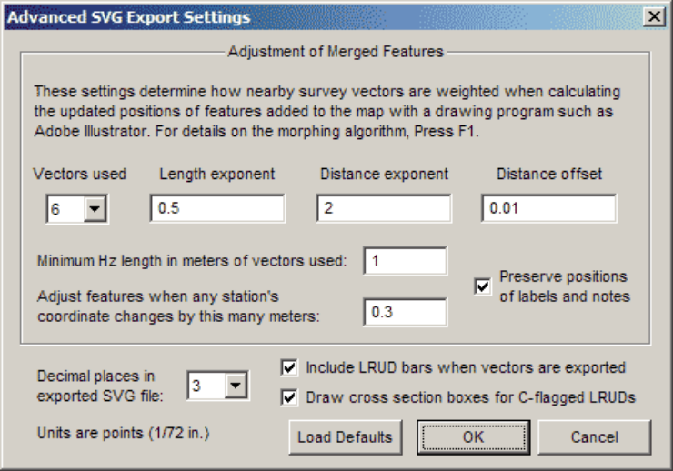
**100** **Walls Project Editor**

**Vectors used**    - When morphing a feature defined by a path object -- for example, a passage wall outline -Walls examines each individual control point to determine the set of N survey vectors closest to it. The program
then computes a new control point position by looking to see how those vectors have changed. The size, N, of
the set is 6 by default, but you can specify any number between 1 and 10. Generally, a larger N will produce a
smoother morphed result.

In determining how much and in which direction to shift a control point, the vectors in the "closest set" don't all
have the same degree of influence. The shift in a control point's position is actually computed as a _weighted_ average of the shifts that would be dictated by the vectors individually. Note that the shift dictated by a vector acting alone preserves the point's perpendicular distance to the vector and also it's proportional distance along the
vector's length. The formula used for computing a vector's weight is

where _length_ is the vector's horizontal length and _distance_ is the horizontal distance between the vector (nearest
point along its length) and the control point. The remaining terms in the formula are specified with the next three
dialog settings.

**Length exponent**    - Parameter _**P**_ specifies to what degree a vector's influence (or weight) increases with its horizontal length. If _**P**_ is zero, a vector's length is irrelevant provided it's no smaller than a specified minimum (see
below). The default value for _**P**_ is currently 0.5.

**Distance exponent**    - Parameter _**B**_ specifies to what degree a vector's influence drops off with its distance from
the control point. This is perhaps the most important parameter to consider. The default setting is 2, but other
values, say between 1.5 and 3, might be appropriate. A small value (coupled with a large N) would give a
smoother result, but it could also assign too much weight to vectors completely "out of view" of the survey team
member who sketched the cave feature. Conversely, a value too large can produce an occasional jump, or discontinuity, in a path that was originally smooth. This happens when the closest vector sets for two adjacent control points are significantly different in the way they have changed -- a "bad" vector present in one but not the
other.

**Distance offset**    - When the control point's distance to a vector is zero (or very close to zero) the vector's weight
should be very large but certainly not infinite. Also, a large weight due to a near-zero distance can cause path
discontinuities near where vectors (possibly more than one) and paths cross each other. A positive value entered
here will help prevent this. The default offset is 0.01 (one centimeter).

**Minimum Hz length in meters of vectors used**    - Vectors with horizontal lengths smaller than this value will be
ignored in all adjustment calculations; they will not take up membership slots in the set of N vectors closest to a
control point. Ideally, whether or not a survey vector is significant should depend on where it's located, say in a
big room as opposed to a narrow crawlway. Since the program can't distinguish between such environments, a
compromise minimum length has to be chosen. The default value is one meter.

I've found that changes to the weighting parameters often have little noticeable effect on a map's appearance -particularly when a high quality survey evolves through least-squares adjustments, a process that tends to
smooth out local discrepancies between old and new data. Furthermore, the common situations where they
might matter the most can be dealt with by other means. One such case is when major survey blunders are being corrected. Another is when passage detail exists far away from any survey shots, as in sketched passages
that haven't actually been surveyed. In the first case, a manual touch-up in the region of the blunder is normally
all that's needed. In the second case, inserting a few dummy shots (floated vectors) in the data and drawing
should smooth things out nicely. The weighting parameters can usually be left at their defaults or at whatever
you believe works best for a particular cave.

**Adjust features when any station's coordinate changes...**    - A feature adjustment is considered unnecessary if
the maximum difference between a vector's endpoint coordinate in the merged file and the corresponding coordinate in the database is less than this distance in meters. If an adjustment is required, the maximum distance
actually found is reported when the operation completes (assuming you haven't chosen to launch Walls2D upon
completion). The default maximum distance is 0.3 meters. This feature significantly speeds up a common operation: launching Walls2D with different views of an existing map.

_Copyright © 2013 by David McKenzie_

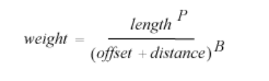
**Roundtripping SVG Maps** **101**

**Load Defaults**      - The choices you make in this dialog, if it's closed with "OK", are remembered the next time you
export an SVG. Click this button to temporarily discard those choices and reinitialize the fields with default settings. (The latter may not be optimal and will likely change in future program releases.) If you then decide you
don't like the defaults, "Cancel" the dialog to keep your last saved settings.

##### **5.4 SVG Layer Definitions**

This topic should be reviewed by anyone who wants to use an external SVG editor, such as Adobe Illustrator, to
decorate an exported SVG with artwork, then have that artwork incorporated in future exports -- _merged_ exports
-- from Walls. The details presented here aren't needed to simply export SVGs as you would metafiles, to view
and print SVGs with Walls2D, or to perform merged exports using source SVGs decorated by someone else.

The SVG export function places graphical content into specially named layers. The names are preserved when
the SVG file is read and rewritten by Illustrator. (Note that a layer name, like _w2d Walls_, will appear with an underline ("_") instead of a space character in the SVG text file. You should avoid the underline character when
manually entering layer or group names while in Illustrator.) During a merged export operation, when Walls
reads back an SVG decorated with artwork, the layer names determine how the new content is to be treated
when it's combined with revised survey data. Content outside of these layers is not automatically included in the
new SVG that's written. This layer-specific treatment is described below and also in Adjustment of Brushed
Strokes.

**Required Layers for Roundtripping**
As will be explained in more detail below, the particular _w2d_ layer where artwork is found will determine how
Walls adjusts it. For example, when you export a new merged SVG, it might have both a new scale and a different north arrow direction. The reason you would place passage-defining rocks and large boulders within a _shp_
sublayer instead of a _sym_ sublayer is to insure that their _north-relative_ orientations are preserved as much as
possible. The adjustment will scale, translate, and rotate the objects as required. Also, unless the objects are
enclosed in an _unnamed_ group within the _shp_ layer, their paths will also be _reshaped_, with each control point being shifted separately. By contrast, all _sym_ objects, including paths, are adjusted while preserving their _page-rel-_
_ative_ orientation. _Sym_ objects are never reshaped, just translated and scaled. Also, _sym_ objects inside an unnamed group maintain their relative positions -- exactly what you would want for objects making up a cross section or ceiling height symbol.

**Important Note:** Layers and groups are different kinds of objects in Illustrator, with groups shown in light gray
rather than dark gray in the layers palette (see image below). The SVG format, however, makes no distinction
between layers and groups. As a result, the special SVG layers that Walls creates and operates on are initially
interpreted by Illustrator as groups. Since targeting a group with new artwork can be less convenient than targeting a layer, you'll probably want to convert the groups you intend to work with into Illustrator layers. This can be
done quickly by running a script immediately after opening the file. (For details, see Converting Groups to Layers
in Illustrator.) In this topic, all of the w2d groups and layers will be referred to as "layers."

_Copyright © 2013 by David McKenzie_

**102** **Walls Project Editor**

When an SVG freshly exported from Walls is first opened in Illustrator, the Layers palette will show a sequence of layers and groups reflecting the selections
you made in the SVG Export dialog. The image at left shows the palette _after_ the
script was run that converts eight of the w2d groups to layers.

Although the layers are individually described below under Layer Descriptions,
some general properties are worth noting first. While most layers are optional,
their listing order in the Layers palette is important and should be maintained as
you add artwork. Objects appearing higher in the list will be rendered after the
objects beneath them are rendered, possibly obscuring them. (The listing order
is reversed in the SVG file itself, where listing order matches rendering order.)

**Layers for Interactive Access -** The _w2d Walls_, _w2d Detail_, _w2d Survey_, _w2d_
_Labels_, _w2d Flags_, _w2d Notes_, and _w2d Grid_ layers are recognized by the integrated SVG viewer, Walls2D, where their display can be toggled on and off. This
may affect your choice of what to place in each layer, either when exporting from
Walls or when adding artwork.

**Merged Layers -** When an adjustable SVG file without merged content is exported from Walls, the _w2d Legend_, _w2d Walls_, _w2d Detail_, and _w2d Mask_ layers
are present but empty. It is within those four layers that you are expected to add
artwork. (Note that these are "unlocked" layers in the example at left.) The _w2d_
_Walls_ and _w2d Detail_ layers each consist of two sublayers: one with a name
ending in "sym" and another with a name ending in "shp". The _sym_ layers will
contain elements, such as text and symbols, that must maintain their shape and
_page-relative_ orientation during an adjustment by Walls. By contrast, the _shp_
layers and the _w2d Mask_ layer will contain _paths_, like cave wall outlines, whose
control points must be adjusted individually. The _shp_ layers can also contain
non-morphable objects which must maintain their shape and _north-relative_ orientation. Finally, the _w2d Legend_ layer will be subject only to translation and
scaling as a group. In any merged layer but the legend layer, the locations of
objects will individually track the positions of nearby survey vectors.

In each of the merged layers you are free to define new sublayers or groups with
names of your choosing. (If a group is named, the name must be unique within
the document.) Their entire contents, including style attributes, will be preserved
during roundtripping with Walls. The shapes and positions of contained objects,
however, will be subject to adjustment if the survey data, map view, or scale
changes. The specific features of the merged layers will be described below.

**Inheriting Styles from Non-merged Layers**
The remaining layers (survey vectors, labels, flags, etc.) are always regenerated from project data during an export operation; you'll normally leave them untouched when adding artwork. Note, however, that there is an SVG
Export dialog option named **Preserve styles and colors** . If you leave that option enabled, the program will retrieve certain style attributes from layers in the merged SVG as opposed to taking them from current project settings. Those attributes could have originated from an earlier Walls export, from edits in Illustrator, of from manually editing the SVG as text. Here are the specific attributes inherited from the non-merged layers when the option is enabled:

**w2d Frame** **-** Ratio of outline stroke width to total frame width.
**w2d Grid** **-** Color and stroke widths of major and minor grid lines.
**w2d Notes**      - Typeface, size, and color as obtained from first-encountered note (first in SVG).
**w2d Labels** **-** Typeface, size, and color as obtained from first-encountered label.
**w2d Flags** **-** All attributes of symbols assigned to named station flags including instance sizes.
**w2d Markers**      - Station marker symbol and size as obtained from first-encountered instance.
**w2d Vectors**      - Colors of all vectors and stroke width as obtained from first-encountered vector.
**w2d Ref**      - Font point size of map title and georeference information.
**w2d Background**     - Background color (or passage color if there is a merged _w2d Mask_ layer).

_Copyright © 2013 by David McKenzie_

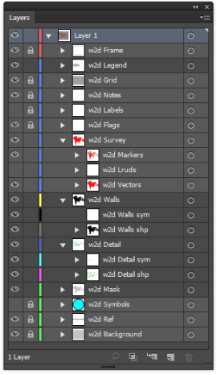
**Roundtripping SVG Maps** **103**

**Required Layers in the Merged SVG**
Layers in the above list that are present in a merged SVG are examined only for their style attributes and for information needed when adjusting artwork. Only _w2d Ref_ and _w2d Vectors_ are required to be present. (They are
needed to correlate the merge file's contents with the project database.) In both merged and non-merged exports, the elements in these nine layers are rebuilt each time based on export options and the current state of
the compiled project. The option to inherit styles, however, frees us from having to worry about display settings
during merged exports that create adjusted, possibly zoomed views of an existing SVG source file. This will be a
very common operation.

**Size Scaling**
When a new view of an existing SVG map is generated, any size attributes inherited from the merged SVG are
actually scaled so that the apparent sizes (or thicknesses) of objects in world coordinate units remain the same.
For example, a station marker that appears 30 cm wide in the merged SVG will also appear that large in the new
SVG even though the map scales may be different. Likewise, the stroke thicknesses of passage outlines and
other drawn objects in the merged layers will remain in constant proportion to the map's scale bar. The effect is
the same as zooming interactively within the Walls2D viewer. Whenever this is not the effect you want for the
non-merged layers, you should uncheck **Preserve styles and colors** and set up the display attributes (font
sizes, background color, etc.) in Walls prior to exporting. As for an initial non-merged export, this requires that
you consider carefully the Scale & Position dialog settings for the project item being reviewed and also the
scales at which the SVG is likely to be viewed or printed. Remember that SVG images are rescalable and can be
made interactive. Even if the SVG is too large to print in full detail, high-resolution, printable images can be
made from smaller portions of it.

**Controlling Overlap of Labels and Notes**
Finally, there is another Advanced SVG Export option, "Preserve Visibility and Positions of Labels", that causes
station-relative offsets of both notes and labels to be inherited from the merged SVG. There is no automatic overlap control in SVG map labeling, but this feature allows you to manually adjust, while in Illustrator or another editor, the positions of individual elements in these layers to avoid severe cases of clutter. Specific station labels
(but not notes) can be deleted as well. This means that if a vector endpoint exists in the merged SVG, but is
missing a label, it will also not have one in the new SVG.

**Layer Descriptions**
The SVG document elements recognized by Walls are described below in the order they would appear in Illustrator's Layer window. This order is opposite the rendering order, or order of appearance within the SVG file itself. The names in bold type are the XML group id's that any SVG editor must preserve. Unless they are on
grayed top-level layers, Illustrator sees these as _group_ names rather than true sublayer names. When Illustrator
reads back an SVG, the distinction between sublayers and groups is lost for all but the top-most layer or layers.
This is easily fixed for Walls-exported SVGs, however. (See Converting Groups to Layers.)

**w2d Frame -** Consists only of a non-filled rectangle with black outline surrounding the view frame. The frame dimensions are always determined by Walls settings for the compiled branch at the time of export (Scale & Positiondialog). The outline stroke width, when not inherited from a source SVG, is taken from the frame's "Line
width" setting in the Printer: Map format Options dialog. (A zero thickness omits the frame.) When it _is_ inherited,
it's actually the ratio of stroke width to frame width that's preserved. This causes the outline to look much the
same as it did in the merged file when the new SVG is viewed full-screen.

**w2d Legend**     - A layer that's always present in an adjustable SVG export, but empty unless a merged SVG has
content in this layer. In the latter case, the layer will be duplicated in the merged export, including all symbols
and their instances. You may want to use Illustrator to create at least a map title, scale, and north arrow in the legend layer. At least one text element is required if the layer is used at all. In a merged export, the entire layer will
be translated and scaled so that the first-rendered text element has the same world (not page) coordinates. Unless a new plan view is being established (survey rotated), the world coordinates will in fact be unchanged for
all elements. An exported zoomed view might contain no legend or just a partial legend, even though you've
chosen to include it. If the map's datum or zero reference in the merged file differs from that in the compiled
data, the legend might be shifted entirely out of view. (In an adjustable SVG export the entire contents of the
_w2d Legend_ layer is included, even if outside the frame.) Also, if you change the plan orientation, any north arrow
in the legend layer will need to be manually revised in Illustrator. Note that the _w2d Ref_ layer (described below)
will always contain the map title and georeferencing information.

_Copyright © 2013 by David McKenzie_

**104** **Walls Project Editor**

As with earlier Walls releases, the _w2d Legend_ layer can optionally be positioned immediately above the _w2d_
_Walls_ layer. Placing it above _w2d Grid_, as described here, can result in more attractive maps -- especially if you
use legend boxes (possibly with drop shadows). For an example of this, see the Tutorial Project sample.

**w2d Grid**    - Consists of horizontal and vertical lines of an optional 2-level square grid. The major grid interval in
meters and the number of subintervals are always specified in the SVG export dialog; they are never inherited
from a source SVG. The grid's style, however, can be inherited. When not inherited, the stroke width of minor
grid lines is the same as that used for survey vectors (0.03 times label type size) and the width of major grid lines
is five times as large. The grid color, when not inherited, is the one specified on the Segments page of the
Review dialog. The grid lines are always assigned an opacity value of 0.5, which makes them fainter and allows
objects beneath them to show through.

**w2d Notes**    - An optional layer consisting of notes (text strings) that have been assigned to stations in Walls. If
notes are exported at all, a note is omitted only when the associated station is unflagged (or with only hidden
flags) and the option "Hide notes for unflagged stations" in the Flag and Marker Symbols dialog is checked.
When not inherited, note color is specified as usual on the Segments page's control panel and font size is specified in the Printer: Map format Options dialog. The typeface, however, is initially a Times New Roman italic font,
but like the other attributes it can be inherited. A note, by default, is positioned above-right of the station marker
to avoid obscuring the station's label, which is normally below-right. Positions of individual notes can be inherited
as described above (Controlling Overlap of Labels and Notes).

**w2d Labels**    - An optional layer consisting of text elements representing station names. Up to eight characters of
the name prefix, with colon separator, is included whenever the option to show prefixes is enabled in the Printer:
Map format Options dialog. This dialog is also be used to control the initial font size and station-relative offsets.
Text color is specified on the Segments page's control panel. The initial typeface is Arial but this, like all font
properties, can be inherited from a merged SVG. Text overlap can be controlled manually as described above
under Controlling Overlap of Labels and Notes. Unlike notes, labels deleted from a merged SVG will not be reintroduced in the new SVG when the preserve visibility option is selected. For initial SVG exports, label font size
should be chosen carefully since it is also used to calculate an initial marker size and stroke width for vectors.
For map scales of around 1:360 (1"= 30 ft), I would suggest a font size of about five points.

**w2d Flags**    - An optional layer of symbols centered at stations that have been assigned the corresponding flag
names in Walls. A flag symbol's initial style and appearance (visible or hidden) is controlled as usual from within
the Flag and Marker Symbols dialog. In a merged export, both the symbol definitions and the sizes of their instances can be inherited, although instances for a particular named symbol will have the same size (the size of
the first encountered instance in the source SVG). When an exported SVG is brought into Illustrator, the Symbol
window will show the symbols used in this layer along with the station marker symbol and symbols used in other
layers. Their names will be the actual flag names prefixed with an underline. Assigning the "transparent" style to
a flag symbol in Walls produces an SVG symbol with "fill-opacity" 0.5. The effect is that station markers would
be visible beneath assigned flags.

**w2d Survey**    - The parent layer of _w2d Markers_ and _w2d Vectors_ . Those sublayers are grouped to allow toggling
of Survey visibility in Walls2D via a single control. They comprise the entire content of this layer.

**w2d Markers**     - A sublayer of _w2d Survey_ containing instances of a station marker symbol named "_m". Both
the symbol definition and the sizes of its instances are inheritable from the first-encountered marker instance
in a merged SVG. Otherwise the symbol is defined as a solid square with a color that's specified in the Flag
and Marker Symbols dialog. When not inherited, the width of a marker instance is 0.133 times the point size
of a station label. A marker layer is created each time vectors are exported, but a merged SVG doesn't have
to have one.

**w2d Lruds**     - A sublayer of _w2d Survey_ that's present when you've checked the box labeled "Include LRUD
bars when vectors are exported" in the SVG Advanced Settings dialog. The color of the bars is not an inhertitable setting, but is always determined by what you have set for Passage Outlines on the Segments page.
In Walls2D the bars and vector lines are toggled on and off as a group. Another advanced setting is support
for cross-section outline boxes. If the "C" suffix was used when specifying an LRUD in the survey data, a
rectangular box will accompany the bar. The box is drawn one meter to the right of the bar's right endpoint
as one looks toward the LRUD's facing direction. The Illustrator user will need to reposition and page-orient
the box if required, draw the section, then reflect the whole thing about the vertical axis if the box was originally upside down. See LRUD Passage Dimensions.

_Copyright © 2013 by David McKenzie_

**Roundtripping SVG Maps** **105**

**w2d Vectors**       - A sublayer of _w2d Survey_ containing the line segments that represent survey vectors. Only
in non-adjustable exports is this layer not required. When not inherited, the line colors are specified as usual
on the Segments page of the Review dialog. Different segments of the survey can have different colors, including any of the three gradient types. The stroke width, however, is initially 0.03 times the point size of a
station label (or 0.01 pts, whichever is largest). The stroke width can also be inherited from the first-encountered vector in a merged SVG. In an adjustable SVG export, each vector element has a specially constructed name, the XML id attribute, that uniquely identifies the two endpoint stations. This allows linkage to
the Walls project database and makes adjustment of nearby map features possible.

There is a simple way to remove a vector's influence on the adjustment of features. For example, you may
want to remove the effect of an overlying surface survey vector while not deleting it. You can do this in Illustrator by prefixing the path's existing name (the XML id) with a single space character. (The name will
already have one starting space character if the vector's FROM station name begins with a digit.) In an SVG
source file produced by Walls you'll need to do this by editing the SVG text -- except here you'll use the underline character ("_") which corresponds to the space you would see in Illustrator. When you use this technique, be careful not to alter the remaining portion of the name.

**w2d Walls**     - An optional parent layer that's present in an adjustable SVG export, but empty unless a merged
SVG has content in this layer (possibly drawn with Illustrator). It's intended for prominent map features, like passage wall outlines, which remain visible when the Detail layer is turned off in the Walls2D viewer _._ All objects in
this layer must belong to either of two sublayers:

**w2d Walls sym -** An optional sublayer of _w2d Walls_ containing symbol instances, text elements, and any
path or group that can't be reshaped. It is here that you draw prominent map features like area names, geological symbols, passage cross sections, or anything whose survey-relative position must be maintained
through translation and scaling alone. This is done by calculating a shift value for the center of the object's
bounding box. (In determining a bounding box, Walls currently doesn't calculate the true extent of a text element; only the location of the bottom-left corner of the first character is considered.) Unlike passage wall
outlines in the plan, which are subject to morphing, objects in this layer will maintain their shape and pagerelative orientation during feature adjustment. Examples are the filled circles representing wells in Actun
Kaua. After Illustrator 10 exports them to SVG, those objects are no longer easily identifiable as circles. Instead they are closed "paths" that are no different in SVG syntax from ordinary drawn columns or breakdown pieces. (This limitation of version 10 was removed in version CS, which exports a variety of basic SVG
shapes, including ellipses.)

In both of the _sym_ layers ( _w2d Walls sym_ and _w2d Detail sym_ ) an _unnamed group_ is translated and scaled
as if it were a single object. Furthermore, unlike a _shp_ layer object, it maintains its _page-relative_ orientation.
Grouping a ceiling height number with its enclosing circle, for example, will prevent the number from becoming uncentered during an adjustment. Similarly, if you add details to a cross section, you'll want to group
them with the cross section's outline. In Illustrator, an unnamed group is labeled "<group>" in the Layers
palette.

**w2d Walls shp**       - An optional sublayer of _w2d Walls_ . It is here that you draw prominent _reshapable_ features
like passage walls, large breakdown, and major water boundaries. They include anything you would like to
still see when the Detail layer is toggled off in Walls2D. Such features are represented in both Illustrator
SVG text as < _path>_ objects -- sequences of control points defining polylines or Bezier curves. During a
merged SVG export, Walls updates each control point's position to fit the current best estimate for the cave
survey. The latter could have changed since the features were drawn. By default, a shift value is computed
for each control point that is a weighted average of the shifts in the six nearest survey vectors (their plan projections). This vector count, along with other weighting parameters, are options in the Advanced SVG Export
Settings dialog.

Similarly to the _sym_ layers, the _shp_ layers ( _w2d Walls shp_ and _w2d Detail shp_ ) can also have non-morphable
objects such as symbols, text, and paths in unnamed groups. Unlike such objects in the _sym_ layers, however, these _shp_ layer objects maintain their orientation with respect to the _survey coordinate system_, not the
page. For example, in the _shp_ layers you'll place path-aligned text and _symbols_ representing large rocks
and breakdown. (For efficiency sake, you should define and use symbols whenever possible. Note that different symbol instances can be transformed in different ways.)

**w2d Detail**      - An optional parent layer that's present in an adjustable SVG export, but empty unless a merged
SVG has content in this layer (possibly drawn with Illustrator). It's intended for less prominent, small-scale map

_Copyright © 2013 by David McKenzie_

**106** **Walls Project Editor**

features -- anything you may want to hide from view when the map is presented at smaller scales or magnification. All objects in this layer must belong to either of two sublayers:

**w2d Detail sym**      - An optional sublayer of _w2d Detail_ intended _non-reshapable_ features whose visibility you
may need to control independently of the _w2d Walls sym_ layer. Candidate objects are ceiling heights, depth
indicators, and representations of floor material like clay. The layer could contain symbol instances for geological, biological, or historical content if the _w2d Flag_ layer isn't being used for this purpose. Since the _w2d_
_Flag_ layer will be rewritten (or entirely omitted) in a Walls export, you might want to move certain flag symbols to _w2d Detail sym_, possibly replacing them with fancier icons from Illustrator's symbol pallette. You'll
also want to place cross sections in this sublayer since only their positions, not shapes, should depend on
the locations of nearby survey vectors.

**w2d Detail shp**      - An optional sublayer of _w2d Detail_, which is available for drawing both _reshapable_ and
non-page oriented features whose visibility you may need to control independently of the _w2d Walls shp_
layer. Candidate objects are slope lines, dome and drop indicators, stream courses, pools, and breakdown.
Like in _w2d Walls shp_, such objects can be either drawn or placed as symbol instances. In either case their
orientation with respect to the survey is preserved.

**w2d Mask**   - An optional layer which is treated during merge operations exactly like _w2d Walls shp_ and _w2d De-_
_tails shp_ . Its visibility, however, can't be toggled off in the Walls2D viewer. As with the other layers intended to
contain artwork, an empty _w2d Mask_ layer is produced by a non-merged SVG export from Walls.

One reason for having such a layer is that it's often desirable to have different background colors for the cave interior (passage floor) and the non-cave regions. The way to accomplish this is to store in _w2d Mask_ a duplicate of
those paths in the _w2d Walls shp_ layer that define _passage outlines_ . The copy should then be modified as follows:

    - Connect all paths forming the outer wall of the cave, creating a single closed outline path. Position this path
as the lowermost path in the _w2d Mask_ layer (or of a named group in that layer). Give the path a fill color
that represents the floor of the cave. This color will be referred to as the "passage" color.

    - Close off all open paths located inside the cave outline, forming closed paths surrounding non-cave regions
such as columns. Give all the interior closed paths a fill color that's different from the passage color.
Normally this will be the map's background color. (See **w2d Background** .)

    - Finally, assign no stroke to all paths in the _w2d Mask_ layer.

The mask layer should be organized into one or more named or
unnamed _groups_ of closed paths. The lowermost (first-drawn)
path in a group will be recognized as an _outer_ path, which is normally filled with the passage floor color. The remaining paths in
each group, the _inner_ paths, can be filled with a different color,
usually the map's background color when the inner paths represent columns or non-passage regions. Such grouping makes it
easier to represent multiple disconnected caves in the SVG and
also facilitates exporting to shapefile format as described below.

The mask layer has another important purpose. When compiling project data, Walls will optionally process (adjusting if necessary) an attached source SVG containing a mask layer. The program can then draw SVG-based,
rather than LRUD-based, passage outlines on its displayed and printed maps without utilizing the Walls2D
viewer. (See Passage Display Options.) The image detail and quality isn't as good as that of the complete SVG
rendered by Walls2D (which uses Adobe's plug-in), but the operation is much faster. When drawing the passages, Walls observes the settings on the Segments page that specify passage floor color and background
color. Those colors are then used to replace the corresponding colors in a processed SVG. (The fill color of the

_Copyright © 2013 by David McKenzie_

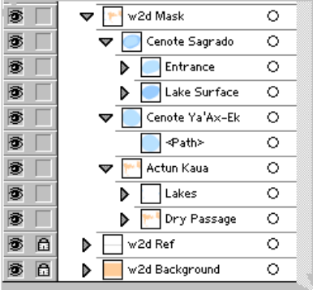
**Roundtripping SVG Maps** **107**

lowermost path in _w2d Mask_ is considered the SVG's passage floor color. In the example above, this is the fill
color of the bottom path in "Dry Passage".) The passage outline pen style and color can also be specified on the
Segments page.

Finally, one of the five shapefile types that can be chosen during a shapefile export operation are the passage
outlines. A shapefile of this type will consist of polygons constructed from the closed paths in the _w2d Mask_
layer. Each group of outer and inner paths will be stored as a record in the shapefile, and the name of the group
(concatenated with parent group names, if present) will be stored as a field in the shapefile's table component.
Additional table fields are SVG file name and total floor area in square meters.

One feature of the shapefile export worth noting is that the colors assigned to inner paths in the SVG are ignored. Each shapefile record, which consists of one outer polygon grouped with zero or more inner polygons, is
assigned one fill color attribute (which can be "no color"). If it's used as the basis of color assignments in ArcView, the outer polygons will be filled with those colors while the inner polygons will produce "holes" in the
outer polygons. The above example gets around this restriction by placing Cenote Sagrado's "Entrance" and
"Lake Surface" outlines in their own groups. This way, both will be treated as outer polygons. If the single path in
"Entrance" had been grouped with the one in "Lake Surface" (but positioned just above it), it would be treated as
an inner polygon. While Walls would show it as light blue (above the darker blue of the lake), ArcView would
show it as a hole with no color. For the same reason, the individual paths in "Lakes" are placed in their own unnamed groups. This feature of ArcView is usually an advantage instead of a limitation. The "holes" in a cave floor
allow other layers, such as background images, to show through.

**w2d Symbols**     - This layer is produced by Walls in an adjustable SVG export where the source SVG contains added symbol definitions. It contains one instance of each symbol -- all positioned near the upper left corner of the
page. The layer's only purpose is to work around an Illustrator CS bug. (When importing SVG, it obtains some
symbol attributes, such as geometric transformations, from the first-encountered instance instead of the actual
symbol definition.) After opening the SVG in Illustrator, you can delete this layer if you wish. You may want to
keep it if you plan to roundtrip Illustrator's own SVG files as opposed to passing them through Walls -- something you should try to avoid for other reasons as well. See Instructions for Illustrator Users.

**w2d Ref**     - A required "metadata" layer consisting of a single text element positioned at the lower left corner of
the frame. It's part of every SVG exported from Walls and a file must have it to be accepted in a merge operation.
The text consists of a map title and information used by Walls and Wall2D for georeferencing -- specifically the
plan view (degrees), scale ratio, region width and height (meters), and center coordinates (meters). The format of
this line of text must not be altered outside of Walls. The type size, however, can be inherited in a merge operation. Otherwise it's a setting in the Printer: Map format Options dialog (Fonts - Frame section). For an interactive
map, I suggest a size that makes the text barely readable at maximum zoom level. A black Arial typeface is always assigned by the export function. You may want to hide the text completely if you have a legend. This can
be done manually by finding line "<g id='w2d Ref'>" in the SVG text file and changing it to "<g id='w2d Ref' display='none'>". The effect is the same as toggling the visibility of this layer off in Illustrator before saving the document.

**w2d Background**     - A required layer consisting of a single filled rectangle (no outline) which defines the map extent. The fill color, when not inherited from a merged SVG, is taken from the current background color setting for
a displayed map in Walls. (See, for example, the Segments page's control panel.) If the color happens to be
white (either specified or inherited) _and_ the passage color of the _w2d Mask_ layer is also white, then another style
attribute, opacity, is assigned a value of zero by the export function. That's simply to make the map look less
"washed out" when it's viewed in Walls2D or Adobe's SVG viewer -- a fix that apparently doesn't degrade performance. (Setting the fill attribute to "none" was not an option since a filled background is required for mouse
movement to be detected.)

##### **5.5 Adjustment of Brushed Strokes**

The treatment by Walls of unnamed groups in _shp_ layers can on occasion lead to unexpected results. In Adobe
Illustrator it's easy to create ledges and dome lines as brush-stroked paths. It also can be convenient to scatter
sand and small rocks this way. The natural place for them is in the _w2d Detail shp_ layer, but not in an unnamed
group since we want those paths to be reshaped as necessary, just like the wall outlines. (See SVG Layer Definitions for a description of how layers are adjusted.) Unfortunately, when exporting to SVG Illustrator expands all
brush-stroked paths to their individual components -- numerous tick marks, for example -- and nests them two
levels deep within unnamed groups. That's all Walls sees and also what you'll have if you read the SVG immedi

_Copyright © 2013 by David McKenzie_

**108** **Walls Project Editor**

ately back into Illustrator. The invisible path is still there but its relationship with the tick marks is only that it's in
the same unnamed group. This is the same result you'll get if you select a stroked path in Illustrator and choose
_Object | Expand Appearance_ . A consequence of this behavior is that when Walls needs to severely adjust artwork
you might wind up with something like the before and after images below:

A 30-degree azimuth correction in shot K to L caused the dome line near the middle to extend outside the passage. That's due to its being enclosed in an unnamed group in the _w2d Detail shp_ layer. We could have prevented this from happening by performing an _expand appearance_ on any brush-stroked paths before the export, at
which time we would also delete the empty path and _ungroup_ the tick marks (or name the enclosing group). Although it's not shown here, that approach worked fine in this example, with the individually adjusted tick marks
being nicely aligned while staying inside the passage. Another approach, probably safer and just as easy, is to
repair such messed up paths by redrawing them in Illustrator after any round trip in which they happen to appear. Hopefully such cases will be rare and will need to be fixed just one time. (A possibly cleaner solution is
suggested below.) The SVG format as produced by Illustrator just can't represent brushes and brushed paths
efficiently like it can symbols.

This example also illustrates what can happen to a set of cross section lines in a severe adjustment. The set
between K and L became skewed with respect to the passage because the two components were grouped in a
_sym_ layer. That's also something that's easy to fix manually.

**An Alternative Approach for Large Maps**
The inability of Illustrator to convert brushes and brushed paths to SVG efficiently can cause very large SVG files
to be created, possibly bogging down the roundtripping process. It's also unfortunate that the links between
paths and brush patterns are lost, even though the adjustment might produce acceptable results in most cases.
A possible workaround for the large file problem is to break the project into pieces that can be roundtripped separately. A better alternative may be to keep the brush-stroked paths (dome and drop lines, etc.) in a separate
layer that's _not_ roundtripped -- one that's flagged as a _template layer_ to prevent it from being exported. After
each roundtrip cycle, this layer could be copied back to the Illustrator document and touched up manually in
areas that have shifted significantly. This way the brushes and possibly other types of decoration can remain
fully editable and efficiently stored. To produce an SVG file for the Walls2D viewer you could remove the template flag and position the layer as a named sublayer beneath _w2d Details shp_ before exporting _._

##### **5.6 Live Paint and Pattern Support**

**Live Paint** -- This is a feature of recent versions of Adobe Illustrator that allows artists to quickly color areas separating path segments in a group of possibly overlapping graphics objects. It's not a requirement that the colors
(or patterns) be assigned to specific objects in the group. For example, to create a tinted lake partially filling a
cave passage it's not necessary to draw a separate closed path with much of its border coinciding with the cave
wall outline. A non-closed path is all that's needed.

Of course a live paint object is more complicated than the set of objects selected for the "make" operation, and
Illustrator will _expand_ it during an export to SVG. The problem this causes from our standpoint is that the expan

_Copyright © 2013 by David McKenzie_

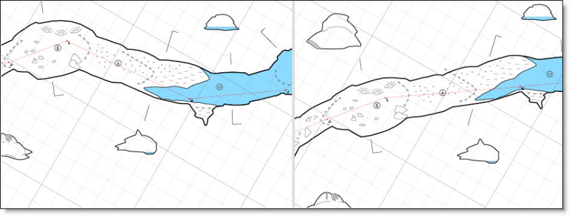
**Roundtripping SVG Maps** **109**

sion will nest path objects inside _unnamed_ groups. Ordinarily, and by design, this would prevent Walls from reshaping the paths if the live paint object were placed in a _shp_ layer. (See SVG Layer Definitions.)

Fortunately it appears that Illustrator (CS6 at least) consistently encloses these unnamed groups in an SVG
group element with an id of the form XMLID_n_, where n is an integer. This allows Walls to identify it as a live
paint object and treat the underlying unnamed groups in a special way. At least for now, when processing a
merged SVG, Walls gives any XMLID group encountered in a shp layer a new name of the form W2Dn, and also
gives the unnamed groups beneath it names of the form W2Dnsn. This is necessary because when Illustrator
imports an SVG file, even one that it created, it simply ignores (strips off) the XMLID names. If the document
were exported again, Walls would encounter sets of nested unnamed groups that are no longer recognizable as
live paint objects. The renaming strategy has worked well so far during testing. It's also easy in Illustrator to turn
a W2D group back into a live paint object if this were desired.

**Patterns** -- This is another Illustrator feature for which roundtripping support has been implemented recently. (In
previous versions the SVG <pattern> element wasn't recognized.) It allows one to fill both shapes and strokes
with patterns consisting of repeated tiles, either created or selected from Illustrator's swatch library.

The only problem noticed so far is that Illustrator CS6 can't always import exactly the same pattern that it exports
to SVG. At least one complicated pattern in the library, a pattern named "Snake", will undergo a subtle transformation while still being recognizable. At least in testing so far, Walls2D (or Adobe SVG Viewer) will render the
image the same way whether or it is processed by Walls. But this image can be different from the two versions of
it seen in Illustrator, before and after the roundtrip. If you see this, a reassignment of the pattern should fix the
problem.

##### **5.7 Instructions for Illustrator Users**

**Importing a Walls SVG**
The SVG export function of Walls creates an SVG file that can be opened directly by Adobe Illustrator provided
the **Adjustable** option is selected. It can also be "placed" in an existing document. The SVG might be a raw export from Walls containing only survey data and a hierarchy of empty predefined groups (see SVG Layer Definitions), or a roundtripped SVG containing adjusted artwork along with new survey data. Here are some initial
steps you might want to carry out after a direct SVG open:

      - Under File | Document Setup... set the _artboard width and height_ to be the same as that of the _frame dimen-_
_sions_ used for the SVG export in Walls. (Unfortunately there's nothing in the SVG itself that causes Illustrator to do this automatically although the document is properly scaled.) To see everything you must then
zoom the document to fit the screen.

      - Next, open the Layer panel and check the expected _w2d_ "layers" are present, but with Illustrator having interpreted them as a sequence of _groups_ beneath a single layer named "Layer 1." At this point you can run a
script that will convert to true _sublayers_ the w2d groups you'll be normally working with. This takes only
seconds. See Converting Groups to Layers in Illustrator.

      - Finally, if you want to bring in scanned images to trace, create a second _outermost_ layer and assign it the
_template_ property. When you place images in this layer an SVG export won't include them. (Walls would ignore them anyway if they're not placed in a _w2d_ layer.) Since it's not difficult to reload selected field book
scans, I prefer not to involve them in the roundtripping process.

**Illustrator Settings for Creating an SVG for Walls**
After drawing artwork in the layers described in SVG Layer Definitions, you should use the following dialog settings in Illustrator when creating a source SVG compatible with Walls. The next step will be to let Walls perform
a merged export to produce a working or final SVG file compatible with Illustrator, Walls, and Walls2D.

_Copyright © 2013 by David McKenzie_

**110** **Walls Project Editor**

First, be sure to should use Illustrator's **File |** **Save a Copy** command (not Save As) to write an SVG for Walls
while keeping a backed-up document in **AI** format in which you perform your edits. Only on relatively rare occasions will you need to replace this working AI document with a new one made by importing an SVG adjusted by
Walls.

Below are some notes about the export options presented by Illustrator CS6. Other versions, including CC,
present essentially the same options.

**SVG Profiles -** Leave this option set to either or SVG 1.1 or SVG 1.0. From what I've seen of Illustrator's SVGs
so far, the choice between these two varieties affects only the Document Type Definition (DTD), a line of text

_Copyright © 2013 by David McKenzie_

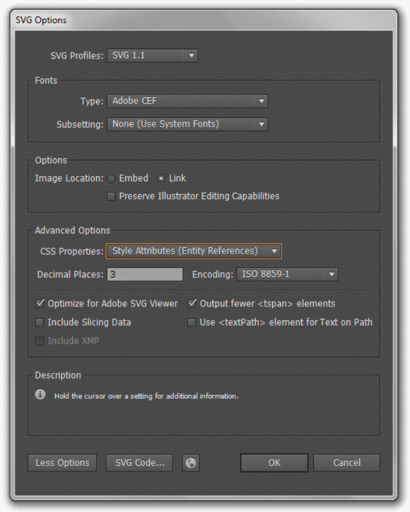
**Roundtripping SVG Maps** **111**

[near the top of the file. If called upon, the W3C Markup Validation Service](https://validator.w3.org/#validate_by_upload+with_options) will use the DTD to determine if the
SVG is syntactically correct. In any case, when Walls uses the SVG in a merged export, it produces an SVG 1.0
file.

**Fonts**     - In the box labeled **Type** choose **Adobe CEF** to achieve better quality rendering of small text. It's compatible with Walls2D and the Adobe SVG Viewer, but possibly not with other viewers

**Image Location**     - Select _Embed_ if you want a self-contained SVG file. This is irrelevant if you don't include images or special effects that require rasterization.

**Preserve Illustrator Editing Capabilities**      - Leave this _unchecked_ if you're targeting Walls. If checked, a large
chunk of information would be added to the file that's usable only by Illustrator. This inflates the file's size and
causes Illustrator to ignore the SVG content when it reads the unaltered file back in. Although the extra data
shouldn't prevent Walls from using the file in a merged export operation, the exported SVG won't have this information.

**CSS Properties**     - It's important that you select **Style Attributes (Entity References)** . This creates a smaller file
by using short names as abbreviations for element style attributes -- colors, type sizes, and so forth. Walls also
does this when it exports an SVG file. This simplifies making style changes manually by editing the SVG as text.

**Decimal Places**     - Page coordinates for graphics objects will be written with this many decimal places. Both
Walls and Illustrator use point units, or 1/72 inches. You should leave decimals set at 2 or 3. Adobe 's documentation states that 3 is the "best choice for most files."

**Encoding**     - Leave this set at ISO 8859-1, the same character encoding used by Walls.

**Optimize for SVG Viewer**      - Leave this option _checked_ .

**Output Fewer TSPAN Elements**     - Be sure to _check_ this box. It fixes a text export inefficiency that has occurred
in older versions of Illustrator.

**Include slicing data**      - Leave _unchecked_ .

**Use <textPath> element for Text on Path**      - Leave this box _unchecked_ for now. Walls can read and adjust a file
containing SVG <textPath> elements, but unfortunately Illustrator may not be able to import these elements correctly. This doesn't prevent you from decorating your maps with path-aligned text, however. (See the 7th item
under Illustrator Limitations and Workarounds.)

When saving the document as SVG, you may want to follow a naming convention that simplifies the file's use by
Walls. I normally include something like "_ai11" in the name to indicate what program produced the file. When
the SVG export dialog is opened in Walls, the field containing the pathname of the merged file is initialized in
one of two ways. If an SVG file is attached to the reviewed item (at any sublevel, but with an assigned type of
Other), its pathname is used. Otherwise, the path is the project directory and the file name is the item's base
name with suffix "_mrg.svg" appended. The default _output_ file name, on the other hand, is constructed by appending "_w2d.svgz" to the base name. Of course you can change names while in the dialog.

**Using Template Layers:** It's likely you'll be using scanned drawings or fieldbook pages when working in Illustrator, in which case you should avoid placing those images in any of the layers Walls will recognize. Again, the
best approach is to maintain a working document in AI format. All images are then placed in a layer that's never
printed or exported, a layer with the _template_ property. Then, whenever an SVG file is needed, use the "Save a
Copy..." function to write a renamed SVG using the above settings. This will create a compact source SVG for
use in merge operations. (I've noticed that a template layer must be an outermost layer, not a sublayer, for it to
be excluded from the SVG.)

The basic rule to follow is to keep a backed-up working document in AI format and avoid having to read into Illustrator an SVG file that wasn't processed and rewritten by Walls. Also, instead of using an Illustrator-written SVG
as a source SVG for routinely generating new views, it's better that you use an adjustable SVG created by Walls
in a merged export. The SVGs in the sample projects were written by Walls, not Illustrator.

_Copyright © 2013 by David McKenzie_

**112** **Walls Project Editor**

If you are having difficulty with SVG exchanges between Walls and Illustrator, see Illustrator Limitations and
Workarounds.

##### **5.8 Illustrator Limitations and Workarounds**

(Note: This topic needs to be brought up-of-date. Some of what's described here may not apply to more recent
versions of Illustrator.)

I've noticed several issues with Illustrator's functions for reading and writing SVG's. All are annoyances that are
easily worked around. They are listed below in order of decreasing significance.

     - Illustrator makes a distinction between layers and groups, whereas SVG doesn't. Consequently, a named
layer or sublayer exported to SVG will always be brought back into Illustrator as a named group whether or
not it was processed by Walls. Some Illustrator users might find this awkward because groups and layers
behave differently. Fortunately, there are two solutions to this problem. For details, see Converting Groups
to Layers.

     - Illustrator doesn't interpret a clipping region correctly when importing an SVG. The result is an image with
the Y-axis reversed in direction. (Version CS2 doesn't reverse the Y-axis but a new unacceptable behavior is
that it discards objects not entirely within the clipping region.) If it weren't for this limitation, all SVGs exported from Walls could be opened in Illustrator without difficulty. The simple workaround is to _always_ turn on
the adjustable option when exporting SVGs intended for Illustrator. The Y-axis reversal actually serves as a
handy reminder in case you've forgotten to select this option when it was appropriate. For more details, see
a note about this issue.

     - When reading an SVG, Illustrator CS2 is unable to properly handle symbols that are composed of other
symbols. The result is missing or badly scaled symbol instances. Until Adobe fixes this, the workaround is to
avoid such compound symbols, or to replace existing ones with new symbols that are fully "expanded" versions of the former. Since this affects only symbol definitions, file size shouldn't increase significantly. (Versions 10 and CS1 don't have this problem.)

     - Illustrator can write different variations of the SVG format as specified in the "SVG Options" dialogs. Unfortunately, if you open an SVG, make some changes, and then simply "Save" the file (which you shouldn't be
doing anyway), you're not presented with this dialog; the original SVG is simply overwritten with a new SVG,
one that reflects your current option settings and possibly having the wrong type. (See the above suggested
settings.) A related issue, more a bug than a design flaw, is that if you open a compressed SVG file with extension .svgz, make changes and again simply "Save" it, the new version of the file will still have extension
.svgz, but will be _uncompressed._ The workaround for both problems is to _always_ write SVGs using the "Save
a Copy" command on the file menu. Version affected: v10 (other versions not tested).

     - At least the CS1 version of Illustrator (not version 10) has a bug that causes symbol definitions and their instances to possibly be corrupted when an SVG is imported. The problem is that some attributes of a symbol,
such as scale and rotation, are taken from the first-encountered instance rather than the symbol's actual
definition. Therefore, to prevent this from happening with an adjustable SVG exported from Walls, a special
layer ( _w2d Symbols_ ) containing untransformed symbol instances is included so that Illustrator will properly
reconstruct the symbol definitions. After opening the SVG you can safely delete the _w2d Symbols_ layer while
in Illustrator.

     - Some effects, like brush strokes and path-aligned text, will display correctly when an exported SVG is
viewed. Walls will also adjust them properly. Unfortunately, such objects have a more primitive form in the
SVG. When an SVG file is read back into Illustrator, whether or not it was processed by Walls, some objects
may be in an "expanded" form with links to associated paths broken. This means that on the occasions
where objects need to be edited (dome and drop lines, for example) you may want to either recreate them or
copy them from the original AI source so their definitions can be easily tweaked. This issue is discussed under Adjustment of Brushed Strokes.

     - Path-aligned text exported as SVG and read directly back into Illustrator will also be transformed incorrectly
(characters not rotated) due to a bug in the import function. As a result, Walls not only adjusts but also reformats such text so that Illustrator can properly handle it. It's no longer editable as path-aligned text, but it
should still look fine over the course of future roundtrippings. Although version CS2 offers a new export option, which is to save path-aligned text as SVG <textPath> elements, it's useless for roundtripping since Illustrator can't read these elements back in without "flattening" the text to individual, improperly aligned characters. For now you should avoid that option since it inhibits the Walls reformatting feature.

     - Illustrator CS1 (not version10 or CS2) has a problem exporting text efficiently. By default it tries to position
each character precisely using superfluous kerning adjustments, resulting in very long sequences of
<tspan> elements that break up the text arbitrarily. The Walls merge/export routine tries to eliminate most of

_Copyright © 2013 by David McKenzie_

**Roundtripping SVG Maps** **113**

this by combining <tspan> elements into a fewer number of <text> elements. Another way to correct this in
Illustrator, however, is to "select all", then open the Character palette (Window | Type | Character) and make
sure that the kerning setting is "0" instead of "Auto". Version CS2 offers still another alternative, which is to
select the new export option, "Output Fewer TSPAN Elements."

      - If the even-odd fill rule is set for a compound path in Illustrator, an exported SVG will have this style correctly specified. If Illustrator reads back the SVG, however, the style reverts to the default non-zero winding,
which may or may not cause features containing compound paths to be displayed incorrectly. Since path
directions can cause non-zero winding fills to have the same appearance as even-odd fills, the user might
not notice this style change. Illustrator versions affected: v10 (CS1 and CS2 not tested).

      - When reading an SVG file, Illustrator (v10 or CS1, but not CS2) unnecessarily increases the group nesting
of certain elements, particularly symbol definitions. This means that successive exports and imports of Illustrator's own SVG files can create ever-deepening hierarchies of nested groups. (This is another reason to
avoid opening Illustrator's own SVG files.) To counter this problem, Walls removes the extra nesting when
processing symbol definitions in a source SVG. Also, with version 10 (not CS1 or CS2), simply opening an
SVG file will add an outer top-level layer in addition to those created by earlier imports. Since Walls will preserve this extra layer, I prefer to remove it prior to saving the SVG from Illustrator 10. You can easily do this
by targeting the superfluous sublayer and selecting Object | Ungroup.

      - This is not so much a program flaw as it is something to be aware of when you're assigning names to
groups in the Layers Palette. In SVG, all names given to objects must be unique, regardless of their positions in the grouping hierarchy. This is not enforced while you edit a document in Illustrator. Therefore, when
Illustrator saves your document to SVG format, it will append characters (e.g., "_1_") to any name that
would match a previously encountered name. To avoid this, be sure to use unique names.

      - An item of interest only: The SVG files written by Illustrator versions 10 and CS reference to an undefined
entity, ns_graph, in the header. This in turn causes version CS2 not to accept them: "This SVG is invalid.
Validate it before opening." When such files are used as source SVGs, however, Walls will ignore this defect. This is all we require since as explained above we'll not be using Illustrator to open its own raw SVGs.

The following Illustrator issues might interest SVG users and developers in general, if not the Walls user:

      - The names of layers, groups, and most objects, including paths, are saved as XML id's during roundtripping. Any names assigned to text elements, however, are discarded by Illustrator (version 10 at least) when
reading or writing an SVG. In an adjustable SVG export, Walls gets around this limitation by placing each
text element (note or label) inside a named group.

      - Sometimes Illustrator inserts "garbage" in exported SVGs in the form of empty paths -- paths consisting of
just a beginning point. Since these are never displayed, Walls ignores them when the files are read during
merged exports. (There is also a command in Illustrator for cleaning these up.)

      - The SVG standard allows for a very efficient "dot" object in the form of a 2-point path whose points have the
same coordinates. Dot thickness and shape are then determined by stroke style. Unfortunately, Illustrator
"optimizes" them away by turning them into 1-point paths that are not rendered at all. As far as I know, the
most space-efficient way to visibly mark a location in Illustrator's SVGs is to use a filled 4-point closed path.
Walls uses this as the default marker symbol.

      - There is a problem with units (see note) that becomes an issue only when Illustrator's exported SVGs are
shared with another drawing program.

##### **5.9 Converting Groups to Layers**

An issue you'll encounter when importing any SVG file into Illustrator is that you'll end up with a hierarchy of
_groups_, not actual Illustrator layers and sublayers. Furthermore, any layer or sublayer will be _exported_ from Illustrator as an ordinary SVG group, the distinction between groups and layers being lost. Since the roundtripping
process requires that you place artwork into specially named SVG groups, you might think it necessary to
modify the way you draw. For example, you can use the _direct selection_ tool (white arrow cursor) to target objects inside groups.

My preference, however, is to transform the particular groups I need to work with into true layers so that they can
be targeted in the usual way. This is only needed when a raw SVG export from Walls is first opened in Illustrator,
or when a Walls-updated SVG is being brought back in. At other times we would be maintaining an AI file while
doing our drafting and occasionally spinning off SVG files for use by other software.

_Copyright © 2013 by David McKenzie_

**114** **Walls Project Editor**

**Caution** : Unfortunately, not only is this aspect of the layer structure discarded when Illustrator exports to _pure_
SVG format. When the file is read back in, some art objects, notably brush strokes, will have been "expanded"
and will not be as easily editable. Illustrator artwork should never be saved as an SVG file until it's necessary,
say for adjustment by Walls.

**Using a Script to Convert Groups to Layers.**
An Illustrator script that can perform this conversion is now installed alongside Walls in its application folder. To
make it especially easy to invoke, you'll need to copy file **w2dGroupsToLayers.jsx** to Illustrator's script folder
when Illustrator is not running. (Windows may prompt for permission to do this.) On my computer this folder is

C:\Program Files\Adobe\Adobe Illustrator CS6 (64 Bit)\Presets\en_US\Scripts\.

After that, whenever you open an SVG freshly exported from Walls, select **File | Scripts** from Illustrator's main
menu. The name **w2dGroupsToLayers** should appear in the list of readily-available scripts. Just clicking on the
name will execute the script, which begins with a request for confirmation -- a total of 3 mouse clicks.

The groups that are converted, if they are found, are _w2d Legend_, _w2d Walls_, _w2d Walls sym_, _w2d Walls shp_,
_w2d Detail_, _w2d Detail sym_, _w2d Detail shp_, and _w2d Mask_ . The other _w2d_ groups are placed in an initial locked
state. The script makes no changes if the top layer is either empty or it already contains true sublayers. Other
layers can exist below the top layer, in which case they shouldn't be affected.

**Manually Converting Groups to Layers**
Here are instructions for converting the key SVG groups into layers using Illustrator's Layer panel functions.
They could be performed as described here, after Illustrator opens an SVG file generated by Walls. But even if
you've used the above script for that task, you might need to use the manual method on a specific named group
you've created earlier as a sublayer, say one now existing as a subgroup of _w2d Walls shp_ .

§ Double-click on the artwork square next to the name of a high-level _w2d_ group in the Layers panel, for example, _w2d Legend_ . (The parent must already be a layer.) This opens a small "Options" dialog showing the
group name. Right-click on the name and select **Copy** to save the name to the clipboard, then cancel the dialog.

§ While the group is still highlighted in the Layers panel, open the Layers pop-up context menu by clicking on
the tiny down-arrow near the top of the panel. From the list of commands, select **Collect in New Layer** . This
will create a new layer with a unique name, say _Layer 2_, containing the group _w2d Legend_ that you want to
convert. _Layer 2_ also takes up the slot originally held by _w2d Legend_ .

§ Double-click on the artwork square next to the name of _Layer 2_ and paste the original name, _w2d Legend_,
back in. You will now see an arrow next to this layer indicating that it has child objects under it. Expand the
layer and you will see beneath it the original group, _w2d Legend_, with its name unchanged.

§ If Walls exported the SVG file in a merge operation, this lower _w2d Legend_ group will likely contain artwork. If
that 's the case, select the group's contents by clicking on the circle to the right of the name, then select **Ob-**
**ject** | **Ungroup** from Illustrator's main menu. That removes the duplicate name and extra level in the hierarchy.
If this is your first SVG export from Walls, one without Illustrator artwork, then the lower _w2d Legend_ group will
be empty, in which case you can **delete** it by clicking the panel's trash can icon. In either case, you'll notice
that the remaining _w2d Legend_ panel item is displayed with a darker background color, distinguishing it as a
true Illustrator layer, not a group.

§ Next, convert the _w2d Walls_ group to a layer in the same fashion. This group, however, contains two sublayers
(groups for now), with the names _w2d Walls sym_ and _w2d Walls shp_ . As in the case above, the _w2d Walls_
group will become a child of the new _w2d Walls_ layer that's created. You don’t need to do anything to that, it
will disappear on its own when the child groups are converted to layers.

§ Perform the same conversion on the _w2d Detail_ group and its two subgroups. Pay attention when pasting the
layer names back in when doing these conversions on a file that already contains artwork. After you select
**Collect in New Layer**, a different layer may become highlighted, and if you are not careful you may be pasting the original name into the wrong place.

This amounts to just a few mouse clicks per layer, and with practice the conversion of groups to layers can be
done in about 3 minutes.

_Copyright © 2013 by David McKenzie_

**Roundtripping SVG Maps** **115**

##### **5.10 Using Other Drawing Programs**

(Note: This topic is badly out of date, but I believe the situation hasn't significantly changed with respect to SVG roundtripping as of July 2016.)

There are several popular drawing programs that have capabilities comparable to _Adobe Illustrator_ . Unfortunately, among those alternatives only _CorelDraw 12_ offers significant support for the SVG format (as of early
2004). That support falls just short of allowing it to correctly read the SVG files written by Walls -- see note. The
most recent version of _Xara X_ can now _export_ SVG, but of course we also need import capability for roundtripping . An open source program, _InkScape_, which uses SVG as its native format, has been showing a great deal
of promise. Already (as of 2008) it probably could be made to work with Walls without a great deal of effort on my
part. The problem is that enough cave surveyors would have to be willing to adopt InkScape as their drawing
[program. You might want to check it out by browsing to www.inkscape.org.](http://www.inkscape.org/)

For the time being the best workaround for those familiar with another program is to use Illustrator as a file converter only. I believe that recent versions of _Xara X_ and _Freehand_ (now from Adobe), can all read the Windows
metafiles (WMF or EMF) exported by Walls. They can also write files that Illustrator can read (usually some variant of the AI or PDF format). Therefore I recommend the following procedure if you want to use a different program for the bulk of your drafting:

1) Export a line map from Walls as an EMF or WMF file featuring at least the survey vectors -- something that
your drawing program can import. At the same time, perform the equivalent SVG export (identical view, scale,
frame dimensions, and center coordinates), making sure that the adjustable option is selected. (See SVG Export
Dialog.) Include all survey features (labels, notes, flags, etc.) in this export. As a precaution, also save a snapshot of the project using the ZIP backup feature.

2) After importing the metafile, use your drawing program to add artwork using survey lines (station marks and
vectors) as a guide. If the program supports it, place drawn features into separate named layers as described in
SVG Layer Definitions. I suggest you use similar but not identical names. (That's because Illustrator will automatically rename layers to insure uniqueness, a possible issue in step 4.)

3) When ready to create a final SVG map, or possibly an adjustable source SVG for Walls, export the document
in any format that Illustrator can read without significant loss -- probably some variant of AI. Xara X, for example,
will preserve the layer names in an AI export. The remaining steps must then be carried out by someone who
has Illustrator.

4) Using Illustrator, import (or place) both the SVG file of step 1 and the AI file of step 3 into a new document.
Delete the survey features originally supplied by the WMF file, since they are being replaced by the contents of
the SVG file. At this point, it may be necessary to reorganize and rename certain layers so that they conform to
the description in SVG Layer Definitions.

5) Write the new document as an SVG file as described in Instructions for Illustrator Users. Walls can then use
the SVG in a merged export where new surveys are added and artwork is adjusted as necessary. If more decoration is needed, Illustrator can be used again to convert the updated SVG to a file your program can hopefully
read. The process can then repeat, starting at step 2.

The SVG component of the _Kaua North Maze_ sample project originated in the above fashion. A Walls-produced
WMF file was imported into Xara X. After decoration with passage outlines, etc., an AI (version 7) document was
produced for Illustrator 10.

#### **6 Import/Export Features**

##### **6.1 Importing Compass Data**

_Copyright © 2013 by David McKenzie_

**116** **Walls Project Editor**

This function is an enhanced, built -in version of _css2srv.exe_, the command-line utility that was previously
provided with Walls to import files produced by Larry Fish's Compass program. To access it, choose **FILE | Im-**
**port > Compass MAK or DAT file...** from the Walls main menu.

This function will process a Compass project (MAK) file to create a georeferenced Walls project incorporating
data from many data (DAT) files. Besides the file names, the MAK file might contain the names and coordinates
of **fixed points**, georeferencing info, and the names of connecting stations called **links** . The import function will
also accept as input an individual DAT file, or multiple DAT files if an expression containing DOS-style wild cards
(usually *.DAT) is entered for the source file name.

Represented in the resulting Walls project will be the raw instrument readings, specified units and corrections,
#date directives, and LRUD passage dimensions. Shot "types", if non-blank, will appear as leaves of the segment tree. For example, vectors to be excluded from length computations or from plotting will appear in the tree
under leaves labeled "L" or "P. Such leaves can be quickly detached prior to either operation. Excluded shots
(type "X") are placed in comment blocks and "non-closed" shots (type."C") are constrained with zero variance assignments.

Also, **underwater surveys** will appear as they do in the Compass editor (and Walls), with depth gauge measurements represented as relative depths. Such surveys will have #units assignments "tape=SS" and "order=DA" (or
"order=AD"). The relative depth (increase in elevation or decrease in depth) will appear as the third measurement.

**OPTION: Combine a DAT file's surveys into one file**
The created Walls project tree will contain a branch (book node) for each DAT file. If this option is
checked, these branches will each contain at most two SRV data files. The one having the DAT
file's name as title will contain all of that file's surveys. If the option isn't checked, separate files for
the named surveys will be generated and attached to the branch in the order they appear in the
DAT file.

Normally, you'll want to leave this option _unchecked_ so that the individual surveys are more easily
selected and edited. The survey names, often with appended comments, will serve as leaf titles in
the project tree. Branch items can be rearranged, even sorted via a menu function.

_Copyright © 2013 by David McKenzie_

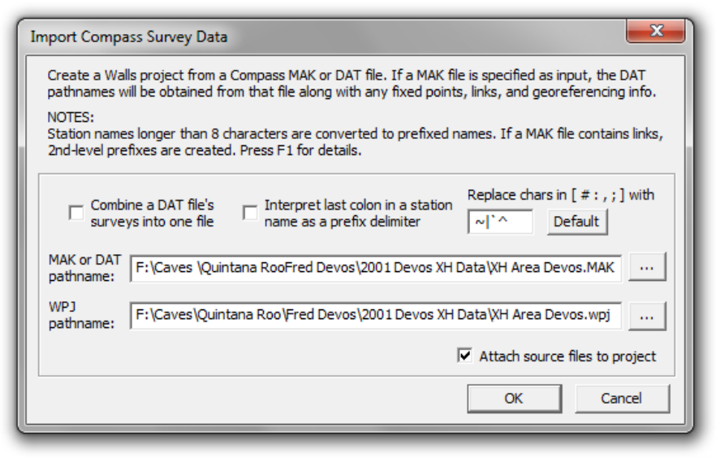
**Import/Export Features** **117**

On the other hand, if you believe it unnecessary to generate what could be many hundreds of data
files, you can try the combine option. The segment tree will still show the individual survey names,
since with this option the import function inserts a #Segment directive at the start of each survey.

In both cases, if either fixed points or links have been defined, a separate SRV file will appear as the
branch's top leaf, with either "(Fixed Pts)", "(Links)", or "(Links and Fixed Pts)" appended to the title.
When there are links, a block of comments will show the link names, their 2nd-level prefixes (more
on those below), and the DAT files where they first appeared.

**Station Name Alterations**
When station names longer than eight characters are encountered during the import operation, prefixed names
are generated. For example, **SURF123456** will become **SU:RF123456** . This is necessary because the base
name length is limited to eight characters in Walls whereas Compass supports 12-character names. The effect in
Walls of such alterations is that only the base names will be seen in certain dialogs where they're normally not
needed. Also, name prefixes (up to any level) are only optionally included in the name labels displayed on maps.
The data files and coordinate listings, however, will have the prefixes attached to the base names.

**OPTION: Replace chars in [ # :, ; ] with...**
Four special characters, possible in Compass station names, will be replaced if they occur. The pound sign (#),
colon, comma, and semicolon will, by default, be replaced with the tilde (~), vertical bar (|), back accent (`), and
caret (^), respectively. For example, the name **PEP:TEC100** will become **PE:P|TEC100** upon import. Since
these substitutions could conceivably cause name conflicts, the import dialog lets you customize the replacement characters by choosing ones that don't already exist in the names.

**OPTION: Interpret last colon in a station name as as a prefix delimiter**
This could be useful if the survey data had originated from Walls. With this option, the last colon in a name won't
be replaced when it's followed by no more than 8 characters. In the example above, name **PEP:TEC100** would
be preserved.

**Suggestions for improving the names:** If the import summary states that substitutions and/or
name-splitting was necessary, you may want to make the names more acceptable. You can use the
Walls built-in search/replace features to accomplish this -- see Search Operations. If numerous data
files would be affected, using an external program for this task might save some effort.

**Issues with Links and Fixed Stations**
Whereas Walls uses station name prefixes to avoid conflicts when surveys of different caves are compiled together, Compass uses the structure of the MAK file for this purpose. For each data file listed, the user can specify as links which names need to be "remembered" from earlier files in the sequence, possibly only to be
passed on to later files that need them. If there is at least one link or fixed station, only the link names are remembered at the start of processing of that file. If there are no links or fixed stations, processing continues as if
there were no break between files. In Compass, therefore, a station name can represent more than one station.

Fixed stations can appear in the MAK file alongside the links, each being a name followed by a set
of coordinates in brackets. When processed by Compass, a fixed station is like a link in only one
sense. If one is present, _only the links_ will be carried over from previously listed data files. The name
of the fixed station, unlike that of a link, is _not_ remembered; a new station is created. Oddly, this
means that simply assigning a fixed station to what would seem to be the appropriate data file could
require one to locate all connecting stations and include them as links. It wouldn't matter if unique
station naming was being enforced. A Compass user can avoid this problem, however, by introducing all fixed stations with the first data file.

The MAK file processing behavior of Compass is duplicated by Walls through the use of 2nd-level
name prefixes. When a MAK file lists multiple data files, and has fixed stations and/or links assigned
to files other than the first one, a **#Prefix2 <SRV name>** directive will appear near the beginning of
each SRV file that's written. The link stations, when not in the data file that introduced them, will

_Copyright © 2013 by David McKenzie_

**118** **Walls Project Editor**

have this prefix prepended to their names. The overall appearance of the survey data shouldn't be
much affected. Why 2nd-level prefixes? The import function has to reserve 1st-level prefixes for the
possible splitting of names greater than 8-characters long.

**Note:** The importer deviates from Compass behavior when a data file is assigned a fixed station and
a link with the same name. Whereas Compass ignores the link, the importer does what you might
expect, which is to try matching the name with that of a station appearing in (or forwarded to) the
previous file. If there's a matched station, its location is established with the fix. If the station has
already been fixed, you're notified of a **duplicate fix error** . (The MAK file opens with the line highlighted.) It's likely that only an error in the MAK file will cause this difference in behavior.
.

##### **6.2 Importing SEF Files**

An SEF (SMAPS Exchange Format or Survey Exchange Format) import capability has been built into the program from the very beginning. Since a few other cave mapping programs can read this format, an SEF export
function is also available, making the exchange of _raw_ survey data with another program more easily achievable.
SEF is certainly limited in what it can represent, but at least Walls can import the files it exports.

The import operation reads an SEF file and creates one project script (WPJ file) and a sequence of associated
SRV data files. While the project preserves the SEF directory hierarchy, the SRV files, normally one per named
survey or control point group, will contain the raw measurement data in a recognizable form. Included are the instrument units and corrections, #DATE directives, and LRUD passage dimensions.

To import an SEF, choose the **FILE | Import > SEF Data file...** from the Walls main menu.

Some types of data, while surviving a Walls round trip, might not be accepted or handled the same same way by
other SEF-capable programs. Those types include instrument and target heights, the four taping methods, underwater surveys, TO and FROM station LRUDs, and starting and ending station LRUDs. To alleviate this problem for data exchange, the SEF export function allows the selection of two levels of detail, both ultimately producing exactly the same vectors and fixed points prior to network adjustment. See Exporting SEF Files.

_Copyright © 2013 by David McKenzie_

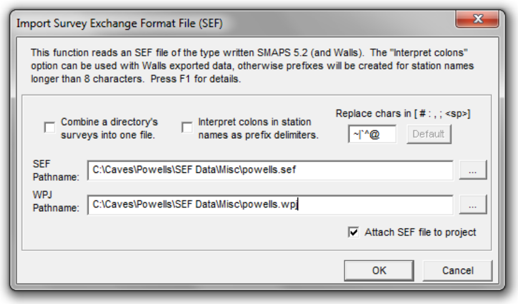
**Import/Export Features** **119**

Since the SEF format can't represent everything likely to be found in Walls data, some advanced features simply
won't be involved, particularly those controlling how data will be displayed. Even the location estimates might differ noticeably if there are loops and the default variances have been overridden in the data. Missing for stations
will be notes, named flags, and multilevel name prefixes (the latter being converted to a short prefix by the exporter). Missing for vectors will be variance assignments (e.g., floated traverses) and user-added segment attributes that don't appear to be vector flags. (Trailing attributes such as "P" and "L", are exported by Walls to SEF
as shot types.) You'll likely want to add some of these features to the imported project.

A Walls project created from an SEF file exported by another program will likely require some manual repairs
due to limitations of the format and how the other developers used it. For the SEF definition I've largely relied on
SMAPS itself and a series of emails written by Doug Dotson in 1992. This function certainly doesn't support all
elements of the format as it was originally described, such as include files and control points with lat/long coordinates. Unfortunately, Doug Dotson's SMAPS 5.2, which implemented the format, is evidently no longer compatible with modern PCs running Windows.

**Generated Data Files**
The first four letters of the specified project name (the SEF file name by default) will be used by Walls to generate the 8-character file names of possibly many separate SRV data files, normally one for each SEF compass
and tape survey or control point group. For example, POWELLS.SEF will ordinarily give rise to POWELLS.WPJ,
POWE0001.SRV, POWE0002.SRV, etc. Any existing files with those names will be overwritten without warning.

**Option: Combine a directory's surveys into one file**
The import dialog also offers the option to combine _adjacent_ surveys in a SMAPS directory into a single file. This
will create fewer files of larger size. With this option, individual survey names can still be represented as a component of the segment attribute assigned to vectors. The import should produce a usable segment tree.

**Station Name Considerations**
When station names longer than eight characters are encountered during the import operation, a prefixed name
is generated. For example, **NAME1234567** will become **NAM:E1234567** . This is necessary because the base
name length is limited to eight characters in Walls while SEF (and SMAPS) supports 12-character names. The
only consequence of this is that just the last eight characters of the original names will be seen in certain program dialogs. Also, In Walls the prefixes are optionally excluded from name labels on maps. The SRV data files
and coordinate listings will have the full prefixed names.

**Option: Interpret colons in names as prefix delimiters**
Selecting this option will alter the behavior described below and cause colons in names to be accepted as prefix
delimiters. This will likely be useful only when importing a Walls-created SEF (which of course I've often had to
do). If a base name longer than eight characters would result from keeping the colons, they are all replaced and
a prefixed name is created. You'll be informed of such cases in the summary that's presented when the operation completes.

**Option: Replace chars in [ # :, ; <sp>] with...**
Five special characters, evidently possible in SEF station names, can't be used in Walls station names. Therefore, the pound sign (#), colon, comma, semicolon, and space character will, by default, be replaced with the
tilde (~), vertical bar (|), back accent (`), caret (^), and at sign (@), respectively. For example, with the above
"Interpret colons..." option unchecked, the name **PEP:TEC100** will be converted to **PE:P|TEC100** . Since
there's a possibility that these replacements will themselves cause name conflicts, the import dialog lets you customize the replacement characters. The import summary will report which substitutions were necessary.

**Importing Georeferenced Projects**
If the control points defined in the SEF have UTM coordinates, only the zone, not the geodetic datum, can be
specified using SEF statements as far as I can tell. Therefore, if UTM coordinates are seen during the import operation, upon completion you're informed of the need to establish a geographical reference and to check the box
that enables generation of UTM coordinates. Hopefully the datum will be either known or indicated by comments
in the SEF file.

**Declination Issues**
There are two ways declinations can be specified in a Walls data file: indirectly by date and directly as a #units
directive setting. A setting of "decl=0", for example, will override any declination derived from a preceding #date
directive, resetting it to zero. This behavior could have been intended or not, depending on the instruments used

_Copyright © 2013 by David McKenzie_

**120** **Walls Project Editor**

for the survey. Therefore, when Walls imports an SEF file, the ordering of the #date and #decl directives in the
SEF text will determine the ordering of the #date and #units directives in the data file that's written. To help
guard against mistakes in directive ordering, caution messages will appear at locations where a zero declination
assignment follows the #date directive. (When Walls imports Compass data directly, the #date directive will always follow the #units directive.)

##### **6.3 Exporting SEF Files**

To create a Survey (or SMAPS) Exchange File (SEF) for a selected portion of your project, right-click a branch
(or root) of the project tree and choose **Export > Data in branch as SEF file...** from the context menu. A dialog
will appear that lets you specify certain characteristics of the generated file, along with its name and location.

The following check boxes are presented -- all initially unchecked by default:

**OPTION: Instrument corrections, backsights, inst / tgt heights, and tape method**
If you're targeting another program besides Walls, you _may_ need to leave this box unchecked if the program
doesn't support these four features of the SEF format. In that case, all corrections but declination will be applied
to a CT vector before it's written to the SEF as distance, azimuth, and inclination. The handling of LRUDs and
declinations is not affected. At the very least, this option can be used for testing the export function. Geometrically, the defined vectors _should_ be same as the ones produced with this option enabled.

**OPTION: Also use vdist for relative depth in dive surveys (order=DA, tape=SS)**
If you check the above box, you might also try checking this one if your project contains underwater surveys. The
only advantage is that it will simplify (at least in Walls) the appearance of the raw data files after the SEF is imported -- no inclination column and with columns IAB and TAB (instrument and target heights above station) replaced with one column named FRDEPTH-TODEPTH. The numbers in that column would be the actual instrument height _minus_ the target height for SS taping and zero inclination, where both instrument and target are
considered located at the water's surface.

Note that the Compass survey editor has an identically-defined column for storing relative depth gauge readings
in underwater surveys. Therefore, a direct (not SEF) import of a Compass underwater survey by Walls will create

_Copyright © 2013 by David McKenzie_

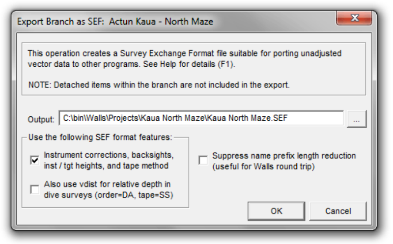
**Import/Export Features** **121**

the equivalent tape=SS, order=DA (or AD) survey. The vdist measurement type in SEF seems to me the most
natural way to represent the same thing, but of course the program you're targeting will need to support it.

**OPTION: Suppress name prefix length reduction**
A station name prefix, when concatenated with the base name, could easily exceed the SEF limit of 12 characters. By default, the exporter will replace the prefixes with shortened versions consisting of up to three uppercase
letters followed by a single terminating colon. The replacements will be assigned in the order that new (possibly
multilevel) prefixes are encountered during processing. If you do not select this option and you have long name
prefixes, you'll be cautioned about this in a note at the bottom of the summary dialog:

If you then choose to import the SEF into Walls, say to test the result, you'll want to check the box labeled **Inter-**
**pret colons in station names as prefix delimiters** in the SEF Import dialog. Failing to do that will cause the import function to generate new prefixes as necessary. The prefixed name CALENTURAS:A20, for example, would
become CALENT:URAS|A20, with the original colon being replaced by a vertical bar (default replacement for
colons). Apart from the names, the same survey will be produced.

**SEF Export Limitations**
An SEF export operation produces a data set consisting of unadjusted vectors, instrument corrections (optional),
assigned declinations, and any associated LRUD measurements, all organized in an SEF directory hierarchy resembling the Walls project tree. Many things that define Walls data (notes, flags, name prefixes, segment attributes, floated or constrained vector components, etc.) are omitted because they aren't supported by the SEF
format. The numbers representing measurements won't necessarily reflect the original units since Walls supports several formats..

While SEF seemingly allows the specification of many parameters describing raw survey measurements (e.g.,
#date, #decl, #fcc, #fic, etc.), their values can't vary within an individual survey or control point group,. They can,
however, change multiple times within a SRV file. With every change of one of these parameters a new group
must be generated by the exporter. These groups become the named surveys, possibly even separate files,
within the importing program. The Walls SEF Import dialog offers the option to combine all groups within a parent directory (book) into a singe file, which can significantly reduce the total number of files written.

##### **6.4 Exporting Maps as Metafiles**

Walls supports the creation of two basic types of vector-based image files: metafiles (extensions **WMF and EMF** )
and Scalable Vector Graphics files (extension **SVG** ). The export dialogs are accessible via the File menu (File |
Export map as ...) whenever a compiled project item is being reviewed. That is, whenever you are able to print (or

_Copyright © 2013 by David McKenzie_

**122** **Walls Project Editor**

print preview) a map, you can instead choose to export that same map as a metafile or SVG. Note that what we
are really exporting is a 2D _drawing_ in the form of editable text and path objects. Only with a VRML export do we
save the survey as a 3D object.

While SVG is a new format with limited application support (see Roundtripping SVG Maps), most Windowsbased illustration programs, such as CorelDraw and Adobe Illustrator, can correctly import the WMF files produced by Walls. So can image conversion utilities that attempt to convert any one format to a variety of other
formats, such as DXF, CGM, CDX, CDR, and EPS. Only a few of these programs even attempt to read the theoretically more versatile "enhanced metafiles" (extension EMF), the basic problem being that the EMF format tries
to encompass the entire Graphics Device Interface (GDI) of the Windows operating system (Win32). Applications
have a hard enough time handling, in a uniform way, the much simpler 16-bit WMF format.

Actually, two varieties of WMF exist: the official, Microsoft-sanctioned WMF, which is almost useless for image interchange, and the WMF that most programs expect and which Walls produces. The latter variety has an "Aldus
placeable header" which relays to the importing program the image's resolution and true rectangle dimensions.
(Microsoft's solution to WMF deficiencies, of course, is EMF.)

You'll notice that Walls maintains a separate set of format options (see Map Options Dialog) for exported maps.
One reason for this is that many otherwise excellent drawing programs have less than perfect import routines (or
filters). Ideally, printed output from Walls and the drawing program should closely match when map options for
printer and export are identical. Xara X, for example, fails to meet this criterion in a number of typical ways.
While not supporting EMF at all, it reduces by one third the point size of all imported text in a WMF. It also uses
the character cell's lower left corner instead of its upper left corner for positioning text, possibly causing labels to
overrun the top edge of the frame. (If this happens, the image's vertical dimension is rescaled without warning!)
You can often cancel the effects of these kinds of quirks by adjusting various settings in Walls. For example, if
you were targeting Xara X and wanted 8-point text for labels, you would select a 12-point label font for exported
maps. Also, to force Xara X to correctly position the text, you would change the y-offset for labels from 0, its
usual value, to 8, the resulting text height.

Due to integer overflow problems, Illustrator 8 produces garbage when importing large WMF documents, such
as ones with 50-inch wide frames. (Thanks to Bob Osburn for catching this.) Evidently, this has been fixed beginning with Illustrator 9.

Other problems might require you to forego the use of some features. I found that some programs have difficulty
with dashed or dotted line styles. Xara X, without explanation, simply refuses to import the file. Errors in scaling
are also surprisingly common. Hijaak Pro v4 brings in the entire WMF image at only half its correct size. It's a
nuisance to have to resize an image (or its contained objects) after an import, but a decent result should still obtainable after a little tweaking. The fact that rescaling causes no loss of quality is one of the main advantages of
a metafile import as opposed to a bitmap image import.

Another format option you should be aware of is station label spacing -- see Labels and Notes. While it's possible to specify a large frame (say 5 feet wide) and a tiny font, so that label overlap is unlikely, you might still
want to avoid labeling every station. Otherwise, the large number of text objects could exceed the capacity of
the importing program. (This might depend on how much memory your computer has.) The solution, in this
case, is to not use overlap avoidance, or proximity, as the _only_ criterion for labeling stations (Gap>0, Inc=1), but
to use a sequencing criterion as well -- perhaps even exclusively. For example, Gap=0 and Inc=5 would cause
every 5th station in the traverse-oriented plotting sequence to be unconditionally labeled. If necessary, overlapping labels can be repositioned or deleted in the target program.

Once you import a metafile into a drawing program, perhaps as a "layer" in an existing document, you may want
to "ungroup" the resulting objects. This way, the frame, grid, vectors, markers, flags, labels, and notes can be individually edited or repositioned. (That's another big advantage of a metafile import.) A common requirement is
to place different classes of objects into different layers -- for example, labels and markers into layer #1, and
notes, flags, and lines into layer #2. Depending on the drawing program, the easiest way to do this may be to
have Walls create separate metafiles for import into specific layers of the same document.

_Copyright © 2013 by David McKenzie_

**Import/Export Features** **123**

##### **6.5 Exporting ESRI Shapefiles**

A shapefile export allows Walls processed data to be used directly by **ArcView®** and other GIS programs that
support the ESRI shapefile format. With such programs you can associate your survey data with scanned topographic maps and aerial photos. In addition, many kinds of operations (sophisticated queries, feature highlighting, etc.) that Walls itself currently doesn't support can be accomplished.

**Update:** See **Units and Geographical Reference Issues** below for a recent enhancement of this export function. Also note that Lat/Long shapefiles are now generated by default.

To perform a GIS export, compile your project and select the Segments page of the Review dialog. Next, select
the desired branch of the segment tree and click the "Reports" button (or right click on the branch). This brings
up the Adjusted Totals dialog, which features several export options. Finally, click the button labeled **Shapefiles** .
This brings up the following dialog:

The **Shapefile base name** field specifies the output file name prefix. In this example, the shapefile containing
vector data would be named KAUA-NM_V.SHP.

The **Output Folder** field specifies where all created shapefile components will be located. The initial default location is the project's workfile folder, but you can change it to the location of an existing GIS project.

**Shape Types** : Not only can vectors and coordinate information be exported, but also the text for station notes
and flags and, if available, the passage outlines stored in a processed SVG file. The codes corresponding to the
display attributes you've assigned to segment tree nodes will also be stored as shapefile attributes. This allows
you to configure a GIS viewer's map so that its colors and line styles resemble those displayed in Walls. The attached/detached state of branches will be recognized during the export operation, allowing you to exclude data
with certain segment attributes. You might want to perform multiple export operations, giving recognizable
shapefile base names to different parts of the project (individual caves, surface surveys, GPS locations, etc.). Although it's possible to differentiate (e.g., with color assignments) data with different attributes in a single
shapefile database, it might be more convenient to work with multiple shapefiles that can be selectively enabled
as layers in an GIS project.

_Copyright © 2013 by David McKenzie_

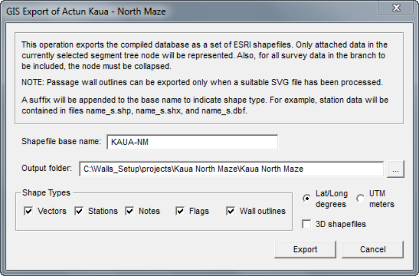
**124** **Walls Project Editor**

**Lat/Long degrees or UTM meters** : Although the compiled dataset consists of UTM coordinate values, you can
specify that the geometry component of the shapefile should have Lat/Long degree values. This is the default
choice, as most GIS viewers will accept such shapefiles regardless of whether or not a projection component
(PRJ file) is available. Since PRJ files are generated for datums WGS84, NAD83, and NAD27 CONUS, UTM
shapefiles with those datums should work equally well if the GIS program reads the PRJ file and, if necessary,
converts the data correctly.

**Update:** **Create 3D shapefiles** : Check this box to create 3D versions of all chosen shape types except that of
the Wall outlines (which are always 2D). For UTM shapefiles this causes a feature's elevation in meters to be
stored as a Z value in the geometry portion of the shapefile. For Lat/Long shapefiles this elevation is scaled to
degree units, which is a requirement of the format. The attribute portion (DBF file) will be similar to that of the 2D
version. The 3D Analyst extension of ArcView allows viewing of 3D shapefile data at different profile orientations.
The ArcView program itself will ignore the Z values. For best compatibility with other GIS software I recommend
you choose UTM instead of Lat/Long as the coordinate type for 3D shapefiles.

**Notes Regarding the Shapefile Types**
The **Flags** shapefile will contain only the non-hidden flags as indicated in the Flags and Marker Symbols dialog.
There is also a check box in this dialog labeled **Hide notes for unflagged stations** . When that box is checked,
the **Notes** shapefile will contain just the notes for stations with _non-hidden_ flags. The Flags and Marker Symbols
dialog might also show flags that have been excluded from this export operation via the detachment of segment
tree branches. Both those flags and the hidden flags are excluded from the **Flags** shapefile.

The option to produce a **Walls outlines** shape type is enabled only when the most recent compilation produced
a workfile with extension NTW. Two conditions are necessary for this to happen when a project book item is compiled: 1) an SVG source file with a mask layer is attached to the project tree as a child of the compiled item, and
2) the Compile Options property, **Process source SVG if one is attached**, is enabled for that item. For more information on what's actually written to this shapefile, see the attributes section below and also the SVG Mask
layer description in the SVG Layer Definitions topic.

An ESRI shapefile is actually a set of at least three files, each with the same base name but with different extensions: SHP, SHX, and DBF. To access them from ESRI's ArcExplorer, for example, perform these steps:

    - In Walls, create a named shapefile database as described above. In this example, **Kaua_V.shp**,
**Kaua_N_shp**, **Kaua_F.shp, and Kaua_W.shp** will be created (with associated SHX and DBF files) in folder
**E:\kaua\project\kaua .**

    - Start ArcExplorer with an empty "Untitled" project and select the **Theme | Add Theme** menu option (or toolbar button). From the dialog that opens, navigate to the output folder you've selected for the export.

    - To add a listed shape file (extension .SHP) as a theme in your project, simply double-click the listed filename. Alternatively, you can drag-and-drop the SHP files to the program's map page.

    - Enable (display) the desired themes by checking their corresponding boxes on the map's legend. Finally,
double-click each of the legend items to experiment with their visibility properties.

**Units and Geographical Reference Issues**
The display and selection options available with GIS software such as that offered by ESRI are too numerous to
be described here. Much of this depends on the attributes stored as fields in the DBF database that accompanies each SHP file. The shapefile format specification says nothing about what fields (named columns) should be
present in the database. It does, however, state that each DBF file record (row) will be associated with a set of
XY coordinates, a "shape" of a certain type, stored in the SHP file.

If your goal is to add your survey data as layers in a GIS project, you must first ensure that the exported files will
have units compatible with the topographic images you'll be associating them with. Most likely, you'll want to
overlay your cave surveys on maps keyed to a specific geodetic datum (such as NAD27 or WGS84). To accomplish this, you should run through the following checklist _before_ exporting the data from Walls:

    - Establish a geographical reference position for your Walls project (or relevant portion thereof). This is accomplished via the Geographical Reference page of the Properties dialog.

    - On this same page, make sure that the type specified for generated coordinates is **UTM grid-relative** .

    - In the SRV data files, ensure that all #FIXed stations (there must be at least one) have assigned UTM coordinates based on the same UTM zone and geodetic datum that's specified for the geographical reference.

_Copyright © 2013 by David McKenzie_

**Import/Export Features** **125**

- Optionally produce a vector listing to confirm both the nature and quantity of the data you've selected to export.

Starting with Walls Release B8, a fourth shapefile component, an ESRI-compatible _projection file_ with extension
PRJ, is produced in export operations where the assigned datum is either **WGS84**, **NAD83**, or **NAD27 CONUS** .
(Other datums may have this support in future releases.) Also, the projection file will specify the type of shapefile
coordinates you've chosen: **UTM meters** or **Lat/Long degrees** . The presence of a PRJ component greatly simplifies adding shapefiles to GIS projects, allowing for the automatic conversion of coordinates to a different
datum or map projection when it's required.

**Shapefile Attributes**
In this implementation of the GIS export feature I've chosen to create the named attributes detailed below -- a
separate set for each of the five types of shapefiles that can be exported. Note that the attribute files are "standard" dBase-III DBF tables that can be read by most commercial database programs for the PC, including Microsoft Access **®** . This means you can modify their structure and contents as long as the number and order of records doesn't change.

**Name_V.DBF (Vectors):**

|Name|Type|Description|
|---|---|---|
|FR_PREFIX FR_NAME TO_PREFIX TO_NAME CTR_X CTR_Y CTR_Z LENGTH AZIMUTH INCLINE LINETYPE DATE SRV_NAME SRV_TITLE|C8 C8 C8 C8 N12.2 N12.2 N10.2 N10.2 N5.1 N6.1 C8 N8.0 C8 C48|From station prefix From station name To station prefix To station name Vector center's east coordinate Vector center's north coordinate Vector center's up coordinate Vector length Vector azimuth (deg) Vector inclination (deg) RRGGBBxx (RGB color/style) Date surveyed: yyyymmdd Unique SRV file base name Survey title|

**Name_S.DBF (Stations):**

|Name|Type|Description|
|---|---|---|
|PREFIX NAME X Y Z LEFT RIGHT UP DOWN LRUD_AZ|C8 C8 N12.2 N12.2 N10.2 N8.1 N8.1 N8.1 N8.1 N8.1|Station prefix Station name Station's east coordinate Station's north coordinate Station's up coordinate Dist to left wall Dist to right wall Dist to ceiling Dist to floor LRUD's facing azimuth|

**Name_N.DBF (Notes):**

|Name|Type|Description|
|---|---|---|
|(5 station fields) NOTE|... C64|(Same as Name_S.DBF) Station's assignednote|

**Name_F.DBF (Flags):**

**Name** **Type** **Description**

_Copyright © 2013 by David McKenzie_

**126** **Walls Project Editor**

(5 station fields)
FLAGNAME

...
C64

(Same as Name_S.DBF)
Station's assigned flag

**Name_W.DBF (Wall outlines):**

|Name|Type|Description|
|---|---|---|
|SVGNAME GROUPNAME FILLCOLOR POLYGONS SQMETERS|C30 C40 C6 N6.0 N8.1|Name of SVG source file Name of the enclosing SVG group Fill color (RRGGBB) of the outer polygon or "NOFILL" Poly- gon count (one outer plus 0 or more inner polygons) Area in square meters of the outer polygon less the areas of the inner polygons (i.e., floor area)|

**Notes:**
Most of the attribute fields should be self-explanatory. An exception is the vector's LINETYPE attribute. This is
an 8-digit hex number that identifies the RED-GREEN-BLUE color value (e.g. FF0000 for bright red, FF00FF for
purple, etc.) and line style (00 for thin, 01 for thick, 02, for dashed, etc.) that you've assigned to that vector within
Walls. Although the GIS program won't automatically recognize them for what the are, you can still have it assign unique colors to vectors with unique LINETYPE values. This is just one way to leverage the selection and
highlighting capabilities of the Walls segment tree. Another way is to produce separate shapefile sets for different parts of the tree.

Walls creates three of the shape types defined in ESRI's specification. The name_V shapefile consists of 2D or
3D _polylines_, one survey vector per record. The name_S, name_N, and name_F shapefiles each consists of 2D
or 3D _points_ . The name_W shapefile consists of 2D _polygons_, each polygon record being an _outer_ polygon combined with zero or more _inner_ polygons producing "holes" in the outer polygon. For details on how the polygons
are obtained from an SVG source file, see w2d Mask under SVG Layer Definitions.

The flag (name_F) shapefile will usually associate multiple stations with the same flagname and vice-versa. In
Walls, stations with the same named flag can be displayed on maps with a distinctive marker symbol. To get this
effect in ArcExplorer, for example, you could do the following:

     - Set the properties of the name_F (flag) theme to _classify_ by "unique values" of the FLAGNAME field.

     - Specify, for each unique flagname, its own special marker symbol. This symbol will appear on the map legend alongside its corresponding flagname.

     - Set the properties of the name_N (note) theme to use "standard labels" based on the NOTE field. At the
same time, _uncheck_ the "Draw Features" property of the note theme. Leaving it checked would cause another marker to be placed at the flag marker's location.

The numeric fields (e.g., type N12.2) are special in that it's possible to assign to objects a smooth range of colors
(or even symbol sizes) based on value intervals. For example, the CTR_Z and DATE attributes of vectors can be
used in this manner to assign color by depth and color by date.

##### **6.6 Exporting 3D VRML Files**

Built into Walls is the ability to create a **Virtual Reality Modeling Language** (VRML v1.0) file from a
selected portion of a compiled database. To open the VRML export dialog, select **Export 3D Model (VRML)** on
the File menu or, more simply, click the "WRL" tool bar icon (shown here).

Also, the 3D button labeled "3D" will launch Walls3D with the VRML file previously exported for the project (if it
exists). If multiple files with extension WRL exist in the project folder (or a folder you've chosen for storing all
VRML files), you'll be presented a date-sorted list of file names from which to choose.

_Copyright © 2013 by David McKenzie_

**Import/Export Features** **127**

The export operation will create a text file with extension **WRL** that should be accepted by most VRML viewers or
browsers. Walls3D, a simple VRML viewer based on OpenGL, is part of the Walls distribution. Alternatively you
can set up Walls to use a different viewer if you can find one that's compatible with VRML v1.0. One that's evid[ently compatible is the open source viewer, View3DScene. (Last I checked, the browser plug-in,](http://castle-engine.sourceforge.net/view3dscene.php) _Cortona_, is not
fully compatible in that the assigned colors are ignored.)

All vectors in attached branches of the segment tree will be included in the exported data while recognizing the
assigned colors. Vectors with the "No lines" line style, however, won't be visible. Those that are visible will have a
1-pixel thickness in Walls3D. The background color selected in the Segments page's right panel is also recognized.

**Update:** A recent enhancement of the export function is the option to include **LRUD and wall shot** dimension
lines (rays) and/or their endpoints (wall points). They will appear even if their adjacent vectors have been assigned the "No lines" style. The color of the rays will be that assigned to the _Passage Outlines_ node of the segment tree. The color of the wall points will be that assigned to the _Passage Floors_ . Although the size of the wall
point markers isn't specifiable in the VRML format, a particular VRML viewer might have settings affecting a
point's appearance. For example, _View3DScene_, has settings to control both width in pixels and degree of antialiasing for both points and lines. In Walls3D the point size is fixed at 2 x 2 pixels and anti-aliasing is always on
whenever it's supported by the graphics driver on your system.

The **Output** edit box is initialized with a path and file name constructed from the project branch being reviewed.
Most likely, you'll accept the default pathname; however, since the default file name is based on the workfile
base name for the compiled project tree branch, you may need to override this name if you want to create multiple files for the same portion of your project.

Note that the export dialog also allows you to specify the vertical scale factor and the type of reference grid.

Select the menu item **Options | 3D file viewer...** to configure Walls so that it automatically executes the viewer
of your choice after an export operation. You can also execute the configured viewer via the **File | Launch 3D**
**Viewer** menu option. In this case, the viewer's starting folder will be the folder you've specified for storing exported VRML files (the current project directory by default). If the folder contains a single file with extension WRL,
the viewer will display it immediately. If there are multiple such files, you're prompted to pick from a date-sorted
list.

The WRL file contains _adjusted vectors_ floating above (or within) a reference grid. For now it's just a simple wireframe model that you can manipulate in perspective view. The file's format is practically self-explanatory.

_Copyright © 2013 by David McKenzie_

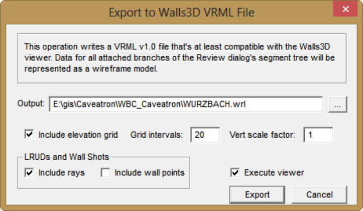
**128** **Walls Project Editor**

##### **6.7 Downloading GPS Data**

The direct download of GPS receiver data is currently restricted to the popular consumer models made by
Garmin. Although there are differences between them, Garmins are able to describe their capabilities when sent
special commands. This enables GPS software, including Walls, to account for various limitations and to work at
least on some level. For example, the GPS V stores altitudes with track points while the GPS III doesn't. Unfortunately, while there exists a widely supported GPS interface (NMEA) that's suitable for some purposes, we must
use the device manufacturer's proprietary interface to access stored track logs. The ability to convert track logs to
traverses is useful for creating karst feature maps showing roads and trails. Also, processing points in a track log
taken at one location is a good way to increase the accuracy of a position estimate and to determine what kind of
weight to give it when it's combined with other data.

To download tracks and/or waypoints stored in a Garmin GPS receiver, select **Download GPS Data** from the
File menu. (Downloading of routes, another GPS data type, is not supported.) The dialog box shown here will
open:

It's not necessary that a project already be open in Walls since the download operation will create a ready-tocompile WPJ file and one or more attached data files. The data files, one for each represented UTM zone, will
have individually assigned geographical references using the WGS84 datum. If you specify a restricted region of
interest for retrieved data, the reference's location will be that of the named waypoint at the region's center.
Otherwise, the reference's location will be that of the first recorded waypoint or track point. The project root folder
will be assigned the same geographical reference as that of the first (topmost) data file. Also, only the first data
file will be attached to the root with a connecting line. Therefore, compiling either the root or the first tree item will
process the first zone's data. The data files representing additional zones will be detached from the root. They
have to be compiled individually since the program currently doesn't support compilations spanning multiple
UTM zones.

If you wish, you can drag any of those data files to another project window -- an operation that preserves the
properties stored in the original WPJ file, including the references. The parent branch in the destination project
can have a different geodetic datum (such as NAD27), in which case Walls will perform a datum conversion
when the parent is compiled.

**Dialog Settings and Controls**

_Copyright © 2013 by David McKenzie_

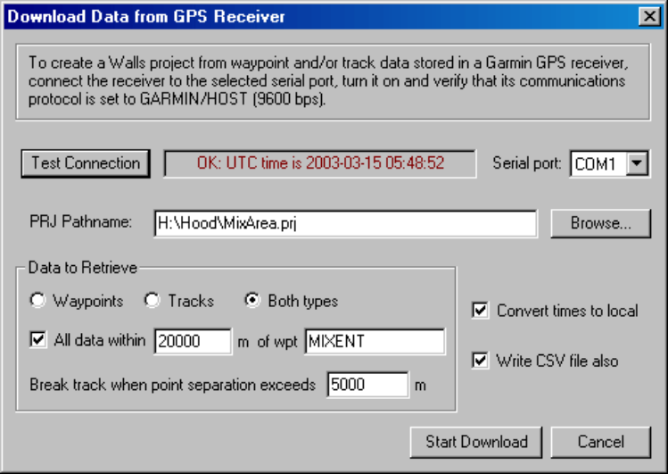
**Import/Export Features** **129**

**Test Connection**     - You should click this button after connecting and turning on the receiver, but before starting
the download. This is to verify that the device is successfully communicating at 9600 bps, the speed used by
Garmin's default protocol, GARMIN or GARMIN/HOST. If all is well, the receiver's Coordinated Universal Time
(UTC) will soon appear in a status box at the button's right (see above example).

**Serial Port**      - The name of the RS-232 serial port you connected the receiver to - a choice between COM1
through COM6. The program remembers the last port you used.

**WPJ Pathname**     - The location and name of the WPJ file that will be created and then opened. You can use the
**Browse** button to select or create an appropriate folder. The data files will be written to the same folder and
given names like MIXA-14R.SRV, MIXA-15S.SRV, etc., where the first four characters are taken from the WPJ file
name and the last three characters specify the UTM zone. You are warned if this would entail overwriting existing
files.

**Data to Retrieve**      - You can download waypoints, track logs, or both data types. In the latter case, waypoints
and tracks in a particular UTM zone are stored in the same SRV data file, waypoints first. Although it won't make
the download faster, you can save to the project only those waypoints and track segments that lie within a specified horizontal distance of a named waypoint. In the above example, anything beyond 20 kilometers of waypoint
MIXENT will be excluded from the project. If the **All data within** box is unchecked, every waypoint and/or track
segment will be represented.

Here is how waypoints and tracks are represented in the file:

      - **Waypoints**      - All waypoints in the UTM zone appear as #FIXed stations with UTM coordinates. They are
placed in a segment named "Waypoints." Elevations may be present or absent depending on the receiver
model. The stations have names identical to the waypoint names (up to 8 characters) and also have name
prefixes indicating the zone, such as WP-14R. The waypoint comment is saved as the station's note, usually
a timestamp unless it was changed in the field. Garmin's name for the waypoint symbol is saved as the station's flag.

      - Depending on the GPS model, waypoint names can have a maximum length of anywhere from 6 to 15 characters. Since station names in Walls are limited to 8 characters in length (excluding prefix), a waypoint
named "CAVE ENTRANCE" in a GPS V, for example, will appear in the project as "CAVE_:ENTRANCE".
The zone-derived name prefix, in this case, is replaced with "CAVE_". Also, any space characters in the
name are converted to underline characters.

      - **Tracks**      - Each track log segment in the UTM zone is represented by a #FIXed station followed by a series of
RECT vectors forming a traverse. The traverse is given a segment name, "Tracks/Log Name/yy-mm-dd",
where Log Name is the name of the track log and yy-mm-dd is either the date when the segment's first track
point was logged or else the date of download. The track points won't have timestamps if the track log was
originally uploaded to the GPS from a file. Timestamps are also missing from "saved" track logs with names
other than "ACTIVE LOG". Garmin's newer GPS models provide the option of creating a named track log
from all or part of the active log, a process that discards "unnecessary" track points as well as timestamps.
Also, the individual track segments are merged to form a single segment in the saved version. For this
reason you'll want to retain as much data as possible in the active log before tracks are downloaded. Both
the active log and all saved logs are included in the download.

      - Each station in the traverse is given a prefixed name of the form "yy-mm-dd:hh.mm.ss" indicating the track
point's time of logging when it's available. When a timestamp isn't available, yy-mm-dd is the download date
and hh.mm.ss is replaced with a sequence number. The #FIXed station (first track point) is assigned a flag
named "Track start." No notes are assigned.

      - Finally, each track segment will have a #Units directive containing an assignment of the form "rect=n
grid=n", where n is the UTM grid convergence calculated for the track segment's starting point. The "grid=n"
assignment overrides the convergence corresponding to the data file's geographical reference. The "rect=n"
assignment specifies that the RECT vectors in the traverse are grid-relative rather true north-relative.

**Break Track when Point Separation Exceeds** **(5000 m)**     - When a track log is being recorded, Garmin receivers
usually start a new track segment whenever a satellite lock is reacquired after being lost. This apparently doesn't
happen with all models, however. Also, the segmentation is lost when the active track log is "saved". As a result,

_Copyright © 2013 by David McKenzie_

**130** **Walls Project Editor**

very long lines can appear on your map when they're not wanted. Here you can specify the maximum distance
allowed between adjacent track points before the program removes the connecting line.

**Convert Times to Local**      - Times stored in the receiver are based on Coordinated Universal Time (UTC). Enabling this option insures that all times written to data files, such as those in track point names, are first converted to local times as determined by settings in the computer where Walls is running. These times are not necessarily local to the places where GPS positions were recorded.

**Write CSV File Also**      - Check this box to create a Comma Separated Value file (extension CSV) in addition to the
data files described above. This is a simple text file with date of download, datum name, and position data beneath the following column labels: TYPE, NAME, ZONE, EASTING, NORTHING, ELEV, DATE, TIME, SYMBOL,
and COMMENT. The CSV file is attached to the project tree's root as an item of type Other. Also, the Launch
Option is set to Open, which means that double-clicking the item's icon will open the file in whatever program is
associated with extension .CSV. You might want to use Microsoft Excel, for example, to compute the coordinate
means and standard deviations of track points obtained with the receiver stationary. (If you have Excel, it's likely
already associated with CSV files.)

**Start Download**     - When this button is selected, the status window (to the right of "Test Connection") will begin
serving as a progress indicator, showing download counts and totals for the waypoints followed by the track
points. At any time you can **Cancel** the operation, such as when a connection to the device can't be established
or when it's broken (intentionally or not). When that happens you're prompted to either save or discard what was
successfully downloaded.

#### **7 Integrated Applications**

##### **7.1 Walls2D SVG Viewer**

Walls2D is a browser-like application designed to recognize the Scalable Vector Graphics (SVG) files generated
by Walls. It also works if the files have been modified and rewritten by an SVG editor, such as Adobe Illustrator.
This means that if the SVG file has any of the named groups described in SVG Layer Definitions (specifically
w2d Walls, w2d Detail, w2d Survey, w2d Labels, w2d Notes, w2d Flags, and w2d Grid) their display can be
toggled on and off via toolbar buttons. The program will also recognize georeferencing information in a group
named w2d Ref. As you move the mouse cursor across the program's window, coordinates will be displayed on
the status pane.

Other types of SVG files, even normal Web pages and URL addresses, can be accessed as well. That's because
Walls2D functions as a container for Microsoft's Internet Explorer browser control, a component of most Windows
installations. (IE version 5.5 or greater is required.) The latest version of IE is available as a free upgrade at
[www.microsoft.com/windows/ie.)](http://www.microsoft.com/windows/ie/)

The program also functions as a container for Adobe Systems' free SVG viewer plug-in, ASV 3. You're actually
using ASV's functions when you zoom and pan a displayed map via the keyboard and mouse. When an SVG
document first loads, you'll see this message on the status pane: "To navigate: CTRL-drag to zoom in, CTRLSHIFT-click to zoom out, ALT-drag to pan, right-click to access other functions." Clicking the right mouse button,
for example, opens Adobe's context menu. From there, you can select Help to obtain more information about
available functions.

**Updated:** Adobe's plug-in is not part of the Walls installation package. When Walls2D attempts to open an SVG
file, it checks to see if ASV 3+ is already installed on your system. If not, you're informed of this and an About
[box displays a link that (last I checked) no longer leads us to the plug-in. Instead, you can use a direct link to](http://download.adobe.com/pub/adobe/magic/svgviewer/win/3.x/3.03/en/SVGView.exe)
[the setup file](http://download.adobe.com/pub/adobe/magic/svgviewer/win/3.x/3.03/en/SVGView.exe) at Adobe's website. Just download and run the setup executable (SVGView.exe). Except for the 2.2
MB file transfer, the process is fast and simple; there are no installation options.

**Important:** If you last installed ASV prior to an upgrade to Internet Explorer 9 or newer, you' likely need to reinstall ASV.

Walls2D keeps a list of recently-opened SVGs, opening the most recent one if it's launched without an argument. If there are no recent SVGs, it tries to open a compressed SVG file named "walls2D.svgz" in the Walls2D

_Copyright © 2013 by David McKenzie_

**Integrated Applications** **131**

program directory. (A small sample map comes with the Walls installation.) One way to send someone an SVG
map you've created is to save it as a compressed SVG named "walls2D.svgz", then bundle it in an archive with
walls2D.exe. Note that one of the choices in Adobe's context menu saves the loaded document as either a compressed or uncompressed SVG file.

**More Details**
Another context menu choice is to view the loaded SVG file as text ("View Source"). If the SVG was exported
from Walls, you'll see comments that describe (to a minimal extent) the file structure and how you might change
certain display attributes with a text editor. If you're inclined to explore further, you may want to know how Walls2D communicates with the SVG document when displaying layers, coordinates, and so forth. When instructed
to open an SVG file (extension svg or svgz), the program doesn't load the file directly. Instead, it generates a
small HTML "wrapper" file (walls2D.htm) and instructs the browser control to load it. The HTML contains a reference to the SVG file and also a set of JavaScript functions serving as the communications link. Walls2D uses
one of those functions, for example, to determine which of the above named groups, or layers, exist in the SVG.
The corresponding toolbar buttons are then grayed out for those layers that don't exist. The HTML wrapper file is
not erased; the last one generated can be found in the Windows %TEMP% directory, which for Windows versions Vista and above is normally "C:\Users\<name>\AppData\Local\Temp."

**Planned Features**
Since an SVG can have image elements (linked PNG files), a planned enhancement is support for another layer
named "Image". This will be a PNG background image that the Walls export function takes from a georeferenced
TIFF (or PNG) file attached to the project. The next Walls2D release will also offer a better printing function (see
below) and a way to convert the current view to a raster image with a specified resolution.

**Future Availability of Adobe's SVG Viewer**
[Although Adobe ended official support of the viewer in January 2009, the ASV EOL FAQ](http://www.adobe.com/svg/pdfs/ASV_EOL_FAQ.pdf) states the following :

_Adobe does not currently have plans to remove Adobe SVG Viewer from the Adobe.com download area. Adobe_
_recognizes that customers have built Web applications that depend on ASV being available for download, and al-_
_though Adobe does not plan to develop ASV further, we plan for the existing versions to be available for download_
_as long as our customers rely on them._

The FAQ also mentions some limitations of the viewer when running under Windows Vista, such as
the View Source context menu option not working. (This has in fact worked on my computers running Vista 64-bit SP1 and Windows 7 64-bit and Windows 8.1 64-bit.) These limitations are apparently minor and don't affect the functioning of Walls2D. Nevertheless, I'm investigating other options
for rendering SVG content, particularly using the capabilities now available in recent versions of IE.

**Printing from Walls2D**
While Adobe Illustrator has better facilities for printing SVG, Walls2D does provide the standard IE-based printing functions in the File menu: Print, Page Setup, and Print Preview. Unfortunately, in part due to issues with the
interface between Internet Explorer and Adobe's plug-in, an attempt to print will likely result in a poor-quality
map with the wrong aspect ratio. (The grid cells, for example, won't be square.) Accidentally, I discovered the following workaround for obtaining a printout with the correct aspect ratio using IE 8. Later versions of IE behave
differently and you'll likely need to experiment to get a decent result.

1) After Walls2D is opened, select File | Page setup and choose landscape mode.

2) Next, select File | Print Preview. The first time you do this, you'll see a fairly crude rendering of the map. Also,
the aspect ratio will probably be wrong, just like with a printed version. Note that if you right-click on the image,
no context menu pops up.

3) At this point, close the preview window by clicking on the 'X' at the extreme upper-right corner of the window.
Important: Do _not_ close it by clicking on the toolbar button labeled "Close" (if present). If you do, the next step
doesn't work!

4) Again, select File | Print preview. This time (and at subsequent times) the preview image will look different.
You will have the original non-zoomed view and the quality will be better. Also, a right-click of the mouse will
bring up Adobe's context menu. You can then use the mouse (and only the mouse) to zoom to the portion of the

_Copyright © 2013 by David McKenzie_

**132** **Walls Project Editor**

image you want to print. Be careful not to touch the keyboard! Pressing ALT, for example, will crash the print
preview function, producing the message, "There was an internal error, and Internet Explorer is unable to print
this document."

5) Finally, print the image by selecting "Print.." from the Print Preview window toolbar. You should get a good
result.

The only problem I've found with this bizarre workaround is that any layer visible when the document was loaded
will be present in the printout, even though you may have toggled it off. Therefore, it helps that the SVG export
function of Walls lets you choose which layers are initially visible. This bug occurs not only with Walls2D, but
also with IE/ASV when accessing many of the SVG files posted on the Internet. Only certain kinds of SVGs seem
to be affected: those intended to fill the browser window, but in a manner that preserves aspect ratio. That's the
kind Walls2D needs to display and print.

##### **7.2 Walls3D VRML Viewer**

The 3D file export option of Walls produces standard VRML v1.0 text files (extension WRL) that represent your
surveys as multicolored, 3-dimensional wireframe models. LRUD and wall shot dimension lines, along with the
"point cloud" formed by their endpoints, are also optionally represented. A simple VRML viewer program, _Wall-_
_s3D.exe_, is part of the Walls installation and will be present in the same folder as Walls. It requires an OpenGLcapable video system, something all computers running Windows have these days. If you wish, you can configure Walls to use a different program for displaying the VRML files you generate. (Use the menu item, Options |
3D File Viewer.) By default, Walls will launch Walls3D when it's appropriate. See Exporting VRML files for more
information.

Although there is no help file, you should have little trouble using the toolbar buttons, mouse, and keyboard to
explore different 3D views of the wire-frame. Simple instructions appear on a status pane at the bottom of the
program's window. An often overlooked feature is the program's ability to view multiple VRML files at once.
Opening new files will add panes to a tiled set of 3D views that can be independently manipulated.

#### **8 Background and Tutorial**

##### **8.1 Network Terminology**

Here are a few definitions pertaining to the geometry, or physical connectivity, of a survey network. Our usage of
such terms as _vector, loop system,_ _traverse chain_, etc., is not meant to suggest a terminology accepted by most
cave surveyors, but is intended to help you understand the Geometry page of the Walls review dialog and its
function as a data screening tool.

In discussing the geometry, we use the term **vectors** to denote the elemental components of a survey network,
the observed displacements between pairs of named **stations.** Usually they are the shots (or legs) we record in
our field books, each consisting of a set of actual measurements convertible to a three dimensional vector. They
can also be the vectors connecting so-called control points (GPS fixes, locations scaled from maps, etc.) to an
implied zero reference.

Cave surveys can contain vectors that are deficient in either of the horizontal and vertical dimensions. Radio locations and some GPS fixes have no observed vertical component, while vectors that serve only to constrain
points to a known level (an underground lake, for instance) have no horizontal component. In fact, vectors restricted to one or two dimensions will arise routinely in the context of this program, where we will be throwing out,
if only temporarily, the vertical and/or horizontal components of traverses.

Therefore, it's important that the geometric terms we will be using are separately applicable to each of the horizontal and vertical components of a survey network. Even with this qualification, some kinds of survey measure

_Copyright © 2013 by David McKenzie_

**Background and Tutorial** **133**

ments don't neatly fit this simple vector model (e.g., turned angles, triangulations, incomplete shot data), but
they are comparatively rare in cave surveying and shouldn't complicate this discussion of basic terminology.

**Components and Loop Systems**
Two vectors are _connected_ if they share the same named station as an endpoint. A set of vectors is **consistent** if
the connectivity indicated by their named endpoints is compatible with the values of their components. In other
words, assuming their components are east-north-up displacements, consistent vectors can be plotted to show
their connectivity with no distortion or "misclosures". Since only the simplest cave surveys are consistent in this
strict sense, we will associate consistency with certain numbers, or statistics, that can be computed from the
data. These numbers will help us assess the severity of misclosures.

A **traverse** is one vector or a sequence of vectors connected end-to-end. Here we are using the term to denote a
geometric entity, not an activity carried out by a particular team of surveyors (or result of such). A **loop** is a
closed nonintersecting traverse -- one in which the starting and finishing endpoints are the same and each intermediate endpoint is encountered only once. Traverses can also form _traverse chains_ (described below) for
which data screening statistics are computed in Walls.

A survey **network** is a collection of vectors consisting of one or more **connected components,** each being, as
you might expect, a maximal subset of vectors having the property that between any chosen pair of stations
there exists a traverse connecting them. (If the stations are fixed with respect to a common datum, we consider
that a traverse in this geometric sense.) If there is only _one_ traverse connecting them, then that traverse (and
each vector therein) is termed a **bridge.** When a portion of your project's data is compiled by Walls, the separate pieces of the resulting network are listed under "Components" on the Geometry page. You can then choose
which one of these you want to examine in detail.

A **loop system** is a maximal subset of vectors such that given any two vectors in the subset there exists at least
one loop containing them both. All vectors are either bridges or parts of loop systems. It is the nature of some
adjustment methods (e.g., least-squares), that one vector's measurement will contribute to the final estimates of
all vectors in the loop system that contains it. Also, the effect on consistency of a bad measurement will not extend beyond the containing loop system. In Walls, loop systems are important since we will be picking them
apart during the data screening process.

**Traverse Chains**
We can now describe the parts of a survey network that will be the main focus of our attention when searching
for data errors. Two vectors in a loop system belong to the same **traverse chain** if every loop that contains one
of them contains them both. Each loop system is uniquely decomposable into a set of traverse chains, not loops.
These objects are of special interest to us since they are the smallest components of a survey network to which
blunders can be localized due to bad loop closures. (Here we're assuming nothing about a vector's error probability.) In the past, cave software developers have used the term string to describe the traverses to and between
"junction" stations and "dead-end" stations, but for our purposes traverse chain is a more useful concept. By
definition, dead-end traverses, bridges between loop systems, and articulation points, are excluded from consideration. (Note: Traverse chains were called "links" in earlier versions of Walls.)

If some vector's measurement were grossly in error, we might narrow its location to a traverse chain, but not to a
specific member of the chain without making further assumptions about the error. The members of a multi-traverse chain, which we'll call **chained traverses**, all have the same F-ratio and the same best correction. On the
Geometry page in Walls, a loop system's traverses are initially sorted by their decreasing F-ratios (horizontal and
vertical combined). This usually allows us to recognize chained traverses by a grouping of two or more traverses
with identical statistics. (The statistics are also displayed with a gray instead of white background.) Another way

_Copyright © 2013 by David McKenzie_

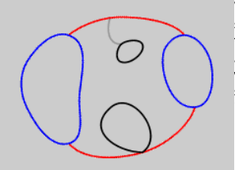
**134** **Walls Project Editor**

to detect these objects is by inspecting the Map page. When a chained traverse is _selected_, it's colored red on
the preview map while the other members of the chain are colored light blue.

You'll discover that floating a chained traverse has the immediate effect of turning the other traverses in the
chain into bridges _._ This means they are technically no longer loop components but instead are unadjusted connections between what are now separate loop systems. Unlike ordinary bridges, which are unfloatable, chained
traverses that were made bridges by the floating of other chain members are themselves "floatable" in a sense.
When you float multiple parts of a traverse chain via the Geometry page's Float button you are selectively distributing the best correction across the entire chain. For details, see Floating Traverse Chains.

**Loop System Properties**
An important property of a loop system and one that largely determines the effectiveness of statistics measuring
consistency is the **loop count,** or the number of redundant traverses it contains. This can be calculated as the
number of (unfloated) traverses minus the number of _traverse junctions_ plus one. (A 1-traverse system is a special case and is regarded as having a loop count of one.) In the Geometry dialog both the horizontal and vertical
loop counts are displayed for the selected system. You'll see that floating a traverse reduces the loop count by
one.

Finally, some surveys contain numerous **isolated loops**, each being a 1-traverse loop system. The above diagram, for example, shows two isolated loops -- one attached to the larger system by a bridge and the other by
an articulation point. In the Geometry dialog, Walls lumps these together as if they were a single loop system for
display and analysis purposes.

For a discussion of how network geometry relates to data screening in Walls, see Data Screening Tutorial.

##### **8.2 Data Screening Tutorial**

This topic is a mini-tutorial that describes how the data screening tools can be applied to an actual data set. It
may be enough to get you started if you want to avoid plowing through the help file from start to finish. For a
more complete description of the pertinent dialogs, and for a more detailed explanation of the displayed numbers, see Geometry Page and Traverse Page.

When you compile a project tree branch and observe the Geometry page of the review dialog you may see several "Loop Systems" listed for the network fragment that's highlighted under "Components". Only multiple-traverse systems are listed in this upper list box. (A lower 1-item list box is used to select the 1-traverse systems as
a group.) Those systems with the worst statistics, or largest combined UVEs, are listed first. A "Traverses" list
box on the right shows the traverses for the selected system, also arranged with the worst entries at the top. For
example, here is the top part of the Geometry page as it appears after compiling Paxton Cave, a 7-mile long,
327-loop maze:

The game you play while data screening is "float or correct all traverses with conspicuously large F-ratios while
reducing each loop system's UVE to as small a value as possible". In the process you should locate and correct
bad measurements within traverses, or single out whole traverses that are so obviously incompatible that they
should be permanently floated so they don't distort the map. What size UVEs to expect will obviously depend on
many factors. (See Variance Assignments.)  My experience has been that a single surveying team employing
Suuntos and fiberglass tape can consistently achieve UVEs (both horizontal and vertical) smaller than 1.0. In a
large project involving multiple teams, UVEs less than 2.0 might be a more realistic goal.

_Copyright © 2013 by David McKenzie_

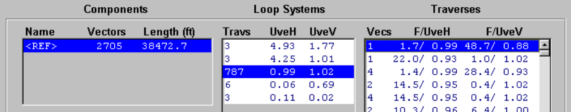
**Background and Tutorial** **135**

The results for Paxton Cave meet these expectations almost perfectly. The horizontal and vertical UVEs (all systems combined) are a remarkable 1.00 and 1.02, respectively. We'll use this data set, exactly as it was provided
to me by Bob Thrun, to illustrate some powerful data screening techniques. In the process we'll quickly locate
several errors whose obvious fixes would lower the vertical UVE to 0.75.

First, note that we've highlighted the cave's largest loop system, which has 787 total traverses and a vertical UVE
(UveV) of 1.02. We've also selected the system's worst traverse, one that shows "48.7/ 0.88" in the F/UveV
column. The top number (48.7) is the F-ratio, which measures the traverse's "agreement" with all other traverses
in the loop system. A value of zero represents perfect agreement. A value of one is close to the expected agreement. In this case, F is _much_ greater than one, which means that the system's vertical consistency will improve
significantly if this traverse alone is discarded. In fact, UveV will drop from 1.02 to 0.88 (the number beneath the
slash). If F had been smaller than one, detaching the traverse would actually worsen consistency; the number
beneath the slash would have been larger than 1.02. Hence the bottom number is what the new UveV will be
after the traverse is discarded -- something we can immediately verify by clicking the "FloatV" button.

Before continuing with this example, I should comment about the statistics in general. Our approach is not to
apply formal rules to automatically identify and reject bad measurements. Although we could determine the
probability that an F-ratio will have a value less than X given certain assumptions, a less formal approach based
on experience with real data is far more effective in my opinion. It's not hard to quickly get a feel for the statistics
as we locate "outlier" traverses and confirm they are caused by blunders of various kinds. I suggest that in a
sufficiently large and debugged loop system -- say with a loop count of at least 5 -- the F-ratios should be fairly
smoothly distributed between 0 and 5, with perhaps a few between 5 and 10. Anything above 7 is certainly sufficient cause to recheck the field notes. When a loop system is very large, with hundreds of traverses, the system
UVEs could be within tolerance even when some outstanding F-ratios reveal several outliers. The Paxton Cave
example demonstrates this. It's therefore important to screen all loop systems -- even those with small UVEs.

**Graphical Review**
Once we highlight a traverse near the top of the list there are two routes to follow in discovering why its numbers
are so bad -- possibly so bad as to be unprintable, in which case you'll see a set of dashes: "--.-". What I would
probably do first is click one (or both) of the "FloatV/FloatH" buttons underneath the list box. This reprocesses
the loop system and refreshes the displayed statistics; the respective components of the traverse are effectively
thrown out. Immediately after this I would click the "Zoom" button to display the dialog's Map page homed in to
the floated traverse. Shown in yellow is the uncorrected raw traverse as it was originally measured. Shown in
red is the traverse as it would now be seen on a printed map. The red version "floats" to fit the now independently adjusted network. If we had zoomed without floating first, we would see _only_ a red adjusted version and
the network around it would likely be distorted by its effect. After floating the worst (topmost) traverse in Paxton
Cave and then zooming in to its profile, we would see something like this:

At this point, common problems like misnamed stations, reversed From/To names, and reversed signs on inclinations should be easy to spot. You may want to click the tool bar button that toggles between attaching one end
or the other of the yellow traverse to the corresponding network station. In this particular case, however, we see
that the correct end is already attached. Obviously a shot was made from the bottom of a 6-foot vertical drop
rather than from its top, as the data wrongly implies. To see a map with station labels we need only click the
Display button in the "Displayed or Printed Map" section of the control panel.

_Copyright © 2013 by David McKenzie_

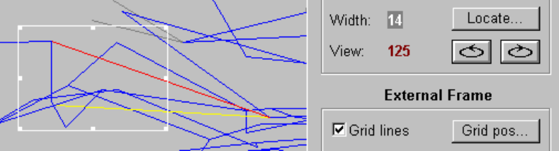
**136** **Walls Project Editor**

By inspecting the map we see that the shot was probably recorded incorrectly
as B7 to B14 instead of B8 to B14. Of course it's conceivable that the problem
is a 15-degree error in the measured inclination coupled with a 2-foot error in
distance (as determined by inspecting the Traverse page). But given the fact
that the free end of the yellow traverse comes to within inches of a station it
could easily connect to (B8), we can confidently say we found a station
misnaming problem -- one that would be easy to miss in a horizontal maze
since the plan is essentially unaffected.

**Review Best Correction**
The other route to follow is the Traverse page of the Review dialog. (Double clicking on a list box item in the
Geometry page is a quick way to select a particular traverse while switching to the Traverse page at the same
time.) This page shows the uncorrected vectors of the selected traverse in their proper sequence, each transformed into spherical coordinate measurements whether or not they were derived from compass and tape data.
These measurements may not reflect their original units, but this is not normally a problem if you realize that the
declination, convergence, and instrument corrections have already been applied to obtain true north (or grid-relative) bearings. There is a check box in the upper right corner of the page that toggles between feet and meters.

Above is the top portion of the Traverse page as it would appear after selecting the _third_ traverse listed for Paxton
Cave's big system. This traverse originally had the second worst vertical F (28.4). Now that we've detached the
misnamed station, its new vertical F of 33.4 happens to be the worst. To the right of each raw vector is a set of
three corresponding measurement increments, or suggested corrections. If all three increments for _just one vec-_
_tor_ were to be applied then the traverse would close perfectly with the remaining network (adjusted with that traverse omitted from the data) and both F-ratios would be zero. The closure vector, the traverse's best correction,
can be inferred from the increments, but it's also displayed as east-north-up components at the bottom of the
Traverse page (not seen here). By definition, the best correction is the same whether or not the traverse has
been floated; there's no need to float a traverse before examining it on the Traverse page. However, floating or
correcting _other_ traverses first, if they are bad, will often affect these numbers, making them more likely to match
an actual error in the data.

As illustrated above, several of the traverse's vectors can have measurements and corresponding increments
highlighted in red. Each of the three measurement types (distance, bearing, and inclination ) has a user specified tolerance level, in this case 3 feet, 5 degrees, and 5 degrees. (See Options | Compilation | Vector Highlighting... in the Walls menu.) If exactly _one_ of the increments is out of tolerance, then both it and its corresponding measurement are colored red instead of blue. Thus attention is drawn immediately to any _single meas-_
_urement_ that would alone fix the traverse if corrected.

_Copyright © 2013 by David McKenzie_

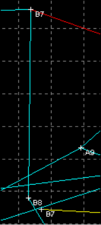

**Background and Tutorial** **137**

Here we see that three of four traverse vectors meet this criterion. Of the three inclination corrections that are
highlighted, the last one in particular gets our attention: namely -15.0, which when added to the original 7.50
measurement amounts to a sign reversal. Of course we would examine the notes and sketch if they were available, but without them we strongly suspect that "-7.5" instead of "7.5" should have been recorded for shot M80
to M124. The other possibilities are less likely but can't be discounted entirely. For example, the second vector
(M125 to T5) fails to meet our criterion for highlighting, but perhaps we should treat this pure vertical shot as a
special case. Simply changing this vertical distance from "3.2" to "8.2" would eliminate the traverse's vertical
misclosure while having no effect on horizontal consistency.

We can continue in this fashion. For example, floating this traverse produces a new set of statistics, the worst
vertical F (29.8) now belonging to a 3-vector traverse with a sign reversal even more obvious than the one just
diagnosed. The Traverse page suggests we add -26.6 to the 13.0 inclination measurement in shot A11 to A12.
Likewise, we can focus attention on the system's horizontal statistics, the worst being a horizontal F of 22.0 for
the second traverse listed.  Here a -6.8 foot correction in distance is suggested for shot HC37 to HC18. Perhaps
"21.1" was mistaken for "27.1". The next worst horizontal F happens to be for a pair of chained traverses . Such
traverses necessarily have identical statistics and can be treated as if they formed a single traverse. Within them
several suspicious measurements are highlighted, and it would take just a few minutes to check them against
the field notes if they were available. Overall, the horizontal consistency is remarkably good. After floating just
five of the 787 traverses, the horizontal UVE is reduced from 0.99 to 0.81 with F-ratios all in the single-digit
range.

Finally we come to the most gratifying step in the process. Once we are in the Traverse page, we can doubleclick a vector to open an edit window into the appropriate survey file, with the vector's data line highlighted. We
will be doing this often to correct mistakes we've confirmed by examining our notes. Although it's often possible
to winnow out multiple bad traverses interactively by simply floating them in succession as we've done here, it's
usually better to correct mistakes as soon as we find them and recompile. This way the new data can play a role
in exposing further inconsistencies.

The Paxton Cave survey data was obviously in very good shape when I received it. It's also characteristic of a
dense horizontal maze. I'll finish this overview with something closer to what you'll encounter if you use Walls
with some existing large project data sets. Multiple blunders in systems with significant vertical relief can actually be fun to ferret out.

Below is a 500-foot wide plan view of part of Lechuguilla Cave's "South" survey as it was sent to me by Dale Pate
in June, 1996. Highlighted in the Map page's preview map is the topmost listed traverse after _thirty_ of 643 traverses were successively floated -- a mechanical process in which simply the worst remaining traverse was
floated at each step. This brought the horizontal UVE of a 258-loop system down to 6.7 from an initial high of
224.4, with the horizontal F finally ranging from 0 to 10.

Our hope is that this initial screening phase leaves us with enough good data (613 traverses) to help us in the
next phase: determining _why_ each floated traverse is so grossly inconsistent. As it happens, many of the traverses are bad simply because their endpoints are misnamed, and we can make several fixes without even referring to the original notes. For example, the free end of the traverse highlighted above, which is named FNHA3 in
the data, comes to within 7 feet horizontally and 2 feet vertically of FNHC3. (If we had omitted the first phase
and floated this traverse alone, it would have come to within 14 ft and 5 ft, respectively.) No other station in the
vicinity is this close in _either_ dimension nor has a name this similar to FNHA3. The real FNHA3 is about 400 ft
horizontally and 160 ft vertically away from FNHC3.

In projects like Lechuguilla Cave, one can easily imagine how useless unadjusted plots of the entire data set
would be in trying to specifically identify such problems. You'll notice that Walls doesn't even offer the option of
producing a plot in which the selection of detached traverses is completely arbitrary. (You can instead highlight
all _floated_ traverses on the map.) Likewise, the common approach of examining _residuals_ (also known as "error

_Copyright © 2013 by David McKenzie_

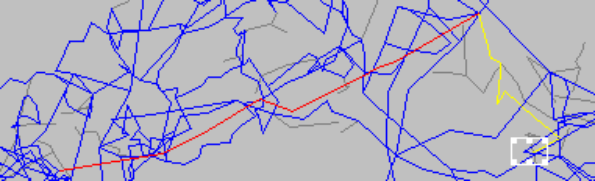
**138** **Walls Project Editor**

ratios"), which are based on how much each traverse is actually corrected by a single all-encompassing adjustment, would be of very little help.

**Additional Notes On the Statistics**
If you use this program extensively you will occasionally see a large vertical component F-ratio, even though the
containing loop system's vertical UVE may in fact be strikingly small. You'll recognize this as a loop system
(usually a small one) where almost all of the vertical angle measurements are _exactly zero,_ resulting in near perfect vertical closure. In this case, even though a traverse's vertical error may be acceptable (but nonzero), its
corresponding F-ratio could be quite large. You might see "--.-/0.01" in the F/UveV column of the Geometry
page. Obviously, statistics inflated by such circumstances are no cause for concern.

This illustrates an important property of F-ratios compared to UVEs. Unlike a loop system's UVE, which is sensitive to the magnitude of assigned variances, an F-ratio does not depend on any prior notion of what constitutes a
"small error" when evaluating a traverse's misclosure. The basis for comparison implicit in an F-ratio is just the
internal consistency achieved by other traverses in the particular loop system being examined. (An isolated loop
is a special case, where we have decided to use all _other_ isolated loops as the basis for comparison.)

Given the likelihood of multiple blunders in large loop systems, the F-ratios are more useful for the relative ranking of traverses within a single system than for comparing traverses in different systems. In a system where
many of the traverse measurements are bad, the F-ratios could all be small in magnitude (say, less than 7), with
the UVEs after detachment all in the double-digit range. This situation is easily created by accidentally mixing
different surveys with duplicated station names, or by combining the work of teams using uncalibrated compasses. It is primarily for this reason that Walls displays for each traverse _both_ the F-ratio and the UVE after detachment. The F-ratios by themselves would not be as informative.

Another point worth noting concerns the best corrections. Unlike a loop closure error, a large best correction in a
traverse does not by itself imply that the traverse is bad, since the remaining portion of the system could in fact
be a poor estimate of the corresponding displacement. A best correction should be considered a _suggested_ correction only when the F-ratio is large, meaning that the loop system's UVE would be lowered significantly if the
traverse were discarded. When a suspect traverse is less than, say, 10 vectors in length, the best correction can
be informative in singling out specific measurements as candidates for correction as was seen above. For longer
traverses the best correction tends to be less useful as an estimate for the error in any one vector -- unless it's
something as dramatic as a 30-meter distance being recorded as "300".

Finally, if you are familiar with the mathematics of least-squares, you may have noticed that the statistics (e.g.,
best corrections) are defined in a way that suggests a loop system with, say, 500 traverses might require 500
separate solutions to the equations representing the adjustment problem. If so, then your understanding of the
statistics is on track since that is indeed one possible approach. This program, however, employs a direct solution method that obtains the statistics for all traverses in one pass. See Statistical Formulas for more details.

##### **8.3 Easily Overlooked Features**

Here are some miscellaneous program features which, for whatever reason, are in danger of being misunderstood or overlooked completely. Some of them are recent additions. I expect to update this list fairly often by
simply appending new items to it.

**Enter Key Behavior**
The first thing you'll notice when using the Walls editor is that the ENTER key, by default, skips to the next tab
stop instead of inserting a line break. You can end the line with either two successive ENTERs or a CTRLENTER (which inserts a line break). This behavior makes entering tab-delimited data via the numeric keypad especially easy. Also note that the grid lines (vertical bars) are due to the inserted tab characters. You control this
behavior, along with tab spacing, grid line presence, etc., via the Options | Editor series of dialogs.

**Looking for Duplicate Vectors**
Prior to compiling a branch of your project tree for the first time, you should turn on the **Options | Compilation |**
**Look for Duplicates** menu option. (There is a toolbar button for toggling this option on or off.) This will cause
compilation to be interrupted when two vectors with the same pair of FROM/TO names are encountered, which is

_Copyright © 2013 by David McKenzie_

**Background and Tutorial** **139**

likely the result of unintentional duplication. Since this slows compilation significantly, the option is initially
turned off each time the program is started.

**Search Options**
Various kinds of search operations are provided via the **Search | Find** menu option. You can also click the binocular icon on the toolbar (or the arrow icons on either side) to invoke a search or search-next function. For details, see Search Operations. Basically, the functionality depends on which kind of window is active:

      - If an edit window is active, the search options are basically the same as that of many other Windows text editors.

      - If a _project tree_ window is active you are given the opportunity to search all files in the _selected tree branch_
(opened or not) for the specified text. All survey files that contain the text (e.g., a station name) will then be
flagged with a red check mark on the tree diagram. Subsequent opening of a checked file will automatically
position the cursor at the first highlighted match. Additional matches in the file are accessed by clicking the
"find next" icon (a right arrow).

      - If the Geometry page of the Review dialog is active, the search operation will locate the component, loop system, and traverse (if any) containing a specified _vector._ You are prompted to enter a pair of station names in
any order. Note that the text editor's right-click menu provides an option to jump directly to the statistics for a
vector defined on the current line -- no need to search in that case.

      - Finally, if the Map page of the Review dialog is active, the search option allows you to position a small tracker
rectangle over a named station. The "find next" operation will do the same, using the previously searched for
station as a target, or the component's reference station (or first "fixed" station) if this is the first search.

**Setting the Size of Displayed Maps**
Like printed maps, the size of screen map windows you generate via the Map Page's "Display" button is customizable. You can do this by setting the "frame width" in the **Options | Displayed maps** dialog . A much easier
way, however, is to right-click an existing screen map and select **Resize map frame** from the popup context
menu. You can resize the current window (effectively changing the map's resolution) and optionally reset the default size for future windows. See Displayed Maps.

**Station Labeling, etc.**
Note that the Options | Printed (or Displayed) maps dialogs allow you to change the spacing between station labels and notes. The default spacing (gap) is 1, which produces the densest labeling without overlap. Use larger
values for sparser labeling. Use 0 to ignore overlap and label all stations. With each new version of the program, be sure to check out the other settings in these two dialogs. Although you shouldn't need to change the
settings often, you may want to experiment to determine what's best for your monitor and printer. Any changes
you make are automatically saved.

**Choosing Fonts**
Character fonts are often problematic in Windows programs since they are so dependent on display settings and
particular device drivers. Be sure to run through the **Options | Fonts** settings that are possible. You may want
to experiment with the station label fonts for both display and printer. Realize that the point size for TrueType
fonts can be _smaller_ than any of the choices you are given in the font dialog's drop-down list. (You can enter it
explicitly.) For example, on my 1024x768-resolution display, I find point 6 _Arial_ a good choice for labels. Point 5
_Small Font_ is smaller but slightly less readable. Point 5 _Arial_ is unreadable.

Also, the Geometry and Traverse pages of the Review Dialogs employ a fixed-space font for tabular data. You
can select **Options | Fonts | Review tables** to choose a font style (bold, italic, face name, etc.) other than the
initial default; however, unlike the other font choices in Walls, you cannot choose a proportional font. Neither can
you specify its point size since it will be sized automatically.

**Vector and Coordinate Listings**
Currently there are no report _printing_ options in Walls itself. (Only maps are printed.) However, a text file with
coordinates and other statistics can be generated for selected portions of the _segment tree._ To obtain one, go to
the Segment page of the Review dialog, select a _collapsed_ branch of the tree and click **Reports**, or click the right
mouse button. In the Adjusted Totals dialog that pops up, click **Coordinates** to open the Vector and Coordinate
Reports dialog. From there you can create a file, <name>.LST, in the project's work folder while simultaneously
placing it in the Walls editor. <name> is the workfile base name of the compiled branch. Preexisting files with

_Copyright © 2013 by David McKenzie_

**140** **Walls Project Editor**

that name are automatically overwritten. With vector lists, use the mouse shortcut described below for quickly
jumping to a vector's definition in the raw data.

**Mouse Shortcuts**
Besides the normal method of double-clicking on a file icon in the project tree to open a file, there are other
methods of file opening that result in a vector of interest being highlighted in gray:

     - Double-click a vector in the Traverse page of the Review dialog to open an edit window into the data file with
the vector's definition highlighted.

     - In the Files list box of the Geometry page, double-click a file name to open an edit window into the file. If
the name clicked on was highlighted in red, a vector adjacent to the network component's reference station
will be highlighted.

     - When using the editor to scan a vector listing (see above), double-click anywhere in the colon-separated file
name and line number (the rightmost column) to open the respective data file.

When working with the preview map, several shortcuts are available. They are described in more detail under
Map Page:

     - Left-click and drag to open a "tracker" rectangle.

     - Double click in a tracker rectangle to "Zoom" to that view.

     - Left-click and drag with the CTRL key down to pan across the image (also works on the Page Layout page).

     - Right-click and drag with the CTRL key down to rotate the image in 1-degree increments.

     - Right double-click anywhere to zoom out.

     - Double click on the desired center point to pan to that location.

**Creating New Projects**
The menu selection **File | New Project** gives you the opportunity to select a folder and name for the project
script file by way of the familiar file creation dialog. Since it's often convenient to establish a new project in its
own folder (unless it's sharing another project's data), you may at the same time want to create a new folder beneath the folder that's actually selected. This is easy to do by simply prefixing the name you enter with the desired folder name -- for example, "JEWEL/JEWELL.WPJ". In fact, you can specify an entire pathname to create
a set of nested folders if necessary. In a similar fashion you can create new folders via the **File | Import** and
**File | Save as** dialogs.

#### **9 Advanced or Special Topics**

One or more of these topics may be of interest to you, especially if you are active in the design of Walls or similar
software. The topics are not necessarily related, and none of the information is needed for effective use of the
program.

Workfiles Created by Walls
Choice of Mathematical Model
Error Propagation in Long Traverses
GPS Position Accuracy Table
Statistical Formulas
Tree Survey Example
The Missing Measurement Problem
Height Measurement Pitfalls
Accessing Walls from Other Applications
Regular Expression Searches
Floating Traverse Chains

##### **9.1 Workfiles Created by Walls**

When an item in the project tree is compiled, whether it be an entire branch or just a leaf (survey), a database
consisting of a group of five binary files is generated and placed in the project's work folder. The file names are
constructed from the 8-character **workfile base name** (or survey file name), which is a property specified for the
particular item being compiled. (See Properties: General Page). Currently Walls creates files with the following

_Copyright © 2013 by David McKenzie_

**Advanced or Special Topics** **141**

extensions: **NTA**, **NTAC,** **NTV**, **NTS**, **NTN**, **NTP**, and (optionally) **NTW** . Also, any coordinate listings (extension
**LST** ) you might want are created in the work folder.

The **NTA** workfiles are particularly important since they store various configuration and display settings you've
assigned to the compiled item. These include the sizes and colors of map features, last-saved map view, grid intervals, and so forth. (The **NTAC** files, which store defined color gradients, are considered part of the NTA file
set, as are gradient snapshot files with extensions **NTAE**, **NTAD**, and **NTAS** .) The backup archive feature therefore gives you the option of including all NTA files in the project backup. There is one catch, however. Since the
NTA file format is rather complex and subject to change, it has not always been possible for a new version of
Walls to read the NTA files of an older version (depending on how old). Hence the occasional need to recompile,
and, in the worst case, make new display assignments. (See note below.)

**How They Are Used**
The database is used during Review operations. Also, to preserve current configuration settings, the existing
NTA component is read during the recompilation of a project tree branch. Since the entire database can be
quickly regenerated (albeit with default display settings), there's no need to archive it with the all-important WPJ,
SRV, and SVG source files -- except you may want to save the NTA file. The database is self-contained and can
be deleted ( **Edit|Purge item workfiles...** ) without affecting the status of other items in the project tree.

Although each and every item in a large project tree _can_ be compiled, this would likely be a waste of disk space
since there's seldom a need to review the network geometry at every level of the hierarchy. For example, if a
book contained just one survey, compiling each (book and survey) would create separate but essentially
identical databases with respect to processed data.

During review operations, however, a database is revised to also contain assigned map attributes such as grid
spacing, colors, and line styles. These assignments can get complicated for a network with numerous segments. Therefore, to get around the fact that Walls currently stores only one set of assignments in each database, you may on occasion want to insert a book node (a one-child parent) in the tree. In its database you could
store a special set of assignments -- colors, for example, suitable for your printer but not the screen. Alternatively, you can maintain a separate project tree (linked to the same survey files) for this purpose.

**How Walls Keeps Track of Currency**
Built into each database is a 32-bit code (checksum) constructed from the names, sizes, and last update times of
all of the incorporated survey text files. When Walls opens a project, it scans the disk to determine whether
databases are up-to-date and colors the respective project tree icons accordingly (blue if up-to-date). Walls updates these icon colors automatically as you edit files, rearrange the tree, attach/detach branches, etc. Simply
_reordering_ children will not cause a parent's icon to change color, since the particular order that survey files are
encountered in a branch traversal -- either in compilation or in computing the checksum -- is considered irrelevant. Actually, order is not _completely_ irrelevant. Flag symbol priorities and the assignment of the default reference station can be affected. To be sure such changes are reflected in your workfiles you can force a recompile
by selecting **Edit | Recompile item.**

**Important Note:** Another situation where you may need to either recompile or **Edit | Purge branch workfiles** is
when the database format is revised by a new program release. The program should be able to detect this situation and issue an appropriate message if certain settings need to be reinitialized to their default values.

##### **9.2 Choice of Mathematical Model**

When Walls does a least-squares adjustment, it assumes by default that the error variances of the observed
XYZ components of a traverse are each proportional to the traverse's total length. (For data format details see
Variance Assignments.) No doubt we can come up with a more interesting approximation of variance -- maybe
one that's more realistic. If we wanted to extract as much information as possible from our survey data, we could
try constructing a detailed statistical model, where instrument standard deviations and other effects, like target
positioning error, are specified as parameters. It so happens that the adjustment routine used by Walls was originally designed to support such a model, wherein a traverse misclosure, for example, can be dealt with mathematically as if it were more an effect of random compass errors than of random taping errors. (For details, see
the article cited in History and Acknowledgements, where matrix equivalents of the Statistical Formulas used by
Walls are described.)

_Copyright © 2013 by David McKenzie_

**142** **Walls Project Editor**

Unfortunately, there are several drawbacks to this approach. Since the detailed model requires that a vector's error components be treated as correlated, the numerical operation involves the manipulation of 3x3 covariance
matrices in place of scalars. The math is more memory consumptive and significantly slower; a float operation in
the Walls review dialog, for example, might take ten seconds instead of one. (This assumes that the same numerical algorithm is used. The direct sparse matrix method used by Walls is the fastest way I know of obtaining
both the least-squares estimates and the additional statistics we need for data screening.)

A more serious drawback is the increased complexity of the program and its documentation. Would users appreciate a dialog featuring statistical parameters when it's unclear what the settings should be? The reliability of
Suunto compass measurements surely drops off significantly with "steep" shots, but by how much? How large is
the effect of target positioning error? Should our data format support a variance override consisting of _six_ parameters? (This would allow a vector to substitute for a traverse or subnetwork, as it can now, without affecting adjustment results.) And finally, should we continue to think of and treat separately (during float operations, for example) the horizontal and vertical dimensions of traverses? The correlated model by itself doesn't justify this separation, but the practice of ranking traverses by horizontal and vertical consistency has been so effective in finding blunders that Walls users have come to depend on it. The fact remains that some common types of blunders
(bad azimuths and reversed signs on inclinations) destroy just one of the two kinds of consistency while leaving
the other unaffected.

Assuming cave surveyors are interested in these issues, and their surveys are good enough to be modeled this
way, it's doubtful that introducing such complexity in Walls would be worth the effort. The end result would be
data screening statistics much harder to get a feel for due to their dependence on subjective, or even arbitrary,
parameter choices. Although UVEs could be obtained, they would be useless for objective comparisons between
data sets unless we could all agree on a standard set of parameters and their values. Contrast this with inverse
length-proportional weighting. While the latter amounts to a rather crude approximation of variance, it is supremely simple because it has no parameters -- that is, none that try to describe the errors in specific instrument
readings. Instead of being sensitive to such assumptions, the UVEs can be regarded as variance scaling factors
estimated from the data. Interpreted this way they can serve as objective measures of consistency. (See Relative
Variance vs True Variance under Variance Assignments.)

To reduce the cost of least-squares computation, some cave mapping programs have assumed a watered down
version of the detailed (correlated) variance model. This approach makes use of estimated measurement standard deviations to compute just the diagonal elements of a vector's covariance matrix, effectively assigning zero to
the correlation terms. What makes this unattractive, in my view, is that for computational expediency alone we
are giving up much of what's theoretically nice about the complete model. For one thing, assigning different variances to the two horizontal components while ignoring correlations causes adjustment results (e.g., the distances between points) to depend on which coordinate frame of reference we've chosen. Also, parameter
choices are not made any simpler. If we're going to go this far then why compromise on the math?

The more realistic our mathematical model, the more sensitive our statistics will be to _departures_ from the model
-- that is, to blunders. But how many additional blunders would stand out if we used a different formula for assigning variances to vectors? A little experimentation with Walls should convince you there wouldn't be many. In
the Suunto and tape tree survey example, if you select any one of the 226 single-vector traverses and perturb an
angle measurement by four degrees, the program will rank the traverse as the worst of the entire survey. It will
also highlight the changed measurement and suggest a correction of about four degrees. In most cases, even a
2-degree perturbation would be noticeable. (Alternatively, you can examine the effect of changing a distance by
a couple of feet.) It's true that in this example the tight control provided by numerous loops and short traverses
is responsible for this sensitivity. Similar results would have been achieved with almost any variance function
(e.g., weighting all vectors equally). When so few traverses have more than one vector, location estimates won't
vary much either -- perhaps a few inches one way or another.

Yet, when traverses are longer, it makes even less _theoretical_ difference which formula we use to weight individual vectors. Unless our model is so sophisticated that it treats instrument _calibration error_ as a random variable, the variance of a traverse is simply the sum of the variances, or covariance matrices, of the component vectors. (The assumption here is that the "random" measurement errors in different survey shots are reasonably
small and independent of each other.) Consequently, as vector counts increase, the relative variances of traverses tend to resemble their relative lengths provided the distribution of shot lengths doesn't vary too much
between traverses. Also, as directions change in a traverse, any asymmetry in the directional components of variance tends to be washed out.

_Copyright © 2013 by David McKenzie_

**Advanced or Special Topics** **143**

It is often the case, unfortunately, that the longest traverses end up having the worst statistics, or F-ratios. While
this might suggest to some that our model needs refinement, there's a much simpler explanation: Such traverses
really _are_ bad. There are at least two good reasons why we can expect this. First, data screening is less effective
in isolating blunders to specific vectors in long traverses; serious mistakes will go unnoticed. Second, surveys of
long routes are often carried out by single teams and are more likely to be affected by systematic error. (See Error Propagation in Long Traverses.) When our goal is data screening, we want to use a statistical model to expose such problems by way of contrast, not to simulate them. At some later stage of data processing, when we
want up-to-date location estimates, then it's reasonable to assign a very large variance to a traverse we consider
suspect. In Walls this is easily done with a variance override. Short of throwing the traverse out completely (or
floating it), I know of no good way to handle such an assignment automatically. In fact, most of the large Walls
databases I'm aware of have several traverses that have been permanently floated.

The correlated component model still has some advantages worth pointing out. Perhaps its most important advantage is flexibility. Transit surveys (i.e., turned angles) could be integrated with compass and tape data while
giving proper statistical weight to the angle measurements. It would be possible to handle triangulations and
missing measurements in a more satisfying way. The breakdown of the UVE into components besides horizontal
and vertical might provide interesting information about specific kinds of measurements. As already mentioned,
instrument calibration error could be treated as a random variable and taken into account when deriving covariance matrices for traverses. In fact, instrument corrections could in some cases be treated as unknowns and estimated. (This can now be done iteratively with successive compilations.) Because much of the code has already
been written, a future version of Walls might offer such a model as an option.

However, it's unlikely that a cave survey would benefit in any practical sense from such a detailed model for an
individual vector's variance, where we're presumably squeezing a little more information from the data set. As
suggested above, the improvement in results owing to the _mere presence_ of loops, or redundancy, in our cave
surveys is likely to far outweigh in significance any benefit that could be derived from revising the statistical
model. Implementing alternative models in Walls, as attractive as they might be theoretically, would surely break
the most important rule of software design: Keep it as simple as practical considerations allow.

##### **9.3 Error Propagation in Long Traverses**

There is a good reason why the longest traverses in a project often have the worst statistics (large F-Ratios). It is
simply that the statistical model used in a least-squares adjustment assumes that systematic error has been
eliminated. Realistically, in most compass-and-tape (CT) traverses longer than a few hundred meters, the uncertainty in compass calibration plays a larger role than random errors of measurement. Suppose, for example, that the standard deviation (SD) of the _error_ in a true north-relative instrument calibration is
only a tenth of a degree. This would have to be considered a very good calibration. Nevertheless, in
an east-west traverse with this instrument, the SD of the error in northing would grow with traverse
length as follows:

Length in Meters Systematic Error SD Random Error SD Total Error SD
50 0.09 0.39 0.40
100 0.17 0.55 0.58
500 0.87 1.23 1.51
1000 1.75 1.74 2.47
1500 2.62 2.14 3.38
2000 3.49 2.47 4.28
This assumes that random error behaves in accordance with the Walls default assumptions (UVE =
1.0), and that there are no blunders. (The numbers in the second column were obtained by multiplying the length by the sine of 0.1 degrees.) In most cave surveys the uncertainty in instrument calibration and/or magnetic declination is several times larger than 0.1 degree, in which case the growth
of systematic error with distance is larger than what the table shows by the same factor. Even if the
traverse meanders somewhat, the effect of random measurement error grows in proportion to the
square-root of traverse length, while that of systematic error grows linearly with east-west extent.

_Copyright © 2013 by David McKenzie_

**144** **Walls Project Editor**

Because systematic error can't be eliminated completely in CT surveys, the default variance assignment can be a poor approximation when it's applied to very long traverses. Statistics will sometimes
show this when a project contains widely separated GPS locations connected by CT surveys. One
way to help remedy the situation is to override the default variances of specific traverses. You can
do this with the UV parameter on a #units directive. For example, if the assumptions of the above
table were applicable, a 1-km traverse would exhibit the same total error SD (2.47) as Walls would
assume by default for a 2-km traverse. To correct for this you would apply "UVH=2" to the vectors in
the 1-km traverse, causing the horizontal components to be assigned twice their normal variance.
The program currently provides no way to favor one horizontal component over the other in a variance override. (See Choice of Mathematical Model.)

Another possible strategy, one that I recommend in any case if you have very good GPS locations
that are well separated, is to try reducing the effects of systematic error by deriving plausible compass corrections that are consistent with those locations (smallest UVE). The macro feature can
help with this task.

Determining proper weights in an average requires both craft and common sense. Weight should correspond inversely to error variance, but the latter is rarely known with any confidence. What we can usually hope for in cave
surveying is that our assumptions about measurement error won't in themselves limit the accuracy of our results
to a practically significant degree.

##### **9.4 GPS Position Accuracy Table**

This table can be used to estimate one kind of position error statistic from another. To estimate a statistic on the
top from a statistic on the left, multiply by the number in the cell where the corresponding column and row intersect. "Vt" in a label indicates that the statistic is the error of a single coordinate in length units, whether it be easting, northing, or elevation. "Hz" indicates that the statistic is the error in length units of a horizontal position. The
percentages indicate the type of confidence region the length represents. These particular regions are often referred to as follows:

Vt 50% Median absolute error of a single coordinate.
Vt 58% Mean absolute error of a single coordinate.
**Vt 68%** Root-Mean-Squared (RMS) error of a single coordinate (standard deviation).
Vt 95% 95% bound on size of a single coordinate's error.
Hz 50% Median horizontal position error, or Circular Error Probable (CEP).
Hz 54% Mean horizontal position error.
**Hz 63%** Horizontal Root-Mean-Squared (RMS) error.
Hz 95% 95% bound on length of horizontal error.

Since the Walls data format allows point accuracies to be specified as RMS error (see Variance Assignments),
you might want to use the table to convert a different kind of accuracy estimate to the equivalent RMS error.

_Copyright © 2013 by David McKenzie_

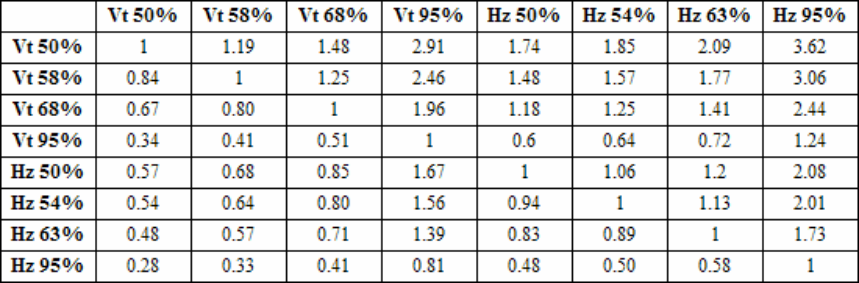
**Advanced or Special Topics** **145**

For example, suppose you have a GPS location whose horizontal error is believed be less than 3 meters with
95% confidence. To convert this to an RMS error that can be used by Walls, you would multiply by 0.58, the
number at the intersection of the "Hz 63%" column and "Hz 95%" row. The RMS error is therefore 0.58 x 3 =
1.74.

Another example: Suppose you have a location estimate where you believe the standard deviations of the two
horizontal coordinate errors are each 10 feet. Since standard deviation of a single component corresponds to the
"Vt 68%" row, we use that and the "Hz 63%" column to obtain RMS error = 1.41 x 10 = 14.1 feet.

The Hz values in the table are based on the Rayleigh distribution, a special case of the bivariate normal distribution where it's assumed that the two variables (coordinate errors in this case) are uncorrelated and have the
same variance. These assumptions don't strictly hold, but they're commonly accepted in studies of GPS accuracy.

[A detailed discussion of GPS receiver accuracy can be found at David L. Wilson's GPS Accuracy Web Page.](http://users.erols.com/dlwilson/gps.htm)

##### **9.5 Statistical Formulas**

Here is a more detailed description of the numbers displayed in Walls dialogs -- namely the UVEs that rank loop
systems, the F-ratios that rank traverses, and the best corrections that identify data errors. This is an attempt to
state exactly what's being computed by the program, not to explain fully the theory and derivations. Information
on the statistical terms and distributions can be looked up in appropriate textbooks. How the numbers are used
during data screening is discussed in Geometry Page, Traverse Page, and Data Screening Tutorial.

We start by letting **X, Y,** and **Z** represent the components of a measured traverse, with **Vh** and **Vz** representing
their assigned error variances. The modifier **h** is used to indicate that the horizontal components (X and Y) are
being given identical assignments. Also, we'll assume that the traverse in question is not constrained: Vh > 0
and Vz > 0. (For a description of how Walls computes a traverse's error variance see Variance Assignments.)

First, we perform a least-squares adjustment of a loop system, thereby obtaining for each traverse the final estimated displacement: **x, y, z,** and the theoretical _variances_ of this estimate: **vh** and **vz** (the network variances).
Also provided by the adjustment routine are the loop counts, **Nh** and **Nz,** and the quantities actually minimized,
the sums of squares of _weighted residuals_ :

**SSh =** Sum over all unconstrained traverses of **((X - x)² + (Y - y)²) / Vh,** and

**SSz =** Sum over all unconstrained traverses of **(Z - z)² / Vz,**

The unit variance estimates are then

**UVEh = SSh / (2 · Nh)** and **UVEz = SSz / Nz.**

If we assume that a traverse's error components actually have the assigned variances, and that they are also independent, normally distributed random variables with zero means, then SSh and SSz have _chi-square distribu-_
_tions_ with 2·Nh and Nz degrees of freedom. UVEh and UVEz would then have unit means and variances 1 / Nh
and 2 / Nz, respectively. Anything tending to invalidate these assumptions, such as gross data errors, would
presumably inflate the UVEs to values larger than one, the significance of a given increase depending on the
loop count.

The approach taken in Walls is less strict than this since we're mainly interested in measuring consistency. If,
for the sake of computing useful numbers, we assume only that the assigned variances are correct apart from an
unknown scaling factor (i.e., the _unit variance_ ), the UVE can be interpreted as a sample variance that estimates
this scaling factor. Its expected value after data screening could be significantly different from one depending on
the survey's quality (grade), skill of surveyors, and difficulty.

Whereas the UVEs gauge overall consistency of survey data with respect to an assumed model, the F-ratios
measure _relative_ consistency. We might ask if a particular observation's contribution to the sum of squares is

_Copyright © 2013 by David McKenzie_

**146** **Walls Project Editor**

unusually large when measured against the consistency of the remaining data. It can be shown that if a traverse
is deleted from the data set, the sums of squares will decrease by

**SEh = ((X - x)² + (Y - y)²) / (Vh - vh)** and **SEz = (Z - z)² / (Vz - vz).**

Now let's simplify our notation by dropping the modifiers (h and z) and using variable **M** to denote the number of
dimensions under consideration: two for the horizontal case and one for the vertical case. The traverse's two Fratios are then computed as

**F = (SE / M) / ((SS - SE) / (M·(N - 1))).**

Note that the denominator of F is the new system UVE resulting from the traverse's deletion. While the formula
for F depends on the _relative_ sizes of variances assigned to traverses, it's clear that the variance scaling factor
cancels out. Although M also cancels out of this expression, we leave it in to illustrate that the numerator and
denominator of F (under the assumptions mentioned above for SS) are independent chi-square statistics scaled
to have unit means. F, like a loop system's UVE, is a nonnegative number, possibly very large. If it is greater
than one, the traverse's presence in the data is hurting consistency (making the system UVE larger). If it is less
than one, consistency is being helped.

Finally, the traverse's best correction is

**Cz = - (Z - z) · Vz / (Vz - vz),** with **Cx** and **Cy** obtained similarly.

Thus the key results we need for data screening depend on our adjustment algorithm having provided the network variances, vh and vz. I'll omit the derivation of these formulas; if they were incorrect the Walls review dialogs (e.g., float operations) wouldn't work at all.

**Some Notes on Interpretation**
The F-ratios displayed by Walls are so named because of their presumed behavior under ideal circumstances. If
there were no blunders, and if our simple statistical model (including the normality assumption) was realistic, the
F-ratio computed for a traverse in a system with loop count N would have a _central F-distribution_ with M and
M·(N - 1) degrees of freedom. You can find information on this distribution in most introductory statistics texts.
It's worth noting that the expected value of F is N / (N - 2) for N > 2, or about one for systems with large loop
counts.

One approach to understanding what would happen to F if we were to introduce a blunder -- say a fixed vector E
added to the random traverse measurement -- is to consider its behavior as a random variable with a _non-central_
_F-distribution._ A much simpler approach is to realize that perturbing the traverse by vector E, simply adds -E to
the traverse's best correction. You'll notice that while the denominator in the above expression for F (the UVE
after deletion) doesn't change, the numerator SE / M certainly does and usually does so dramatically. In fact, we
can express SE in terms of the best correction's squared length (C² = Cx² + Cy² when M = 2, or C² = Cz² when M
= 1):

**SE = C² /** **(V + vº),**

where **vº = v·V / (V - v)** is the corresponding network variance with the traverse discarded. If we assume that the
best correction without the blunder is of negligible size -- its expected squared length theoretically being M·(V +
vº) -- then it's obvious that _a blunder will inflate the F-ratio at a rate proportional to the blunder's squared length._
It's also clear that for a blunder of fixed size, F will on average be larger when the quantity V + vº is smaller. A
small vº indicates that the remaining network, by virtue of its geometry and the variances assigned to it, can in
principle provide a good estimate of the true displacement. Finally, in the case where both blunder and assigned variances are fixed, F will be larger when the consistency actually achieved by the remaining network is
better -- that is, when F's denominator, the UVE after detachment, is smaller.

While these theoretical observations suggest _why_ the F-ratios are effective, there is certainly no critical dependence in Walls on the assumptions made about variances and distributions, which, of course, are never strictly
valid anyway. All that really matters is that if a traverse is affected by one or more blunders, its horizontal and/or
vertical F-ratio is likely to be _much_ larger than those of traverses not so affected. By experimenting with the program you should have no trouble verifying this.

_Copyright © 2013 by David McKenzie_

**Advanced or Special Topics** **147**

F-ratios have been recognized for their ability to flag outliers in measurement data; however, they aren't as popular as other methods because they're relatively hard to compute. In our case, obtaining the necessary network
variances requires the partial _inversion_ of a very large matrix -- more than what's required by a least-squares adjustment alone. Therefore, for simply ranking traverses, why don't we consider something more familiar -- like
"error ratios", which are just the weighted least-squares residuals? The main reason we don't is that statistics
based on residuals are much weaker than F-ratios because they tend to be highly correlated. In a large network, for example, a severe blunder could easily make the good traverses nearby look worse than bad traverses
some distance away. The F-ratios, while still correlated in a strict sense, are so specific in their sensitivity that
we've had no trouble identifying multiple blunders after a single data compilation. Besides that, the F-ratios are
conceptually akin to UVEs and come hand-in-hand with the best corrections.

**Special Cases**
There are two special cases that I will mention only briefly. First, if the traverse is constrained, then V = v = 0,
and trying to retrieve the statistics in the above manner would be rather futile. The Walls adjustment module
simply wasn't designed to provide the information we need in this case, even though the statistics are in fact
definable in terms of the unknown quantity vº > 0. Hence, "<FIXED>" is displayed in place of the statistics in
Walls dialogs. To obtain just the best correction, the user can temporarily float the traverse. To obtain F as well,
the user can assign an insignificant but positive variance to the traverse instead of strictly constraining it.

Second, when we are dealing with an isolated loop, the system's loop count is actually N = 1, again making the
above formulas inapplicable. So that a legitimate F-ratio can still be derived, the entire set of isolated loops belonging to a connected component is treated in Walls as if it were a single loop system. The denominator in F is
therefore the combined UVE for a _ll other_ isolated loops. If there are no others, then Walls simply displays the
traverse's UVE (e.g., UVEz = Z² / Vz) in place of F.

##### **9.6 Tree Survey Example**

The importance of specifying instrument corrections, even when they are seemingly very small, is often not fully
appreciated -- if only because there exist large project data sets for which the compass corrections, for example,
were never recorded. It is not even known, in some cases, whether or not different instruments were used in different parts of the survey. Otherwise, we could at least try to estimate the corrections based on the consistency
of the combined data. Also unfortunate is the practice of _reversing_ shots after the fact, so that the FROM-TO
name sequence that the computer sees doesn't necessarily imply which station the clinometer reading was
taken at.

An illustrative example (included with Walls) is TREE.WPJ, a Suunto and fiberglass tape tree survey of a 12-acre
lot. It is a 136-loop mesh of compass and tape vectors connecting 5 stakes at known true north relative positions
on the outer boundary. Since the relative elevations of the stakes are not known, the vertical loop count is smaller: 131. There are 261 traverses, all but 35 consisting of just one vector. The average shot length is 62 ft. Obviously, surface surveying in broad daylight is not exactly comparable to cave surveying, but the results can be
interesting nonetheless. In this case, a flagged stick was held vertically at each station; other conditions hardly
varied at all.

With the magnetic declination set at +6.5 and the independently determined clinometer correction (IncV) set at
+0.3, we see the following effects of the compass correction (IncA) and vertical adjustment (IncH) on consistency
as measured by the horizontal and vertical UVEs (correction units are degrees and feet):

**IncA** **UveH** **IncH** **UveV**

+2.00 0.69 -0.50 0.23
+1.50 0.19 -0.30 0.11
+1.30 0.16 -0.20 0.08
+1.00 0.27 -0.10 0.11
+0.50 0.93 -0.00 0.17

In this way, a compass correction of +1.30 was obtained (assuming the declination is correct). Detaching the
survey from the stakes drops the horizontal UVE from 0.16 to 0.15, suggesting there is nothing wrong with the
fixed stake locations. The vertical UVE is very small -- not unheard of in a mostly horizontal survey. While a few
bad readings could easily affect the size of UveV, the vertical adjustment that minimizes it (IncH = -0.2) would be

_Copyright © 2013 by David McKenzie_

**148** **Walls Project Editor**

less affected. A systematic vertical positioning error of just over two inches is certainly plausible and accounting
for it is enough to change the relative ranking of a few traverses.

##### **9.7 Missing Measurement Problem**

The Mexican cave _Gruta de Bustamante_ is primarily a 100+ meter wide passage whose floor is a steep slope of
huge boulders -- some almost house-sized. A detailed survey in progress, conducted by Jan and Orion Knox,
consists of many measurements between station flags placed prominently on boulders throughout the passage.
For this kind of project the surveyors might reasonably ask: "If we take numerous azimuth and inclination measurements between the stations _without_ measuring most of the corresponding distances, will Walls be able to
handle the data and produce an optimal adjustment?"

The short answer is: Not very elegantly. The only recourse for now is to substitute approximate values for the
missing distances (such as those obtained in a compilation in which the corresponding vectors are floated) and
run Walls in an iterative fashion, obtaining new approximations with each run. The iterations would stop when
further changes to the dummy values would not significantly improve consistency by lowering the UVEs.

The same problem can arise when specific measurements recorded in fieldbooks are either undecipherable or so
obviously far off as to be worthless. Ideally, the remaining _good_ measurements that make up a shot would still be
given appropriate weight in a least-squares adjustment -- assuming loops are present, of course.

##### **9.8 Height Measurement Pitfalls**

_Point-to-point_ surveying is the practice of locating markable stations so that when the inclination measurement is
made the instrument height above station always matches the target height above station. Usually both heights
are near zero (i.e., not actually measured) and neither is recorded in fieldbooks. Many cave surveyors would
agree that any deviation from this practice often causes more problems than it solves. For one thing, instrument/
target (IT) height measurements introduce yet another likely source for hard-to-detect blunders, such as reversed signs. (Some of my past surveying efforts are a good demonstration of this.) Furthermore, data screening with Walls is a bit more complicated since the raw vectors shown in the Traverse page resemble less the original data.

Another problem that comes into play with IT heights is the inevitable taping method confusion. For me, instrument-to-target is the obvious method to assume by default; for others, station-to-station (the default in SMAPS)
is the reasonable assumption. Getting it wrong will introduce a systematic error, yet I don't recall ever seeing a
set of field notes where the taping method was clearly indicated.

Finally, when interpreting fieldbook data, questions about units can arise. Are the tape and units for IT heights
the same as for the distance measurement? If so, should a _correction_ be applied to the heights if the tape was
assigned one? SMAPS, for example, allows specification of a separate "auxiliary" tape, the units of which determine the units of both the above-station heights and the LRUD passage dimensions. During processing, however, it appears that the auxiliary tape correction is applied to the LRUD data but _not_ to the height data! Not only
can field notes be ambiguous, but because of all the possible variations in length measurement data, assumptions made by software can be unclear as well.

**Personal note:** Despite the pitfalls, IT height measurements have been used in most projects I've participated in.
I think they're so useful in some caves that trying hard to avoid them makes even less sense.

##### **9.9 Regular Expression Searches**

Support for regular expressions is common in text editing software and several programming languages. When
the option to use them is enabled in a search dialog, certain character sequences in the **Find what** field are
treated as wildcards, or codes that represent classes of characters rather than specific characters. The codes are
formed with the help of _metacharacters_ belonging to the sequence \ ^ $ . | [ ] ( ) { } ? + *. Another useful term is

_Copyright © 2013 by David McKenzie_

**Advanced or Special Topics** **149**

_regex_, the short name for regular expression. Unfortunately, not all regex search engines support the same
[codes. A good introduction to the Perl 5 flavor recognized by Walls is Jan Goyvaerts' tutorial.](http://www.regular-expressions.info/tutorial.html)

The examples below are not an adequate introduction but they can at least serve as a memory refresher. They
also demonstrate the use of codes that another search engine might handle differently. You can try them out on
a Walls data file or project branch by cutting and pasting them into a search dialog.

Suppose we want to find all vertical shots in our survey data assuming that the vertical angle measurement is
the fifth item on a line:

**Find what:** ^\s*(\S+\s+){4}[+-]?90(\.0*)?(\s|$)

We've constructed this pattern by using appropriate wildcards for the character sequences we want it to match -sequences that appear contiguously left-to-right on a line. To match the fifth line item we must actually begin
matching characters at the line's start:

      - The circumflex (^) matches the start-of-line condition.

      - \s* matches zero or more consecutive whitespace characters (tabs and spaces). (\t would have matched a
single tab character.)

      - (\S+\s+){4} matches four repetitions of one or more non-whitespace characters (\S+) followed by one or more
whitespace characters (\s+).

      - [+-]? matches one instance or zero instances of one of the characters in brackets, in this case either + or -.

      - 90(\.0*)? matches one of 90, 90., 90.0, 90.00, etc. The decimal point is _escaped_ with a backslash since a
period by itself is a metacharacter that matches _any_ character.

      - (\s|$) matches either a whitespace character (\s) or the end-of-line condition ($). The vertical bar (|) separates
alternatives. (Bill|William) would match either Bill or William.)

The pattern is complex because we're trying to capture all possible formats for a vertical shot while eliminating
non-qualifying matches. Although not used in this example, a few additional codes besides \s and \S are available for matching generic classes of characters. \d and \D match digits and non-digits, respectively. \w and \W
match word and non-word characters, where a word is any mixture of digits, letters, and the underscore character (_). Some codes match _conditions_ that exist before or after an examined character. \b asserts the presence of
a _word boundary_ while \B asserts the lack of one. As with the line start (^) and line end ($) conditions, no character is matched, or "consumed", with \b or \B. In Walls dialogs the option **Match whole words** is equivalent to
prefixing and suffixing the target string with \b.

The element [+-] in this example deserves futher explanation. A bracketed sequence of characters, a _character_
_class,_ matches any one character belonging to the set. As part of such a sequence most characters will be interpreted literally, not as metacharacters. Exceptions are ^, -, and \, depending on their placement. For example,
the character class [a-zA-Z] will match any alphabetic character due to the placement of minus signs to define
_character ranges_ . In character class [+-] neither the plus sign nor the minus sign has a special meaning. Codes
that match conditions _,_ like \b, are not recognized as such in a character class, but codes representing characters, like \s, have the same meaning inside brackets as they do outside. When a circumflex (^) immediately follows the opening bracket, a _negated_ character class is formed, one that matches any character as long as it's _not_
one of the remaining characters in brackets.

The Walls search function is implemented so that it looks for matching text that resides entirely within individual
lines. The expression ^$, however, won't match an empty line since empty lines are completely ignored. The next
example selects the two station names of a vector data line, presumably the first two items, while skipping over
line comments and directives. The replacement string swaps name positions and illustrates how a replacement
string can be constructed from portions of the matched text:

**Find what:** ^(\s*)([^;#]\S*)(\s+)(\S+)
**Replace with:** \1\4\3\2

The subexpression [^;#] is a negated character class that matches anything but a semicolon or pound sign. In
this context it can't match a whitespace character either since any such character will have been consumed by
the preceding \s*. The sets of parentheses in the whole expression are needed to form groups that can be referenced in the replacement string. Up to nine left-to-right counted parenthesized groups, possibly nested, can be

_Copyright © 2013 by David McKenzie_

**150** **Walls Project Editor**

referenced using codes \1 through \9. (The entire matched text, the selected string, is referenced by \0.) Similarly, a group can be _backreferenced_ in the regular expression itself.

The final example is the sort of operation you might conceivably find useful when working with survey data:

**Find what:** (^|[\s,:;])A(\d)
**Replace with:** \1AB\2

This would change A-prefixed names (A1, A321, etc.) to AB-prefixed names (AB1, AB321, etc.) provided their positions in the file are plausible for a station name. The expression, (^|[\s,:;]), insures that immediately preceding
the letter A is either the start-of-line condition or a character in the bracketed set (whitespace, comma, colon, or
semicolon). The (\d) insures that a digit immediately follows A, the parentheses allowing it to be referenced in the
replacement string as \2.

[Walls takes advantage of the excellent code library, PCRE](http://www.pcre.org/) (Perl Compatible Regular Expressions), written by
Philip Hazel. The documentation for PCRE contains the most complete description of the regex flavor supported
by Walls.

##### **9.10 Floating Traverse Chains**

Surveys of complex caves typically contain several traverse chains, or sets of two or more non-contiguous traverses that belong to the same set of closed loops no matter how those loops are defined. Because chained traverses have identical error statistics, it's sometimes impossible to narrow the location of a blunder to a specific
chain member when it's obvious from the statistics that at least one of them is bad. For the time being we may
want to remove the chain's participation in the overall least-squares adjustment, treating it exactly like we would
an obviously bad traverse. That would mean floating the entire traverse chain, not just an arbitrary part of it.

In the Traverses list box of the Geometry dialog, the statistics for chained traverses are grouped together and
displayed with a gray background. The F-ratios, UVEs after deletion, and best corrections of the grouped traverses are initially identical. As soon as we float one of them, however, <FLT-00n> replaces the statistics of the
floated traverse while a lower-case <brg-00n> replaces the statistics of all other traverses in the chain. (The number "n" identifies a traverse as belonging to the loop system's n-th chain as found by Walls during the initial compilation.) Technically those unfloated traverses in the chain have become bridges -- the only remaining "hard"
connections between what are now separate loop systems.

Although bridges aren't floatable in the usual sense, the **FloatH** and **FloatV** buttons on the Geometry page are
enabled for traverse chain bridges whereas they're disabled for normal bridges. So what exactly happens when
we float a bridge that's part of a chain?

To demonstrate we'll operate on a simple 2-traverse chain -- not a particularly bad one but an easy one to visualize. The image below shows portions of the Geometry and Map pages after we've floated the horizontal components of just one chain member. Earlier versions of Walls would have given us only two choices for interactively
removing the chain's effect. We could have floated the 15-vector traverse as shown here (red with yellow unadjusted version), or alternatively we could have floated the other chain member, a 5-vector traverse that's colored
light blue:

_Copyright © 2013 by David McKenzie_

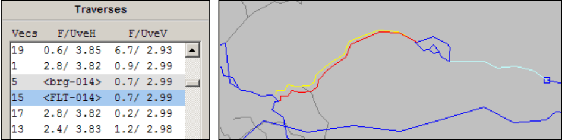
**Advanced or Special Topics** **151**

The program now provides a third option. As long as at least one member of a traverse chain is already floated,
we can _redistribute_ parts of the best correction to other members of the chain by floating them also. In this example, selecting the <brg-014> item and clicking the **FloatH** button immediately produces the following result:

Unlike ordinary float operations, floating bridges will not reduce the loop count or change the loop system's overall statistics. Likewise, when multiple members of a traverse chain are floated, _unfloating_ one of them will not increase the loop count. It just redistributes the best correction across the remaining floated members in accordance with their assigned weights. Such operations will necessarily affect the computed _coordinates_ (but not the
vectors and statistics) of other parts of the network. In this example the location of the hat-shaped loop system
separating the two chain members will be affected. By distributing the chain's discrepancy across two traverses
we've at least avoided the worst-case error in that system's location.

Of course we can hope to do better than leave any traverses floated, chained or not. A traverse chain is a special
case only because the statistics on the Geometry page alone can't isolate a blunder to one of its members. If the
chain has a large F-ratio, we first look for the blunder in the usual way by floating each member _individually_
while examining the Traverse and Map pages. If by using those tools we can find no obvious error in a specific
vector or traverse, we might then consider floating the entire chain for the purpose of creating a working map. As
illustrated above, the preview map uses different colors to highlight all traverse chain co-members of a selected
traverse. This can be helpful since a large cave survey might have numerous hard-to-see traverse chains, some
with several members separated by hundreds of meters.

**A Few More Details**
As with ordinary unchained traverses, it's possible to turn all members of a traverse chain into _unfloatable_
bridges by floating _other_ traverses in the loop system. In fact, we can continue floating traverses until all we're
left with is a "tree" with a loop count of zero. When there's nothing left to float, all members of a chain will have
the same label: either <flt-00n> or an upper-case <BRG-00n>. An unchained traverse will be labeled either
<FLOAT> or <BRIDGE>.

Traverse chain members are normally grouped together in the Traverses list box. Separation is possible, however, when a traverse's horizontal or vertical components have been individually "hard floated" in the data rather
than interactively. (By using variance overrides it's now possible to float multiple chain members -- see Variance
Assignments.) The reason for this is that the sorting criterion for ordering items in the list box is based on a _com-_
_bined_ horizontal and vertical F-ratio that's computed during the initial data compilation. A chain member with a
floated vertical component, for example, will have a smaller combined F-ratio than a member with no floated
components.

For more information on traverse chains see Network Terminology.

**9.10.1** **Accessing Walls from Other Applications**

Walls has a search feature that can perform a project-wide search for all occurrences of a string of characters,
including those matching a regular expression. Perhaps its main limitation is that after a search you have to open
each data file flagged with a red check mark to see the context of any matches and to perform replacements.

A simple, free program that can perform a regular expression **search and replace** across multiple files is
[GrepWin. The search results window has two views, one listing details for each file found and the other showing](http://stefanstools.sourceforge.net/grepWin.html)

_Copyright © 2013 by David McKenzie_

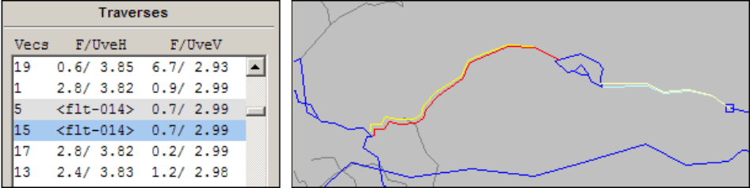
**152** **Walls Project Editor**

the specific lines containing the text searched for. Both views provide access to Windows Explorer's right-click
context menu. The program also has a setting where you specify the command to execute when one of the lines
showing matched text is double-clicked. For example, you can have it open the Walls editor with the cursor positioned at the line of interest.

To set up a program like this for Walls, you must tell it to execute a command of the following form:

**C:\Walls\Walls32.exe <SRV pathname> -L<line number> -C<column number>**

. **<SRV pathname>** is the complete pathname of the data file, surrounded by quotes if it contains spaces. **<line**
**number>** and **<column number>** are integers, with line and column numbering starting at 1. To configure the
search program, you'll need to use program-specific _macros_ . For example, for specifying the external editor command for _GrepWin_, macros %path% and %line% are available. In this case, the optional column parameter of
Walls won't be used.

Although the command will launch Walls if necessary, it will work especially well if Walls is already running and
has the appropriate project open. The program is designed so that when another program instructs it to open a
SRV file, it automatically checks if the file belongs to an open project. If it does, the operation is equivalent to the
user double-clicking the corresponding project tree item. The command line does more in that it also positions
the editor at a specific place in the file, making project-specific functions in the editor's context menu functions
available.

_Copyright © 2013 by David McKenzie_

# **Index**

## **- # -**

#DATE Directive   85
#FIX Directive   78
#Flag Directive.   83
#Note Directive   81
#Prefix Directive   80
#SEG Directives   76
#Units - General   69
#Units Directive   69

## **- A -**

Acknowledgements   10
Adjusted Totals   52
Advanced Topics   140

## **- B -**

Backsight Types   73
Block Comments   86
branch   11
Bustamante   148

## **- C -**

Color_dialog   46
Contents   1

## **- D -**

Data Screening Overview   134
Declinations   72

## **- E -**

Export of VRML Files   126
Exporting ESRI Shapefiles   123
Exporting Maps as Metafiles   121
Exporting SEF Files   120

_Copyright © 2013 by David McKenzie_

**Index** **153**

## **- F -**

Features You May Overlook if not Careful   138
Format of Survey Data   64
F-ratios   145

## **- G -**

geographical calculator   61
Geometry page   23

## **- I -**

Import of SMAPS 5.2 (SEF) Files   118
Instrument Corrections   73
Introductory Note   2

## **- L -**

Limitations   10
Lot Survey   147
LRUDs.   66

## **- M -**

Map Format Options   37
Map Page   28
mathematical model   141

## **- P -**

Position and Scale dialog   32
Properties Dialog   15
Properties: Compile Options Page   18
Properties: General Page   15
Properties: Geographical Reference Page   20

## **- R -**

Review Dialogs   22

## **- S -**

Saving and Restoring   74

**154** **Walls Project Editor**

Segment Page   43
Seldom Used   75
SRV Files   65
station-to-station   148
Suffixes   70
Survey Text Editor   13
System Requirements   9

## **- T -**

Terminology   132
testing   9
Traverse page   26

## **- U -**

Unit Specifications   71

## **- V -**

Variance Assignments   87
Vector Data Lines   66
Vector Type   71

## **- W -**

wall shots   34
workfiles Created by Walls   140

_Copyright © 2013 by David McKenzie_

