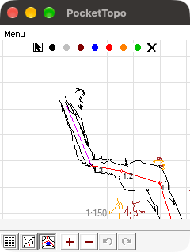
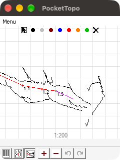

# PocketTopo — rzeczywiste źródła z potrójnymi odczytami

Wynik przeglądu z **2026-09-25**: Shadow ma 32 rekordy i **zero** kolejnych
serii potrójnych. Jest przykładem szkicu, ale nie wystarcza do badania powtórzeń.
Lepsze małe źródła to `zach0dni2.top`, `okna.top` i `DS201208.top`.

## Wybrane pliki

| Źródło | Rekordy | Serie po 3 | Wierzchołki plan / bok |
| --- | ---: | ---: | ---: |
| [zach0dni2.top](https://github.com/dlubom/test2/blob/4c00c008a8dd441d70f9c62aa376c20b5914c7e0/495-Interessante/20120809-Zachodni_286/zach0dni2.top) | 11 | 3 | 692 / 220 |
| [okna.top](https://github.com/dlubom/test2/blob/4c00c008a8dd441d70f9c62aa376c20b5914c7e0/495-Interessante/20120807-Partie_Gastryczne-Okna/okna.top) | 14 | 4 | 226 / 131 |
| [kaskady lafiryndy v2.top](https://github.com/dlubom/test2/blob/4c00c008a8dd441d70f9c62aa376c20b5914c7e0/495-Interessante/20140813-Kaskady_Lafiryndy/kaskady%20lafiryndy%20v2.top) | 13 | 4 | 1414 / 834 |
| [DS201208.top](https://github.com/dlubom/test2/blob/4c00c008a8dd441d70f9c62aa376c20b5914c7e0/501-Kitzgrabenwasserschacht/DS201208/DS201208.top) | 25 | 8 | 459 / 812 |
| [kalacka.top](../../Poligony/D_Bystra/Kalacka/_RAW/01/kalacka.top) | 257 | 70 | 68 / 59 |
| [Czarna-zimna.top](../../Poligony/D_Koscieliska/Organy/Czarna/_RAW/01/source/Czarna-zimna.top) | 756 | 238 | 0 / 0 |
| [shadow.top](https://github.com/dlubom/test2/blob/4c00c008a8dd441d70f9c62aa376c20b5914c7e0/502-Schattenhohle/20120816-Shadow/shadow.top) | 32 | 0 | 4150 / 1330 |

Każda wyliczona trójka w sześciu wybranych alternatywach zawiera co najmniej
dwa różne zestawy D/A/V. Nie jest to proste trzykrotne skopiowanie tego samego
rekordu. Kalacka zawiera dodatkowo trzy serie po dwa odczyty. Czarna–Zimna
nie ma szkiców, więc sprawdza warstwę pomiarową, nie konwersję rysunków.

## Konkretny przykład

`zach0dni2.top`, rekordy **2–4**, para **1.0 → 1.1**, tripIndex **0**:

| Rekord | D [m] | A [°] | V [°] |
| --- | ---: | ---: | ---: |
| 2 | 3.670 | 342.339478 | -24.955444 |
| 3 | 3.680 | 342.361450 | -24.746704 |
| 4 | 3.670 | 342.108765 | -24.845581 |

Stopnie w tabeli są prezentacją zaokrągloną; surowe jednostki kątowe, mm,
indeksy, SHA-256 i kolejne przykłady zachowuje [raport JSON](REPEAT_CANDIDATES.json).

## Metoda i zakres dowodu

Przeszukano wszystkie **262 ścieżki / 258 unikalnych zawartości** `.top`
z `dlubom/test2` w przypiętej rewizji `4c00c008a8dd441d70f9c62aa376c20b5914c7e0`.
Każdy pobrany plik porównano z identyfikatorem Git blob z inwentarza tej rewizji.
Odczyt struktur v3 zakończył się bez błędu dla wszystkich; dodatkowo sprawdzono
lokalną Kalacką i Czarną–Zimną. W korpusie **223 ścieżki / 219 unikalnych
zawartości** zawierają co najmniej jedną serię po trzy.

Seria oznacza maksymalny kolejny ciąg dodatnich odczytów identycznej skierowanej
pary nazwanych, różnych stacji w tym samym tripie. Splay, zero, inna para lub
zmiana tripu przerywa serię. Liczono wyłącznie serie o długości dokładnie 3;
serie dłuższe nie zostały sztucznie podzielone, kierunków przeciwnych nie łączono.
To definicja wyszukiwania, nie implementacja grupowania konwertera.

Wszystkie zapisane przykłady wybranych plików sprawdzono także drugim roboczym
czytnikiem: liczby rekordów oraz surowe D/A/V zgadzają się. `zach0dni2.top` otwarto dodatkowo z izolowanej kopii w PocketTopo 1.372:
plan i przekrój są widoczne, co utrwalają poniższe obrazy. Następnie wykonano
natywne eksporty TXT/DXF trzech wybranych plików: wszystkie 50 rekordów
i 2540 wierzchołków szkiców zgadzają się ze źródłami.
[Pełny zapis próby](evidence/repeat-candidates/README.md).
Nie wykonano pełnego audytu geometrii całego korpusu.
Nie jest to zaliczenie docelowej bramki korpusu z PRD.

Są to mocni kandydaci na powtórzenia instrumentu, ale sama kolejność, nazwy
i zbliżone D/A/V nie potwierdzają niezależnie intencji autora. Przed aktywnym
uśrednianiem nadal obowiązuje potwierdzenie pochodzenia z PRD. Dat z nazw
i tripów nie uznano za potwierdzone daty terenowe. Licencja zewnętrznych
materiałów pozostaje nieustalona; raport linkuje przypięte oryginały.

## Dobór do dalszej pracy

- `zach0dni2.top`: najmniejszy znaleziony pod względem liczby rekordów przykład
  z trójkami oraz obydwoma szkicami; 3 serie, plan wielobarwny.
- `okna.top`: 4 serie i bardzo małe rysunki, łatwy audyt każdego wierzchołka.
- `DS201208.top`: 8 serii, oba widoki, inne źródło jaskiniowe niż Interessante.
- Kalacka: lokalny większy przypadek 70 trójek i 3 par, z niewielkimi szkicami.
- Czarna–Zimna: większy przypadek 238 trójek bez rysunków.

Syntetyczne wzorce P01 pozostają zamrożone. Te źródła uzupełniają Shadow
w przyszłych próbach P02–P05; wyszukiwanie nie zmieniło ich bajtów ani `_RAW`.

## Wizualne potwierdzenie w PocketTopo

Plan i przekrój `zach0dni2.top`, obrazy okna PocketTopo 1.372 (widoczny fragment):

