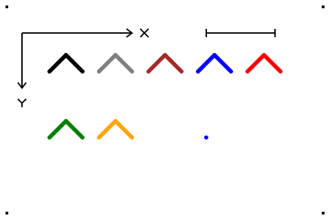

# P01: wybór i próba renderera SVG → PNG

**Wynik z 2026-09-25:** wybrano **resvg CLI 0.48.1**. Ten sam jawny SVG
wyrenderowano bez GUI na macOS arm64 oraz w Ubuntu 24.04 amd64. PNG są
**identyczne bajtowo** między systemami przy obu rozdzielczościach: 480 × 320
i 960 × 640. Nie dodano jeszcze zależności ani integracji P05 do projektu.

## Materiał i granice próby

[renderer-probe.svg](renderer-probe.svg) jest małym, ręcznie napisanym wzorcem
renderera, **nie eksportem PocketTopo ani niezależnym wzorcem parsera `.top`**.
Zawiera osie ekranu (+X w prawo, +Y w dół), odcinek długości 100 jednostek,
siedem otwartych polilinii po trzy wierzchołki, pojedynczy punkt zapisany jako
`circle` o promieniu 3 jednostek oraz cztery znaczniki brzegowe. Nie używa
fontów, obrazów, CSS zewnętrznego ani innych zasobów. Tło jest białe i nieprzezroczyste.

| Indeks PocketTopo | Nazwa według formatu | sRGB wybrane w tym wzorcu |
| --- | --- | --- |
| 1 | black | `#000000` |
| 2 | gray | `#808080` |
| 3 | brown | `#a52a2a` |
| 4 | blue | `#0000ff` |
| 5 | red | `#ff0000` |
| 6 | green | `#008000` |
| 7 | orange | `#ffa500` |

Tabela bada zachowanie siedmiu odrębnych, jawnych kolorów przez renderer.
**Nie ustala dokładnych RGB natywnej palety PocketTopo**. Identyfikatory 1–7
pochodzą z [kontraktu formatu](../../../FORMAT_V3.md); wartości sRGB są
wyborem tego syntetycznego wzorca. Również transformacja osi `.top` → SVG,
geometria native DXF, warstwy/osnowa/XSection i wygląd napisów pozostają
zadaniami P05. Zapis punktu jako `circle` sprawdza widoczność jawnej
reprezentacji punktu; nie zakłada, że jednowierzchołkowa `polyline` sama się
wyrenderuje.

## Rzeczywista walidacja

[validation.json](validation.json) zapisuje oczekiwania i wyniki:

- niezależny `xml.etree.ElementTree` potwierdził poprawny XML, siedem otwartych
  polilinii, po trzy wierzchołki i jawny pojedynczy punkt;
- ImageMagick zdekodował każdy PNG do RGBA; dla każdego z czterech obrazów
  sprawdzono 23 punkty: siedem kolorów, osie, skalę, punkt i jego otoczenie,
  siedem pustych miejsc potencjalnego domknięcia i cztery znaczniki brzegowe;
- w obu skalach wszystkie próbki miały dokładnie oczekiwane RGBA, wszystkie
  piksele były nieprzezroczyste, cały skrajny obwód biały;
- sprawdzono rozmiary PNG, skalowanie współrzędnych próbek 2× i identyczność
  całych plików między systemami, bez tolerancji pikselowej;
- obejrzano PNG 480 × 320: osie, wszystkie kreski, punkt i znaczniki są
  widoczne, bez obcięcia i bez domkniętych podstaw polilinii.



To dowód działania renderera na Linux zgodnym z docelowym środowiskiem CI,
**nie zapis uruchomienia GitHub Actions**. Linux uruchomiono w Docker Desktop
29.4.2 na macOS 27.0 arm64, z emulacją amd64. Nie jest to dowód poprawności
przyszłego konwertera ani gwarancja zgodności każdego możliwego SVG.

## Odtworzenie lokalne i w Linux CI

Użyto oficjalnych archiwów wydania
[resvg 0.48.1](https://github.com/linebender/resvg/releases/tag/v0.48.1).
Adresy, sumy archiwów i rozpakowanych programów są w
[manifest.json](manifest.json). Archiwa pobrano do `/tmp` i porównano ich
SHA-256 z polem `digest` API GitHub. Programy nie są częścią repozytorium.

Po rozpakowaniu właściwego programu i ustawieniu `RESVG` na jego ścieżkę,
z katalogu repozytorium:

```sh
CASE=doc/pockettopo/evidence/p01/renderer
"$RESVG" --version  # oczekiwane 0.48.1
"$RESVG" --skip-system-fonts --dpi 96 --width 480 --height 320 \
  --background '#ffffff' "$CASE/renderer-probe.svg" /tmp/renderer-probe.png
"$RESVG" --skip-system-fonts --dpi 96 --width 960 --height 640 \
  --background '#ffffff' "$CASE/renderer-probe.svg" /tmp/renderer-probe-2x.png
cmp "$CASE/renderer-probe-macos.png" /tmp/renderer-probe.png
cmp "$CASE/renderer-probe-2x-macos.png" /tmp/renderer-probe-2x.png
```

Rzeczywista komenda Linux (dla drugiej rozdzielczości zmieniono wymiary
na `960 640` i nazwę na `renderer-probe-2x-linux.png`):

```sh
CASE="$PWD/doc/pockettopo/evidence/p01/renderer"
docker run --rm --platform linux/amd64 --network none --read-only \
  -v /tmp/p01-resvg/linux:/renderer:ro -v "$CASE:/evidence" \
  ubuntu@sha256:008173c23f95b170204355c12626cb5a965d779a7e1283b09e9cffbb1bf33ca3 \
  /renderer/resvg --skip-system-fonts --dpi 96 --width 480 --height 320 \
  --background '#ffffff' /evidence/renderer-probe.svg \
  /evidence/renderer-probe-linux.png
```

W CI amd64 ten sam oficjalny program Linux można uruchomić bez Dockera.
Na etapie P05 trzeba przypiąć pobranie i SHA-256 lub zależność/build w
przyjętym mechanizmie CI, a nie polegać na zmiennym `latest`. Porównanie
z zachowanym PNG przez `cmp` powtarza pełną kontrolę pikseli i zapisu PNG;
nie wymaga ImageMagick. Przy zmianie renderera/wersji w pierwszej kolejności
należy ponownie zweryfikować jawne oczekiwania, zamiast automatycznie
podmieniać obrazy referencyjne.

Resvg został wybrany ze względu na samodzielny CLI i powtarzalność renderingu
między platformami deklarowaną przez
[projekt resvg](https://github.com/linebender/resvg#reproducibility),
potwierdzoną powyższą próbą dla używanego podzbioru SVG. Statyczne SVG jest
wystarczające dla tej próby; tekst w P05 będzie wymagał jawnego fontu.
